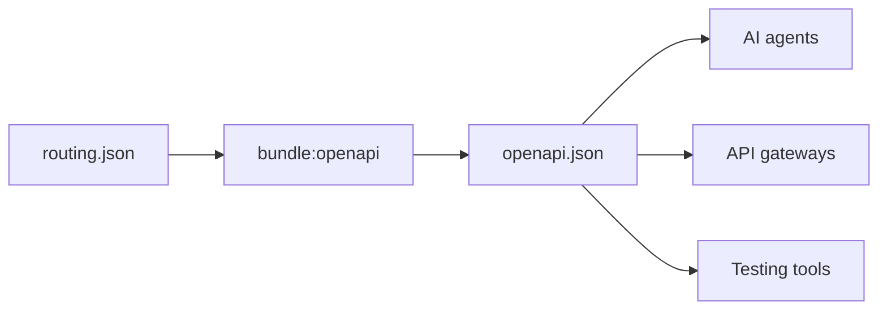
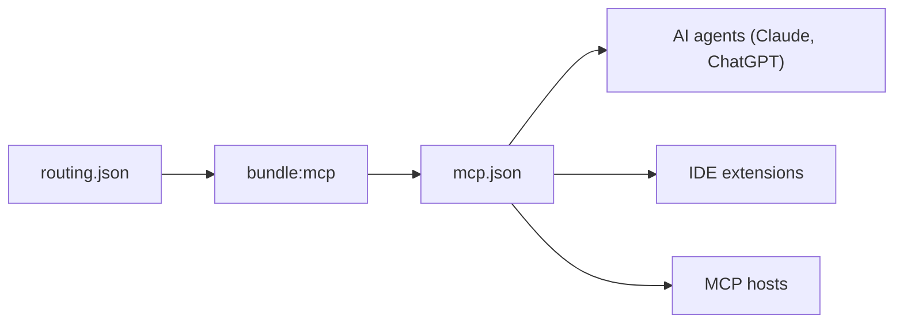
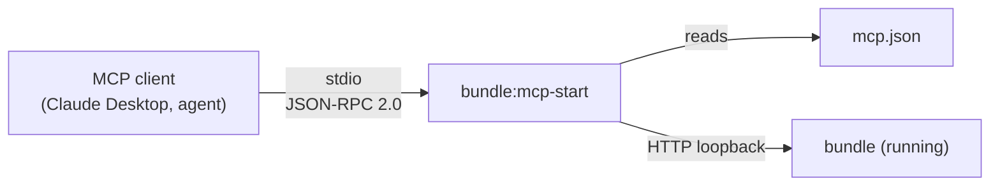

# `gina bundle`

Manage individual bundles within a project. Bundles are independent Node.js processes, and these commands let you start, stop, restart, build, scaffold, and list them. All commands require `@<project>` to identify the target project.

---

## `bundle:start`

Start a bundle as a background process.

```bash
gina bundle:start <bundle> @<project>
```

```bash
gina bundle:start frontend @myproject
```

The bundle's entry point (`src/<bundle>/index.js`) is executed in a detached
child process. The assigned port is printed to stdout on success.

**Flags**

| Flag | Description |
|------|-------------|
| `--env=<env>` | Override the project's default environment (`dev`, `prod`, or a custom env) |
| `--scope=<scope>` | Override the project's default scope |
| `--gina-version=<version>` | Pin this bundle to a specific installed gina version (see below) |

Any unrecognised `--key=value` flag is forwarded to the Node.js process
(e.g. `--max-old-space-size=4096`, `--inspect=5858`, `--inspect-brk=5858`).

**Debugging**

```bash
gina bundle:start api @myproject --inspect-brk=5858 --max-old-space-size=2048
```

### Per-bundle framework version

Pin a bundle to a specific installed gina version without touching the running
socket server:

```bash
gina bundle:start api @myproject --gina-version=0.1.8
```

You can also declare the version statically in `manifest.json` so it applies on
every start without a CLI flag:

```json
{
  "bundles": {
    "api": {
      "gina_version": "0.1.8"
    }
  }
}
```

The CLI flag takes priority over `manifest.json`. The declared version is
validated against the tracked version list in `~/.gina/main.json` — only
versions that were properly installed are accepted. The socket server continues
running its own version; only the spawned bundle process uses the declared
version.

---

## `bundle:stop`

Stop a running bundle.

```bash
gina bundle:stop <bundle> @<project>
```

```bash
gina bundle:stop frontend @myproject
```

---

## `bundle:restart`

Stop then start a bundle. Equivalent to running `bundle:stop` followed by
`bundle:start`.

```bash
gina bundle:restart <bundle> @<project>
```

```bash
gina bundle:restart api @myproject
```

---

## `bundle:status`

:::note Not yet implemented
`bundle:status` is planned but the handler is not yet implemented. It will print the running/stopped state, PID, port, and active environment for a specific bundle.
:::

```bash
gina bundle:status <bundle> @<project>
```

---

## `bundle:build`

Build a bundle for distribution. Compiles assets, applies environment overrides,
and writes a release to `releases/`.

```bash
gina bundle:build <bundle> @<project> [--env=<env>] [--scope=<scope>]
```

| Flag | Default | Description |
|------|---------|-------------|
| `--env` | `dev` | Target environment (`dev`, `prod`, or a custom env) |
| `--scope` | `local` | Target scope (`local`, `production`, or a custom scope) |

```bash
gina bundle:build frontend @myproject --env=prod --scope=local
```

---

## `bundle:add`

Scaffold a new bundle inside an existing project. Creates the standard directory
structure under `src/<bundle>/` and registers the bundle in `manifest.json`.

```bash
gina bundle:add <bundle> @<project>
```

```bash
gina bundle:add admin @myproject
```

The new bundle entry in `manifest.json` is written with the current framework
version pinned as `gina_version` so the pin is explicit from day one:

```jsonc title="manifest.json (after bundle:add admin)"
{
  "bundles": {
    "admin": {
      "version":      "0.0.1",
      "gina_version": "0.3.0-alpha.1",   // written automatically
      "src":          "src/admin",
      "link":         "bundles/admin"
    }
  }
}
```

To run the bundle under a different installed version, edit `gina_version`
manually or use `--gina-version` at start time. See
[Per-bundle framework version](#per-bundle-framework-version) below.

---

## `bundle:remove`

Remove a bundle from a project. Unregisters it from `manifest.json`.

```bash
gina bundle:remove <bundle> @<project>
```

---

## `bundle:list`

List all bundles registered in a project.

```bash
gina bundle:list @<project>
```

---

## `bundle:openapi`

*New in 0.3.3-alpha.2*

Generate an [OpenAPI 3.1.0](https://spec.openapis.org/oas/v3.1.0) specification from a bundle's `routing.json`. The spec is written to `<bundle>/config/openapi.json` by default.

```bash
gina bundle:openapi <bundle> @<project>
```

```bash
gina bundle:openapi api @myproject
```

Generate specs for **all** bundles in a project:

```bash
gina bundle:openapi @<project>
```

**Flags**

| Flag | Description |
|------|-------------|
| `--output=<path>` | Write the spec to a custom file path instead of the bundle's config directory |

**Alias:** `bundle:oas`

```bash
gina bundle:oas api @myproject
```

### How routing.json maps to OpenAPI

The generator reads every route in `routing.json` and produces the corresponding OpenAPI structure — no manual spec writing required.



| routing.json field | OpenAPI equivalent |
|---|---|
| `url` (`:param` syntax) | `paths` (`{param}` syntax) |
| `method` | HTTP operations under each path |
| `param.control` | `operationId` |
| `namespace` | `tags` |
| `requirements` (regex) | `parameters[].schema.pattern` |
| `requirements` (pipe-separated) | `parameters[].schema.enum` |
| `_comment` | operation `description` |
| `_sample` | `x-sample-url` extension |
| `param.title` | operation `summary` |
| `middleware` | `x-middleware` extension |
| `cache` | `Cache-Control` response header documentation |
| `param.code` + `param.path` (redirects) | 3xx response with `Location` header |

### Enriching the generated spec

Add `_comment` and `_sample` fields to your routes for richer output:

```json title="routing.json"
{
  "user-get": {
    "namespace": "users",
    "url": "/users/:id",
    "method": "GET",
    "param": {
      "control": "getUser",
      "title": "Fetch a user by ID",
      "id": ":id"
    },
    "requirements": {
      "id": "/^[0-9a-f]{8}-/i"
    },
    "_comment": "Returns the full user profile including preferences.",
    "_sample": "/users/3fa85f64-5717-4562-b3fc-2c963f66afa6"
  }
}
```

This produces an operation with `operationId: "users.getUser"`, `summary: "Fetch a user by ID"`, `description: "Returns the full user profile including preferences."`, a `{id}` path parameter with a UUID pattern, and the `users` tag.

---

## `bundle:mcp`

*New in 0.3.7-alpha.2*

Generate a [Model Context Protocol](https://modelcontextprotocol.io) tool manifest from a bundle's `routing.json`. The manifest is written to `<bundle>/config/mcp.json` by default.

```bash
gina bundle:mcp <bundle> @<project>
```

```bash
gina bundle:mcp api @myproject
```

Generate manifests for **all** bundles in a project:

```bash
gina bundle:mcp @<project>
```

**Flags**

| Flag | Description |
|------|-------------|
| `--output=<path>` | Write the manifest to a custom file path instead of the bundle's config directory |

:::note Pair with `bundle:mcp-start`
`bundle:mcp` only writes the manifest. To actually serve it to an MCP client, run [`bundle:mcp-start`](#bundle-mcp-start) in a separate process — it reads `<bundle>/config/mcp.json` and dispatches `tools/call` as real HTTP requests into the running bundle.
:::

### How routing.json maps to MCP tools

The generator reads every route in `routing.json` and produces one MCP tool per route variant — no manual manifest writing required.



| routing.json field | MCP Tool equivalent |
|---|---|
| `param.control` | `name` (with `#<method>` / `#<n>` disambiguation when needed) |
| `param.title` | `title` |
| `_comment` | `description` |
| `url` (`:param` syntax) + query params | `inputSchema.properties` |
| `requirements` (regex) | `inputSchema.properties[].pattern` |
| `requirements` (pipe-separated) | `inputSchema.properties[].enum` |
| `method` GET/HEAD | `annotations.readOnlyHint: true` |
| `method` DELETE | `annotations.destructiveHint: true` |
| `method` PUT | `annotations.idempotentHint: true` |
| routing.json routeName key | `_meta["io.gina.routeName"]` |
| `namespace` | `_meta["io.gina.namespace"]` |
| `_sample` | `_meta["io.gina.sample"]` |

### Tool naming

Tool IDs are derived from `param.control`. When a single route handler covers multiple HTTP methods, each method gets its own tool with a `#<method>` suffix (e.g. `getUser`, `getUser#post`). When a route defines multiple URL variants (comma-separated), each variant gets a `#<n>` suffix (e.g. `listUsers#1`, `listUsers#2`).

### Example

Given the same route used in the OpenAPI example above:

```json title="routing.json"
{
  "user-get": {
    "namespace": "users",
    "url": "/users/:id",
    "method": "GET",
    "param": {
      "control": "getUser",
      "title": "Fetch a user by ID",
      "id": ":id"
    },
    "requirements": {
      "id": "/^[0-9a-f]{8}-/i"
    },
    "_comment": "Returns the full user profile including preferences.",
    "_sample": "/users/3fa85f64-5717-4562-b3fc-2c963f66afa6"
  }
}
```

This produces a tool with `name: "getUser"`, `title: "Fetch a user by ID"`, `description: "Returns the full user profile including preferences."`, an `inputSchema` with an `id` property carrying the UUID pattern, `annotations.readOnlyHint: true`, and `_meta["io.gina.routeName"]` carrying the routing entry's key name for downstream dispatch.

---

## `bundle:mcp-start`

*New in 0.3.7-alpha.3*

Run a live [Model Context Protocol](https://modelcontextprotocol.io) server for a single bundle over stdio (MCP spec revision **2025-06-18**, JSON-RPC 2.0, newline-delimited UTF-8). Tool calls are dispatched as real HTTP requests against the running bundle's configured port on localhost.

```bash
gina bundle:mcp-start <bundle> @<project>
```

```bash
gina bundle:mcp-start api @myproject
```

**Prerequisites.** The bundle must already be started with [`bundle:start`](#bundle-start) **and** a manifest must be generated with [`bundle:mcp`](#bundle-mcp). The MCP server is stateless — it holds no session, no auth, nothing beyond what lives in `mcp.json` and the bundle's own routing.



:::caution stdio discipline
`bundle:mcp-start` reserves `stdout` for the JSON-RPC wire. All framework logs, warnings, and informational output go to `stderr`. This is enforced by an early intercept in `bin/cli` — do not wrap the command in anything that muxes stderr into stdout.
:::

### Methods implemented

| Method | Notes |
|---|---|
| `initialize` | Responds with `protocolVersion: "2025-06-18"`, `serverInfo`, and `capabilities.tools.listChanged: false` |
| `ping` | Responds with `{}` |
| `tools/list` | Returns every tool from `mcp.json` |
| `tools/call` | Validates arguments against `inputSchema`, dispatches via HTTP, returns the result |
| `notifications/initialized` | Flips internal state to initialized |
| `notifications/cancelled` | Marks the target request as cancelled (best-effort) |

Unknown methods return `-32601` (METHOD_NOT_FOUND). Argument validation failures return `-32602` (INVALID_PARAMS). Tool execution failures — upstream 4xx/5xx, `ECONNREFUSED`, timeout — are returned as `{content, isError: true}` per the MCP spec, **never** as JSON-RPC errors.

### Dispatch rules

- URL `:param` placeholders are substituted from tool arguments (`/invoice/:id` → `/invoice/42`).
- For `GET`, `DELETE`, `HEAD` — remaining arguments become the query string.
- For `POST`, `PUT`, `PATCH` — if an argument named `body` is present, it is sent as the JSON body; otherwise all non-path arguments are sent as the JSON body.
- `Content-Type: application/json` is set on request bodies.
- `application/json` and `application/problem+json` responses become `structuredContent` + a text block. Non-JSON responses become a text block only.
- Default timeout: 30 seconds.

### Warnings emitted on stderr

- **Staleness.** If `routing.json` has been modified after `mcp.json`, the server warns on startup and suggests re-running `bundle:mcp`. Clients may otherwise see outdated tools.
- **Session-scoped tools.** Tools whose `_meta["io.gina.middleware"]` contains `auth`, `session`, or `login` are listed as likely to return 401/403 until the bundle recognises the caller.

### Example — Claude Desktop

In Claude Desktop's `claude_desktop_config.json`:

```json
{
  "mcpServers": {
    "gina-api": {
      "command": "gina",
      "args": ["bundle:mcp-start", "api", "@myproject"]
    }
  }
}
```

Claude Desktop spawns the process, speaks JSON-RPC over its stdio, and exposes every route in the `api` bundle as a callable tool.
