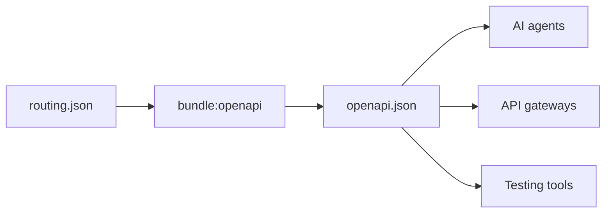

# `gina bundle`

Manage individual bundles within a project. Bundles are independent Node.js processes, and these commands let you start, stop, restart, build, scaffold, and list them. All commands require `@<project>` to identify the target project.

---

## `bundle:start`

Start a bundle as a background process.

```bash
gina bundle:start <bundle> @<project>
```

```bash
gina bundle:start frontend @myproject
```

The bundle's entry point (`src/<bundle>/index.js`) is executed in a detached
child process. The assigned port is printed to stdout on success.

**Flags**

| Flag | Description |
|------|-------------|
| `--env=<env>` | Override the project's default environment (`dev`, `prod`, or a custom env) |
| `--scope=<scope>` | Override the project's default scope |
| `--gina-version=<version>` | Pin this bundle to a specific installed gina version (see below) |

Any unrecognised `--key=value` flag is forwarded to the Node.js process
(e.g. `--max-old-space-size=4096`, `--inspect=5858`, `--inspect-brk=5858`).

**Debugging**

```bash
gina bundle:start api @myproject --inspect-brk=5858 --max-old-space-size=2048
```

### Per-bundle framework version

Pin a bundle to a specific installed gina version without touching the running
socket server:

```bash
gina bundle:start api @myproject --gina-version=0.1.8
```

You can also declare the version statically in `manifest.json` so it applies on
every start without a CLI flag:

```json
{
  "bundles": {
    "api": {
      "gina_version": "0.1.8"
    }
  }
}
```

The CLI flag takes priority over `manifest.json`. The declared version is
validated against the tracked version list in `~/.gina/main.json` — only
versions that were properly installed are accepted. The socket server continues
running its own version; only the spawned bundle process uses the declared
version.

---

## `bundle:stop`

Stop a running bundle.

```bash
gina bundle:stop <bundle> @<project>
```

```bash
gina bundle:stop frontend @myproject
```

---

## `bundle:restart`

Stop then start a bundle. Equivalent to running `bundle:stop` followed by
`bundle:start`.

```bash
gina bundle:restart <bundle> @<project>
```

```bash
gina bundle:restart api @myproject
```

---

## `bundle:status`

Show the running/stopped state, PID, preferred port, and active environment for a single bundle. Where [`bundle:list`](#bundlelist) answers "what bundles exist" and leads each line with a source-presence marker, `bundle:status` answers "is this one bundle running" and leads with the run-state label.

```bash
gina bundle:status <bundle> @<project>
```

```bash
gina bundle:status api @myproject
```

Both the bundle name and `@<project>` are required.

**Flags**

| Flag | Description |
|------|-------------|
| `--format=json` | Emit a JSON payload instead of the human-readable line |

### Output

A single run-state-led line — the state label, the padded bundle name, the preferred port, and the PID when running:

```text
[ running ] api              http/2.0 dev https 4208  pid 12345
```

- **`[ running ]` / `[ stopped ]`** — probed from `~/.gina/run/<bundle>@<project>.pid` with `process.kill(pid, 0)`. A stale pidfile (the process exited) reports `[ stopped ]` without being deleted; pidfile clean-up stays with [`bundle:stop`](#bundlestop).
- **`http/2.0 dev https 4208`** — preferred port. Read from `~/.gina/ports.reverse.json`. Precedence: `http/2.0 https` → `http/1.1 https` → `http/1.1 http`; `dev` env is preferred when present, otherwise the first environment in the record. A bundle with no allocated port renders as `(no port)`.
- **`pid 12345`** — process id, appended only when the bundle is running.

With `--format=json`, the command emits a single object:

```json
{
  "bundle": "api",
  "project": "myproject",
  "framework": "0.5.5-alpha.2",
  "gina_version": null,
  "running": true,
  "pid": 12345,
  "env": "dev",
  "scheme": "http/2.0",
  "protocol": "https",
  "port": 4208,
  "ports": {
    "dev": { "http/1.1": { "http": 3000, "https": 3004 }, "http/2.0": { "https": 4208 } }
  }
}
```

`framework` is the framework version the project resolves to — its `projects.json` pin, or the global default when the project is unpinned. `gina_version` is the per-bundle `manifest.json` override (`null` unless the bundle pins a version via `--gina-version`); the effective version is `gina_version || framework`.

When the bundle is not declared in the project's `manifest.json`, the command exits non-zero; with `--format=json` it emits `{"bundle":"api","project":"myproject","status":"not-found"}`. A missing or malformed `ports.reverse.json` is tolerated — the bundle renders as `(no port)` with `env` / `scheme` / `protocol` / `port` null and `ports: null`.

:::caution Docker bundles
A bundle running inside a Docker container writes its pidfile inside the container, not on the host `~/.gina/run/` directory. Running `bundle:status` from a host shell reports it as `[ stopped ]` even when the container is up — use `docker ps` or `docker exec <container> gina bundle:status <bundle> @<project>` for the container-side view.
:::

---

## `bundle:build`

Build a bundle for distribution. Compiles assets, applies environment overrides,
and writes a release to `releases/`.

```bash
gina bundle:build <bundle> @<project> [--env=<env>] [--scope=<scope>]
```

| Flag | Default | Description |
|------|---------|-------------|
| `--env` | `dev` | Target environment (`dev`, `prod`, or a custom env) |
| `--scope` | `local` | Target scope (`local`, `production`, or a custom scope) |

```bash
gina bundle:build frontend @myproject --env=prod --scope=local
```

---

## `bundle:add`

Scaffold a new bundle inside an existing project. Creates the standard directory
structure under `src/<bundle>/` and registers the bundle in `manifest.json`.

```bash
gina bundle:add <bundle> @<project>
```

```bash
gina bundle:add admin @myproject
```

The new bundle entry in `manifest.json` is written with the current framework
version pinned as `gina_version` so the pin is explicit from day one:

```jsonc title="manifest.json (after bundle:add admin)"
{
  "bundles": {
    "admin": {
      "version":      "0.0.1",
      "gina_version": "0.3.0-alpha.1",   // written automatically
      "src":          "src/admin",
      "link":         "bundles/admin"
    }
  }
}
```

To run the bundle under a different installed version, edit `gina_version`
manually or use `--gina-version` at start time. See
[Per-bundle framework version](#per-bundle-framework-version) below.

### Controlling the port scan

`bundle:add` scans for an available port starting at `3100`, automatically
skipping ports already assigned to the project's bundles and the reserved
`4100-4199` range. Two optional flags adjust the scan:

```bash
# move the start of the scan
gina bundle:add <bundle> @<project> --start-port-from=4200

# skip specific ports (comma-separated), on top of the automatic exclusions
gina bundle:add <bundle> @<project> --ignore-ports=3000,3001,8080

# combine both
gina bundle:add <bundle> @<project> --start-port-from=4200 --ignore-ports=4250,4300
```

| Flag | Description |
| --- | --- |
| `--start-port-from=<port>` | Move the start of the availability scan to `<port>`. |
| `--ignore-ports=<port[,port...]>` | Comma-separated list of ports to exclude from the scan, on top of the already-assigned and reserved ports. Entries must be integers; out-of-range values are ignored. |

Both flags also apply when re-registering an existing bundle with `--import`.

---

## `bundle:remove`

Remove a bundle from a project. Unregisters it from `manifest.json`.

```bash
gina bundle:remove <bundle> @<project>
```

---

## `bundle:copy`

Duplicate a bundle's source files and configuration under a new name **within the same project**. Gina copies the source tree, rewrites the bundle-name footprint in the copied `.js`/`.json` files, allocates a fresh full protocol/scheme/env port matrix for the new name, and registers it in `manifest.json`, `env.json`, and the `~/.gina` ports registry.

```bash
gina bundle:copy <source> <new_name> @<project>
```

The alias `bundle:cp` is equivalent:

```bash
gina bundle:cp <source> <new_name> @<project>
```

The name rewrite is **word-boundary anchored** and limited to `.js`/`.json` files: it renames the controller class identifiers, the gina require-var, the `app.json` name, and the webroot — but never a name embedded inside a larger token — and it leaves user content in templates, SQL, and CSS untouched. A first-bundle webroot of `/` is repointed to `/<new_name>` so it does not collide with the source.

Preview before writing with `--dry-run`. It lists every file the rewrite would touch (and the planned port and manifest changes) so a coincidental match can be reviewed before anything is written:

```bash
gina bundle:copy <source> <new_name> @<project> --dry-run
gina bundle:copy <source> <new_name> @<project> --dry-run --format=json
```

Overwrite an existing target with `--force`:

```bash
gina bundle:copy <source> <new_name> @<project> --force
```

**Flags**

| Flag | Description |
|------|-------------|
| `--dry-run` | Preview every rewrite site and the planned port/manifest changes without writing anything |
| `--force` | Overwrite an existing destination bundle (removes its source tree and registry entries first) |
| `--format=json` | Emit a JSON payload instead of the human-readable text |

---

## `bundle:rename`

Rename a bundle **in place within the same project**. Gina moves the source tree to the new name, rewrites the bundle-name footprint in the moved `.js`/`.json` files, and rekeys `manifest.json`, `env.json`, and the `~/.gina` ports registry to the new name — **preserving the existing port numbers** (they are rekeyed, not reallocated).

```bash
gina bundle:rename <old> <new_name> @<project>
```

The name rewrite uses the same **word-boundary anchored** engine as `bundle:copy`, limited to `.js`/`.json` files: it renames the controller class identifiers, the gina require-var, the `app.json` name, and a name-derived webroot, but never a name embedded inside a larger token, and it leaves user content in templates, SQL, and CSS untouched.

The bundle **must be stopped first** — gina refuses to rename a running bundle (its pidfile and process title would still carry the old name). This guard is **not** lifted by `--force`.

Preview before writing with `--dry-run`. It lists every file the rewrite would touch so a coincidental match can be reviewed before anything is written:

```bash
gina bundle:rename <old> <new_name> @<project> --dry-run
gina bundle:rename <old> <new_name> @<project> --dry-run --format=json
```

Overwrite an already-existing bundle of the new name with `--force` (this only overwrites a *different* bundle that already holds the new name — it does **not** bypass the running-bundle guard):

```bash
gina bundle:rename <old> <new_name> @<project> --force
```

**Flags**

| Flag | Description |
|------|-------------|
| `--dry-run` | Preview every rewrite site and the planned port/manifest rekey without writing anything |
| `--force` | Overwrite an existing destination bundle that already holds the new name (removes its source tree and registry entries first); does not bypass the running-bundle guard |
| `--format=json` | Emit a JSON payload instead of the human-readable text |

---

## `bundle:list`

List the bundles registered in a project, each annotated with src-existence, a preferred-port summary, and host-side running state.

```bash
gina bundle:list @<project>
```

```bash
gina bundle:list @myproject
```

List every project at once with `--all`:

```bash
gina bundle:list --all
```

**Flags**

| Flag | Description |
|------|-------------|
| `--all` | List bundles for every registered project |
| `--format=json` | Emit a JSON payload instead of the human-readable text table |

### Output

The text output shows a status prefix, the padded bundle name, the preferred port, and the running state:

```text
[ ok ] inspector        http/2.0 dev https 4208  (running, pid 27007)
[ ok ] proxy            http/2.0 dev https 4210  (stopped)
[ ?! ] unbuilt          (no port)                (stopped)
```

- **`[ ok ]` / `[ ?! ]`** — src-existence. `[ ?! ]` means the bundle's source directory (`<project>/<bundle.src>`) is missing.
- **`http/2.0 dev https 4208`** — preferred port. Read from `~/.gina/ports.reverse.json`. Precedence: `http/2.0 https` → `http/1.1 https` → `http/1.1 http`; `dev` env is preferred when present, otherwise the first environment in the record. Bundles with no allocated port render as `(no port)`.
- **`(running, pid N)` / `(stopped)`** — probed from `~/.gina/run/<bundle>@<project>.pid` with `process.kill(pid, 0)`. A stale pidfile (the process exited) reports `(stopped)` without being deleted; pidfile clean-up stays with [`bundle:stop`](#bundlestop).

With `--format=json`, each bundle object carries:

```json
{
  "bundle": "inspector",
  "project": "gina",
  "status": "ok",
  "ports": {
    "dev":  { "http/1.1": { "http": 4200, "https": 4204 }, "http/2.0": { "https": 4208 } },
    "prod": { "http/1.1": { "http": 4201, "https": 4205 }, "http/2.0": { "https": 4209 } }
  },
  "running": true,
  "pid": 27007
}
```

A missing or malformed `ports.reverse.json` is tolerated — the command still renders with every bundle showing `(no port)` / `ports: null`.

:::caution Docker bundles
Bundles running inside a Docker container write their pidfile inside the container, not on the host `~/.gina/run/` directory. Running `bundle:list` from a host shell will report them as `(stopped)` even when the container is up — use `docker ps` or `docker exec <container> gina bundle:list` for the container-side view.
:::

---

## `bundle:openapi`

*New in 0.3.3-alpha.2*

Generate an [OpenAPI 3.1.0](https://spec.openapis.org/oas/v3.1.0) specification from a bundle's `routing.json`. The spec is written to `<bundle>/config/openapi.json` by default.

```bash
gina bundle:openapi <bundle> @<project>
```

```bash
gina bundle:openapi api @myproject
```

Generate specs for **all** bundles in a project:

```bash
gina bundle:openapi @<project>
```

**Flags**

| Flag | Description |
|------|-------------|
| `--output=<path>` | Write the spec to a custom file path instead of the bundle's config directory |

**Alias:** `bundle:oas`

```bash
gina bundle:oas api @myproject
```

### How routing.json maps to OpenAPI

The generator reads every route in `routing.json` and produces the corresponding OpenAPI structure — no manual spec writing required.



| routing.json field | OpenAPI equivalent |
|---|---|
| `url` (`:param` syntax) | `paths` (`{param}` syntax) |
| `method` | HTTP operations under each path |
| `param.control` | `operationId` |
| `namespace` | `tags` |
| `requirements` (regex) | `parameters[].schema.pattern` |
| `requirements` (pipe-separated) | `parameters[].schema.enum` |
| `_comment` | operation `description` |
| `_sample` | `x-sample-url` extension |
| `param.title` | operation `summary` |
| `middleware` | `x-middleware` extension |
| `cache` | `Cache-Control` response header documentation |
| `param.code` + `param.path` (redirects) | 3xx response with `Location` header |

### Enriching the generated spec

Add `_comment` and `_sample` fields to your routes for richer output:

```json title="routing.json"
{
  "user-get": {
    "namespace": "users",
    "url": "/users/:id",
    "method": "GET",
    "param": {
      "control": "getUser",
      "title": "Fetch a user by ID",
      "id": ":id"
    },
    "requirements": {
      "id": "/^[0-9a-f]{8}-/i"
    },
    "_comment": "Returns the full user profile including preferences.",
    "_sample": "/users/3fa85f64-5717-4562-b3fc-2c963f66afa6"
  }
}
```

This produces an operation with `operationId: "users.getUser"`, `summary: "Fetch a user by ID"`, `description: "Returns the full user profile including preferences."`, a `{id}` path parameter with a UUID pattern, and the `users` tag.

---

## `bundle:mcp`

Generate a [Model Context Protocol](https://modelcontextprotocol.io) (MCP) tool manifest from `routing.json` for a bundle. The manifest targets MCP spec revision `2025-06-18` and is written to `<bundle>/config/mcp.json` by default. The emitted file is static — one tool per (route × URL variant × HTTP method) combination — with `inputSchema` derived from URL parameters and requirements. No runtime server is started; this step is the prerequisite for `bundle:mcp-start`.

```sh
gina bundle:mcp <bundle_name> @<project_name>
gina bundle:mcp @<project_name>                         # all bundles in the project
gina bundle:mcp <bundle_name> @<project_name> --output=/path/to/mcp.json
```

---

## `bundle:mcp-start`

Run a live MCP server for a single bundle. Speaks JSON-RPC 2.0 over one of two transports:

- **`stdio`** (default) — newline-delimited UTF-8 on stdin/stdout. Point-to-point, ideal for local CLI agent hosts that spawn the server as a subprocess.
- **`http`** (Streamable HTTP, spec revision `2025-06-18`) — long-running HTTP listener. Ideal for remote or containerised agents.

```sh
# stdio (default)
gina bundle:mcp-start <bundle_name> @<project_name>

# Streamable HTTP
gina bundle:mcp-start <bundle_name> @<project_name> --transport=http
gina bundle:mcp-start <bundle_name> @<project_name> --transport=http --http-port=3107
gina bundle:mcp-start <bundle_name> @<project_name> --transport=http --auth-token=<token>
```

The bundle MUST already be started (`gina bundle:start`) and a manifest generated (`gina bundle:mcp`). The server reads `<bundle>/config/mcp.json` to discover tools and warns on stderr if the manifest is older than `routing.json`.

`tools/call` invocations are dispatched as real HTTP requests against the bundle's loopback port. Session-scoped routes (middleware list contains `auth`/`session`/`login`) are flagged at startup but still exposed — agents receive the upstream 401/403 as `{content, isError: true}` rather than a JSON-RPC error.

### Common flags

| Flag | Default | Purpose |
|---|---|---|
| `--transport=stdio\|http` | `stdio` | Transport selection |
| `--timeout-ms=<n>` | `30000` | HTTP dispatch timeout. Also `mcp.json > server > timeoutMs`. |

### HTTP transport flags

| Flag | Default | Purpose |
|---|---|---|
| `--http-host=<host>` | `$GINA_HOST_V4` → `127.0.0.1` | Bind host. Pass `0.0.0.0` to expose externally (deliberate opt-in). |
| `--http-port=<n>` | `0` (OS-assigned) | Bind port. Resolved port logged to stderr on start. |
| `--max-in-flight=<n>` | `16` | Concurrency cap on upstream dispatch. Applies globally across HTTP clients. |
| `--auth-token=<token>` | none | When set, `Authorization: Bearer <token>` is required on every non-OPTIONS request. Also `$GINA_MCP_AUTH_TOKEN` or `mcp.json > server > authToken`. |
| `--cors-origin=<list>` | loopback-only | Comma-separated extra origins beyond the built-in loopback allowlist (`http(s)://localhost`, `127.0.0.1`, `[::1]` on any port). Pass `*` to disable the Origin check entirely. |

Every CLI flag has a matching `mcp.json > server > <field>` manifest fallback (`transport`, `httpHost`, `httpPort`, `maxInFlight`, `authToken`, `allowedOrigins`, `timeoutMs`). Precedence at each layer: CLI → manifest → env (where sensible) → default. Invalid values (non-numeric port, unknown transport name) warn on stderr and fall through to the next tier — a malformed override cannot silently disable the guard.

### HTTP endpoint semantics

One endpoint, `POST /`. The `Accept` header picks the response shape: `application/json` returns a JSON frame (or JSON array for a JSON-RPC 2.0 batch); `text/event-stream` returns SSE with one `event: message` per non-notification frame. Notifications-only POSTs return `202 Accepted` with an empty body. `GET` and `DELETE` return `405 Method Not Allowed` — v1 has no server-initiated streams.

`Mcp-Session-Id` is generated via `crypto.randomUUID()` on the `initialize` response header when the client does not supply one, and echoed verbatim on every subsequent response (including 202 notifications). Dispatch is stateless — no per-id state is retained.

### Default security posture

Bind loopback (`127.0.0.1`), no auth. The network boundary IS the security. The `Origin` allowlist accepts `http(s)://localhost`, `127.0.0.1`, and `[::1]` on any port so browser-based MCP clients (MCP Inspector, dev tools) work without configuration; requests without an `Origin` header (curl, desktop agent hosts) pass through. Disallowed origins receive `403 Forbidden` without CORS headers; missing or invalid bearer tokens receive `401 Unauthorized` + `WWW-Authenticate: Bearer realm="MCP"` with CORS preserved so browser clients can read the error body.

:::info OAuth 2.1 deployments
Gina's MCP server ships **static bearer auth only**. For OAuth-protected deployments, place gina behind a reverse proxy (e.g. `oauth2-proxy`, Traefik `ForwardAuth`, nginx `auth_request`) that handles the OAuth dance and forwards the upstream request with a static bearer or no auth. This is the MCP community standard and keeps gina's surface small.
:::

### Manifest example — pin every tunable

```json
{
  "server": {
    "name": "demo",
    "version": "0.0.1",
    "baseUrl": "http://localhost:3100",
    "transport": "http",
    "httpHost": "127.0.0.1",
    "httpPort": 3107,
    "maxInFlight": 32,
    "timeoutMs": 10000,
    "authToken": "<set via env or deploy config, not committed>",
    "allowedOrigins": ["http://mcp-inspector.example.com"]
  },
  "tools": [ ... ]
}
```

CLI flags always win; use the manifest for project-pinned defaults.

---

## `bundle:types`

*New in 0.5.18*

Emit TypeScript declarations from a bundle's [DTOs](/guides/dtos). Walks `<bundle>/dtos/*.js` (the same factories `bundle:openapi` / `bundle:mcp` consume) and writes `<bundle>/dtos/index.d.ts` by default. Output is deterministic — DTOs are sorted, no timestamps — so the file diffs cleanly in version control.

```sh
gina bundle:types <bundle_name> @<project_name>
gina bundle:types @<project_name>                          # all bundles in the project
gina bundle:types <bundle_name> @<project_name> --output=/path/to/dtos.d.ts
```

**Flags**

| Flag | Description |
|---|---|
| `--output=<path>` | Write the declarations to a custom path instead of `<bundle>/dtos/index.d.ts` |

Two types are emitted per DTO: `<Name>` (the declared shape — what a client sends, what OpenAPI documents) and `<Name>Projected` (the declared shape minus `.exclude()`d fields — what the action holds on `req.dto` and what a `param.responseDto` puts on the wire). Value bounds (`.min()` / `.max()`) are carried as `@minimum` / `@maximum` doc comments labelled schema-only, and a `dto.date()` field is typed `string` — the engine coerces dates to ISO strings, not `Date` objects.

A DTO file that fails to load **aborts** the command instead of being skipped: a type surface emitted minus a broken DTO would ship an incomplete contract silently (the bundle would refuse to boot on that DTO anyway).

---

## `bundle:man`

Render the `bundle` command group's manual page inline in the terminal — no browser needed. Falls back to the group's help text when no rendered manual page is available.

```bash
gina bundle:man
```
