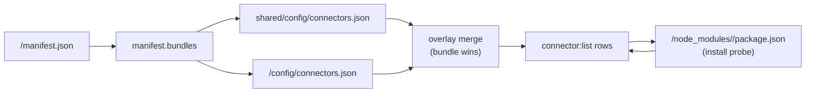
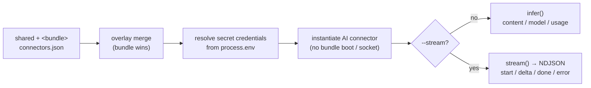
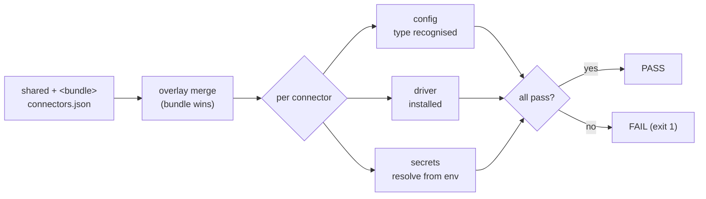

The `connector` command group inspects and maintains `connectors.json` across a project's `shared/config/` and each bundle's `config/` directory. It reports the effective overlay that every bundle sees at runtime, adds or removes entries, lints / auto-fixes common schema drift, runs a one-off inference against a configured AI connector, and probes connectors for readiness. The config subcommands (`list` / `add` / `rm` / `migrate`) and `connector:test`'s default validate-only mode are **offline** — no framework socket or network call; only `connector:infer` (and `connector:test --connect`) reach out, contacting the configured AI provider.

- **`connector:list`** — read-only inventory of every declared connector, with driver install status and version-pin warnings.
- **`connector:add`** — write a connector entry to shared or bundle scope, with driver install hint.
- **`connector:rm`** (alias `connector:remove`) — remove a connector entry; prints retention hints, never touches `node_modules/`.
- **`connector:migrate`** — lint every `connectors.json` for schema drift, optionally fix in place with `--fix`.
- **`connector:infer`** — run a one-off inference against a configured AI connector outside a request; `--stream` for token-by-token NDJSON.
- **`connector:test`** — probe configured connectors for readiness (config / driver / secrets) and exit non-zero on any failure; `--connect` adds a live AI `models.list` probe (zero generation tokens).



---

## `connector:list` {#connectorlist}

*New in 0.3.7-alpha.2*

List connectors for every registered project, a single project, or the merged view a single bundle sees at runtime.

```bash
gina connector:list                      # Every registered project
gina connector:list @<project>           # One project (shared + all bundles)
gina connector:list <bundle> @<project>  # Merged shared+bundle view for <bundle>
```

**Flags**

| Flag | Description |
|------|-------------|
| `--format=json` | Emit a JSON payload instead of the human-readable text table |

### Output

```text
------------------------------------
myproject
------------------------------------
[ ok ] session          couchbase    [shared]                 (couchbase@>=3.0.0 4.1.3 installed)
[ ok ] profile          couchbase    [api]                    (couchbase@>=3.0.0 4.1.3 installed)
[ ok ] session          couchbase    [api override]           (couchbase@>=3.0.0 4.1.3 installed)
[ ?! ] mongodb          mongodb      [admin]                  (mongodb@>=5.0.0 — run `npm install mongodb`)
[ ok ] local            sqlite       [worker]                 (Node.js >= 22.5.0 built-in (node:sqlite))
```

**Row columns**

| Column | Meaning |
|--------|---------|
| **`[ ok ]` / `[ ?! ]` / `[ ?? ]`** | Install status (see below) |
| **name** | Logical connector key (JSON object key in `connectors.json`) |
| **connector** | Driver type resolved from `entry.connector` (falls back to the logical key) |
| **source label** | Where the entry comes from: `[shared]`, `[<bundle>]`, or `[<bundle> override]` |
| **driver info** | Resolved npm package, `peerDependencies` range, pinned version (if any), install state |

**Status flags**

| Flag | Meaning |
|------|---------|
| `[ ok ]` | Driver installed at `<project>/node_modules/<driver>`, or built-in (`node:sqlite`) |
| `[ ?! ]` | Driver declared but not found — `npm install <driver>` suggested inline |
| `[ ?? ]` | Unknown connector type, or `ai` connector with missing/unrecognised `protocol` |
| `[ !! ]` | Version-pin disagreement — emitted as a trailing warning line when two bundles pin the same driver at different versions (the first `npm install` wins) |

**Source labels**

| Label | Meaning |
|-------|---------|
| `[shared]` | Declared only in `shared/config/connectors.json` |
| `[<bundle>]` | Declared only in the bundle's `config/connectors.json` |
| `[<bundle> override]` | Declared in `shared` **and** overridden by the bundle — the merged entry (bundle wins on conflicting keys) is shown |

### JSON output

```bash
gina connector:list @<project> --format=json
```

```json
{
  "project": "myproject",
  "status": "ok",
  "connectors": [
    {
      "project": "myproject",
      "bundle": "api",
      "name": "session",
      "connector": "couchbase",
      "source": "override",
      "driver": "couchbase",
      "builtin": false,
      "range": ">=3.0.0",
      "version": null,
      "installed": true,
      "installedVersion": "4.1.3",
      "note": null,
      "unresolved": false
    }
  ]
}
```

| Field | Description |
|-------|-------------|
| `project` / `bundle` / `name` | Project, owning bundle (null for shared-only rows), logical connector key |
| `connector` | Resolved connector type |
| `source` | `"shared"`, `"bundle"`, or `"override"` |
| `driver` | npm package name (null for built-in drivers) |
| `builtin` | `true` when the driver is Node-builtin (e.g. `node:sqlite`) |
| `range` | `peerDependencies` range declared by the framework |
| `version` | User-set `version` pin from the connector entry (null if unset) |
| `installed` / `installedVersion` | Install probe result from `<project>/node_modules/<driver>/package.json` |
| `note` | Human-readable hint for unresolved or built-in entries |
| `unresolved` | `true` when no driver mapping exists for the type |

### Driver resolution

Drivers are resolved from the framework's `peerDependencies` declared in `package.json`:

| Connector type | npm package | Range |
|----------------|-------------|-------|
| `couchbase` | `couchbase` | `>=3.0.0` |
| `redis` | `ioredis` | `>=5.0.0` |
| `mysql` | `mysql2` | `>=2.0.0` |
| `postgresql` | `pg` | `>=8.0.0` |
| `mongodb` | `mongodb` | `>=5.0.0` |
| `scylladb` | `@scylladb/scylla-driver` | `>=1.0.0` |
| `sqlite` | *(built-in: `node:sqlite`)* | Node ≥ 22.5.0 |
| `ai` | Resolved from `entry.protocol` | See below |

The `ai` connector resolves its driver from `entry.protocol`:

| Scheme | npm package |
|--------|-------------|
| `anthropic://` | `@anthropic-ai/sdk` (`>=0.27.0`) |
| `openai://`, `deepseek://`, `qwen://`, `groq://`, `mistral://`, `together://`, `ollama://`, `gemini://`, `xai://`, `perplexity://` | `openai` (`>=4.0.0`) |

### Overlay semantics

Shared and bundle-level `connectors.json` files are merged key-level, with the bundle side winning on conflicting keys. This mirrors the runtime behaviour of `core/config.js`: a bundle that overrides `session` in its own `config/connectors.json` does **not** need to restate the full entry — it inherits the shared fields and only overrides the keys it declares.

The text output emits one row per resolved entry:
- A shared entry with no bundle override → one `[shared]` row.
- A shared entry that is overridden by one or more bundles → one `[<bundle> override]` row per overriding bundle; **no standalone `[shared]` row**.
- A bundle-only entry (not in shared) → `[<bundle>]`.

### Comment tolerance

`connectors.json`, `manifest.json`, and the file headers they carry are parsed with tolerance for `//` line comments and `/* … */` block comments, the same as `routing.json`.

### Error paths

| Input | Behaviour |
|-------|-----------|
| `connector:list @unknown` | CmdHelper rejects: "Project \[unknown\] not found in your projects list" (exit 1) |
| `connector:list <bundle>` (no `@<project>`) | "`connector:list <bundle>` requires `@<project>`" (exit 1) |
| `connector:list bogus @<project>` | "Bundle \[ bogus \] is not registered inside `@<project>`" (exit 1) |
| `connectors.json` malformed | Treated as "no connectors declared" (silently skipped — use `bundle:start` for strict validation) |

:::caution Version-pin warnings vs. install resolution
npm resolves `node_modules/<driver>/` to a single version per project. When two bundles declare the same driver with different `version` pins, the first `npm install` wins and the other bundle's pin is aspirational. `connector:list` flags this with a trailing `[ !! ] driver \`<name>\` has conflicting \`version\` pins: ...` line. The actual installed version still appears on the affected rows.
:::

---

## `connector:add` {#connectoradd}

*New in 0.3.7-alpha.2*

Add a connector entry to a project's `shared/config/connectors.json` or a bundle-scoped `<bundle>/config/connectors.json`. Preserves any `//` / `/* */` comment header above the first `{`, serialises the body with 4-space indentation, and pins `$schema` at the top.

```bash
gina connector:add <name> @<project>               # Writes to shared/config/connectors.json
gina connector:add <name> <bundle> @<project>      # Writes to <bundle-src>/config/connectors.json
```

After the write, the exact install command for the matching driver is printed — e.g. `npm install ioredis@">=5.0.0"`.

### Flags

| Flag | Description |
|------|-------------|
| `--connector=<type>` | Driver type. One of: `couchbase`, `mysql`, `postgresql`, `sqlite`, `redis`, `ai`. Inferred from `<name>` when `<name>` matches one of those values. |
| `--driver=<type>` | Synonym for `--connector=`. |
| `--protocol=<uri>` | Connection protocol URI scheme (`couchbase://`, `anthropic://`, etc). Required for `ai` connectors. |
| `--host=<host>` | Hostname or IP. Comma-separated for clusters (`db1,db2`). |
| `--connector-port=<port>` | Server port. Numeric when possible. Written to the entry under the `port` key. See the **Reserved flag names** note below. |
| `--database=<name>` | Database, bucket, or keyspace name. |
| `--username=<name>` | Authentication username. |
| `--password=<value>` | Authentication password. Supports `${ENV_VAR}` interpolation. |
| `--scope=<scope>` | Data isolation scope: `local`, `beta`, `production`, `testing`. |
| `--model=<id>` | AI connector only. Default model id. |
| `--api-key=<value>` | AI connector only. API key. Supports `${ENV_VAR}` interpolation. |
| `--base-url=<url>` | AI connector only. Override the provider base URL (OpenAI-compatible providers). |
| `--driver-version=<range>` | Optional semver range to pin the driver install (e.g. `^5.0.0`, `>=5.3.0 <6.0.0`). Written to the entry under the `version` key. See the **Reserved flag names** note below. |
| `--force` | Overwrite an existing entry with the same `<name>`. |
| `--install` | After writing the entry, run the detected package manager's install command for the resolved driver + range. Opt-in; default behaviour is "write entry, print hint". See [Driver install](#driver-install-with---install) below. |

:::caution Reserved flag names
Two CLI flags use longer names than their schema property names:

- **`--connector-port=`** (not `--port=`): `--port=` is reserved by the framework for its own socket port (8124 by default) and is intercepted by `bin/cli` before the handler runs. The written JSON entry still uses the property name `port`.
- **`--driver-version=`** (not `--version=`): the framework auto-converts any `--<key>=<value>` flag to a `GINA_<KEY>` env var, so `--version=^5.0.0` would set `GINA_VERSION=^5.0.0` and trigger a framework version migration. The written JSON entry still uses the property name `version`.

These aliases exist to avoid collisions with framework-level flags; the on-disk JSON shape is unchanged.
:::

### Examples

```bash
# Shared Redis, type inferred from name
gina connector:add redis @myproject --host=127.0.0.1 --connector-port=6379

# Shared Redis under a custom name
gina connector:add session @myproject --connector=redis --host=127.0.0.1 --connector-port=6379

# Bundle-scoped MySQL entry
gina connector:add mydb api @myproject --connector=mysql --database=mydb --username=root

# AI connector with env-var secret
gina connector:add ai-bot @myproject --connector=ai --protocol=anthropic:// --api-key='${ANTHROPIC_API_KEY}'

# Pin driver version, overwrite existing
gina connector:add session @myproject --connector=redis --driver-version=^5.0.0 --force

# Write entry AND run `npm install ioredis@<range>` (lockfile-detected PM)
gina connector:add redis @myproject --install
```

### Output

```text
Added connector `redis` (redis) in bundle `api` at /path/to/project/src/api/config/connectors.json
Next: run `npm install ioredis@">=5.0.0"` inside your project root.
```

When overwriting an existing entry with `--force`, the first line reads `Updated connector ...` instead of `Added connector ...`.

### Driver install with `--install`

By default, `connector:add` writes the entry and prints the matching `npm install …` hint — it does **not** run the install for you. Pass `--install` to turn that hint into an actual call, using the package manager detected from the project's lockfile.

```bash
gina connector:add redis @myproject --install
```

```text
Added connector `redis` (redis) in shared scope at /path/to/project/shared/config/connectors.json
[install] detected package manager: npm (package-lock.json)
[install] resolving driver range: >=5.0.0 (source: framework)
[npm] running: npm install ioredis@>=5.0.0 (cwd: /path/to/project)
…npm output…
```

**Package-manager detection (lockfile probe order)**

The detector walks the project root looking for a lockfile, in this order:

| Order | Lockfile | Package manager | Install subcommand |
|-------|----------|-----------------|--------------------|
| 1 | `bun.lockb` | bun | `bun add <pkg>@<range>` |
| 2 | `pnpm-lock.yaml` | pnpm | `pnpm add <pkg>@<range>` |
| 3 | `yarn.lock` | yarn | `yarn add <pkg>@<range>` |
| 4 | `package-lock.json` | npm | `npm install <pkg>@<range>` |
| — | *(no lockfile)* | npm (fallback) | `npm install <pkg>@<range>` |

The first match wins. When no lockfile is present, npm is the fallback — the detector logs `(fallback — no lockfile found)` so it's visible in the output.

**Install-range resolution order**

The range that follows `@` in the install command is resolved in three tiers, first match wins:

1. **`--driver-version=<range>`** — the pin on the `connector:add` call (if set). Also written to the entry under the `version` key.
2. **Project `package.json`** — `dependencies` first, then `devDependencies`. If the driver is already declared there (from a previous install), that range is reused so `npm install` doesn't churn the lockfile.
3. **Framework `peerDependencies`** — the range declared by gina itself (e.g. `ioredis >=5.0.0`, `couchbase >=3.0.0`).

The resolved tier is logged as `(source: entry | project | framework)` so you can see which rung fired.

**`sqlite` and `ai` behaviour**

- **`sqlite`** — short-circuits. Node.js ≥ 22.5.0 ships `node:sqlite` built in, so `--install` logs `[install] no install needed — Node.js >= 22.5.0 built-in (node:sqlite).` and exits `0` without running anything.
- **`ai`** with a missing or unknown `--protocol=` — exits `1` after writing the entry. The entry is still written to disk (you can fix the protocol and re-run `--install` separately, or install by hand). The error names the supported schemes.

**Exit codes**

| Scenario | Exit code |
|----------|-----------|
| Entry written, install ran, package manager exited `0` | `0` |
| Entry written, `sqlite` short-circuit | `0` |
| Entry written, install ran, package manager exited non-zero | whatever the PM returned |
| Entry written, PM binary missing on `PATH` | `127` |
| Entry written, AI connector with missing/unknown `protocol` | `1` |
| Entry written, unknown connector type | `1` |

:::note Opt-in by design
`--install` is never applied by default — `connector:add` always writes the entry first, then honours the flag. There is no `--no-install` / `--yes` counterpart, and no configuration that silently turns install into the default. If a future session needs it, the flag can be added without changing the default.
:::

### Version pin — where it applies

The `--driver-version=` pin is written to the entry under the `version` key. At install time, the printed install hint uses that pin (so `--driver-version=^5.0.0` produces `npm install ioredis@"^5.0.0"`). When omitted, the hint falls back to the framework's `peerDependencies` range.

Since `npm install` resolves a single version per project, a `version` pin set on one bundle still affects every bundle that uses the same driver. `connector:list` flags conflicting pins with a `[ !! ]` warning — see the [version-pin warnings note](#connectorlist).

### Merge behaviour

The written file always has this order:

1. `$schema` (always first; inserted with the canonical `https://gina.io/schema/connectors.json` URL if none was present)
2. Existing entries — key order preserved verbatim; if `<name>` already exists, it is replaced in place (not moved to the bottom)
3. The new entry — appended only when `<name>` was not already present

Any comment header above the first `{` is preserved byte-for-byte. Mid-body `//` or `/* */` comments are **lost** on rewrite — the body is re-serialised from the parsed JSON.

### Error paths

| Input | Behaviour |
|-------|-----------|
| `connector:add` with no `<name>` | "`connector:add` requires `<name>` and `@<project>`" (exit 1) |
| `connector:add <name>` (no `@<project>`) | "`connector:add` requires `@<project>`" (exit 1) |
| `connector:add <name> bogus @<project>` | "Bundle \[ bogus \] is not registered inside `@<project>`" (exit 1) |
| `connector:add mycache @<project> --connector=notathing` | "Unknown connector type `notathing`. Allowed values: ..." (exit 1) |
| `connector:add redis @<project>` with no `shared/` dir | "Config directory does not exist: ..." (exit 1) |
| Entry already exists, `--force` not passed | "Connector \`<name>\` already exists in ... Re-run with --force to overwrite." (exit 1) |
| `--scope=` is not one of `local`, `beta`, `production`, `testing` | The framework's scope validation rejects first (before the handler); if it passes, the handler falls back to "Scope \`<value>\` is not valid. Allowed: ..." |

:::tip Inferred type
If `<name>` is one of the built-in connector types (`couchbase`, `mysql`, `postgresql`, `sqlite`, `redis`, `ai`), you can omit `--connector=`. In that case, the generated entry also omits the `connector` field — the runtime uses the logical key name as the type.

Example: `gina connector:add redis @myproject --host=127.0.0.1 --connector-port=6379` writes:
```json
"redis": { "host": "127.0.0.1", "port": 6379 }
```
:::

---

## `connector:rm`

*New in 0.3.7-alpha.2*

Remove a connector entry from a project's `shared/config/connectors.json` or from a bundle-scoped `<bundle>/config/connectors.json`. The scope is inferred from positional-absence: pass a `<bundle>` to target that bundle, omit it to target shared. `remove` is accepted as an alias.

```bash
gina connector:rm <name> @<project>              # Removes from shared/config/connectors.json
gina connector:rm <name> <bundle> @<project>     # Removes from <bundle-src>/config/connectors.json
gina connector:remove <name> @<project>          # Alias for rm
```

:::caution Never uninstalls the npm driver
`connector:rm` removes the JSON entry only — it never runs `npm uninstall`. A driver removed from one bundle may still be needed by another bundle in the same project, and the project's `node_modules/` is shared across bundles. After removal, the command prints a retention hint listing any sibling bundles (or shared) that still reference the same driver.
:::

### Flags

| Flag | Description |
|------|-------------|
| `--dry-run` | Print what would be removed without touching any file. Includes the sibling-usage hint. |
| `--force` | Skip the project-level guard that refuses to remove a shared connector while other bundles still reference it. Bundle-level removals never consult this guard. |

### Scoping rules

| Command shape | Target file | Safety gate |
|---------------|-------------|-------------|
| `connector:rm <name> @<project>` | `shared/config/connectors.json` | Refuses if any bundle still declares `<name>` unless `--force` is passed |
| `connector:rm <name> <bundle> @<project>` | `<bundle-src>/config/connectors.json` | Always proceeds. Leaves shared untouched. |

### Examples

```bash
# Remove shared entry (fails if any bundle still uses it)
gina connector:rm session @myproject

# Remove from one bundle only
gina connector:rm session api @myproject

# Preview removal with sibling warnings
gina connector:rm session @myproject --dry-run

# Remove shared entry even if bundles still use it
gina connector:rm session @myproject --force
```

### Output

```text
Removed connector `session` from shared scope at /path/to/project/shared/config/connectors.json
Note: gina does not uninstall npm packages. Driver `redis` is still referenced by: api (override), worker (session).
```

When removing from a bundle:

```text
Removed connector `session` from bundle `api` at /path/to/project/src/api/config/connectors.json
Note: gina does not uninstall npm packages. Driver `redis` is still referenced by: shared, worker (session).
```

When the removed driver is `sqlite` (Node-builtin), the retention note is omitted — there is no npm package to retain.

### Dry-run

```bash
gina connector:rm session @myproject --dry-run
```

```text
[dry-run] Would remove connector `session` from shared scope at /path/to/project/shared/config/connectors.json.
[dry-run] Current entry:
{
    "connector": "redis",
    "host": "127.0.0.1",
    "port": 6379
}
[dry-run] Warning: 2 bundle(s) still reference `session`: api (override), worker. Re-run without --dry-run and with --force to proceed.
[dry-run] Note: gina does not uninstall npm packages. Driver `redis` is still referenced by: api (override), worker (session).
```

Dry-run never writes to disk and always exits `0`, even when the real command would refuse without `--force`.

### Project-level guard (`--force`)

By default, removing a shared connector requires that no bundle still declares the same logical name — this prevents a bundle that relies on overlay inheritance from breaking silently. The command prints the offending bundles:

```text
[error] Removing shared connector `session` would break 2 bundle(s) that still reference it:
  api (override), worker.
Re-run with --force to remove anyway, or remove from each bundle first.
```

Pass `--force` to bypass the guard. Bundle-level removals never consult the guard — removing from `api` has no effect on `worker` or `shared`.

### Inherited-from-shared hint

Attempting to remove a connector from a bundle when it is only declared in `shared` prints a hint pointing at the right scope:

```text
[error] Connector `session` is not declared in `api/config/connectors.json` — it is inherited from shared/config/connectors.json. Use `gina connector:rm session @myproject` to remove it from shared.
```

### Merge behaviour

The written file preserves:

1. `$schema` (always first)
2. Existing entries in their original key order, minus the removed key
3. Any comment header above the first `{` (byte-for-byte)

Mid-body `//` or `/* */` comments are **lost** on rewrite — the body is re-serialised from the parsed JSON, same as `connector:add`.

### Error paths

| Input | Behaviour |
|-------|-----------|
| `connector:rm` with no `<name>` | "`connector:rm` requires `<name>` and `@<project>`" (exit 1) |
| `connector:rm <name>` (no `@<project>`) | "`connector:rm` requires `@<project>`" (exit 1) |
| `connector:rm <name> bogus @<project>` | "Bundle \[ bogus \] is not registered inside `@<project>`" (exit 1) |
| `connector:rm unknown @<project>` | "Connector `unknown` not found in /…/shared/config/connectors.json" (exit 1) |
| `connector:rm session api @<project>` (lives only in shared) | Inherited-from-shared hint (exit 1) |
| `connector:rm session @<project>` (siblings still reference it) | "Removing shared connector would break N bundle(s): …" (exit 1; pass `--force` to override) |

---

## `connector:migrate`

*New in 0.3.7-alpha.2*

Lint every `connectors.json` in a project (or a single bundle's file) and optionally apply auto-fixable issues in place. `connector:migrate` is **explicit and opt-in** — the framework never auto-migrates a `connectors.json` at bundle boot. Run it in CI or before committing.

```bash
gina connector:migrate @<project>                 # Scan shared + every bundle
gina connector:migrate <bundle> @<project>        # Scan just the bundle's file
gina connector:migrate @<project> --fix           # Apply auto-fixable issues
gina connector:migrate @<project> --format=json   # Machine-readable report
```

:::info Dry run by default
Without `--fix`, `connector:migrate` is a **read-only dry run** — nothing is written. Pass `--fix` to apply the auto-fixable issues.
:::

### Flags

| Flag | Description |
|------|-------------|
| `--fix` | Apply auto-fixable issues to disk. Without it, `connector:migrate` is a read-only dry run. |
| `--format=json` | Emit a machine-readable JSON report instead of the human-readable text summary. |

### Checks

| Check | Severity | Auto-fixable | Description |
|-------|----------|--------------|-------------|
| `missing-schema` | info | yes | Top-level `$schema` key is absent. `--fix` injects `"$schema": "https://gina.io/schema/connectors.json"` at the top of the object, preserving the leading comment header and existing key order. |
| `bare-key-no-connector` | warn | no | An entry has no `connector` field **and** its key is not in the built-in enum (`couchbase`, `mysql`, `postgresql`, `sqlite`, `redis`, `ai`). The correct driver cannot be inferred from the key name, so re-declare the entry explicitly via `gina connector:add <name> @<project> --connector=<type> --force`. |

### Example — dry run

```bash
gina connector:migrate @myproject
```

```text
[dry-run] /.../shared/config/connectors.json (shared) — 2 connector(s), 1 issue(s) remaining
    INFO  missing-schema — Top-level `$schema` key missing. Auto-fix adds `"$schema": "https://gina.io/schema/connectors.json"`.
[dry-run] /.../api/config/connectors.json (bundle `api`) — 1 connector(s), no issues
[dry-run] /.../admin/config/connectors.json (bundle `admin`) — 2 connector(s), 2 issue(s) remaining
    INFO  missing-schema — Top-level `$schema` key missing. Auto-fix adds `"$schema": "https://gina.io/schema/connectors.json"`.
    WARN  bare-key-no-connector — `mongodb` Entry `mongodb` has no `connector` field and key `mongodb` is not in the built-in enum (couchbase, mysql, postgresql, sqlite, redis, ai). Add `"connector": "<type>"` by hand, or re-declare via `gina connector:add mongodb @<project> --connector=<type> --force`.
Re-run with --fix to apply 2 auto-fixable issue(s). 1 issue(s) need manual attention.
```

### Example — apply fixes

```bash
gina connector:migrate @myproject --fix
```

```text
[fix] /.../shared/config/connectors.json (shared) — 2 connector(s), 1 fixed
    FIXED  missing-schema — Top-level `$schema` key missing. Auto-fix adds `"$schema": "https://gina.io/schema/connectors.json"`.
[fix] /.../api/config/connectors.json (bundle `api`) — 1 connector(s), no issues
[fix] /.../admin/config/connectors.json (bundle `admin`) — 2 connector(s), 1 fixed, 1 issue(s) remaining
    FIXED  missing-schema — Top-level `$schema` key missing. Auto-fix adds `"$schema": "https://gina.io/schema/connectors.json"`.
    WARN  bare-key-no-connector — `mongodb` Entry `mongodb` has no `connector` field and key `mongodb` is not in the built-in enum (couchbase, mysql, postgresql, sqlite, redis, ai). Add `"connector": "<type>"` by hand, or re-declare via `gina connector:add mongodb @<project> --connector=<type> --force`.
Applied 2 fix(es). 1 issue(s) still need manual attention.
```

Re-running after `--fix` is idempotent — the fixable issue no longer fires, and only the manual-attention warnings remain.

### JSON output

```bash
gina connector:migrate @myproject --format=json
```

```json
{
  "project": "myproject",
  "scope": "project",
  "bundle": null,
  "fixApplied": false,
  "files": [
    {
      "path": "/.../shared/config/connectors.json",
      "bundle": null,
      "exists": true,
      "parseError": null,
      "connectorCount": 2,
      "fixed": [],
      "issues": [
        {
          "type": "missing-schema",
          "severity": "info",
          "fixable": true,
          "message": "Top-level `$schema` key missing. Auto-fix adds `\"$schema\": \"https://gina.io/schema/connectors.json\"`."
        }
      ]
    }
  ]
}
```

| Field | Description |
|-------|-------------|
| `project` | Project short-name (manifest `name` with the leading `@` stripped) |
| `scope` | `"project"` when `<bundle>` is absent, `"bundle"` when present |
| `bundle` | Bundle name when scope is `"bundle"`, otherwise `null` |
| `fixApplied` | `true` when `--fix` was passed (regardless of whether any fix ran) |
| `files[]` | One entry per scanned `connectors.json` file — `path`, owning `bundle` (null for shared), `exists`, `parseError`, `connectorCount` (excluding `$schema`), `fixed[]`, `issues[]` |

### Comment header preservation

The leading `//` or `/* */` comment header above the first `{` is preserved byte-for-byte when `--fix` rewrites the file. Mid-body comments are lost on rewrite (same convention as `connector:add` and `connector:rm`).

### Why there is no auto-migrate hook

`connector:migrate` does **not** run automatically at bundle boot — `core/config.js` is unchanged by this command. A runtime auto-migration hook is the right long-term design, but only when a concrete old-shape → new-shape delta exists to migrate. Today's schema has no such delta (the enum and field shapes are stable since 0.3.7), so a boot-path hook would be scaffolding around a non-existent problem. The real hook is deferred to `0.4.0` alongside the Couchbase SDK v2 removal (`#CN8`), when the migration will have a real before/after to act on.

### Error paths

| Input | Behaviour |
|-------|-----------|
| `connector:migrate` with no `@<project>` | "`connector:migrate` requires `@<project>`" (exit 1) |
| `connector:migrate @unknown` | "Project \[unknown\] not found in your projects list" (CmdHelper, exit 1) |
| `connector:migrate bogus @<project>` | "Bundle \[ bogus \] is not registered inside `@<project>`" (exit 1) |
| `connector:migrate @<project> --format=xml` | "Unknown --format value `xml`. Supported: json." (exit 1) |
| Target `connectors.json` missing | Reported as "missing (skipped)" — not an error (exit 0) |

---

## `connector:infer` {#connectorinfer}

*New in 0.5.6-alpha.3*

Run a single inference against a configured `ai` connector **without booting the bundle** — the runtime sibling of the config-only `connector:list` / `add` / `rm` / `migrate` commands. It resolves the project's connector config the same way `connector:list` does (shared, or the shared+bundle merged view when a `<bundle>` is named), resolves `${secret:KEY}` credentials from the CLI's own environment, instantiates the AI connector directly, runs one inference, and writes the normalised result to stdout. Useful for smoke-testing connectivity and credentials from CI/automation, or scripting a one-off inference from a shell.

:::caution Makes a network call
Unlike the other `connector:*` subcommands, `connector:infer` is **not** offline — it instantiates the connector and contacts the configured AI provider. Offline providers such as `ollama://` on `localhost` need no paid-API key, but the local server still has to be reachable.
:::



```bash
gina connector:infer <connector> @<project> --message="..."            # Shared connector config
gina connector:infer <connector> <bundle> @<project> --message="..."   # Merged shared+bundle view
gina connector:infer <connector> @<project> --message="..." --format=json
gina connector:infer <connector> @<project> --message="..." --stream   # NDJSON token frames
echo '[{"role":"user","content":"hi"}]' | gina connector:infer <connector> @<project>  # Messages on stdin
```

### Flags

| Flag | Description |
|------|-------------|
| `--message=<text>` | The user prompt. Takes precedence over a messages JSON array piped on stdin; required unless such an array is piped. |
| `--system=<text>` | Optional system prompt. |
| `--model=<id>` | Override the connector's default model for this call. |
| `--max-tokens=<n>` | Maximum tokens in the response (default `1024`). Non-numeric values are ignored. |
| `--temperature=<n>` | Sampling temperature. Non-numeric values are ignored. |
| `--format=json` | Emit `{ content, model, usage }` as JSON instead of the text content + usage footer. The heavy provider `raw` payload is omitted unless `--raw` is given. Matched strictly — `jsonl` / `json5` fall back to the text output. Ignored under `--stream` (which is always NDJSON). |
| `--stream` | Stream the inference as newline-delimited JSON (NDJSON) — one frame per line on stdout. Always NDJSON, regardless of `--format`. See [Streaming with `--stream`](#streaming). |
| `--raw` | Include the heavy provider `raw` payload (omitted by default). With `--format=json`, adds a `raw` field carrying the full provider response. With `--stream`, adds `raw` to the `done` frame — the provider's final message object, or `null` for OpenAI-family streams (which expose no single final object). No effect in text mode. |
| `--api-key=<value>` | Override the connector's `apiKey` with a literal value, bypassing `${secret:...}` resolution. |
| `--base-url=<url>` | Override the provider base URL (OpenAI-compatible providers). |
| `--protocol=<uri>` | Override the connector protocol scheme (e.g. `anthropic://`, `openai://`, `ollama://`). |

### Credentials and secrets

`connector:infer` resolves a `${secret:KEY}` placeholder (typically the `apiKey`) from the **CLI's own environment** via the secrets resolver — the resolved value is never printed. A detached CLI sees only its own shell environment, not secrets a supervisor or orchestrator injects at bundle start, so either:

- export the key in the shell you run the command from (`export ANTHROPIC_API_KEY=…`), or
- pass `--api-key=<literal>` to bypass `${secret:...}` resolution for that one call.

A bare `${ENV_VAR}` (without the `secret:` prefix) is **not** substituted — only the `${secret:KEY}` form, or a literal value. See the [Secrets guide](/guides/secrets) for the `${secret:KEY}` resolver and the [AI connector field reference](/reference/connectors#ai).

### Examples

```bash
# One-off inference against a shared AI connector
gina connector:infer claude @myproject --message="Say hi in one word"

# Bundle-scoped connector, with a system prompt
gina connector:infer claude api @myproject --message="..." --system="You are terse."

# Machine-readable { content, model, usage }
gina connector:infer claude @myproject --message="ping" --format=json

# Same, plus the full provider response under the raw field
gina connector:infer claude @myproject --message="ping" --format=json --raw

# Override the model (e.g. an ollama:// connector)
gina connector:infer local-llm @myproject --message="hi" --model=llama3.2

# Multi-turn messages piped as JSON on stdin (used only when --message is absent)
echo '[{"role":"user","content":"hi"}]' | gina connector:infer claude @myproject
```

### Output

In text mode, the generated content is written to **stdout** and a one-line model / usage footer to **stderr** — so `> file` captures only the content:

```text
Hello!
— claude-sonnet-4-6  (tokens in: 12, out: 3)
```

With `--format=json`, a single `{ content, model, usage }` object is written to stdout (the heavy provider `raw` payload is omitted unless `--raw` is given):

```json
{"content":"Hello!","model":"claude-sonnet-4-6","usage":{"inputTokens":12,"outputTokens":3}}
```

With `--raw`, the object gains a `raw` field carrying the provider's verbatim response (its exact shape is provider-specific — an Anthropic message object, an OpenAI completion object, etc.):

```json
{"content":"Hello!","model":"claude-sonnet-4-6","usage":{"inputTokens":12,"outputTokens":3},"raw":{"id":"msg_01…","type":"message","role":"assistant","stop_reason":"end_turn","content":[{"type":"text","text":"Hello!"}]}}
```

### Streaming with `--stream` {#streaming}

`--stream` emits the inference as **newline-delimited JSON (NDJSON)** — one JSON object per line on stdout, for token-by-token consumption from a shell or CI. It always emits NDJSON, regardless of `--format`. The sequence is a `start` frame, a `delta` frame per token, then a terminal `done` (or `error`) frame:

```text
{"type":"start","model":"claude-sonnet-4-6","role":"assistant"}
{"type":"delta","index":0,"text":"Hel","outputTokens":null}
{"type":"delta","index":1,"text":"lo!","outputTokens":null}
{"type":"done","content":"Hello!","model":"claude-sonnet-4-6","usage":{"inputTokens":12,"outputTokens":3},"latencyMs":412}
```

| Frame | Fields |
|-------|--------|
| `start` | `model`, `role` |
| `delta` | `index`, `text`, `outputTokens` (per-token count when the provider reports it, else `null`) |
| `done` | `content`, `model`, `usage` `{ inputTokens, outputTokens }`, `latencyMs`, `finishReason` (OpenAI-family providers only), and `raw` when `--raw` is given (the provider's final message object, or `null` for OpenAI-family streams) |
| `error` | `error` `{ message }` — emitted on any failure (connector build or mid-stream), followed by exit `1` |

Token counters are **passed through verbatim and never fabricated**: OpenAI-family deltas carry `outputTokens: null` until the final chunk, and some providers (e.g. `ollama`) omit the usage chunk entirely — those stay `null`. `finishReason` is OpenAI-family-only (absent on Anthropic's `done`). This mirrors the in-bundle [token-streaming API](/guides/ai#token-streaming-with-renderstream).

The example above is Anthropic, whose `done` omits `finishReason`. An OpenAI-family provider's `done` carries it (the provider's `finish_reason` passed through verbatim — `stop` on a normal completion, `length` when truncated, etc.):

```text
{"type":"done","content":"Hello!","model":"gpt-4o-mini","usage":{"inputTokens":12,"outputTokens":3},"latencyMs":389,"finishReason":"stop"}
```

### Error paths

| Input | Behaviour |
|-------|-----------|
| `connector:infer` with no `<connector>` | Usage error (exit 1) |
| `connector:infer <connector>` (no `@<project>`) | "`connector:infer` requires `@<project>`" (exit 1) |
| `connector:infer <connector> bogus @<project>` | "Bundle \[ bogus \] is not registered inside `@<project>`" (exit 1) |
| Connector not declared in the shared (or merged) config | "Connector \`<connector>\` not found in ..." (exit 1) |
| Connector is not an `ai` connector | "Connector \`<connector>\` is a \`<type>\` connector, not \`ai\`. ..." (exit 1) |
| `${secret:KEY}` unset and no `--api-key` | Secret-resolution error naming the missing `KEY` (never the value) (exit 1) |
| No `--message` and no stdin messages array | "provide a prompt: --message=…" (exit 1) |
| Provider SDK missing / credential / transport error | The provider error, surfaced with a non-zero exit (under `--stream`, as a terminal `error` frame) |

:::note AI connectors only
`connector:infer` only works with `ai` connectors — it errors cleanly on any other type. The provider SDK (`@anthropic-ai/sdk` for `anthropic://`, `openai` for OpenAI-compatible schemes) must be installed in the project's `node_modules`. Database connectors have no inference equivalent; use `connector:list` to inspect their configuration.
:::

---

## `connector:test` {#connectortest}

*New in 0.5.6-alpha.3*

Probe a project's configured connectors for **readiness** and exit non-zero when any one fails — a CI gate that complements `connector:list` (which reports driver-install status) and [`secrets:check`](./secrets.md) (which reports env presence), answering the single question *"is this connector ready to use?"*. By default it is **validate-only and offline**: for each connector it checks that the `connector` type / `ai` protocol is recognised, the npm driver is installed at `<project>/node_modules`, and every `${secret:KEY}` placeholder resolves from the current environment — no network, and no connector is instantiated.

:::tip Validate-only is offline and CI-safe
The default mode makes no network call and instantiates no connector, so it is safe to run in CI on every push. The opt-in `--connect` flag adds a live connectivity probe — see [The `--connect` live probe](#connect).
:::



```bash
gina connector:test                                  # every connector in every registered project
gina connector:test @<project>                       # every connector in one project (shared + bundles)
gina connector:test <connector> @<project>           # one connector (shared / merged view)
gina connector:test <connector> <bundle> @<project>  # one connector as <bundle> sees it
gina connector:test @<project> --format=json         # machine-readable readiness report
gina connector:test <connector> @<project> --connect # add the live probe (ai: models.list)
```

The positional grammar mirrors [`connector:infer`](#connectorinfer) — a leading `<connector>` selects one connector, an optional `<bundle>` narrows to that bundle's merged view — and the all-modes mirror `secrets:check`: omit the connector to test every connector in a project, and omit `@<project>` to test every registered project.

### Checks

Every connector is evaluated against three checks (a fourth, `connect`, only with `--connect`). A connector **passes** only when all of its non-skipped checks pass; a single failing connector flips the overall exit code to `1`:

| Check | Passes when |
|-------|-------------|
| `config` | The `connector` type (or `ai` `protocol`) is one the framework recognises. |
| `driver` | The npm driver is installed at `<project>/node_modules/<driver>` (or is built-in, e.g. `sqlite`). |
| `secrets` | Every `${secret:KEY}` placeholder the connector declares resolves to a non-empty value in the environment. |
| `connect` | *(only with `--connect`)* The live connectivity probe succeeded — see below. |

### Flags

| Flag | Description |
|------|-------------|
| `--connect` | Add a live connectivity probe on top of the validate-only checks. AI connectors only this release (see below); DB/cache connectors report it as **skipped**. |
| `--format=json` | Emit a machine-readable readiness report instead of the human-readable text. |

### The `--connect` live probe {#connect}

`--connect` adds a real connectivity check. For an `ai` connector it instantiates the connector the same way [`connector:infer`](#connectorinfer) does (resolving `${secret:KEY}` from the environment — the value is never printed) and calls the provider's `models.list` — a **credentialed request that authenticates with zero generation tokens** (for an `ollama://` connector it simply confirms the local server is reachable). `connector:test --connect` **never spends generation tokens**: if a provider client exposes no `models.list`, the probe is reported as *inconclusive* rather than falling back to a paid completion — use [`connector:infer`](#connectorinfer) for a generation probe.

For **DB / cache connectors** the live `--connect` probe is reported as **skipped** for now — config / driver / secrets are still validated. A live DB/cache probe is a planned follow-up; those connector classes load framework internals that are only available inside a booted bundle, so they cannot be instantiated from the CLI the way the AI connector can.

### Output

In text mode, each connector prints its per-check breakdown and a `PASS` / `FAIL` line, followed by a per-project summary:

```text
@myproject:
  localdb (sqlite) [shared]
      config    OK    sqlite connector
      driver    OK    Node.js >= 22.5.0 built-in (node:sqlite)
      secrets   OK    no secrets required
    PASS
  cache (redis) [shared]
      config    OK    redis connector
      driver    FAIL  ioredis not installed — run `npm install ioredis`
      secrets   OK    no secrets required
    FAIL

(2 connectors: 1 passed, 1 failed)
```

With `--format=json`, the report is a structured object — `{ project, connectors: [ { name, connector, source, bundle, ok, checks: [ { name, ok, detail } ] } ] }` for one project (a top-level `projects` array when no `@<project>` is given). Two checks carry one extra field beyond `{ name, ok, detail }`: the **`secrets`** check adds a `keys` array of `{ key, set }` objects — one per required `${secret:KEY}`, naming the key and whether it resolved (`[]` when the connector needs none; the resolved value is never included) — and, with `--connect`, the **`connect`** check adds a `skipped` boolean (its `ok` is `null` when the probe was inconclusive). The example below shows both an empty `keys` (a no-secrets connector) and a populated one:

```json
{"project":"myproject","connectors":[{"name":"localdb","connector":"sqlite","source":"shared","bundle":null,"ok":true,"checks":[{"name":"config","ok":true,"detail":"sqlite connector"},{"name":"driver","ok":true,"detail":"Node.js >= 22.5.0 built-in (node:sqlite)"},{"name":"secrets","ok":true,"detail":"no secrets required","keys":[]}]},{"name":"claude","connector":"ai","source":"shared","bundle":null,"ok":true,"checks":[{"name":"config","ok":true,"detail":"ai connector (anthropic://)"},{"name":"driver","ok":true,"detail":"@anthropic-ai/sdk 0.65.0 installed"},{"name":"secrets","ok":true,"detail":"1 required: 1 set, 0 unset","keys":[{"key":"ANTHROPIC_API_KEY","set":true}]}]}]}
```

### Exit codes

| Exit | When |
|------|------|
| `0` | Every probed connector passed every check. |
| `1` | Any connector failed a check (unknown type / driver not installed / required secret unset / `--connect` probe failed), or a usage error (unregistered project / bundle, bad `--format`, connector not found). |

:::note Secrets are never printed
Like `connector:infer`, `connector:test` reports only the **name** and SET / UNSET status of each `${secret:KEY}` it requires — never the resolved value. See the [Secrets guide](/guides/secrets) for the `${secret:KEY}` resolver.
:::

---

## `connector:help`

Print the usage summary for the `connector` command group.

```bash
gina connector:help
```

```bash
gina connector
```
