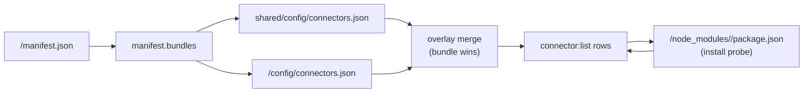

import DocMeta from '@site/src/components/DocMeta';

<DocMeta />

The `connector` command group inspects `connectors.json` across a project's `shared/config/` and each bundle's `config/` directory, then reports the effective overlay that every bundle sees at runtime along with npm driver install status.

:::info Read-only and offline
`connector:list` is **offline** — it does not contact the framework socket and makes no network calls. It only reads local JSON config and probes `node_modules/` for install status.
:::



---

## `connector:list`

*New in 0.3.7-alpha.3*

List connectors for every registered project, a single project, or the merged view a single bundle sees at runtime.

```bash
gina connector:list                      # Every registered project
gina connector:list @<project>           # One project (shared + all bundles)
gina connector:list <bundle> @<project>  # Merged shared+bundle view for <bundle>
```

**Flags**

| Flag | Description |
|------|-------------|
| `--format=json` | Emit a JSON payload instead of the human-readable text table |

### Output

```text
------------------------------------
myproject
------------------------------------
[ ok ] session          couchbase    [shared]                 (couchbase@>=3.0.0 4.1.3 installed)
[ ok ] profile          couchbase    [api]                    (couchbase@>=3.0.0 4.1.3 installed)
[ ok ] session          couchbase    [api override]           (couchbase@>=3.0.0 4.1.3 installed)
[ ?! ] mongodb          mongodb      [admin]                  (mongodb@>=5.0.0 — run `npm install mongodb`)
[ ok ] local            sqlite       [worker]                 (Node.js >= 22.5.0 built-in (node:sqlite))
```

**Row columns**

| Column | Meaning |
|--------|---------|
| **`[ ok ]` / `[ ?! ]` / `[ ?? ]`** | Install status (see below) |
| **name** | Logical connector key (JSON object key in `connectors.json`) |
| **connector** | Driver type resolved from `entry.connector` (falls back to the logical key) |
| **source label** | Where the entry comes from: `[shared]`, `[<bundle>]`, or `[<bundle> override]` |
| **driver info** | Resolved npm package, `peerDependencies` range, pinned version (if any), install state |

**Status flags**

| Flag | Meaning |
|------|---------|
| `[ ok ]` | Driver installed at `<project>/node_modules/<driver>`, or built-in (`node:sqlite`) |
| `[ ?! ]` | Driver declared but not found — `npm install <driver>` suggested inline |
| `[ ?? ]` | Unknown connector type, or `ai` connector with missing/unrecognised `protocol` |
| `[ !! ]` | Version-pin disagreement — emitted as a trailing warning line when two bundles pin the same driver at different versions (the first `npm install` wins) |

**Source labels**

| Label | Meaning |
|-------|---------|
| `[shared]` | Declared only in `shared/config/connectors.json` |
| `[<bundle>]` | Declared only in the bundle's `config/connectors.json` |
| `[<bundle> override]` | Declared in `shared` **and** overridden by the bundle — the merged entry (bundle wins on conflicting keys) is shown |

### JSON output

```bash
gina connector:list @<project> --format=json
```

```json
{
  "project": "myproject",
  "status": "ok",
  "connectors": [
    {
      "project": "myproject",
      "bundle": "api",
      "name": "session",
      "connector": "couchbase",
      "source": "override",
      "driver": "couchbase",
      "builtin": false,
      "range": ">=3.0.0",
      "version": null,
      "installed": true,
      "installedVersion": "4.1.3",
      "note": null,
      "unresolved": false
    }
  ]
}
```

| Field | Description |
|-------|-------------|
| `project` / `bundle` / `name` | Project, owning bundle (null for shared-only rows), logical connector key |
| `connector` | Resolved connector type |
| `source` | `"shared"`, `"bundle"`, or `"override"` |
| `driver` | npm package name (null for built-in drivers) |
| `builtin` | `true` when the driver is Node-builtin (e.g. `node:sqlite`) |
| `range` | `peerDependencies` range declared by the framework |
| `version` | User-set `version` pin from the connector entry (null if unset) |
| `installed` / `installedVersion` | Install probe result from `<project>/node_modules/<driver>/package.json` |
| `note` | Human-readable hint for unresolved or built-in entries |
| `unresolved` | `true` when no driver mapping exists for the type |

### Driver resolution

Drivers are resolved from the framework's `peerDependencies` declared in `package.json`:

| Connector type | npm package | Range |
|----------------|-------------|-------|
| `couchbase` | `couchbase` | `>=3.0.0` |
| `redis` | `ioredis` | `>=5.0.0` |
| `mysql` | `mysql2` | `>=2.0.0` |
| `postgresql` | `pg` | `>=8.0.0` |
| `mongodb` | `mongodb` | `>=5.0.0` |
| `scylladb` | `@scylladb/scylla-driver` | `>=1.0.0` |
| `sqlite` | *(built-in: `node:sqlite`)* | Node ≥ 22.5.0 |
| `ai` | Resolved from `entry.protocol` | See below |

The `ai` connector resolves its driver from `entry.protocol`:

| Scheme | npm package |
|--------|-------------|
| `anthropic://` | `@anthropic-ai/sdk` (`>=0.27.0`) |
| `openai://`, `deepseek://`, `qwen://`, `groq://`, `mistral://`, `together://`, `ollama://`, `gemini://`, `xai://`, `perplexity://` | `openai` (`>=4.0.0`) |

### Overlay semantics

Shared and bundle-level `connectors.json` files are merged key-level, with the bundle side winning on conflicting keys. This mirrors the runtime behaviour of `core/config.js`: a bundle that overrides `session` in its own `config/connectors.json` does **not** need to restate the full entry — it inherits the shared fields and only overrides the keys it declares.

The text output emits one row per resolved entry:
- A shared entry with no bundle override → one `[shared]` row.
- A shared entry that is overridden by one or more bundles → one `[<bundle> override]` row per overriding bundle; **no standalone `[shared]` row**.
- A bundle-only entry (not in shared) → `[<bundle>]`.

### Comment tolerance

`connectors.json`, `manifest.json`, and the file headers they carry are parsed with tolerance for `//` line comments and `/* … */` block comments, the same as `routing.json`.

### Error paths

| Input | Behaviour |
|-------|-----------|
| `connector:list @unknown` | CmdHelper rejects: "Project \[unknown\] not found in your projects list" (exit 1) |
| `connector:list <bundle>` (no `@<project>`) | "`connector:list <bundle>` requires `@<project>`" (exit 1) |
| `connector:list bogus @<project>` | "Bundle \[ bogus \] is not registered inside `@<project>`" (exit 1) |
| `connectors.json` malformed | Treated as "no connectors declared" (silently skipped — use `bundle:start` for strict validation) |

:::caution Version-pin warnings vs. install resolution
npm resolves `node_modules/<driver>/` to a single version per project. When two bundles declare the same driver with different `version` pins, the first `npm install` wins and the other bundle's pin is aspirational. `connector:list` flags this with a trailing `[ !! ] driver \`<name>\` has conflicting \`version\` pins: ...` line. The actual installed version still appears on the affected rows.
:::

---

## `connector:add`

*New in 0.3.7-alpha.3*

Add a connector entry to a project's `shared/config/connectors.json` or a bundle-scoped `<bundle>/config/connectors.json`. Preserves any `//` / `/* */` comment header above the first `{`, serialises the body with 4-space indentation, and pins `$schema` at the top.

```bash
gina connector:add <name> @<project>               # Writes to shared/config/connectors.json
gina connector:add <name> <bundle> @<project>      # Writes to <bundle-src>/config/connectors.json
```

After the write, the exact install command for the matching driver is printed — e.g. `npm install ioredis@">=5.0.0"`.

### Flags

| Flag | Description |
|------|-------------|
| `--connector=<type>` | Driver type. One of: `couchbase`, `mysql`, `postgresql`, `sqlite`, `redis`, `ai`. Inferred from `<name>` when `<name>` matches one of those values. |
| `--driver=<type>` | Synonym for `--connector=`. |
| `--protocol=<uri>` | Connection protocol URI scheme (`couchbase://`, `anthropic://`, etc). Required for `ai` connectors. |
| `--host=<host>` | Hostname or IP. Comma-separated for clusters (`db1,db2`). |
| `--connector-port=<port>` | Server port. Numeric when possible. Written to the entry under the `port` key. See the **Reserved flag names** note below. |
| `--database=<name>` | Database, bucket, or keyspace name. |
| `--username=<name>` | Authentication username. |
| `--password=<value>` | Authentication password. Supports `${ENV_VAR}` interpolation. |
| `--scope=<scope>` | Data isolation scope: `local`, `beta`, `production`, `testing`. |
| `--model=<id>` | AI connector only. Default model id. |
| `--api-key=<value>` | AI connector only. API key. Supports `${ENV_VAR}` interpolation. |
| `--base-url=<url>` | AI connector only. Override the provider base URL (OpenAI-compatible providers). |
| `--driver-version=<range>` | Optional semver range to pin the driver install (e.g. `^5.0.0`, `>=5.3.0 <6.0.0`). Written to the entry under the `version` key. See the **Reserved flag names** note below. |
| `--force` | Overwrite an existing entry with the same `<name>`. |

:::caution Reserved flag names
Two CLI flags use longer names than their schema property names:

- **`--connector-port=`** (not `--port=`): `--port=` is reserved by the framework for its own socket port (8124 by default) and is intercepted by `bin/cli` before the handler runs. The written JSON entry still uses the property name `port`.
- **`--driver-version=`** (not `--version=`): the framework auto-converts any `--<key>=<value>` flag to a `GINA_<KEY>` env var, so `--version=^5.0.0` would set `GINA_VERSION=^5.0.0` and trigger a framework version migration. The written JSON entry still uses the property name `version`.

These aliases exist to avoid collisions with framework-level flags; the on-disk JSON shape is unchanged.
:::

### Examples

```bash
# Shared Redis, type inferred from name
gina connector:add redis @myproject --host=127.0.0.1 --connector-port=6379

# Shared Redis under a custom name
gina connector:add session @myproject --connector=redis --host=127.0.0.1 --connector-port=6379

# Bundle-scoped MySQL entry
gina connector:add mydb api @myproject --connector=mysql --database=mydb --username=root

# AI connector with env-var secret
gina connector:add ai-bot @myproject --connector=ai --protocol=anthropic:// --api-key='${ANTHROPIC_API_KEY}'

# Pin driver version, overwrite existing
gina connector:add session @myproject --connector=redis --driver-version=^5.0.0 --force
```

### Output

```text
Added connector `redis` (redis) in bundle `api` at /path/to/project/src/api/config/connectors.json
Next: run `npm install ioredis@">=5.0.0"` inside your project root.
```

When overwriting an existing entry with `--force`, the first line reads `Updated connector ...` instead of `Added connector ...`.

### Version pin — where it applies

The `--driver-version=` pin is written to the entry under the `version` key. At install time, the printed install hint uses that pin (so `--driver-version=^5.0.0` produces `npm install ioredis@"^5.0.0"`). When omitted, the hint falls back to the framework's `peerDependencies` range.

Since `npm install` resolves a single version per project, a `version` pin set on one bundle still affects every bundle that uses the same driver. `connector:list` flags conflicting pins with a `[ !! ]` warning — see the [version-pin warnings note](#connectorlist).

### Merge behaviour

The written file always has this order:

1. `$schema` (always first; inserted with the canonical `https://gina.io/schema/connectors.json` URL if none was present)
2. Existing entries — key order preserved verbatim; if `<name>` already exists, it is replaced in place (not moved to the bottom)
3. The new entry — appended only when `<name>` was not already present

Any comment header above the first `{` is preserved byte-for-byte. Mid-body `//` or `/* */` comments are **lost** on rewrite — the body is re-serialised from the parsed JSON.

### Error paths

| Input | Behaviour |
|-------|-----------|
| `connector:add` with no `<name>` | "`connector:add` requires `<name>` and `@<project>`" (exit 1) |
| `connector:add <name>` (no `@<project>`) | "`connector:add` requires `@<project>`" (exit 1) |
| `connector:add <name> bogus @<project>` | "Bundle \[ bogus \] is not registered inside `@<project>`" (exit 1) |
| `connector:add mycache @<project> --connector=notathing` | "Unknown connector type `notathing`. Allowed values: ..." (exit 1) |
| `connector:add redis @<project>` with no `shared/` dir | "Config directory does not exist: ..." (exit 1) |
| Entry already exists, `--force` not passed | "Connector \`<name>\` already exists in ... Re-run with --force to overwrite." (exit 1) |
| `--scope=` is not one of `local`, `beta`, `production`, `testing` | The framework's scope validation rejects first (before the handler); if it passes, the handler falls back to "Scope \`<value>\` is not valid. Allowed: ..." |

:::tip Inferred type
If `<name>` is one of the built-in connector types (`couchbase`, `mysql`, `postgresql`, `sqlite`, `redis`, `ai`), you can omit `--connector=`. In that case, the generated entry also omits the `connector` field — the runtime uses the logical key name as the type.

Example: `gina connector:add redis @myproject --host=127.0.0.1 --connector-port=6379` writes:
```json
"redis": { "host": "127.0.0.1", "port": 6379 }
```
:::

---

## `connector:help`

Print the usage summary for the `connector` command group.

```bash
gina connector:help
```

```bash
gina connector
```
