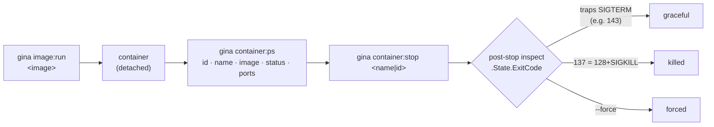

The `container` command group is the other half of [`image:run`](./image.md#imagerun): it lists the containers on the **container host** and stops them. It is the counterpart namespace to [`image`](./image.md) for the same reason podman and docker split the two — these verbs act on *containers*, not images.

- **`container:ps`** — list the containers on the container host.
- **`container:stop`** — stop one, reporting how it came down.

Both are **host-level** (no `@<project>`) and resolve the container host exactly as the [`image`](./image.md#container-host) group does, so `container:ps` always lists the host `image:build` builds onto and `image:run` runs on.



:::caution Drives podman — buildah cannot run containers
The `image` group builds with [buildah](https://buildah.io/), but buildah builds images and cannot run them, so these verbs drive [podman](https://podman.io/). A **build-only host** — buildah present, podman absent — is a supported shape and is reported honestly rather than as an opaque exec failure:

```text
run unavailable on this host: podman not found on ssh://build@lin (buildah 1.44.0 present — build-only host); container:ps needs podman + conmon
```
:::

---

## `container:ps` {#containerps}

*New in 0.5.19*

List the containers on the container host. Running only by default; `--all` includes exited ones.

```bash
gina container:ps
gina container:ps --all
gina container:ps --format=json
```

Every container on the host is listed, not only the ones gina started. A container carries no gina-specific label, so there is no reliable way to tell one from any other — rather than guess with a name heuristic that would quietly hide your own containers, `container:ps` shows you the host as it is, the same as `podman ps` or `docker ps`.

### Flags

| Flag | Effect |
|------|--------|
| `--all` | Include exited containers (default: running only). |
| `--format=json` | Machine-readable output instead of the table. |

### Output

```
CONTAINER ID  NAME  IMAGE                          STATUS         PORTS
42651ca9ea32  demo  localhost/myproject/demo:prod  Up 40 seconds  3101->3101/tcp
```

Ports render the way podman displays them — `[ip:]host->container/proto` — with an explicit `(xN)` when an entry publishes a **range** rather than a single pair. A container with no published ports shows `-`. With nothing to list, the table is replaced by a note:

```text
(no running containers on ssh://build@lin)
```

### JSON output

```bash
gina container:ps --format=json
```

```json
{
  "host": "ssh://build@lin",
  "containers": [
    {
      "id": "42651ca9ea32",
      "name": "demo",
      "image": "localhost/myproject/demo:prod",
      "state": "running",
      "status": "Up 40 seconds",
      "ports": [ { "hostPort": 3101, "containerPort": 3101, "protocol": "tcp" } ],
      "created": "41 seconds ago",
      "createdAt": "2026-07-17T03:57:52.000Z"
    }
  ]
}
```

`host` is the resolved container host (`native`, or the ssh descriptor). `id` is the **12-character short id** — [`image:run`](./image.md#imagerun) reports the full 64-character one, so correlate by prefix, not equality. Following the `image:list` convention, time is dual-keyed: `created` is podman's humanized display string (what the table shows) and `createdAt` is its exact ISO sibling.

A `ports` entry carries `hostPort`, `containerPort` and `protocol`, plus `hostIp` **only** when the port is bound to one interface, and `range` **only** when the entry publishes a port range rather than a single pair. `ports` is `[]` — never `null` — when nothing is published.

Piping is safe — the payload is written synchronously:

```bash
gina container:ps --format=json | jq -r '.containers[].name'
```

### Exit codes

| Exit | When |
|------|------|
| `0` | The host was reached and its containers listed (an empty host is still `0`). |
| `1` | Unsupported `--format`, no container host resolvable, the host cannot run containers (podman absent), or `podman` / `ssh` failed. |

---

## `container:stop` {#containerstop}

*New in 0.5.19*

Stop a container by name or id, reporting the **rung** it came down on. Stopping an already-exited container is a success no-op, so the verb is safe to re-run.

```bash
gina container:stop demo
gina container:stop 42651ca9ea32
gina container:stop demo --time=30
gina container:stop demo --force
```

### Flags

| Flag | Effect |
|------|--------|
| `--time=<seconds>` | Grace period before podman escalates to `SIGKILL` (default `10` — podman's own). |
| `--force` | Kill immediately, skipping the grace period (`podman kill`). |
| `--format=json` | Machine-readable output instead of the text line. |

### The rung {#rung}

podman exits `0` whether a container stopped gracefully or had to be killed, so the exit status alone tells you nothing about *how* it came down. `container:stop` reads the container's own exit code with a post-stop inspect and reports which of three rungs it landed on:

| `result` | Meaning | Typical exit code |
|----------|---------|-------------------|
| `graceful` | The container handled the signal and exited on its own terms. A gina bundle traps `SIGTERM` and drains. | `143` (`128`+`SIGTERM`) |
| `killed` | It did not handle `SIGTERM` in time, so podman escalated to `SIGKILL` after the grace period. | `137` (`128`+`SIGKILL`) |
| `forced` | `--force` — killed immediately, no grace period. | `137` |

A clean drain is what the `gina-container` entrypoint exists to give you, so `graceful` is the expected result for a gina image — see the [Kubernetes & Docker guide](/guides/k8s-docker).

### Output

```text
[container:stop] demo stopped gracefully (exit 143) on ssh://build@lin
[container:stop] demo force-killed after the 10s grace period (exit 137) on ssh://build@lin
[container:stop] demo force-killed (exit 137) on ssh://build@lin
```

### JSON output

```json
{"host":"ssh://build@lin","id":"42651ca9ea32","name":"demo","result":"graceful","exitCode":143}
```

Which makes the rung directly assertable in CI:

```bash
test "$(gina container:stop demo --format=json | jq -r '.result')" = graceful
```

### Exit codes

| Exit | When |
|------|------|
| `0` | The container was stopped — or was already exited (a no-op). |
| `1` | No container given, no container host resolvable, the host cannot run containers (podman absent), no such container on the host, or the stop failed. |

:::note
The target is validated before it reaches the host: it must begin with an alphanumeric and contain only container-token characters. This is what keeps a name from being read as a flag, or from carrying anything else to a remote shell.
:::

---

## `container:help` / `container:man`

Print the usage summary, or the group manual, for the `container` command group:

```bash
gina container:help
gina help container
gina container:man
```
