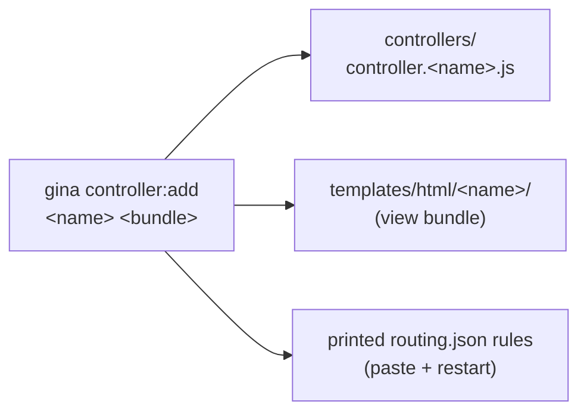

# `gina controller`

Scaffold and manage **namespace controllers** inside a bundle. A controller is
referenced purely by its *namespace string* — the file
`controllers/controller.<name>.js`, a `namespace` value in `routing.json`, and a
`requireController('<name>')` literal all point at the same controller by name,
never by an imported identifier.

- **`controller:add`** — scaffold a namespace controller and print the routing rules to wire it.



All `controller` verbs are **bundle-scoped, same-project** — they take a bundle
name and a `@<project>` suffix — and are **offline** (they read and write local
files; the framework server does not need to be running).

---

## `controller:add` {#controlleradd}

*New in 0.5.25*

Scaffold a namespace controller into an existing bundle and **print** the
paste-ready `routing.json` rules for it. gina creates
`controllers/controller.<name>.js` with one JSDoc'd action stub per `--controls`
entry (or a single `default` action when `--controls` is omitted), and prints the
routing rules for you to paste — **it never edits `routing.json`**. Restart the
bundle after pasting the rules.

```bash
gina controller:add <name> <bundle> @<project>
gina controller:add <name> <bundle> @<project> --controls=<a,b,c>
gina controller:add <name> <bundle> @<project> --api
gina controller:add <name> <bundle> @<project> --views
```

### Example — a view bundle

`demo` is a view bundle (it has views), so gina generates `self.render()` stubs
and one template per action:

```bash
gina controller:add checkout demo @myproject --controls=start,confirm,cancel
```

```text
Creating controllers/controller.checkout.js
  + action start()      + templates/html/checkout/start.html
  + action confirm()    + templates/html/checkout/confirm.html
  + action cancel()     + templates/html/checkout/cancel.html

Add these rules to src/demo/config/routing.json:

  "checkout-start": {
    "url": "/checkout/start",
    "method": "GET",
    "namespace": "checkout",
    "param": { "control": "start", "file": "start" }
  },
  "checkout-confirm": {
    "url": "/checkout/confirm",
    "method": "GET",
    "namespace": "checkout",
    "param": { "control": "confirm", "file": "confirm" }
  },
  "checkout-cancel": {
    "url": "/checkout/cancel",
    "method": "GET",
    "namespace": "checkout",
    "param": { "control": "cancel", "file": "cancel" }
  }

Then restart the bundle.
```

The printed block drops cleanly between existing rules — the entries are
comma-separated with no trailing comma on the last one. Each view rule carries an
explicit `param.file` (equal to the action) so gina resolves
`templates/html/<name>/<action>.html` without the naming-convention warning a
defaulted `file` would trigger.

### Example — an API-only bundle

`api` is an API-only bundle (no views), so the flavor auto-detects to `api` —
`self.renderJSON()` stubs, and **no templates**. API rules omit `param.file`:

```bash
gina controller:add webhooks api @myproject --controls=ping
```

```text
Creating controllers/controller.webhooks.js
  + action ping()

Add these rules to src/api/config/routing.json:

  "webhooks-ping": {
    "url": "/webhooks/ping",
    "method": "GET",
    "namespace": "webhooks",
    "param": { "control": "ping" }
  }

Then restart the bundle.
```

### Example — the default action

Omit `--controls` and gina scaffolds a single `default` action, whose rule routes
to the namespace **root** (`/<name>`) rather than `/<name>/<action>`:

```bash
gina controller:add account api @myproject
```

```text
Creating controllers/controller.account.js
  + action default()

Add these rules to src/api/config/routing.json:

  "account-default": {
    "url": "/account",
    "method": "GET",
    "namespace": "account",
    "param": { "control": "default" }
  }

Then restart the bundle.
```

### The bundle flavor {#flavor}

The flavor is **auto-detected** from whether the bundle has views (a
`config/templates.json`, which [`view:add`](./view.md) creates):

| Flavor | Detected when | Stubs | Templates |
|--------|---------------|-------|-----------|
| `view` | the bundle has `config/templates.json` | `self.render(data)` | one per action at `templates/html/<name>/<action>.html` |
| `api` | no `config/templates.json` | `self.renderJSON(...)` | none |

Force it with `--views` or `--api` when the auto-detect is not what you want (for
example, to scaffold render stubs into a bundle you have not run
[`view:add`](./view.md) on yet).

### Flags

| Flag | Effect |
|------|--------|
| `--controls=<a,b,c>` | One JSDoc'd action stub (and, for a view bundle, one template) per entry. Omitted → a single `default` action. |
| `--views` | Force the view flavor — `render()` stubs + templates. |
| `--api` | Force the API flavor — `renderJSON()` stubs, no templates. |

### The print-only contract {#print-only}

`controller:add` **never edits `routing.json`.** It prints the rules and leaves
the wiring to you — paste the printed block into your bundle's `routing.json` and
restart the bundle. This keeps the command safe to re-run for its scaffolding
alone, and keeps your routing file (with its comments and ordering) yours to edit.

:::note Why a namespace needs a rule
A routing rule dispatches to a controller by its `namespace` value. If a rule
names a namespace whose `controller.<name>.js` does not exist, gina **warns and
silently falls back to the default `controller.js`** rather than erroring — so a
scaffolded-but-unwired controller is simply never reached. Paste the printed
rules (and restart) to wire it up.
:::

### Naming

Controller and action names are **a lowercase letter followed by letters, digits
or underscores** (for example `checkout`, `user_profile`, `ping`). No hyphens,
dots or slashes — the namespace becomes a file-name segment, a routing value and a
`${Bundle}${Namespace}Controller` class name, so it has to be a safe identifier.
The name `controller` is **reserved** (it is the default controller every
namespace controller inherits).

`controller:add` refuses, with a non-zero exit, when:

- the name fails the charset guard or is the reserved `controller`;
- a `controller.<name>.js` already exists in the bundle (remove it with
  `controller:remove`, or edit it in place — `add` never overwrites);
- an action name in `--controls` fails the charset guard;
- both `--api` and `--views` are passed.

### Exit codes

| Exit | When |
|------|------|
| `0` | The controller file (and, for a view bundle, its templates) was created and the rules printed. |
| `1` | Invalid / reserved name, an invalid `--controls` action, the bundle is not registered, the controller already exists, or both flavor flags were passed. |

---

## `controller:help` / `controller:man`

Print the usage summary, or the group manual, for the `controller` command group:

```bash
gina controller:help
gina help controller
gina controller:man
```
