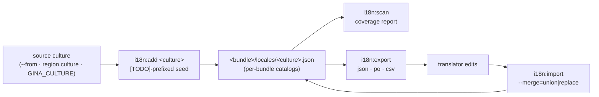

The `i18n` command group maintains the per-bundle translation catalogs that back
[`t()` and per-request locale negotiation](/guides/i18n): a coverage report of
translated vs. missing keys (`i18n:scan`), a seeding command for starting a new
culture from an existing one (`i18n:add`), and a translator round-trip
(`i18n:export` / `i18n:import`) over JSON, gettext PO, and CSV. Every `i18n:*`
action is **offline** — no framework socket, no network call.

- **`i18n:scan`** — read-only coverage report per culture, against the keys used in each bundle's source.
- **`i18n:add`** — seed `<bundle>/locales/<culture>.json` from an existing culture, values `[TODO]`-prefixed.
- **`i18n:export`** — export catalogs as JSON, PO, or CSV for translators.
- **`i18n:import`** — merge a translator-edited file back into the catalogs (`union` or `replace`).

Catalogs live at `<bundle>/locales/<culture>.json` — filenames must match
`<lang>(_<REGION>)?.json` (`en.json`, `en_US.json`, `pt_BR.json`) — and validate
against the [catalog JSON Schema](https://gina.io/schema/locales.json). The
runtime side (the `t()` API, negotiation order, CLDR plurals, ICU) is covered by
the [Internationalisation guide](/guides/i18n).



:::caution Reserved flag names
The `i18n` handlers recognise only the flags documented on this page — the
group's whitelist in `lib/cmd/i18n/arguments.json`: `--format`, `--from`,
`--output`, `--file`, `--merge`, `--dry-run`, `--force`. Any other `--` token
is claimed by the framework CLI layer, never by the handler: `--port=` is
reserved for the framework's own socket port, `--version=` triggers a
framework-version migration, and an unrecognised or mistyped flag
(`--fromm=en`) is treated as a framework/Node parameter rather than rejected —
the command silently falls back to its defaults. Double-check flag spelling
when a flag appears to have no effect.
:::

---

## `i18n:scan` {#i18nscan}

*New in 0.3.11*

Report translation coverage — per bundle, per culture — against the keys used
in each bundle's source. Read-only: `i18n:scan` never writes to the project.

```bash
gina i18n:scan                            # Every registered project
gina i18n:scan @<project>                 # One project (all bundles)
gina i18n:scan <bundle> @<project>        # One bundle
gina i18n:scan @<project> --format=json   # Machine-readable (CI / tooling)
```

With no `@<project>`, every registered project is scanned. A bare `<bundle>`
without `@<project>` is rejected — the bundle positional only scopes a named
project.

### Flags

| Flag | Description |
|------|-------------|
| `--format=<text\|json>` | Output format. Default `text`. |

`i18n:scan` has **no `--output` flag** (`--output` belongs to
[`i18n:export`](#i18nexport)) — JSON goes to stdout; capture it with a shell
redirect (`gina i18n:scan @myproject --format=json > coverage.json`).

### Examples

```bash
gina i18n:scan @myproject
gina i18n:scan dashboard @myproject --format=json
```

### Output

```text
@myproject:
  dashboard:
    Cultures: en, fr
    Coverage:
      en      [  100%]  42/42 keys
      fr      [ 88.1%]  37/42 keys  (5 missing)
    Missing in fr:
      - common.welcome
      - errors.notFound
      - nav.settings
      - nav.signout
      - footer.legal
```

Text output caps each culture's missing-key list at **50** (then
`... (N more)`); JSON output is uncapped. A bundle with no `locales/` catalogs,
or no translation keys in its source, says so instead of a coverage block.

With `--format=json`, a single-project scan emits `{ project, bundles }`; the
all-projects form wraps them in a `projects` array:

```json
{
  "projects": [
    {
      "project": "myproject",
      "bundles": [
        {
          "bundle": "dashboard",
          "cultures": ["en", "fr"],
          "totalKeys": 42,
          "coverage": {
            "en": { "translated": 42, "missing": 0, "percent": 100,  "missingKeys": [] },
            "fr": { "translated": 37, "missing": 5, "percent": 88.1, "missingKeys": ["common.welcome", "errors.notFound", "nav.settings", "nav.signout", "footer.legal"] }
          }
        }
      ]
    }
  ]
}
```

### Exit codes

| Exit | When |
|------|------|
| `0` | Report produced. |
| `1` | Usage error — bad `--format`, unregistered project, or a bare `<bundle>` without `@<project>`. |

---

## `i18n:add` {#i18nadd}

*New in 0.3.11*

Seed `<bundle>/locales/<culture>.json` for every bundle in the project (or one
bundle), copying the keys of an existing source culture and prefixing every
value with `[TODO]` so untranslated strings are easy to spot — and easy for
[`i18n:scan`](#i18nscan) to count.

```bash
gina i18n:add <culture> @<project>            # Seed every bundle in the project
gina i18n:add <culture> <bundle> @<project>   # Seed one bundle
gina i18n:add fr @<project> --from=en         # Copy keys from `en` instead of the default
gina i18n:add ja_JP @<project> --force        # Overwrite an existing target catalog
```

The source culture is resolved in order: `--from=<src>`, then the bundle's
`settings.region.culture`, then the `GINA_CULTURE` env var, then `en`. The
command refuses to seed a culture **from itself** — when the resolved source
equals the target, pass `--from=<other>`.

Cultures are validated against `^[a-z]{2,3}(_[A-Z]{2,3})?$` — `en`, `en_US`,
`pt_BR` — for both the target and `--from`.

### Flags

| Flag | Description |
|------|-------------|
| `--from=<culture>` | Source culture to copy keys from. Default: the bundle's `settings.region.culture`, then `GINA_CULTURE`, then `en`. |
| `--force` | Overwrite an existing target catalog (default: refuse). |
| `--dry-run` | Print what would be written; touch nothing. |

### Examples

```bash
gina i18n:add fr @myproject
gina i18n:add fr dashboard @myproject --from=en
gina i18n:add ja_JP @myproject --force
```

### Output

```text
[dashboard] created /path/to/myproject/dashboard/locales/fr.json (source: en)
```

With `--dry-run`:

```text
[dashboard] [dry-run] would write /path/to/myproject/dashboard/locales/fr.json (346 bytes; source: en)
```

### Exit codes

| Exit | When |
|------|------|
| `0` | Catalog(s) written (or dry-run preview printed). |
| `1` | Usage error — missing/invalid `<culture>` or `--from`, missing `@<project>`, unregistered project or bundle, source == target, unreadable source catalog, or an existing target without `--force`. |

---

## `i18n:export` {#i18nexport}

*New in 0.3.11*

Export a culture's catalogs for translators — as JSON, gettext PO, or CSV — to
stdout or a file.

```bash
gina i18n:export <culture> @<project>                            # JSON wrapper to stdout
gina i18n:export <culture> <bundle> @<project>                   # One bundle (on-disk shape verbatim)
gina i18n:export <culture> @<project> --format=po --output=fr.po # Translator-friendly PO file
gina i18n:export <culture> @<project> --output=fr.csv            # Format auto-detected from extension
```

### Flags

| Flag | Description |
|------|-------------|
| `--format=<json\|po\|csv>` | Output format. When omitted, auto-detected from `--output`'s extension; with neither, defaults to `json`. |
| `--output=<path>` | Write to a file instead of stdout. The parent directory must already exist. |

### Formats

**Project-wide vs. single-bundle.** A project-wide export disambiguates
bundles per format; a single-bundle JSON export is the on-disk catalog shape
**verbatim** (so it round-trips through `i18n:import` byte-faithfully):

| Format | Multi-bundle disambiguation |
|--------|------------------------------|
| `json` | `{ "<bundle>": { …catalog }, … }` wrapper — one key per bundle |
| `po` | `msgctxt "<bundle>"` on each entry |
| `csv` | A leading `bundle` column |

**Plural forms.** PO uses the native `msgid_plural` + `msgstr[N]` shape, with a
`#. cldr-keys: <list>` extracted comment recording the CLDR categories present
so the import can round-trip them. CSV (RFC 4180 quoting) flattens plural forms
to dotted-suffix rows (`items.one`, `items.other`).

Bundles without a catalog for the culture are skipped with a warning; when
**no** bundle has one, the command errors
(`No bundles in @<project> have a catalog for `<culture>`.`).

### Examples

```bash
gina i18n:export fr @myproject --format=po --output=/tmp/fr.po
gina i18n:export en dashboard @myproject --output=/tmp/en.csv
gina i18n:export fr_CA @myproject          # JSON wrapper to stdout
```

### Output

Without `--output`, the export body itself is written to stdout. With
`--output`:

```text
[po] wrote /tmp/fr.po (8452 bytes)
```

### Exit codes

| Exit | When |
|------|------|
| `0` | Export produced. |
| `1` | Usage error — missing/invalid `<culture>`, missing `@<project>`, bad `--format`, unregistered project or bundle, a missing single-bundle catalog, zero project-wide catalogs, or a non-existent `--output` directory. |

---

## `i18n:import` {#i18nimport}

*New in 0.3.11*

Merge a translator-edited file back into the project's catalogs. The inverse of
[`i18n:export`](#i18nexport) — it accepts the same three formats and
auto-detects multi-bundle inputs (JSON wrapper, PO `msgctxt`, CSV `bundle`
column).

```bash
gina i18n:import <culture> @<project> --file=fr.po              # Project-wide (multi-bundle input)
gina i18n:import <culture> <bundle> @<project> --file=fr.csv    # One bundle
gina i18n:import <culture> @<project> --file=fr.json --merge=replace --dry-run
```

### Flags

| Flag | Description |
|------|-------------|
| `--file=<path>` | Input file. **Required.** Format auto-detected from the `.po` / `.csv` / `.json` extension; any other extension needs an explicit `--format`. |
| `--format=<json\|po\|csv>` | Override the extension-based format detection. |
| `--merge=<union\|replace>` | Merge strategy. Default `union`. |
| `--dry-run` | Print what would change; skip the disk write. |
| `--force` | Create the target catalog when it doesn't exist yet (default: error, suggesting [`i18n:add`](#i18nadd)). |

### Merge strategies

| Mode | Behaviour |
|------|-----------|
| `union` (default) | Deep-merge — imported keys win on conflict; existing translations absent from the import are **preserved**. |
| `replace` | The imported catalog wins entirely; existing keys absent from the import are **dropped**, and the dropped count is reported. |

### Scope rules

- **Project-wide scope requires a multi-bundle input.** A single-bundle file
  (flat JSON, no `msgctxt`, no `bundle` column) is rejected — pass the
  `<bundle>` positional instead, or import a multi-bundle export.
- **Single-bundle scope with a multi-bundle file** imports only the named
  bundle's entries; the other bundles' entries are ignored with a note.
- **Unregistered bundles** appearing in a multi-bundle input are warned about
  and skipped — their entries never touch the disk.

The write-back is **comment-preserving**: a catalog's leading comment header
(everything before the first `{`) survives the merge.

### Examples

```bash
gina i18n:import fr @myproject --file=/tmp/fr.po
gina i18n:import fr dashboard @myproject --file=/tmp/fr.csv
gina i18n:import fr @myproject --file=fr.json --merge=replace --dry-run
```

### Output

```text
[dashboard] merged /path/to/myproject/dashboard/locales/fr.json (--merge=union)
[admin] merged /path/to/myproject/admin/locales/fr.json (--merge=union)

@myproject: 2 bundle(s) merged, 0 skipped.
```

With `--merge=replace`, dropped keys are surfaced inline:
`(--merge=replace; 3 key(s) dropped)`. With `--dry-run`, each line reads
`[dry-run] would write …` with the byte count, and nothing is written.

### Exit codes

| Exit | When |
|------|------|
| `0` | Import merged (or dry-run preview printed). |
| `1` | Usage error — missing `<culture>` / `@<project>` / `--file`, bad `--format` or `--merge`, undetectable format, unregistered project or bundle, single-bundle input under project-wide scope, or a missing target catalog without `--force`. |

---

## `i18n:help`

Print the usage summary for the `i18n` command group.

```bash
gina i18n:help
```

```bash
gina help i18n
```
