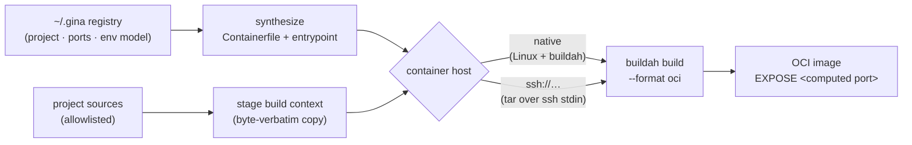

The `image` command group packages a project bundle as a standard [OCI](https://opencontainers.org/) container image. `image:build` synthesizes a `Containerfile` + build context from the project's **registered state** — bundles, entry file, port allocations, env model, Node engine floor — and executes the build with [buildah](https://buildah.io/), natively on Linux or on a container host reached over ssh. The command is **offline** (no framework socket needed), and the resulting image is plain OCI — it runs anywhere OCI images run: Docker, Podman, Kubernetes.

- **`image:build`** — synthesize the `Containerfile` + build context and build the image; `--emit` prints the synthesized artifact without building anything.



---

## `image:build` {#imagebuild}

*New in 0.5.11*

Package a project bundle as an OCI image. You write no `Containerfile` — `image:build` derives one from what the framework already knows about the project (its `manifest.json` bundles, the port matrix, the env model, the framework version pin) and stages an allowlisted copy of the project sources as the build context. Everything the synthesis produces is standard, inspectable Containerfile syntax: `--emit` prints it so you can review — or hand-tune and build yourself — before trusting the automated path.

:::caution Builds with buildah — on Linux, natively or over ssh
buildah runs on Linux only. On macOS or Windows, point the command at a Linux **container host** over ssh — a VM, a CI runner, an OrbStack / Lima machine. The remote path streams the build context as a tar over ssh stdin into a remote temp directory — no listening socket is opened and no registry is involved. With no host resolvable (see [Container host](#container-host) below) the command fails with exit `1`, naming both descriptor surfaces.
:::

```bash
gina image:build @<project>                  # Single-bundle project, default env
gina image:build <bundle> @<project>         # Explicit bundle
gina image:build @<project> --emit           # Print the synthesized artifact, build nothing
```

A project with several bundles must name one — the error lists the candidates.

### Flags

| Flag | Description |
|------|-------------|
| `--env=<env>` | Env baked into the image. Default: the project's single non-dev env (e.g. `prod`) — the deployable artifact. A non-dev env ships the **release tree**, built in-image by `gina bundle:build` (dev/prod parity — see below). |
| `--scope=<scope>` | Target scope. Default: the project's production scope for a non-dev env, else its default scope. |
| `--tag=<ref>` | Image reference. Default `<project>/<bundle>:<env>`. |
| `--platform=<os/arch>` | `linux/arm64` or `linux/amd64`. Default: the build host's native architecture. Cross-arch builds need qemu/binfmt emulation on the build host. |
| `--start-port-from=<n>` | First in-container port (default `3100`). The `EXPOSE`d port is computed deterministically from the `gina-init` port allocator. |
| `--gina-version=<v>` | Framework version installed in the image from the npm registry. Default: the project's registered framework version. |
| `--emit` | Print the synthesized `Containerfile`, entrypoint and context manifest — build **nothing**. |
| `--format=json` | Machine-readable output (one-shot result, or the `--emit` payload). |
| `--stream` | NDJSON progress frames, one JSON object per line: `start` → `step` → `log`* → `done` \| `error`. |

### What the image contains

The synthesized image is deliberately boring, standard OCI:

- **`FROM node:<floor>-slim`** — the floor is the framework's Node engine floor (e.g. `node:22-slim`).
- **gina installed from the npm registry** at the project's registered version (`--gina-version` overrides) — the image never depends on your workstation's install.
- **Project sources copied byte-verbatim** from an allowlisted build context (config, sources, `manifest.json` — no `node_modules`, no VCS metadata).
- **Runs as the non-root `node` user.**
- **Dev/prod parity** — a non-dev `--env` runs `gina bundle:build` *inside the image* so the container ships and boots the built release tree, and the selected env is kept distinct from the project's dev env, so a production image can never start in dev-mode hot-reload.
- **Boots via `gina-init` + `gina-container`** — the foreground, daemonless launcher that forwards `SIGTERM` for graceful shutdown (Kubernetes-friendly; see the [Kubernetes & Docker guide](/guides/k8s-docker)).
- **`EXPOSE <port>` is deterministic** — computed with the same port allocator `gina-init` runs inside the container (first port from `--start-port-from`, default `3100`), so the port you map is stable across rebuilds and is reported as `exposedPort` in the build result.

Run the result with any OCI runtime:

```bash
podman run -d -p 3101:3101 myproject/demo:prod    # or docker run …
```

### Container host {#container-host}

Where the build executes, in precedence order:

1. **`GINA_CONTAINER_HOST=ssh://[user@]host[:port]`** — environment override, wins over everything.
2. **Native buildah** — Linux with `buildah` on `PATH`.
3. **`container.host`** in `~/.gina/<shortVersion>/settings.json` — the machine-level standing default:

```json
{
    "container": {
        "host": "ssh://build@lin"
    }
}
```

With none of the three available the command fails (exit `1`) naming both descriptor surfaces. A descriptor **without** a port defers entirely to your ssh config — host aliases that define their own `Port` / `ProxyCommand` (an OrbStack machine's `<name>@orb`, for instance) work as-is.

:::note Secrets are never baked
`${secret:KEY}` placeholders in the project's config ride **byte-verbatim** into the image and resolve from the *container's* environment at runtime — no secret value is ever read, resolved or baked at build time. Supply them when you run the container (`podman run -e MY_KEY=…`), not when you build it. See the [Secrets guide](/guides/secrets).
:::

### Examples

```bash
# Inspect the synthesized artifact without building
gina image:build @myproject --emit

# Production image for a single-bundle project
gina image:build @myproject

# Explicit bundle + env, machine-readable result
gina image:build demo @myproject --env=prod --format=json

# Stream progress as NDJSON (CI / GUI consumers)
gina image:build demo @myproject --stream

# Build on a remote Linux box
GINA_CONTAINER_HOST=ssh://build@lin gina image:build @myproject
```

### Output

In text mode (the default), a banner line is followed by the relayed buildah log, then the result line:

```text
[image:build] building myproject/demo:prod (demo@myproject, env: prod) on ssh://build@lin
STEP 1/12: FROM node:22-slim
…
[image:build] built myproject/demo:prod (sha256:…) on ssh://build@lin in 48213 ms
```

With `--emit`, the synthesized artifact is printed in three sections — the `Containerfile`, the entrypoint script, and the context manifest — and nothing is staged or built (exit `0`):

```text
# Containerfile — synthesized by `gina image:build` for demo@myproject (env: prod, scope: production)
FROM node:22-slim
…
USER node
EXPOSE 3101
ENTRYPOINT ["/app/gina-entrypoint.sh"]

# --- gina-entrypoint.sh ---
…

# --- context manifest (12 files) ---
manifest.json
src/demo/index.js
…
Containerfile
gina-entrypoint.sh
```

### JSON output

`--format=json` emits a single one-shot object on stdout after a successful build:

```json
{"project":"myproject","bundle":"demo","image":"myproject/demo:prod","tag":"myproject/demo:prod","imageId":"sha256:…","durationMs":48213,"host":"ssh://build@lin","exposedPort":3101}
```

`--emit --format=json` emits the full synthesized artifact instead — `{ project, bundle, env, scope, image, tag, exposedPort, containerfile, entrypoint, context }` — with `containerfile` and `entrypoint` as strings and `context` as the staged-file list.

`--stream` emits NDJSON frames: a `start` frame (the resolved plan: `project`, `bundle`, `env`, `scope`, `image`, `tag`, `host`, `exposedPort`), a `step` frame per phase (`stage`, then `build`), a `log` frame per build-output line, then a terminal `done` frame (carrying the one-shot shape) or `error` frame:

```json
{"type":"start","project":"myproject","bundle":"demo","env":"prod","scope":"production","image":"myproject/demo:prod","tag":"myproject/demo:prod","host":"ssh://build@lin","exposedPort":3101}
{"type":"step","name":"stage"}
{"type":"step","name":"build"}
{"type":"log","line":"STEP 1/12: FROM node:22-slim"}
{"type":"done","project":"myproject","bundle":"demo","image":"myproject/demo:prod","tag":"myproject/demo:prod","imageId":"sha256:…","durationMs":48213,"host":"ssh://build@lin","exposedPort":3101}
```

```json
{"type":"error","error":{"message":"build failed (exit 1) on ssh://build@lin — last output: … (context kept at /tmp/gina-image-build-…)"}}
```

### Exit codes

| Exit | When |
|------|------|
| `0` | The image was built and its id captured — or `--emit` printed the synthesized artifact. |
| `1` | Usage / plan error (several bundles but none named, unknown `--env` / `--scope`), no container host resolvable, context staging failed, `buildah` / `ssh` could not be spawned, or the build itself failed. |

On a build failure the reason line carries targeted hints where the log allows it — a cross-arch `exec format error` points at missing qemu/binfmt on the build host, an untrusted ssh host key points at running `ssh <target>` once to accept it — and the staged context directory is **kept** for inspection (its path is printed).

---

## `image:help` / `image:man`

Print the usage summary, or the group manual, for the `image` command group:

```bash
gina image:help
gina help image
gina image:man
```
