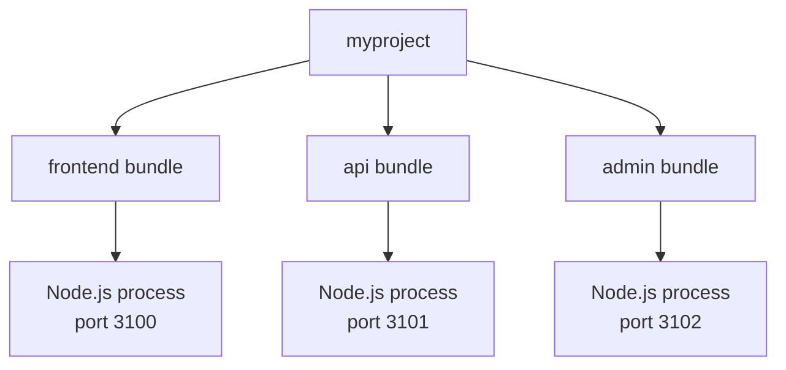
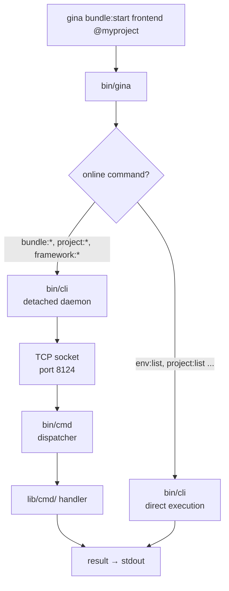
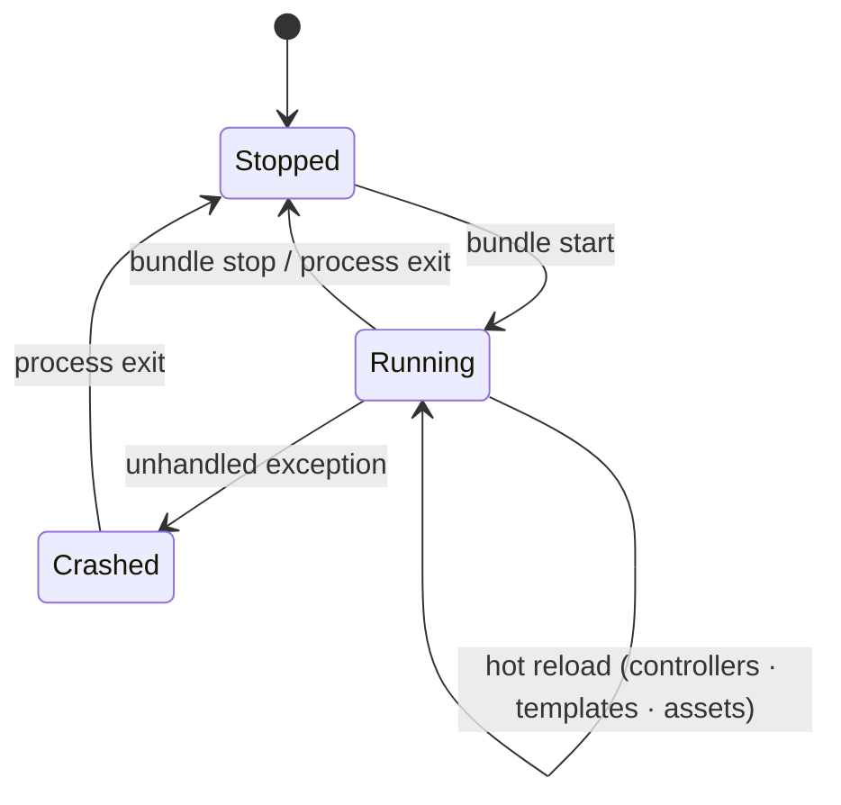
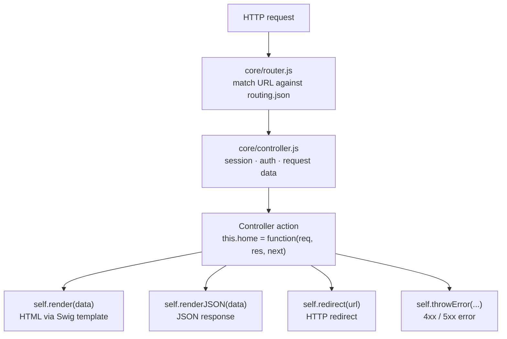
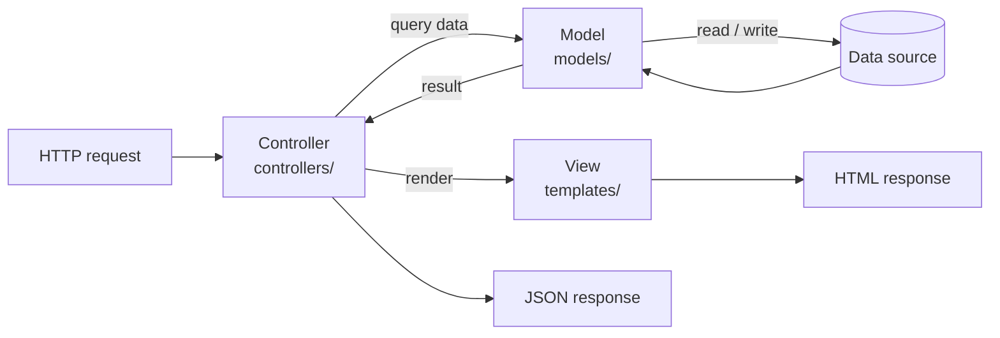

# Architecture

This page describes how a Gina application is structured and how its parts
fit together at runtime.

---

## Projects and bundles

Gina organises code into **projects** and **bundles**.

- A **project** is a collection of bundles. It maps one-to-one to a domain or
  product (e.g. `myproject`).
- A **bundle** is a single application or service inside a project. Each bundle
  runs as an independent Node.js process with its own port, config, and lifecycle.

See [Projects and bundles](./projects-and-bundles) for the full reference.

---

## The framework socket server

When you run `gina start`, Gina starts a background socket server on port `8124`.
All online CLI commands (like `bundle:start` and `bundle:stop`) communicate with
this server over a TCP socket rather than spawning a new process for each command.

An offline command like `env:list` runs directly, without connecting to the server.

---

## Bundle lifecycle

Each bundle starts as a child Node.js process. Its entry point is
`src/<bundle>/index.js`, which bootstraps the Gina core, loads configuration,
and starts listening on its assigned port.

In the development environment, changes to the following directories are applied
**without restarting the bundle**:

- `controllers/`
- `public/` (static assets)
- `templates/`

---

## HTTP request lifecycle

Routes are declared in `src/<bundle>/config/routing.json` — they are not
registered in code.

---

## MVC structure

| Layer | Location | Role |
|-------|----------|------|
| Model | `src/<bundle>/models/` | Data access and business logic |
| View | `src/<bundle>/templates/` | HTML templates (Swig by default) |
| Controller | `src/<bundle>/controllers/` | Request handling and rendering |

---

## Configuration files

| File | Purpose |
|------|---------|
| `env.json` | Host and port configuration per environment |
| `manifest.json` | Bundle manifest — versions and build info |
| `config/app.json` | Application metadata (name, version) |
| `config/routing.json` | URL routing rules |
| `config/settings.json` | Bundle settings (region, timezone, locales) |
| `config/settings.server.json` | Server options (port, protocol, HTTP/2) |
| `config/statics.json` | Static file serving rules |

---

## Global context

Gina injects a set of helpers into every module at startup — no `require()` needed:

| Helper | Purpose |
|--------|---------|
| `_(path)` | Construct a path object |
| `requireJSON(path)` | Load and cache a JSON file |
| `getEnvVar(key)` | Read an environment variable |
| `setEnvVar(key, val)` | Write an environment variable |
| `getContext(key)` | Read a global context value |
| `setContext(key, value)` | Write a global context value |

---

## Ports

| Port | Role |
|------|------|
| 8124 | Framework socket server |
| 8125 | Message queue / log tail listener |
| 3100+ | Bundle HTTP ports (auto-assigned per project) |

See [Ports](./ports) for the full port management reference.
