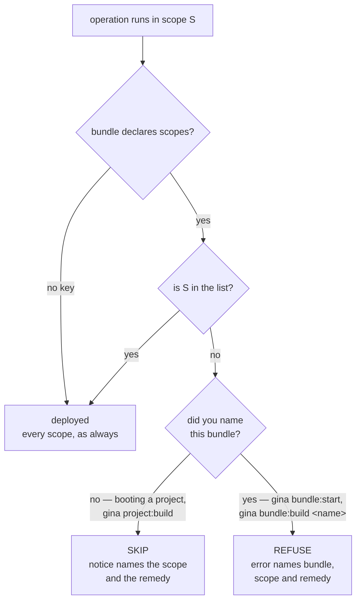

# Scopes

A **scope** is a named deployment target within a project. Scopes let you maintain
separate configurations, certificate paths, and build outputs for different
deployment destinations — for example `local`, `production`, or `staging`. Unlike plain environment variables, scopes reach the data layer: the Couchbase connector stamps every document it inserts with the active scope, and a query that filters on that stamp stays inside its own environment even when environments share one cluster (see [Scopes and data isolation](#scopes-and-data-isolation)).

Every project starts with two default scopes: `local` and `production`.

---

## List scopes

```bash
gina scope:list @myproject
```

List scopes across all registered projects:

```bash
gina scope:list
```

The currently active (default) scope is marked with `[ * ]`.

---

## Add a scope

Add a scope to a project:

```bash
gina scope:add staging @myproject
```

A scope applies to every bundle in the project. To deploy a bundle in some
scopes only, give its manifest entry a `scopes` allow-list — see
[Restrict a bundle to certain scopes](#restrict-a-bundle-to-certain-scopes).

A scope name is made of letters, digits, `_`, `.` and `-`, and starts with a
lowercase letter, a digit, `_` or `.`. `scope:add` refuses any other name,
including `.` and `..` — a scope name becomes a directory name under
`releases/<bundle>/`. It also refuses the name of a property every object inherits,
such as `constructor` or `__proto__`: the project files are indexed by scope name.

---

## Set the default scope

```bash
gina scope:use staging @myproject
```

This makes `staging` the default scope. Commands that accept a scope argument will
fall back to this value when `--scope` is omitted.

---

## Remove a scope

```bash
gina scope:remove staging @myproject
```

---

## Restrict a bundle to certain scopes

By default every bundle registered in `manifest.json` is deployed in **every**
scope. When you are building a new bundle and do not want it going out with the
others yet, give its manifest entry a `scopes` allow-list:

```json
{
  "bundles": {
    "newthing": {
      "version": "0.0.1",
      "src": "src/newthing",
      "link": "bundles/newthing",
      "scopes": ["local"]
    }
  }
}
```

`newthing` is now built and started in `local`, and every other scope behaves as
though it does not exist. When it is ready to ship, add the other scopes to the
list — or delete the key.

:::info `scopes` survives `project:add` / `project:import`
Registration preserves declared bundle entries verbatim — `scopes` included.
If a declared bundle's directory is absent from the location those commands
scan, the command prints a warning naming the bundle and keeps the declaration
(it may be deliberate — precisely this feature); removing an entry for good is
`gina bundle:remove`'s job.
:::

| Value | Meaning |
| --- | --- |
| key absent (or `null`) | Deployed in **every** scope. This is the default, and what every existing manifest does. |
| `["local"]` | Deployed in `local` only. |
| `["local", "staging"]` | Deployed in those two scopes. |
| `[]` | Parked — deployed in no scope at all. |

### What happens to an excluded bundle

It depends on whether you asked for that bundle **by name**. A bulk operation
skips it and says so; an explicit, single-bundle request refuses — because
quietly producing nothing would look like success in a deploy script.



| Operation | Excluded bundle |
| --- | --- |
| Booting a project | **Skipped**, with a notice |
| `gina project:build` | **Skipped**, with a notice — one parked bundle never blocks a project build |
| `gina bundle:start <name>` | **Refused** by name |
| `gina bundle:build <name> --scope=<scope>` | **Refused** by name |

The one exception worth knowing: if the bundle you are *starting* is excluded
from the scope you start it in, that is refused rather than skipped — a boot with
nothing to serve is never what you meant.

:::warning Deleting `releases.<scope>` is not a substitute
It may look equivalent to remove the bundle's `releases.<scope>` entry by hand.
It is not: both build commands walk every scope in the project and re-create any
missing release entry, so the deletion reappears on the next build. Use `scopes`
— it is the only declaration the tooling preserves.
:::

A value that is not an array (for example `"scopes": "local"`) is reported as a
manifest error naming the bundle, rather than being read as "no scopes at all".

---

## Link scopes to local and production slots

Gina reserves two special slots for every project: `local_scope` and
`production_scope`. These slots are used internally for certificate resolution and
build output — for example, certificates under
`~/.gina/certificates/scopes/local/` are picked up when the active scope maps to
the `local` slot.

By default `local` maps to `local_scope` and `production` maps to `production_scope`.
If you rename your scopes or add custom ones, you can remap the slots:

```bash
gina scope:link-local dev @myproject
gina scope:link-production prod @myproject
```

After this, the `dev` scope is treated as the local slot and `prod` as the
production slot everywhere the framework resolves scope-dependent paths.

---

## Scopes and certificates

Certificate paths include the scope name:

```
~/.gina/certificates/scopes/<scope>/<hostname>/
```

See [HTTPS and HTTP/2](../guides/https) for the full certificate setup guide.

---

## Scopes and data isolation

Scopes extend to the data layer. When a bundle uses a Couchbase connector, every
document written to the database is stamped with a `_scope` field that matches the
active scope. This lets multiple environments share the same Couchbase cluster and
bucket without data leaking between them.

### How it works

The connector reads the `scope` field from `connectors.json` (or falls back to
`process.env.NODE_SCOPE`) and stamps it on every document at insert time. An N1QL
query filters on it by comparing `_scope` with the `$scope` placeholder, which the
connector fills in:

```sql
SELECT c.*
FROM myapp AS c USE KEYS [$1]
WHERE c._collection = 'invoice'
AND   c._scope      = $scope
```

`$scope` is replaced with the connector's resolved scope value before the query is
dispatched — the same SQL file works unchanged across all environments. The filter
is not added for you: leave out `_scope = $scope` and the query reads every scope.

### Adding `scope` to a connector

```json title="src/api/config/connectors.json"
{
  "couchbase": {
    "protocol": "couchbase://",
    "host":     "127.0.0.1",
    "database": "myapp",
    "username": "appuser",
    "password": "secret",
    "scope":    "local"
  }
}
```

When `scope` is omitted the connector falls back to `process.env.NODE_SCOPE`, so
development environments usually work without setting it explicitly.

### Scope values

A scope value is the name of a scope registered with the framework. Gina registers two
by default:

| Value | Used for |
|---|---|
| `local` | Local development — maps to `local_scope` by default |
| `production` | Production — maps to `production_scope` by default |

Register another one — for example `staging` — with
[`gina scope:add`](/cli/cli-scope#scopeadd), and use the same value in `connectors.json`.

### Backfilling existing documents

Documents created before `_scope` was introduced have no `_scope` field. Stamp them
with an N1QL update, run in the Couchbase query service against the bucket an
environment uses, with that environment's scope:

```sql
UPDATE `<bucket>` AS d
SET d._scope = '<scope>'
WHERE d._scope IS MISSING
```

Only documents that still lack the field are updated, so running it again changes
nothing. The query service needs an index it can use on the bucket (a primary index
works). In a bucket shared by several environments, documents written before `_scope`
existed cannot be told apart by this query: add a condition that selects the ones
each environment owns.

### Why not separate buckets?

Couchbase Community Edition is capped at five buckets. `_scope` achieves the same
isolation without consuming a bucket slot, following the same pattern as
`_collection` (the document type discriminator already used throughout Gina's
entity system).
