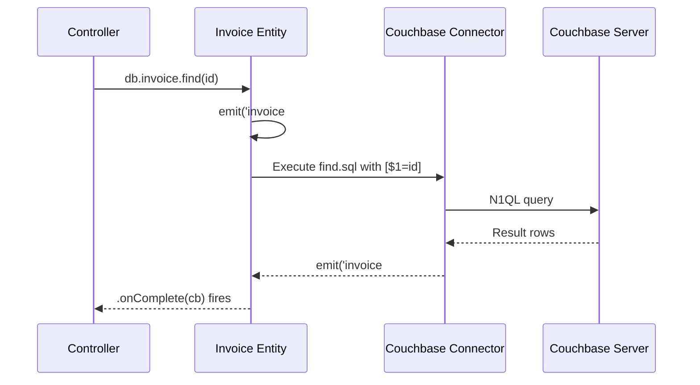
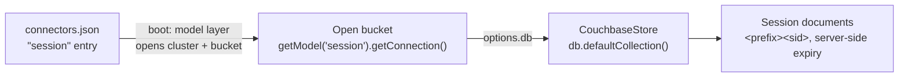

# Couchbase ORM for Node.js

Couchbase is a document database with a SQL-like query language (N1QL) and
key-value access. Most Node.js projects interact with it through the raw SDK,
writing ad-hoc queries in string concatenations and managing connections manually.

Gina's Couchbase connector provides a structured ORM layer:

- **Entities** -- JavaScript classes that map to document types, with generated
  CRUD methods and EventEmitter-based lifecycle hooks
- **SQL files** -- N1QL queries stored as `.sql` files alongside entity code,
  version-controlled and reusable
- **`$scope` isolation** -- automatic multi-tenant data partitioning at the query
  level
- **Auto-stamping** -- `_createdAt`, `_updatedAt`, `_scope` fields injected on
  every insert
- **Query instrumentation** -- every query captured in dev mode for the Inspector

---

## Architecture

```mermaid
flowchart TD
    subgraph Bundle["Bundle Process"]
        C[Controller] -->|"entity.find()"| E[Entity<br/>EventEmitter]
        E -->|"emit trigger"| CN[Couchbase Connector]
        CN -->|"N1QL via SDK"| CB[(Couchbase Server)]
    end

    subgraph DevMode["Dev Mode"]
        CN -->|"push to _devQueryLog"| QI[Query Instrumentation<br/>AsyncLocalStorage]
        QI --> INS[Inspector<br/>Query Tab]
    end

    style Bundle fill:#1a1a2e,stroke:#f2af0d
    style DevMode fill:#2a2a3e,stroke:#4caf50
```



The entity layer sits between your controller and the Couchbase SDK. You interact
with entity methods (`.find()`, `.save()`, `.remove()`). The connector translates
those into N1QL queries, manages the connection, and handles result mapping.

---

## Defining an entity

Entities live under `models/<database>/entities/` in a bundle — one file per
entity, where `<database>` is the `database` value (the bucket name) from the
connector's `connectors.json` entry. The file name is the entity name: the
connector capitalises its first letter to form the class name (`invoice.js` →
`Invoice`) and exposes the instance on the model object in lower-camel form
(`db.invoice`).

An entity file exports a **plain constructor function**. The framework wraps
it with the EventEmitter-based `EntitySuper` base class at startup — you do
not `require` or extend anything yourself:

```javascript
// models/myBucket/entities/invoice.js

/**
 * Invoice entity.
 *
 * N1QL-backed methods (find, findByCustomer, ...) are NOT written here --
 * they are generated from the entity's `.sql` files (next section). Write a
 * custom method only for work the generated methods do not cover, such as
 * key-value access through the SDK collection handle.
 */
function Invoice(conn, caller) {
    var self = this;

    /**
     * Custom KV method. `getConnection()` returns the bucket's default
     * SDK Collection handle.
     * @param {string} key
     * @callback cb - (err)
     */
    this.archiveByKey = function(key, cb) {
        self.getConnection().remove(key)
            .then(function() { cb(null) })
            .catch(cb);
    };
}

module.exports = Invoice;
```

:::caution Instance methods only
Custom methods must be **instance methods assigned in the constructor**
(`this.archiveByKey = function ...`). Prototype-level methods do not survive
the connector's `inherits()` wrapping, and wiring the prototype chain to a
base class yourself is unnecessary — the framework does it for you at
startup.
:::

---

## N1QL query files

Queries are stored as `.sql` files under `models/<database>/n1ql/` — one
directory per entity (named like the entity file), one file per method:

```
models/
  myBucket/
    entities/
      invoice.js
    n1ql/
      invoice/
        find.sql
        findByCustomer.sql
        save.sql
        remove.sql
```

Every `.sql` file becomes a method on the entity, named after the file —
`n1ql/invoice/findByCustomer.sql` is what makes `db.invoice.findByCustomer()`
exist.

:::note One name, three surfaces
The connector loads this whole tree from `models/<database>/`, where
`<database>` is the entry's `database` value — while `getModel()` takes the
**entry name**. Keep the two identical (entry key == `database` == the
`models/` directory name, as in this page's `myBucket` examples) so every
surface points at the same directory.
:::

Each file contains a single N1QL statement:

```sql
-- models/myBucket/n1ql/invoice/findByCustomer.sql
SELECT i.*
FROM `myBucket` i
WHERE i.type = 'invoice'
  AND i._scope = $scope
  AND i.customerId = $1
ORDER BY i._createdAt DESC
```

**Key features of SQL files:**

| Feature | Syntax | Purpose |
|---|---|---|
| Scope filter | `$scope` | Replaced with the current scope string at execution time |
| Positional params | `$1`, `$2`, ... | Bound to method arguments -- parameterized, injection-safe |
| Type filter | `i.type = 'invoice'` | Convention: one document type per entity |
| Annotations | `@options` | Control query execution settings (see below) |

:::info
`$scope` is a **string substitution**, not a query parameter. It is replaced with
a quoted literal (`'local'`, `'production'`, etc.) before the query is sent to
Couchbase. This ensures scope isolation is enforced at the data layer, not in
application code.
:::

:::caution Positional parameters must be JSON-serializable
Every argument bound to a `$1`, `$2`, ... placeholder is serialized with
`JSON.stringify` before it reaches the driver. Three values produce no JSON at
all -- `undefined`, a **function**, and a `Symbol` -- and the Couchbase SDK
cannot represent them.

Gina refuses such a parameter before the query is dispatched, raising a
`TypeError` with the code `GINA_COUCHBASE_UNSERIALIZABLE_PARAM` that names the
offending position. It is delivered to your query callback when you passed one,
and thrown otherwise.

The usual cause is a call that is **one argument short**: the trailing callback
slides into the last placeholder's slot.

```javascript
// findByCustomer.sql declares $1 and $2
invoice.findByCustomer(customerId, function (err, rows) { /* ... */ });
//                                 ^ becomes $2 -- refused with a TypeError

invoice.findByCustomer(customerId, status, function (err, rows) { /* ... */ });
// correct: every declared parameter precedes the callback
```

Pass `null` for a parameter you intend to leave empty -- `null` serializes
correctly and reaches the query. Values such as `0`, `''`, `false`, and objects
that merely *contain* `undefined` properties are all serializable and are passed
through unchanged.
:::

---

## `@options` annotations

Control query behavior directly in the SQL file. `@options` takes a **brace-delimited
object**, written inside a comment block — the same form used in the
[models guide](/guides/models):

```sql
/*
 * @options { consistency: "request_plus" }
 */
SELECT u.*
FROM `myBucket` u
WHERE u.type = 'user'
  AND u._scope = $scope
  AND u.email = $1
```

| Key | Values | Default | Purpose |
|---|---|---|---|
| `consistency` | `not_bounded`, `request_plus` | `not_bounded` | Index consistency level |
| `adhoc` | `true`, `false` | `false` | `false` prepares the statement and caches its plan; `true` runs it ad-hoc |
| `profile` | `off`, `phases`, `timings` | `off` (dev: `timings`) | Query execution profiling |

:::caution
Two parsing rules to watch. Before 0.5.26 both failed **silently**; from 0.5.26 the
connector logs a `[CONNECTOR] @options …` warning naming the ignored keys and the
form to write — but the annotation still does not apply:

- **The braces are required.** `@options consistency=request_plus` does not match the
  parser, so the whole annotation is skipped.
- **Keys other than `consistency` apply only when `consistency` is present too.**
  `@options { adhoc: true }` on its own is skipped; `@options { consistency: "not_bounded", adhoc: true }`
  applies both. When in doubt, always include an explicit `consistency`.
:::

`request_plus` ensures the query sees all mutations up to the current moment --
useful for read-after-write patterns. `not_bounded` (the default) is faster but
may return stale data.

---

## EventEmitter-based lifecycle

Entities extend `EventEmitter`. Method calls emit trigger events, and results are
delivered through callbacks:

```javascript
// In a controller action (var self = this; declared at constructor top)
this.showInvoice = function(req, res, next) {
    // getModel() is a global -- pass the connectors.json entry name.
    // Entities are exposed on the model object in lower-camel form.
    var db = getModel('myBucket');

    db.invoice.find(req.routing.param.id).onComplete(function(err, invoice) {
        if (err) return self.throwError(err);

        self.render({ invoice: invoice });
    });
};
```

The flow:



**Why EventEmitter instead of Promises?**

The entity system predates native Promises in Node.js. The `.onComplete(cb)` pattern
provides a consistent callback interface. For modern code that needs `async/await`,
use the `onCompleteCall()` global helper:

```javascript
// var self = this; declared at constructor top
this.showInvoice = async function(req, res, next) {
    var db = getModel('myBucket');

    try {
        var invoice = await onCompleteCall(db.invoice.find(req.routing.param.id));
        self.render({ invoice: invoice });
    } catch (err) {
        self.throwError(err);
    }
};
```

See [Async helpers](/globals/async) for details on `onCompleteCall()`.

---

## Auto-stamping on insert

When a new document is inserted, the connector automatically adds metadata fields:

| Field | Type | Value |
|---|---|---|
| `_createdAt` | string (ISO 8601) | Timestamp of insertion |
| `_updatedAt` | string (ISO 8601) | Same as `_createdAt` on insert, updated on save |
| `_scope` | string | Current scope (`local`, `beta`, `production`) |

These fields are set by the connector, not by application code. You do not need to
include them in your entity or save logic:

```javascript
// This is all you need — _createdAt, _updatedAt, _scope are injected
db.invoice.save({
    type       : 'invoice'
  , customerId : 'cust-123'
  , amount     : 250.00
  , currency   : 'USD'
}).onComplete(function(err, result) {
    // Saved document now has _createdAt, _updatedAt, _scope
});
```

---

## Multi-tenant isolation with `$scope`

Every N1QL query that includes `$scope` is automatically partitioned by the
current environment's scope. This means:

- A developer running in `local` scope sees only `local` documents
- A staging environment in `beta` scope sees only `beta` documents
- Production sees only `production` documents

**All from the same Couchbase bucket.** No separate databases, no separate clusters,
no manual filtering in application code.

```mermaid
flowchart LR
    subgraph App["Same Application Code"]
        Q["SELECT * FROM bucket<br/>WHERE _scope = $scope"]
    end

    subgraph Envs["Environments"]
        L["local<br/>$scope = 'local'"]
        B["beta<br/>$scope = 'beta'"]
        P["production<br/>$scope = 'production'"]
    end

    App --> L
    App --> B
    App --> P

    style App fill:#1a1a2e,stroke:#f2af0d
    style Envs fill:#2a2a3e,stroke:#666
```



:::tip
Always include `AND _scope = $scope` in your N1QL queries. Omitting it causes the
query to return documents from all scopes -- a data isolation breach. The
[Inspector](/guides/inspector) Query tab highlights queries that are missing scope
filters.
:::

---

## Named scopes & collections

Couchbase itself organises documents into named *scopes* and *collections*.
Gina's data model deliberately does not route queries through them: the
connector works against **one bucket and its default collection**, and
partitions documents with the `_scope` / `_collection` **document fields**
stamped on every insert (see [Auto-stamping](#auto-stamping-on-insert) and
[Multi-tenant isolation](#multi-tenant-isolation-with-scope) above).
`_collection` plays the role a named collection would — one document type per
entity — and `_scope` isolates environments.

Two practical notes:

- **Named-collection KV access is available per call.**
  `entity.getConnection(scope, collection)` returns
  `bucket.scope(scope).collection(collection)` from the SDK — omit both
  arguments for the bucket's default collection. This is the supported escape
  hatch when some of your documents live in a named collection.
- **`useScopeAndCollections` is accepted but currently inert.** The
  `connectors.json` key is reserved for a possible future native
  scope/collection routing mode; setting it changes nothing today.

:::caution Two meanings of "scope"
Gina's `$scope` / `_scope` is the **environment** scope (`local`, `beta`,
`production`, `testing`) — it is unrelated to a Couchbase scope, which is a
namespace layer inside a bucket. `$scope` substitution on this page always
means the environment.
:::

---

## SDK compatibility

The Couchbase connector supports both SDK v3 and SDK v4:

| Feature | SDK v3 | SDK v4 |
|---|---|---|
| N1QL queries | Supported | Supported |
| Query profiling (`meta.profile`) | Works | C++ binding does not surface `profile` field |
| Index reporting | Via `meta.profile` | EXPLAIN fallback (async, cached) |
| Scan consistency | Supported | Supported |
| Prepared statements | Supported | Supported |

The connector detects the SDK version and adjusts its behavior automatically. The
only user-visible difference is in dev-mode query instrumentation: SDK v4 uses an
`EXPLAIN` fallback for index reporting, which may show "N/A" on the first request
for a new query (the EXPLAIN runs asynchronously and caches the result for
subsequent requests).

---

## Soaking an SDK bump candidate

*New in 0.6.3.*

The framework ships a connector-level soak harness for screening a Couchbase
Node SDK candidate (an SDK bump under evaluation) against your Couchbase
Server **before** your project adopts it:

```bash
node "$(npm root -g)/gina/script/soak/couchbase-soak.js" \
  --host=127.0.0.1 --database=soak_scratch \
  --username=Administrator --password=secret \
  --sdk=4.6.1 --duration=15m
```

The harness scaffolds a fully isolated throwaway gina project (your real
`~/.gina` and your real projects are never touched), installs the candidate
SDK **into that project** — the install is the version selector, because the
connector resolves `couchbase` from the project's `node_modules` — builds and
boots the bundle for the prod env, then drives the three connector surfaces
under sustained concurrent load:

| Arm | What it exercises |
|---|---|
| `query` | N1QL entity methods through the connector's real dispatch (`adhoc: false`, positional params, `$scope` substitution), alternating in a `request_plus` scan-consistency arm |
| `kv` | KV through the entity `getConnection()` collection handle, in both the promise form and the 4-arg optional-callback form (`coll.insert(key, doc, opts, cb)`), plus an `UPDATE … USE KEYS` query-path mutation |
| `session` | The couchbase express-session store — set/get/touch/destroy churn through real HTTP requests with rotating cookie jars |

**Pass criteria** — aimed at the silent-death class, where a process under
sustained SDK load exits cleanly with no JS stack:

1. the bundle process must **survive the full duration** — any premature exit,
   explicitly *including a clean exit 0*, fails the run;
2. RSS growth must stay bounded (`--rss-slope`, `--rss-floor`);
3. the error rate must not drift (`--drift-factor`, `--drift-min`), with
   errors classified through the connector's `err.isTransient` stamp;
4. every requested arm must complete real work.

Exit codes: `0` pass, `1` fail, `2` harness/setup error. Reports land in
`tmp/couchbase-soak-<stamp>/` (`report.json`, `report.txt`, `samples.ndjson`,
`boot.log`).

**Recommended usage — two runs.** Soak your *current known-good* SDK first:
that is your baseline, and it calibrates the RSS/drift thresholds on your
hardware. Then soak the candidate. Point the harness at a **scratch bucket**,
never a production one — it creates a primary index
(`CREATE PRIMARY INDEX IF NOT EXISTS`) and writes expiry-bounded soak
documents (`--kv-expiry`, default one hour).

:::caution A screen, not proof
The harness exercises the connector's real code paths under load — not your
application's workload shape. Treat a green soak as the *first* filter on an
SDK-bump candidate, with your own workload-shaped soak as the second gate.
:::

Other options: `--arms=query,kv,session` (subset selection), `--concurrency=8`,
`--durability=majority` (adds `DurabilityLevel.Majority` to the callback-form
insert; off by default — cluster-topology dependent), `--session-database=`
(separate session bucket), `--sdk-path=<dir>` (symlink an existing SDK install
instead of an npm download), `--keep` (preserve the throwaway scene for
forensics), `--skip-preflight`.

---

## Accessing the underlying SDK Cluster

The entity layer wraps the operations most applications need -- N1QL queries,
bulk insert, lifecycle events. For SDK-level features it does **not** wrap --
most notably **multi-document ACID transactions** -- every Couchbase entity
exposes a public `getCluster()` method that returns the underlying Couchbase
SDK `Cluster` handle. This is the supported way to drop down to the SDK without
reaching into private connection internals.

```javascript
this.settle = function settle(req, res, next) {
    var self    = this;
    var db      = getModel('myBucket');

    // getCluster() returns the underlying Couchbase SDK Cluster handle.
    var cluster = db.invoice.getCluster();

    // Use any SDK-level feature directly. Multi-document ACID transactions
    // run through the SDK's own async transaction API:
    cluster.transactions().run(async function (ctx) {
        // ... ctx.get / ctx.insert / ctx.replace / ctx.remove across documents ...
    }).then(function () {
        self.render({ settled: true });
    }).catch(function (err) {
        self.throwError(err);
    });
};
```

`getCluster()` resolves the cluster handle from whichever connection shape the
entity holds, so you do not need to know how the connection was produced. If the
cluster cannot be resolved it throws an `Error` whose `code` is
`GINA_COUCHBASE_CLUSTER_UNRESOLVED`.

**Driver-provided feature.** Gina does not bundle or pin the `couchbase` driver
-- it is resolved from your project's `node_modules`. `getCluster()` guarantees
only the `Cluster` handle; which SDK-level capabilities it exposes depends on the
driver version your project installs. Multi-document transactions require
Couchbase Node SDK **3.2+ or 4.x** (see [SDK compatibility](#sdk-compatibility)
above and the Couchbase [distributed ACID transactions](https://docs.couchbase.com/nodejs-sdk/current/howtos/distributed-acid-transactions-from-the-sdk.html)
guide).

---

## Dev-mode query instrumentation

In dev mode, every Couchbase query is captured and surfaced in the Inspector:

| Inspector feature | What it shows |
|---|---|
| Query tab | Every N1QL query with statement, params, timing, result count, indexes |
| Flow tab | Database queries as waterfall bars alongside HTTP phases |
| Cross-bundle tracing | Queries from upstream bundles (via `self.query()`) are merged |

Each query entry includes:

```javascript
{
    type        : 'N1QL'
  , trigger     : 'invoice#findByCustomer'
  , statement   : 'SELECT i.* FROM `myBucket` i WHERE ...'
  , params      : ['cust-123']
  , durationMs  : 12
  , resultCount : 5
  , resultSize  : 2048
  , indexes     : [{ name: 'idx_invoice_customer', primary: false }]
  , connector   : 'couchbase'
  , origin      : 'api'
}
```

**Index badges** in the Inspector show which indexes each query used:

| Badge | Meaning |
|---|---|
| Green | Secondary index (efficient) |
| Amber | Primary index scan (full bucket scan -- slow) |
| Red | No index used |
| Grey (N/A) | Index information not available (SDK v4 first request) |

This is powered by `extractIndexes()`, which walks the N1QL execution plan tree
to find `IndexScan3`, `PrimaryScan3`, and `ExpressionScan` operators.

See the [Inspector guide](/guides/inspector) for the full Query tab documentation.

---

## Connector configuration

The Couchbase connector is configured in `connectors.json`:

```json
{
  "myBucket": {
    "connector": "couchbase",
    "protocol":  "couchbase://",
    "host":      "localhost",
    "database":  "myBucket",
    "username":  "admin",
    "password":  "password",
    "scope":     "local"
  }
}
```

The connector is selected by the `connector` field, and the bucket name is the
`database` field — the same field names every connector entry uses (see the
[Connectors reference](/reference/connectors)). The SDK connection string is
built as `protocol + host`, so `host` carries no scheme. Naming the entry
after the bucket (as here) keeps the `models/<database>/` tree, the entry,
and `getModel()` on one name — see the note in
[N1QL query files](#n1ql-query-files).

The `scope` field sets the default `$scope` value for all queries through this
connector. It can be overridden per environment in `env.json`.

---

## Session store via per-document `expiry`

The connector also ships an express-session-compatible session store. Couchbase
has native per-document expiry — the `expiry` argument on `upsert` tells the
server to delete the document automatically when its TTL elapses. There is no
separate TTL index or sweeper job.

Two implementations live alongside the ORM connector at
`core/connectors/couchbase/lib/session-store.v{3,4}.js`. The dispatcher at
`session-store.js` reads the project's `couchbase` SDK version pin from
`package.json` and selects the matching variant automatically — `v3`
(Promise + bucket API) or `v4` (Promise + cluster / collection API). SDK v2
support was removed in gina `0.4.0`: the dispatcher refuses a `couchbase@^2`
(or older) pin with an upgrade message.

### Configuration

The Couchbase store is configured differently from the SQLite / Redis /
MongoDB / ScyllaDB stores, which configure themselves from `connectors.json`.
Here the connector entry configures the **model layer**, which opens the
bucket at boot — and the store receives that already-open handle through its
constructor's `db` option. The `connectors.json` entry and the constructor
each own half of the picture:



A bundle can use the same Couchbase cluster for both ORM and sessions, or
declare a separate connector entry (recommended — a dedicated bucket separates
the session lifecycle from primary data). The factory resolves the entry named
`session`:

```json title="src/api/config/connectors.json"
{
  "session": {
    "connector": "couchbase",
    "protocol":  "couchbase://",
    "host":      "127.0.0.1",
    "database":  "sessions",
    "username":  "appuser",
    "password":  "${COUCHBASE_PASSWORD}"
  }
}
```

**Connection fields — read by the model layer, not the store** (the same
fields as any Couchbase connector entry):

| Field | Default | Notes |
|---|---|---|
| `connector` | (required) | Must be `"couchbase"` |
| `protocol` | `"couchbase://"` | `couchbases://` for TLS (Capella, Couchbase Cloud) |
| `host` | — | Cluster hostname(s), comma-separated for multi-node |
| `database` | — | Bucket name (the reference field is `database`, not `bucket`) |
| `username` | — | Bucket / RBAC user |
| `password` | — | RBAC password. Supports `${secret:KEY}` substitution |

**Store options — passed to the `CouchbaseStore` constructor.** A `ttl` or
`prefix` key placed in the `connectors.json` entry is silently ignored — the
store reads nothing from that file:

| Option | Default | Notes |
|---|---|---|
| `db` | — (**required**) | The open bucket for the `session` entry: `getModel('session').getConnection()` |
| `ttl` | (cookie `maxAge` / 1000, then `86400`) | Default expiry in seconds. Stamped into each document via Couchbase's `expiry` argument |
| `prefix` | `"sess:"` | Document key prefix. Combined with the session id (`sess:<sid>`) to form the document key |
| `operationTimeout` | `10000` | Per-operation timeout in ms |
| `connectionTimeout` | `10000` | Connect-time timeout in ms |

### Bundle bootstrap

The same `lib.SessionStore` factory used for every other connector resolves to
the right `CouchbaseStore` class — no version path, no explicit
SDK-variant import. Pass the model layer's open bucket as `db`:

```javascript
var myapp        = require('gina');
var session      = require('express-session');
var SessionStore = myapp.lib.SessionStore;

myapp.onInitialize(function(event, app) {
    var CouchbaseStore = new SessionStore(session);    // resolves the "session" entry → CouchbaseStore class

    app.use(session({
        secret           : process.env.SESSION_SECRET,
        resave           : false,
        saveUninitialized: false,
        store            : new CouchbaseStore({
            db: getModel('session').getConnection()    // open bucket, created by the model layer at boot
        })
    }));

    event.emit('complete', app);
});

myapp.onError(function(err, req, res, next) { next(err); });
myapp.start();
```

### TTL strategy — `expiry` on `upsert`

Couchbase documents carry their TTL in document metadata. Every `set()` writes
the session with the resolved TTL, and the server reaps the document
server-side once it elapses. `touch()` rewrites with the same body + fresh TTL,
and re-stamps `lastModified` on every call. That stamp is the origin the
client-side session countdown measures from, so it has to track each expiry
extension — throttling it would freeze the countdown's starting point while the
document itself kept being extended.

| Express-session method | Couchbase operation |
|---|---|
| `set(sid, sess, fn)` | `collection.upsert("<prefix><sid>", JSON.stringify(sess), { expiry: ttl })` |
| `touch(sid, sess, fn)` | Same as `set` — rewrites the body, refreshes `expiry`, re-stamps `lastModified` |
| `get(sid, fn)` | `collection.get("<prefix><sid>")` (returns parsed session or `null` on key-not-found) |
| `destroy(sid, fn)` | `collection.remove("<prefix><sid>")` |

The operations run on the bucket's default collection — the store calls
`db.defaultCollection()` on the bucket you pass in.

### Document shape

```json
{
  "<prefix><sid>": {
    "cookie":       { "originalMaxAge": 86400000, "secure": false, "httpOnly": true, "sameSite": "lax" },
    "user":         { "id": 42, "name": "Martin", "role": "admin" },
    "lastModified": "2026-05-09T22:32:38.000Z"
  }
}
```

The session body is stored as a JSON string (Couchbase's binary format
roundtrips strings transparently). Couchbase Node.js SDK 4.x uses
`JsonTranscoder` by default and returns the parsed object — the connector's
`get()` handles both pre-parsed and raw-bytes shapes for forward compatibility.

### Promise → callback safety

`destroy()` and `touch()` go through a `.then(function() { fn(null); })` /
`.catch(fn)` pattern rather than `.then(fn)` directly. The Couchbase
`MutationResult` (`{ cas, token }`) returned from a successful Promise would
otherwise reach express-session as the `err` argument, propagate as a 500, and
render the result token in the response body. This trap is documented in
[architecture/connectors.md §8 — `#CB-BUG-4`](https://github.com/gina-io/gina/blob/develop/llms.txt) and applies to every Promise-based store.

:::caution `length()`, `clear()`, `all()` are not implemented
The CouchbaseStore exposes `get` / `set` / `destroy` / `touch` only. Couchbase
discourages full-bucket scans without a secondary view or N1QL index, so
sweeping all sessions or counting them is left to operators (run a one-off
`SELECT COUNT(*) FROM <bucket>` from the Couchbase UI / `cbq` shell when
needed). express-session does not call these methods on the request path —
they are only used by admin tooling like `connect-test-suite`.
:::

---

## Further reading

- [Models guide](/guides/models) -- entity definitions, relationships, validation
- [Sessions guide](/guides/sessions) -- choose-a-store overview, cookie options, controller patterns
- [Connectors reference](/reference/connectors) -- all supported connectors (Couchbase, MongoDB, ScyllaDB, MySQL, PostgreSQL, SQLite, Redis)
- [Scopes](/concepts/scopes) -- scope model and data isolation
- [Inspector guide](/guides/inspector) -- query instrumentation and flow waterfall
- [Async helpers](/globals/async) -- `onCompleteCall()` for Promise/async-await bridging
