# MySQL & MariaDB ORM for Node.js

MySQL — and MariaDB, which speaks the same protocol — is the most widely
deployed relational database there is. Gina's `mysql` connector wraps a
[`mysql2`](https://sidorares.github.io/node-mysql2/docs) connection pool so you
write entity classes with plain SQL files, the same shape as every other Gina
data connector:

- **Entities** — plain JavaScript classes; the framework injects the
  EventEmitter base and attaches SQL-derived methods automatically
- **SQL files** — one query per file with `?` positional placeholders; the
  driver reuses server-side prepared statements on repeated calls
- **Type-safe parameters** — `@param` annotations cast arguments before the
  query runs
- **Result shaping** — `@return` annotations pick first-row / all-rows /
  boolean / count shapes
- **Pooling** — a `connectionLimit`-sized pool per connector entry, shared by
  every entity on the model

---

## When to use MySQL

Use MySQL when your data is relational and your team already knows the MySQL
ecosystem — schema migrations, replication, managed offerings. It supports
concurrent access from multiple bundles or pods against a single server;
multi-node setups go through Galera Cluster or a managed service. For
greenfield production with no MySQL background, also consider
[PostgreSQL](/data/postgresql-orm) — the Gina entity layer is identical over
both, so the choice is about the database ecosystem, not the framework.

For local development without a server, start on
[SQLite](/data/sqlite-orm) and switch later — a `connectors.json` change plus
placeholder syntax (`?` stays `?`), not an application rewrite.

---

## Installation

```bash
npm install mysql2
```

The driver is loaded from your project's `node_modules` at runtime — Gina has
zero hard dependency on it. MariaDB servers use the same `mysql2` driver and
the same connector.

---

## Architecture

```mermaid
flowchart TD
    subgraph Bundle["Bundle Process"]
        C[Controller] -->|"await entity method"| E[Entity<br/>EventEmitter]
        E -->|"? placeholders"| CN[MySQL Connector]
        CN -->|"pool.execute"| DRV["mysql2 pool<br/>(connectionLimit)"]
        DRV -->|"MySQL protocol"| DB[("MySQL / MariaDB<br/>server")]
    end

    subgraph DevMode["Dev Mode"]
        CN -->|"push _queryEntry"| QI[Query Instrumentation]
        QI --> INS[Inspector<br/>Query Tab]
    end

    style Bundle fill:#1a1a2e,stroke:#f2af0d
    style DevMode fill:#2a2a3e,stroke:#4caf50
```



---

## Connector config (connectors.json)

```json title="src/api/config/connectors.json"
{
  "mydb": {
    "connector"      : "mysql",
    "host"           : "127.0.0.1",
    "port"           : 3306,
    "database"       : "mydb",
    "username"       : "appuser",
    "password"       : "${MYSQL_PASSWORD}",
    "connectionLimit": 10
  }
}
```

| Option | Default | Notes |
|---|---|---|
| `connector` | — | `"mysql"` selects the connector |
| `host` | `"127.0.0.1"` | MySQL / MariaDB server host |
| `port` | `3306` | Server port |
| `database` | (required) | Database name; also names the model directory (`models/<database>/`) |
| `username` | — | MySQL user |
| `password` | `""` | Supports `${secret:KEY}` substitution |
| `connectionLimit` | `10` | Maximum number of connections in the pool |
| `ssl` | (none) | SSL options passed directly to `mysql2` |

The entry key (`"mydb"` above) is the model name you pass to `getModel()` in
controllers. See the
[connectors.json reference](/reference/connectors#mysql) for the TLS example
and full field semantics.

---

## Defining an entity

Entities live under `models/<database>/entities/`. The class body can stay
empty — the framework injects the EventEmitter base at startup and discovers
all methods from the SQL files, attaching them to the prototype:

```js title="src/api/models/mydb/entities/user.js"
/**
 * User entity.
 * SQL methods are loaded automatically from models/mydb/sql/user/.
 */
function UserEntity() {
    var self = this;
}

module.exports = UserEntity;
```

```text
src/api/models/mydb/
├── entities/
│   └── user.js
└── sql/
    └── user/
        ├── getById.sql
        └── insert.sql
```

The SQL subdirectory name (`user/`) must match the entity filename (`user.js`)
— case-insensitively. The `.sql` filename becomes the method name.

The entity's class name — and its keys on the model object — derive from the
**file name**, not from the exported function's name: `user.js` registers both
`db.user` and `db.userEntity` (the same object; the bare name is an alias the
framework registers for every entity). This page uses the bare form, which is
what the framework's own generated code uses.

---

## SQL file format

```sql title="src/api/models/mydb/sql/user/getById.sql"
/*
 * @param  {string} ?
 * @return {object}
 */
SELECT id, name, email FROM users WHERE id = ?
```

MySQL uses `?` positional placeholders — the same syntax as SQLite. The driver
re-uses the server-side prepared statement on repeated calls via
`pool.execute()`.

**`@param` — parameter types and casting**

```sql
/*
 * @param {string}  ?   user id
 * @param {integer} ?   page number
 */
```

The `@param` declaration order determines binding. Supported types: `string`,
`number` / `integer` (parsed as integer), `float`.

**`@return` — result shape**

| Annotation | What is returned |
|---|---|
| `@return {object}` | First row, or `null` if the result is empty |
| `@return {array}` | All rows (default for SELECT), `null` when empty |
| `@return {boolean}` | `true` if `length > 0` (SELECT) or `affectedRows > 0` (write) |
| `@return {number}` | Numeric value from the first key of the first row — for `COUNT(*)` |
| *(omitted on write)* | `{ changes, insertId }` |

`@return {number}` applies only when the query contains `COUNT(` — on any
other SELECT it silently falls back to the default all-rows shape.

`@options` and `@include` are **not** available for MySQL — they are
Couchbase-only annotations.

SQL files are read once at load — a changed `.sql` file needs a bundle restart
to apply, in dev mode too.

---

## No `$scope` substitution

MySQL queries do not use the [`$scope`](/concepts/scopes) placeholder. If your
schema requires scope filtering, add a regular column and pass the scope as a
`?` parameter:

```sql
/*
 * @param {string} ?   user id
 * @param {string} ?   scope
 * @return {object}
 */
SELECT * FROM users WHERE id = ? AND scope = ?
```

```js
var user = await db.user.getById(id, self._scope);
```

---

## Transactions

There is no transaction annotation in the SQL-file layer — transactions are a
driver-level feature. The entity's `getConnection()` returns the live `mysql2`
**pool** the connector holds, which is the driver handle transactions live on:
check a connection out of the pool (`pool.getConnection()`), run the
transaction on it (`conn.beginTransaction()` … `conn.commit()` /
`conn.rollback()`), and `conn.release()` it. See
[Reaching the underlying driver handle](/reference/connectors#reaching-the-underlying-driver-handle)
for the per-connector contract, and the
[mysql2 documentation](https://sidorares.github.io/node-mysql2/docs) for the
pool's transaction API.

---

## Transient vs permanent errors

Like every data connector, a failed MySQL query rejects with an error stamped
`err.isTransient` and `err.transientReason` — a normalized `source:condition`
token when the condition is retryable (a timeout, a dropped connection, a
server warming up), `null` when it is permanent. A deadlock or lock-wait
timeout surfaces as `mysql:deadlock` / `mysql:lock-wait-timeout`, connection
exhaustion as `mysql:too-many-connections`. The classifier normalizes signals
the driver already carries — socket errno and the driver's error codes — and
is deliberately conservative: anything unrecognized is reported permanent. See
[Transient vs permanent errors](/guides/models#transient-vs-permanent-errors)
for the full contract and the opt-in
[503 + `Retry-After` rendering](/guides/models#rendering-transients-as-503--retry-after-opt-in).

---

## Reserved method names

A query file named after an inherited prototype member — most commonly
`count.sql`, which collides with the framework's global `count()` helper — is
**skipped**: the method never attaches, and calling it runs the inherited
member instead. Since 0.6.1 the skip logs a startup warning naming the file and
suggesting a rename (for example `countRows.sql`). A file matching a method
your entity class itself defines also skips — your code wins, by design. See
[Reserved method names](/data/duckdb-analytics#reserved-method-names--count-cannot-be-used)
for the full mechanics.

---

## Dev-mode instrumentation

In dev mode, every query an entity runs is pushed to the
[Inspector](/guides/inspector)'s Query tab — statement, parameters, timing, and
result count, attributed to the request that ran it. The Query tab also
performs **live index introspection** for MySQL (as for PostgreSQL and SQLite):
index badges resolve automatically from the actual database when the Inspector
is opened — no manual `indexes.sql` files required.

---

## Trade-offs

**Pros**:

- The most widely known relational ecosystem — tooling, hosting, team
  familiarity
- Server-side prepared statements reused across calls via `pool.execute()`
- Connection pool shared by every entity on the model — one pool per connector
  entry
- MariaDB works with the same driver and connector

**Cons**:

- Single server by default — multi-node needs Galera Cluster or a managed
  service
- No `$scope` substitution — multi-tenant isolation needs an explicit column
- No `@options` / `@include` annotations (Couchbase-only)

If your data is document-shaped, prefer [Couchbase](/data/couchbase-orm) or
[MongoDB](/data/connectors-mongodb). For a zero-setup local store with the same
entity layer, start on [SQLite](/data/sqlite-orm).

---

## Related

- [Models and entities](/guides/models) — the entity system itself: lifecycle,
  annotations, transients.
- [connectors.json reference](/reference/connectors#mysql) — every connection
  key, TLS included.
- [PostgreSQL ORM](/data/postgresql-orm) — the same entity layer over `pg`.
- [SQLite ORM](/data/sqlite-orm) — zero-setup development store with the same
  `?` placeholders.
