# PostgreSQL ORM for Node.js

PostgreSQL is the default choice for greenfield relational production — strict
SQL semantics, JSONB, full-text search, and a first-class managed-hosting
ecosystem. Gina's `postgresql` connector wraps a
[`pg`](https://node-postgres.com/) connection pool so you write entity classes
with plain SQL files, the same shape as every other Gina data connector:

- **Entities** — plain JavaScript classes; the framework injects the
  EventEmitter base and attaches SQL-derived methods automatically
- **SQL files** — one query per file with `$1`, `$2`, … positional
  placeholders, passed in order to `pool.query()`
- **Type-safe parameters** — `@param` annotations cast arguments before the
  query runs
- **Result shaping** — `@return` annotations pick first-row / all-rows /
  boolean / count shapes
- **Pool tuning** — `connectionLimit`, `idleTimeout` and `connectionTimeout`
  map straight onto `pg.Pool` options

---

## When to use PostgreSQL

Use PostgreSQL for structured, relational production data — especially
greenfield projects with no existing MySQL background. It supports concurrent
access from multiple bundles or pods against a single server; multi-node
setups go through Patroni or a managed cloud service. The Gina entity layer is
identical over [MySQL](/data/mysql-orm), so the choice is about the database
ecosystem, not the framework.

For local development without a server, start on
[SQLite](/data/sqlite-orm) and switch later — a `connectors.json` change plus
placeholder syntax (`?` becomes `$1`, `$2`, …), not an application rewrite.

---

## Installation

```bash
npm install pg
```

The driver is loaded from your project's `node_modules` at runtime — Gina has
zero hard dependency on it.

---

## Architecture

```mermaid
flowchart TD
    subgraph Bundle["Bundle Process"]
        C[Controller] -->|"await entity method"| E[Entity<br/>EventEmitter]
        E -->|"$1, $2, … placeholders"| CN[PostgreSQL Connector]
        CN -->|"pool.query"| DRV["pg.Pool<br/>(connectionLimit → max)"]
        DRV -->|"PostgreSQL protocol"| DB[("PostgreSQL<br/>server")]
    end

    subgraph DevMode["Dev Mode"]
        CN -->|"push _queryEntry"| QI[Query Instrumentation]
        QI --> INS[Inspector<br/>Query Tab]
    end

    style Bundle fill:#1a1a2e,stroke:#f2af0d
    style DevMode fill:#2a2a3e,stroke:#4caf50
```



---

## Connector config (connectors.json)

```json title="src/api/config/connectors.json"
{
  "mydb": {
    "connector"        : "postgresql",
    "host"             : "127.0.0.1",
    "port"             : 5432,
    "database"         : "mydb",
    "username"         : "appuser",
    "password"         : "${PGPASSWORD}",
    "connectionLimit"  : 10,
    "idleTimeout"      : 30000,
    "connectionTimeout": 2000
  }
}
```

| Option | Default | Notes |
|---|---|---|
| `connector` | — | `"postgresql"` selects the connector |
| `host` | `"127.0.0.1"` | PostgreSQL server host |
| `port` | `5432` | Server port |
| `database` | (required) | Database name; also names the model directory (`models/<database>/`) |
| `username` | — | PostgreSQL user |
| `password` | `""` | Supports `${ENV_VAR}` substitution |
| `connectionLimit` | `10` | Maximum pool size (`pg.Pool` `max`) |
| `idleTimeout` | `30000` | Milliseconds before an idle connection is closed (`idleTimeoutMillis`) |
| `connectionTimeout` | `2000` | Milliseconds to wait for a connection before timing out (`connectionTimeoutMillis`) |
| `ssl` | (none) | SSL options passed directly to `pg` |

The entry key (`"mydb"` above) is the model name you pass to `getModel()` in
controllers. See the
[connectors.json reference](/reference/connectors#postgresql) for the TLS
example and full field semantics.

---

## Defining an entity

Entities live under `models/<database>/entities/`. The class body can stay
empty — the framework injects the EventEmitter base at startup and discovers
all methods from the SQL files, attaching them to the prototype:

```js title="src/api/models/mydb/entities/user.js"
/**
 * User entity.
 * SQL methods are loaded automatically from models/mydb/sql/user/.
 */
function UserEntity() {
    var self = this;
}

module.exports = UserEntity;
```

```text
src/api/models/mydb/
├── entities/
│   └── user.js
└── sql/
    └── user/
        ├── getById.sql
        └── insert.sql
```

The SQL subdirectory name (`user/`) must match the entity filename (`user.js`)
— case-insensitively. The `.sql` filename becomes the method name.

The entity's class name — and its keys on the model object — derive from the
**file name**, not from the exported function's name: `user.js` registers both
`db.user` and `db.userEntity` (the same object; the bare name is an alias the
framework registers for every entity). This page uses the bare form, which is
what the framework's own generated code uses.

---

## SQL file format

```sql title="src/api/models/mydb/sql/user/getById.sql"
/*
 * @param  {string} $1
 * @return {object}
 */
SELECT id, name, email FROM users WHERE id = $1
```

PostgreSQL uses `$1`, `$2`, … positional placeholders (standard pg syntax).
Arguments are passed in order to `pool.query()`.

**`@param` — parameter types and casting**

```sql
/*
 * @param {string}  $1   user id
 * @param {integer} $2   page number
 */
```

The `@param` declaration order must match the placeholder numbering. Supported
types: `string`, `number` / `integer` (parsed as integer), `float`.

**`@return` — result shape**

| Annotation | What is returned |
|---|---|
| `@return {object}` | First row (`result.rows[0]`), or `null` if the result is empty |
| `@return {array}` | All rows (`result.rows`, default for SELECT), `null` when empty |
| `@return {boolean}` | `true` if `rows.length > 0` (SELECT) or `rowCount > 0` (write) |
| `@return {number}` | Numeric value from the first key of the first row — for `COUNT(*)` |
| *(omitted on write)* | `{ changes, command }` — e.g. `{ changes: 1, command: 'INSERT' }` |

`@return {number}` applies only when the query contains `COUNT(` — on any
other SELECT it silently falls back to the default all-rows shape. The COUNT
value — which `pg` returns as a bigint *string* — is coerced to a JavaScript
number.

Note there is no insert id in the write shape — PostgreSQL reports `command`
instead, and a `RETURNING` clause's rows are not surfaced by the annotation
layer (only statements *starting with* `SELECT` take the read path). Read
generated values back with a separate SELECT-shaped query.

`@options` and `@include` are **not** available for PostgreSQL — they are
Couchbase-only annotations.

---

## No `$scope` substitution

PostgreSQL queries do not use the [`$scope`](/concepts/scopes) placeholder —
`$scope` is not a positional parameter and does not shift `$1`, `$2` numbering
on the stores that support it, but the PostgreSQL connector simply does not
substitute it. If your schema requires scope filtering, add a regular column
and pass the scope as a positional parameter:

```sql
/*
 * @param {string} $1   user id
 * @param {string} $2   scope
 * @return {object}
 */
SELECT * FROM users WHERE id = $1 AND scope = $2
```

```js
var user = await db.user.getById(id, self._scope);
```

---

## Transactions

There is no transaction annotation in the SQL-file layer — transactions are a
driver-level feature. The entity's `getConnection()` returns the live `pg.Pool`
the connector holds, which is the driver handle transactions live on: check a
client out of the pool, run `BEGIN` / `COMMIT` / `ROLLBACK` on that client, and
release it. See
[Reaching the underlying driver handle](/reference/connectors#reaching-the-underlying-driver-handle)
for the per-connector contract, and
[node-postgres — transactions](https://node-postgres.com/features/transactions)
for the client-checkout pattern.

---

## Transient vs permanent errors

Like every data connector, a failed PostgreSQL query rejects with an error
stamped `err.isTransient` and `err.transientReason` — a normalized
`source:condition` token when the condition is retryable, `null` when it is
permanent. PostgreSQL conditions classify from ANSI SQLSTATE classes — a
serialization failure under concurrent transactions surfaces as
`postgres:serialization-failure`, a deadlock as `postgres:deadlock`, and any
connection failure in SQLSTATE class `08` as `postgres:connection-exception` —
each a positive signal that a retry after backoff can succeed. The classifier
is deliberately conservative: anything unrecognized
is reported permanent. See
[Transient vs permanent errors](/guides/models#transient-vs-permanent-errors)
for the full contract and the opt-in
[503 + `Retry-After` rendering](/guides/models#rendering-transients-as-503--retry-after-opt-in).

---

## Reserved method names

A query file named after an inherited prototype member — most commonly
`count.sql`, which collides with the framework's global `count()` helper — is
**skipped**: the method never attaches, and calling it runs the inherited
member instead. Since 0.6.1 the skip logs a startup warning naming the file and
suggesting a rename (for example `countRows.sql`). A file matching a method
your entity class itself defines also skips — your code wins, by design. See
[Reserved method names](/data/duckdb-analytics#reserved-method-names--count-cannot-be-used)
for the full mechanics.

---

## Dev-mode instrumentation

In dev mode, every query an entity runs is pushed to the
[Inspector](/guides/inspector)'s Query tab — statement, parameters, timing, and
result count, attributed to the request that ran it. The Query tab also
performs **live index introspection** for PostgreSQL (as for MySQL and SQLite):
index badges resolve automatically from the actual database when the Inspector
is opened — no manual `indexes.sql` files required.

---

## Trade-offs

**Pros**:

- Strict SQL semantics, JSONB and full-text search on a battle-tested engine
- First-class managed-hosting and HA ecosystem (Patroni, cloud services)
- Pool behaviour is tunable per connector entry (`connectionLimit`,
  `idleTimeout`, `connectionTimeout`)
- Transient-error classification built on standard SQLSTATE classes

**Cons**:

- Single server by default — multi-node needs Patroni or a managed service
- No `$scope` substitution — multi-tenant isolation needs an explicit column
- No `@options` / `@include` annotations (Couchbase-only)
- Placeholder syntax differs from MySQL/SQLite (`$1` vs `?`) — port SQL files
  when migrating between them

If your data is document-shaped, prefer [Couchbase](/data/couchbase-orm) or
[MongoDB](/data/connectors-mongodb). For a zero-setup local store with the same
entity layer, start on [SQLite](/data/sqlite-orm).

---

## Related

- [Models and entities](/guides/models) — the entity system itself: lifecycle,
  annotations, transients.
- [connectors.json reference](/reference/connectors#postgresql) — every
  connection key, TLS included.
- [MySQL ORM](/data/mysql-orm) — the same entity layer over `mysql2`.
- [SQLite ORM](/data/sqlite-orm) — zero-setup development store with the same
  entity layer.
