# SQLite ORM for Node.js

SQLite is an embedded relational database — a single file, no server process, no
credentials. Gina's `sqlite` connector runs it on the Node.js built-in
`node:sqlite` module, so the whole data layer works with **zero npm
dependencies**:

- **Entities** — plain JavaScript classes; the framework injects the
  EventEmitter base and attaches SQL-derived methods automatically
- **SQL files** — one statement per file, pre-compiled at startup via
  `conn.prepare()` and reused on every call
- **Type-safe parameters** — `@param` annotations cast positional `?` arguments
  before the statement runs
- **Result shaping** — `@return` annotations pick `stmt.get()` / `stmt.all()` /
  boolean / count shapes
- **Bun support** — under Bun, the same connector resolves `bun:sqlite` behind a
  `node:sqlite`-shaped adapter; nothing to install on either runtime
- **Secondary roles** — the same store also backs [sessions](/guides/sessions)
  and the [async-job store](/guides/async-jobs)

---

## When to use SQLite

Use SQLite for **local development, staging, and single-pod production**. It is
a file opened by one process at a time — two processes writing to it
simultaneously will corrupt data — so it cannot be shared across pods. Within
that boundary it is the lowest-friction store Gina has: no server, no
credentials, no `npm install`, and the entity layer over it is the same one the
other relational connectors use, so switching to
[PostgreSQL](/data/postgresql-orm) or [MySQL](/data/mysql-orm) later is a
`connectors.json` change plus placeholder syntax, not an application rewrite.

Requires Node.js ≥ 22.5.0 (`node:sqlite` ships with the runtime from there).

---

## Installation

Nothing to install. The connector uses `node:sqlite`, built into Node.js since
22.5.0. Under [Bun](https://bun.sh), the framework resolves Bun's built-in
`bun:sqlite` behind a `node:sqlite`-shaped adapter whenever `node:sqlite` is
absent — no configuration change, and connector-error classification behaves
identically on both runtimes.

---

## Architecture

```mermaid
flowchart TD
    subgraph Bundle["Bundle Process"]
        C[Controller] -->|"await entity method"| E[Entity<br/>EventEmitter]
        E -->|"prepared statement"| CN[SQLite Connector]
        CN -->|"stmt.get / stmt.all / stmt.run"| DRV["node:sqlite<br/>(bun:sqlite under Bun)"]
        DRV --> F[("Database file<br/>or :memory:")]
    end

    subgraph DevMode["Dev Mode"]
        CN -->|"push _queryEntry"| QI[Query Instrumentation]
        QI --> INS[Inspector<br/>Query Tab]
    end

    style Bundle fill:#1a1a2e,stroke:#f2af0d
    style DevMode fill:#2a2a3e,stroke:#4caf50
```



---

## Connector config (connectors.json)

```json title="src/api/config/connectors.json"
{
  "mydb": {
    "connector": "sqlite",
    "database" : "mydb"
  }
}
```

With only `database` set, the file lives in the per-version gina home at
`~/.gina/<version>/<database>.sqlite` — outside your project, and not under
version control. Add a `file` key to place it explicitly:

```json title="src/api/config/connectors.json"
{
  "mydb": {
    "connector": "sqlite",
    "database" : "mydb",
    "file"     : "/app/data/mydb.sqlite"
  }
}
```

| Option | Default | Notes |
|---|---|---|
| `connector` | — | `"sqlite"` selects the connector |
| `database` | (required) | Database name — a logical name, never a path. Names the model directory (`models/<database>/`) and the default file |
| `file` | `~/.gina/<version>/<database>.sqlite` | Path to the SQLite database file. Use `":memory:"` for an ephemeral in-process database |

The entry key (`"mydb"` above) is the model name you pass to `getModel()` in
controllers, and it names the `models/` subdirectory the entities and SQL live
in.

Don't put a file path in `database` — it is a logical name, and a path there is
silently expanded to `~/.gina/<version>/<that path>.sqlite` instead of the file
you meant. The path key is `file`.

At open, the connector applies three PRAGMAs: `journal_mode=WAL` (concurrent
readers never block the writer), `synchronous=NORMAL` (safe in WAL mode), and
`foreign_keys=ON`.

:::note `database` means different things in the two SQLite roles
In a **data** entry, `database` is the model/database *name* and the optional
`file` key carries the path. In a [`session` entry](/reference/connectors#sqlite),
`database` is the SQLite file *path* itself (or `":memory:"`).
:::

---

## Defining an entity

Entities live under `models/<database>/entities/`. The class body can stay
empty — the framework injects the EventEmitter base at startup and discovers
all methods from the SQL files, attaching them to the prototype:

```js title="src/api/models/mydb/entities/user.js"
/**
 * User entity.
 * SQL methods are loaded automatically from models/mydb/sql/user/.
 */
function UserEntity() {
    var self = this;
}

module.exports = UserEntity;
```

```text
src/api/models/mydb/
├── entities/
│   └── user.js
└── sql/
    └── user/
        ├── setup.sql
        ├── getById.sql
        └── insert.sql
```

The SQL subdirectory name (`user/`) must match the entity filename (`user.js`)
— case-insensitively. The `.sql` filename becomes the method name.

The entity's class name — and its keys on the model object — derive from the
**file name**, not from the exported function's name: `user.js` registers both
`db.user` and `db.userEntity` (the same object; the bare name is an alias the
framework registers for every entity). This page uses the bare form, which is
what the framework's own generated code uses.

---

## SQL file format

```sql title="src/api/models/mydb/sql/user/getById.sql"
/*
 * @param  {string} ?
 * @return {object}
 */
SELECT id, name, email FROM users WHERE id = ?
```

SQLite uses `?` positional placeholders (standard SQLite syntax). The `@param`
declaration order determines binding.

**`@param` — parameter types and casting**

Supported types: `string`, `number` / `integer` (parsed as integer), `float`.
Arguments are cast before the statement runs.

**`@return` — result shape**

| Annotation | What is returned |
|---|---|
| `@return {object}` | First row via `stmt.get()`, or `null` if empty |
| `@return {array}` | All rows via `stmt.all()` (default for SELECT), `null` when empty |
| `@return {boolean}` | `true` if `length > 0` (SELECT) or `changes > 0` (write) |
| `@return {number}` | Numeric value from the first key of the first row — for `COUNT(*)` |
| *(omitted on write)* | `{ changes, lastInsertRowid }` |

`@return {number}` applies only when the query contains `COUNT(` — on any
other SELECT it silently falls back to the default all-rows shape.

`@options` and `@include` are **not** available for SQLite — they are
Couchbase-only annotations.

---

## Statements compile at boot — schema first

Every `.sql` file is compiled with `conn.prepare()` while the bundle boots, and
the compiled statement is reused on every call — the best performance for
repeated queries, and syntax errors surface at startup rather than at first
call.

Two consequences:

:::warning The schema must exist before boot
The connector does not create your tables. A statement naming a table that does
not exist yet **fails to compile, and that failure is remembered for the life
of the process** — the method keeps throwing `no such table` even after
something creates the table later. The poisoning is per query method — sibling
methods keep working, and boot itself continues with the failure logged — and
it holds in dev mode too: a bundle restart is the only recovery. Creating
tables from a controller action is too late; run your DDL in a migration
script **before** the bundle starts. The
[Link Shortener tutorial](/tutorials/link-shortener) ships a complete
`migrate.js` pattern for this.
:::

:::note SQL edits need a restart
Because statements are compiled once at boot, SQLite SQL files are **not**
hot-reloaded in dev mode (unlike Couchbase N1QL files, which are re-read on
every call). Restart the bundle to pick up a changed `.sql` file.
:::

---

## No `$scope` substitution

SQLite queries do not use the [`$scope`](/concepts/scopes) placeholder. If your
schema requires scope filtering, add a regular column and pass the scope as a
`?` parameter:

```sql
/*
 * @param {string} ?   user id
 * @param {string} ?   scope
 * @return {object}
 */
SELECT * FROM users WHERE id = ? AND scope = ?
```

```js
var user = await db.user.getById(id, self._scope);
```

---

## Transactions

There is no transaction annotation in the SQL-file layer. For multi-statement
transactions, drop down to the driver: the entity's `getConnection()` **is** the
live database handle the connector holds, so you drive the transaction on it
directly with SQL:

```js
var conn = db.user.getConnection();

conn.exec('BEGIN');
try {
    // ... several statements ...
    conn.exec('COMMIT');
} catch (err) {
    conn.exec('ROLLBACK');
    throw err;
}
```

See [Reaching the underlying driver handle](/reference/connectors#reaching-the-underlying-driver-handle)
for the per-connector table.

---

## Transient vs permanent errors

Like every data connector, a failed SQLite query rejects with an error stamped
`err.isTransient` and `err.transientReason` — a normalized `source:condition`
token when the condition is retryable, `null` when it is permanent. A locked
or busy database surfaces as `sqlite:busy` / `sqlite:locked`, on Node.js and
Bun alike. The classification is conservative: anything unrecognized is
reported permanent.
See [Transient vs permanent errors](/guides/models#transient-vs-permanent-errors)
for the full contract and the opt-in
[503 + `Retry-After` rendering](/guides/models#rendering-transients-as-503--retry-after-opt-in).

---

## Reserved method names

A query file named after an inherited prototype member — most commonly
`count.sql`, which collides with the framework's global `count()` helper — is
**skipped**: the method never attaches, and calling it runs the inherited
member instead. Since 0.6.1 the skip logs a startup warning naming the file and
suggesting a rename (for example `countRows.sql`). A file matching a method
your entity class itself defines also skips — your code wins, by design. See
[Reserved method names](/data/duckdb-analytics#reserved-method-names--count-cannot-be-used)
for the full mechanics.

---

## Dev-mode instrumentation

In dev mode, every query an entity runs is pushed to the
[Inspector](/guides/inspector)'s Query tab — statement, parameters, timing, and
result count, attributed to the request that ran it. The Query tab also
performs **live index introspection** for SQLite (as for MySQL and
PostgreSQL): index badges resolve automatically from the actual database when
the Inspector is opened — no manual `indexes.sql` files required.

---

## Secondary roles — sessions, jobs, framework state

The same `node:sqlite` layer backs three more framework features, so a
zero-dependency bundle can run entirely on SQLite:

- **[Session store](/reference/connectors#sqlite)** — a `session` entry with
  `"connector": "sqlite"`, for dev, staging and single-pod production.
- **[Async-job store](/guides/async-jobs)** — restart-durable job records for
  `self.startJob()`.
- **Framework state** — the framework's own state store rides the same driver
  seam (and the same Bun adapter).

---

## Trade-offs

**Pros**:

- Zero setup and zero npm dependencies — a file, no server, no credentials
- Statements pre-compiled once at boot — fast repeated queries
- The same entity/ORM layer as every other relational connector — migrating to
  PostgreSQL or MySQL later is config + placeholder syntax, not a rewrite
- Runs under both Node.js and Bun with no code change

**Cons**:

- Single-process — cannot be shared across pods; not for horizontal scaling
- Schema must exist before boot — no lazy table creation
- SQL files are not hot-reloaded in dev mode — restart to apply
- No `$scope` substitution — multi-tenant isolation needs an explicit column

If you outgrow the single-process boundary, move to
[PostgreSQL](/data/postgresql-orm) or [MySQL](/data/mysql-orm) — the entity
layer stays the same. For in-process **analytics** over Parquet / CSV exports,
prefer [DuckDB](/data/duckdb-analytics).

---

## Related

- [Link Shortener tutorial](/tutorials/link-shortener) — a complete SQLite ORM
  walkthrough: entities, query files, a schema migration, async actions.
- [Models and entities](/guides/models) — the entity system itself: lifecycle,
  annotations, transients.
- [connectors.json reference](/reference/connectors#sqlite-data-connector) —
  every connection key.
- [Sessions](/guides/sessions) — the session-store side of SQLite.
- [DuckDB analytics](/data/duckdb-analytics) — the embedded *analytical*
  sibling.
