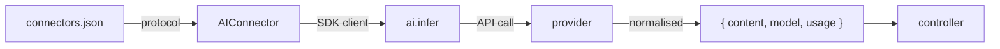

import Tabs from '@theme/Tabs';
import TabItem from '@theme/TabItem';

# AI connector

The AI connector wires any LLM provider into the Gina model layer. Declare a provider
in `connectors.json`, call `getModel('name')` in a controller, and call `.infer()`
with a messages array. The connector normalises response shapes across all providers so
controller code never needs to branch on the provider.

---

## How it works



At startup the framework reads `connectors.json`, detects `"connector": "ai"`, and creates
an SDK client for the declared protocol. Named protocols (`deepseek://`, `qwen://`,
`ollama://`, …) pre-fill the correct base URL — no manual URL lookup needed. The client
is then wrapped with a `.infer()` normaliser and stored under the connector name.

---

## Installation

The AI connector loads the SDK from your **project's** `node_modules` — the framework
has zero hard dependencies on any AI SDK.

<Tabs groupId="ai-provider">
  <TabItem value="ollama" label="Ollama (local)" default>

Ollama runs open-source models locally (MiMo, Llama, Phi, Qwen, Gemma, …) and
exposes an OpenAI-compatible server.

```bash
# Install Ollama from https://ollama.com, then pull a model:
ollama pull mimo     # Xiaomi MiMo-7B
ollama pull llama3.2
ollama pull qwen2.5

npm install openai   # Gina uses the OpenAI SDK to talk to Ollama
```

  </TabItem>
  <TabItem value="deepseek" label="DeepSeek">

DeepSeek's API is OpenAI-compatible — uses the `openai` npm package with a custom base URL.

```bash
npm install openai
```

  </TabItem>
  <TabItem value="qwen" label="Qwen (Alibaba)">

Qwen's DashScope service exposes an OpenAI-compatible endpoint — uses the `openai` npm package.

```bash
npm install openai
```

  </TabItem>
  <TabItem value="groq" label="Groq">

```bash
npm install openai
```

  </TabItem>
  <TabItem value="gemini" label="Gemini (Google)">

Google Gemini exposes an OpenAI-compatible endpoint — uses the `openai` npm package.

```bash
npm install openai
```

  </TabItem>
  <TabItem value="mistral" label="Mistral">

```bash
npm install openai
```

  </TabItem>
  <TabItem value="anthropic" label="Claude (Anthropic)">

```bash
npm install @anthropic-ai/sdk
```

  </TabItem>
  <TabItem value="openai" label="GPT (OpenAI)">

```bash
npm install openai
```

  </TabItem>
  <TabItem value="xai" label="xAI (Grok)">

```bash
npm install openai
```

  </TabItem>
</Tabs>

---

## connectors.json

<Tabs groupId="ai-provider">
  <TabItem value="ollama" label="Ollama (local)" default>

```json title="src/api/config/connectors.json"
{
  "local": {
    "connector" : "ai",
    "protocol"  : "ollama://",
    "model"     : "mimo"
  }
}
```

No `apiKey` needed for local Ollama. The `ollama://` protocol pre-fills
`http://localhost:11434/v1`. Override with `baseURL` if you run Ollama on a different host or port:

```json
{
  "local": {
    "connector" : "ai",
    "protocol"  : "ollama://",
    "baseURL"   : "http://gpu-server.local:11434/v1",
    "model"     : "llama3.2"
  }
}
```

Pull any model with `ollama pull <name>` before starting the bundle:

```bash
ollama pull mimo          # Xiaomi MiMo-7B reasoning model
ollama pull llama3.2      # Meta Llama 3.2
ollama pull qwen2.5       # Alibaba Qwen 2.5 (local, no API key needed)
ollama pull phi4          # Microsoft Phi-4
ollama pull gemma3        # Google Gemma 3
```

  </TabItem>
  <TabItem value="deepseek" label="DeepSeek">

```json title="src/api/config/connectors.json"
{
  "deepseek": {
    "connector" : "ai",
    "protocol"  : "deepseek://",
    "apiKey"    : "${DEEPSEEK_API_KEY}",
    "model"     : "deepseek-chat"
  }
}
```

Available models: `deepseek-chat` (DeepSeek-V3), `deepseek-reasoner` (DeepSeek-R1)

DeepSeek intentionally has no separate SDK — their API is OpenAI-compatible by design.
The `deepseek://` protocol pre-fills `https://api.deepseek.com/v1` as the base URL.

  </TabItem>
  <TabItem value="qwen" label="Qwen (Alibaba)">

```json title="src/api/config/connectors.json"
{
  "qwen": {
    "connector" : "ai",
    "protocol"  : "qwen://",
    "apiKey"    : "${DASHSCOPE_API_KEY}",
    "model"     : "qwen-plus"
  }
}
```

Available models: `qwen-max`, `qwen-plus`, `qwen-turbo`, `qwen-long`,
`qwen2.5-72b-instruct`, `qwq-32b`

The `qwen://` protocol pre-fills `https://dashscope.aliyuncs.com/compatible-mode/v1`.
Get your API key from [Alibaba Cloud DashScope](https://dashscope.console.aliyun.com/).

  </TabItem>
  <TabItem value="groq" label="Groq">

```json title="src/api/config/connectors.json"
{
  "groq": {
    "connector" : "ai",
    "protocol"  : "groq://",
    "apiKey"    : "${GROQ_API_KEY}",
    "model"     : "llama-3.3-70b-versatile"
  }
}
```

Available models: `llama-3.3-70b-versatile`, `llama-3.1-8b-instant`,
`mixtral-8x7b-32768`, `gemma2-9b-it`

Groq runs open-source models on custom LPU hardware — very low latency.

  </TabItem>
  <TabItem value="gemini" label="Gemini (Google)">

```json title="src/api/config/connectors.json"
{
  "gemini": {
    "connector" : "ai",
    "protocol"  : "gemini://",
    "apiKey"    : "${GEMINI_API_KEY}",
    "model"     : "gemini-2.0-flash"
  }
}
```

Available models: `gemini-2.5-pro`, `gemini-2.0-flash`, `gemini-2.0-flash-lite`

The `gemini://` protocol pre-fills Google's OpenAI-compatible endpoint:
`https://generativelanguage.googleapis.com/v1beta/openai/`

  </TabItem>
  <TabItem value="mistral" label="Mistral">

```json title="src/api/config/connectors.json"
{
  "mistral": {
    "connector" : "ai",
    "protocol"  : "mistral://",
    "apiKey"    : "${MISTRAL_API_KEY}",
    "model"     : "mistral-large-latest"
  }
}
```

Available models: `mistral-large-latest`, `mistral-small-latest`,
`codestral-latest`, `open-mistral-nemo`

  </TabItem>
  <TabItem value="anthropic" label="Claude (Anthropic)">

```json title="src/api/config/connectors.json"
{
  "claude": {
    "connector" : "ai",
    "protocol"  : "anthropic://",
    "apiKey"    : "${ANTHROPIC_API_KEY}",
    "model"     : "claude-opus-4-6"
  }
}
```

Available models: `claude-opus-4-6`, `claude-sonnet-4-6`, `claude-haiku-4-5-20251001`

  </TabItem>
  <TabItem value="openai" label="GPT (OpenAI)">

```json title="src/api/config/connectors.json"
{
  "gpt": {
    "connector" : "ai",
    "protocol"  : "openai://",
    "apiKey"    : "${OPENAI_API_KEY}",
    "model"     : "gpt-4o"
  }
}
```

Available models: `gpt-4o`, `gpt-4o-mini`, `o3`, `o4-mini`

  </TabItem>
  <TabItem value="xai" label="xAI (Grok)">

```json title="src/api/config/connectors.json"
{
  "grok": {
    "connector" : "ai",
    "protocol"  : "xai://",
    "apiKey"    : "${XAI_API_KEY}",
    "model"     : "grok-3"
  }
}
```

Available models: `grok-3`, `grok-3-mini`, `grok-2-vision-1212`

  </TabItem>
</Tabs>

---

## Multiple providers in one bundle

You can declare as many AI connectors as you need — each gets its own key and is
independently available in any controller:

```json title="src/api/config/connectors.json"
{
  "local": {
    "connector": "ai", "protocol": "ollama://", "model": "mimo"
  },
  "deepseek": {
    "connector": "ai", "protocol": "deepseek://",
    "apiKey": "${DEEPSEEK_API_KEY}", "model": "deepseek-chat"
  },
  "claude": {
    "connector": "ai", "protocol": "anthropic://",
    "apiKey": "${ANTHROPIC_API_KEY}", "model": "claude-opus-4-6"
  }
}
```

```js
var local    = getModel('local');
var deepseek = getModel('deepseek');
var claude   = getModel('claude');
```

---

## Application examples

Below are concrete controller patterns showing what you can build with the AI connector.
All examples use `async`/`await` — the same code works with any provider by swapping
the connector name.

All examples read incoming data from `req.body`, which is the method-agnostic alias for
`req.post` (POST), `req.put` (PUT), and `req.patch` (PATCH). See [Request objects by HTTP method](/guides/controller#request-objects-by-http-method)
for the full reference.

### Customer support chatbot

A stateless single-turn endpoint that wraps a product-specific system prompt around
the user's message. No external memory — conversation history is sent on every request.

```js
// controllers/controller.support.js
var Controller = function() {
    var self = this;

    this.ask = async function(req, res, next) {
        var ai = getModel('deepseek');  // swap for 'local', 'groq', 'claude', ...

        var result = await ai.infer([
            { role: 'user', content: req.body.message }
        ], {
            system    : 'You are a support agent for Acme Store. ' +
                        'Answer only questions about orders, returns, and products. ' +
                        'Be concise and friendly.',
            maxTokens : 512
        });

        self.renderJSON({ reply: result.content });
    };
};
module.exports = Controller;
```

### Content summariser

Summarise long-form text — articles, support tickets, user reviews — into a few
sentences. Groq's low-latency LPU makes this fast enough for real-time UI.

```js
this.summarise = async function(req, res, next) {
    var ai   = getModel('groq');
    var text = req.body.text;

    var result = await ai.infer([
        { role: 'user', content: 'Summarise the following in 3 sentences:\n\n' + text }
    ], { maxTokens: 256, temperature: 0.2 });

    self.renderJSON({ summary: result.content, tokens: result.usage });
};
```

### Multi-language translation

Translate user content into a target language. Qwen excels at Chinese ↔ other
language pairs; DeepSeek handles most language pairs well at a low cost.

```js
this.translate = async function(req, res, next) {
    var ai     = getModel('qwen');
    var target = req.body.language || 'French';

    var result = await ai.infer([
        {
            role    : 'user',
            content : 'Translate the following to ' + target +
                      '. Output only the translation:\n\n' + req.body.text
        }
    ], { maxTokens: 1024, temperature: 0.1 });

    self.renderJSON({ translation: result.content });
};
```

### Content moderation

Flag user-generated content before it is stored. Run locally with Ollama so
no user text leaves the server.

```js
this.moderate = async function(req, res, next) {
    var ai = getModel('local');  // ollama://  —  stays on your server

    var result = await ai.infer([
        {
            role    : 'user',
            content : 'Does the following text contain hate speech, spam, or ' +
                      'explicit content? Reply with JSON: ' +
                      '{"flagged": true|false, "reason": "..."}\n\n' +
                      req.body.content
        }
    ], { maxTokens: 128, temperature: 0 });

    var verdict;
    try   { verdict = JSON.parse(result.content); }
    catch (e) { verdict = { flagged: false, reason: 'parse error' }; }

    self.renderJSON(verdict);
};
```

### Offline reasoning with MiMo

MiMo-7B (Xiaomi) is a compact reasoning model optimised for math, code, and
logical tasks. It runs entirely locally via Ollama — no API key, no internet.

```js
// connectors.json  →  "local": { "connector": "ai", "protocol": "ollama://", "model": "mimo" }

this.reason = async function(req, res, next) {
    var ai = getModel('local');

    var result = await ai.infer([
        { role: 'user', content: req.body.problem }
    ], {
        system    : 'You are a precise reasoning assistant. ' +
                    'Show your step-by-step thinking before giving the final answer.',
        maxTokens : 2048
    });

    self.renderJSON({ answer: result.content, model: result.model });
};
```

### A/B model comparison

Run the same prompt against two providers in parallel and return both responses
for quality evaluation or user-facing A/B testing.

```js
this.compare = async function(req, res, next) {
    var local    = getModel('local');    // MiMo via Ollama
    var deepseek = getModel('deepseek'); // DeepSeek-V3

    var messages = [{ role: 'user', content: req.body.prompt }];

    var [a, b] = await Promise.all([
        local.infer(messages,    { maxTokens: 512 }),
        deepseek.infer(messages, { maxTokens: 512 })
    ]);

    self.renderJSON({
        local    : { content: a.content, model: a.model, tokens: a.usage },
        deepseek : { content: b.content, model: b.model, tokens: b.usage }
    });
};
```

### RAG — answer from your own data

Retrieve relevant context from your database, inject it into the prompt, and
let the model answer grounded in your data (Retrieval-Augmented Generation).

```js
this.askDocs = async function(req, res, next) {
    var ai   = getModel('groq');
    var docs = getModel('ArticleEntity');

    // 1. Fetch relevant documents from your database
    var articles = await docs.search(req.body.query);
    var context  = articles.map(function(a) { return a.title + '\n' + a.body; }).join('\n\n---\n\n');

    // 2. Inject context into the prompt
    var result = await ai.infer([
        { role: 'user', content: req.body.query }
    ], {
        system    : 'Answer using only the context below. ' +
                    'If the answer is not in the context, say so.\n\n' + context,
        maxTokens : 1024
    });

    self.renderJSON({ answer: result.content });
};
```

---

## Usage in a controller

`getModel()` returns the AI interface directly — no entity map, just `infer()`.

### `await` (preferred in async actions)

```js
var Controller = function() {
    var self = this;

    this.chat = async function(req, res, next) {
        var ai     = getModel('claude');
        var result = await ai.infer([
            { role: 'system',    content: 'You are a helpful assistant.' },
            { role: 'user',      content: req.body.message }
        ]);

        self.renderJSON({ reply: result.content });
    };
};
module.exports = Controller;
```

### `.onComplete()` callback

```js
// var self = this; declared at constructor top
this.chat = function(req, res, next) {
    var ai = getModel('deepseek');

    ai.infer([
        { role: 'user', content: req.body.message }
    ]).onComplete(function(err, result) {
        if (err) return self.throwError(500, err.message);
        self.renderJSON({ reply: result.content });
    });
};
```

### System prompt via options

Both styles accept a `system` option as an alternative to a system message in the array:

```js
var result = await ai.infer(messages, {
    system    : 'You are a concise assistant. Reply in one sentence.',
    maxTokens : 256,
    temperature: 0.3
});
```

### Parallel calls

```js
var [summary, translation] = await Promise.all([
    claude.infer([{ role: 'user', content: 'Summarise: ' + text }]),
    deepseek.infer([{ role: 'user', content: 'Translate to French: ' + text }])
]);
```

---

## `.infer()` API

```js
ai.infer(messages, options)
```

**`messages`** — array of message objects in OpenAI format:

```js
[
  { role: 'system',    content: 'You are a helpful assistant.' },
  { role: 'user',      content: 'What is the capital of France?' },
  { role: 'assistant', content: 'Paris.' },
  { role: 'user',      content: 'And Germany?' }
]
```

**`options`** — all fields optional:

| Field | Type | Default | Description |
|---|---|---|---|
| `model` | string | connector default | Override the model for this call |
| `maxTokens` | number | `1024` | Maximum tokens in the response |
| `temperature` | number | provider default | Sampling temperature (0 = deterministic, 1 = creative) |
| `system` | string | — | System prompt — alternative to `{ role: 'system', … }` in the messages array |

**Returns** a native `Promise` with `.onComplete(cb)` for backward compatibility.

---

## Normalised response

`.infer()` always resolves to the same shape regardless of provider:

```js
{
  content : "Paris.",        // string — the text response
  model   : "deepseek-chat", // string — model that answered
  usage   : {
    inputTokens  : 18,       // prompt tokens
    outputTokens : 4         // completion tokens
  },
  raw     : { ... }          // original unmodified provider response
}
```

Access `result.raw` when you need provider-specific fields not captured by the
normaliser (e.g. Anthropic stop reason, OpenAI finish reason, tool calls).

---

## Raw client access

`getModel()` also exposes the underlying SDK instance via `.client` for advanced use
cases (function calling, embeddings, streaming, fine-tuning):

```js
var ai = getModel('claude');

// Raw Anthropic SDK
var stream = await ai.client.messages.stream({ ... });

// Raw OpenAI SDK
var embedding = await ai.client.embeddings.create({
    model : 'text-embedding-3-small',
    input : text
});
```

---

## Token streaming with `renderStream`

`ai.infer()` returns a single buffered response. For real-time token delivery —
chatbots, copilots, long-generation tasks — use `ai.client` directly with `stream: true`
and pipe the result through [`self.renderStream()`](/guides/controller#selfrenderstreamasynciterable-contenttype).

### Anthropic

```js
this.chat = async function(req, res, next) {
    var self = this;
    var ai   = getModel('claude');

    async function* tokens() {
        var stream = ai.client.messages.stream({
            model     : ai.model,
            max_tokens: 1024,
            messages  : [{ role: 'user', content: req.post.message }]
        });
        for await (var event of stream) {
            if (event.type === 'content_block_delta' && event.delta.type === 'text_delta') {
                yield event.delta.text;
            }
        }
    }

    self.renderStream(tokens());   // default: text/event-stream (SSE)
};
```

### OpenAI-compatible (DeepSeek, Ollama, Groq, …)

```js
this.chat = async function(req, res, next) {
    var self = this;
    var ai   = getModel('deepseek');

    async function* tokens() {
        var stream = await ai.client.chat.completions.create({
            model   : ai.model,
            messages: [{ role: 'user', content: req.post.message }],
            stream  : true
        });
        for await (var chunk of stream) {
            var text = chunk.choices[0].delta.content;
            if (text) yield text;
        }
    }

    self.renderStream(tokens());
};
```

Each yielded string becomes a Server-Sent Events frame (`data: {token}\n\n`). On the
client, read the stream with the standard `EventSource` API or `fetch` with a
`ReadableStream` reader:

```js
// Browser — EventSource
var es = new EventSource('/api/chat');
es.onmessage = function(e) { appendToken(e.data); };

// Browser — fetch + ReadableStream
var res = await fetch('/api/chat', { method: 'POST', body: JSON.stringify({ message }) });
var reader = res.body.getReader();
var decoder = new TextDecoder();
while (true) {
    var { done, value } = await reader.read();
    if (done) break;
    appendToken(decoder.decode(value));
}
```

---

## Quick reference

| Protocol | Provider | Where it runs | Needs API key | Get key |
|---|---|---|---|---|
| `ollama://` | MiMo (Xiaomi), Llama, Qwen, Phi, Gemma, … | **Local** | No | — |
| `deepseek://` | DeepSeek V3, R1 | Online | Yes | [platform.deepseek.com](https://platform.deepseek.com/) |
| `qwen://` | Alibaba Qwen | Online | Yes | [dashscope.console.aliyun.com](https://dashscope.console.aliyun.com/) |
| `groq://` | Groq (Llama, Mixtral, Gemma) | Online | Yes (free tier) | [console.groq.com](https://console.groq.com/) |
| `gemini://` | Google Gemini | Online | Yes (free tier) | [aistudio.google.com](https://aistudio.google.com/) |
| `mistral://` | Mistral AI | Online | Yes | [console.mistral.ai](https://console.mistral.ai/) |
| `anthropic://` | Anthropic Claude | Online | Yes | [console.anthropic.com](https://console.anthropic.com/) |
| `openai://` | OpenAI GPT / o-series | Online | Yes | [platform.openai.com](https://platform.openai.com/) |
| `xai://` | xAI Grok | Online | Yes | [console.x.ai](https://console.x.ai/) |
| `perplexity://` | Perplexity | Online | Yes | [perplexity.ai/settings/api](https://www.perplexity.ai/settings/api) |
| `openai://` + `baseURL` | Any OpenAI-compatible endpoint | Local or Online | Depends | — |

The npm package is `@anthropic-ai/sdk` for `anthropic://`, and `openai` for everything else.

---

## See also

- [connectors.json reference](/reference/connectors) — full field reference and multi-connector config
- [Controllers](/guides/controller) — async actions and `getModel()` usage
- [Models and entities](/guides/models) — ORM-style connectors for relational databases
