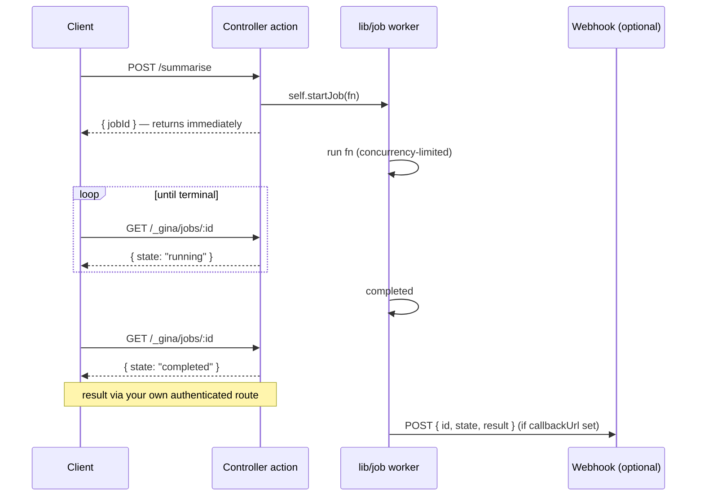

# Async jobs

Some work is too slow to hold a request open — an LLM `.infer()` call can take 1–30 seconds, and awaiting it inline ties up the request pipeline under load. An **async job** runs that work out-of-band: the action calls `self.startJob(fn)`, gets a job id back immediately, returns it to the client, and the deferred function runs on a concurrency-limited worker. The client then polls a status endpoint (or receives a webhook) for the outcome.

---

## How it works



A job moves through `pending → running → completed | failed`. The deferred function lives in the worker process; only the job **record** (state, result, error, timestamps) is stored. The store is in-memory by default, behind a pluggable seam — or [connector-backed](#durable-job-records-connector-store) so records survive bundle restarts.

:::note
The deferred function runs **after** the request has completed, so it must not reference `req` / `res` (the controller releases those at response exit). Capture plain values instead — as the examples below do.
:::

---

## Starting a job

`self.startJob(fn)` returns a job id synchronously; `fn` runs out-of-band.

```js title="src/<bundle>/controllers/controller.report.js"
var Controller = function() {
    var self = this;

    this.build = function(req, res, next) {
        var reportId = req.params.id;
        var jobId = self.startJob(function() {
            // capture plain values (reportId), never req/res
            return buildExpensiveReport(reportId); // returns a Promise
        });
        self.renderJSON({ jobId: jobId });
    };
};
module.exports = Controller;
```

`fn` may be `async`, return a Promise, or return a value synchronously. A thrown error or a rejected Promise transitions the job to `failed` with the error captured as `{ name, message, stack }`.

---

## Polling status

A built-in, always-on endpoint reports a job's state on both the Isaac and Express engines:

```
GET /_gina/jobs/:id
→ 200 { "id": "...", "state": "running", "createdAt": 1716, "updatedAt": 1716 }
→ 404 { "error": "not_found", "message": "/_gina/jobs/<id>: unknown job id" }
```

The endpoint is **state-only** — it never returns the `result` or `error` payload. The job id (an unguessable 21-character token) is the capability to read state; the result is retrieved separately through your own authenticated route (next section).

---

## Retrieving the result

Read the full record — including `result` — from a route you control, so your bundle's own authentication applies. `self.jobStatus(id, cb)` is a callback-style reader:

```js title="src/<bundle>/controllers/controller.report.js"
this.result = function(req, res, next) {
    self.jobStatus(req.params.id, function(err, job) {
        if (err || !job)               return self.throwError(res, 404, 'unknown job');
        if (job.state !== 'completed') return self.renderJSON({ state: job.state });
        return self.renderJSON({ state: job.state, result: job.result });
    });
};
```

---

## `self.inferAsync` — model inference as a job

Because the motivating case is LLM latency, `self.inferAsync(messages, options)` wires the [AI connector](/guides/ai) through a job in one call. It returns a job id; the stored result is the trimmed inference `{ content, model, usage }` (the raw provider response is dropped to keep the record lean).

```js title="src/<bundle>/controllers/controller.ai.js"
this.summarise = function(req, res, next) {
    var jobId = self.inferAsync(
        [{ role: 'user', content: req.post.text }],
        { connector: 'myModel', maxTokens: 500 }
    );
    self.renderJSON({ jobId: jobId }); // returns immediately
};
```

`options.connector` names the connector declared in `connectors.json`; the remaining options (`model`, `maxTokens`, `temperature`, `system`) are forwarded to `.infer()`.

---

## Completion webhooks (opt-in)

Instead of polling, a client can be pushed the result. Pass a `callbackUrl` when starting the job and the framework POSTs `{ id, state, result, error }` to it on completion:

```js
var jobId = self.startJob(buildReport, {
    callbackUrl: 'https://example.com/hooks/report-done'
});
```

Delivery is **best-effort**: retried with exponential backoff, and after the retries are exhausted the job records `webhookFailed: true` — a delivery failure never changes the job's own outcome. To let the receiver verify authenticity, configure a signing secret (see below); each payload is then signed with an `X-Gina-Signature: sha256=<hmac>` header.

---

## Configuration

The primitive is **always-on** with sane defaults — `self.startJob` works out of the box. Tune it per bundle in `app.json`:

```json title="src/<bundle>/config/app.json"
{
  "jobs": {
    "maxConcurrency": 4,
    "ttl": 3600,
    "sweepInterval": 300,
    "idSize": 21,
    "webhookMaxAttempts": 3,
    "webhookBackoffMs": 500,
    "webhookTimeoutMs": 5000,
    "webhookSecret": "${secret:JOB_WEBHOOK_SECRET}"
  }
}
```

| Key | Default | Purpose |
| --- | --- | --- |
| `maxConcurrency` | `4` | Maximum jobs running at once; the rest queue. |
| `ttl` | `3600` | Seconds a finished job is retained before it is swept. |
| `sweepInterval` | `300` | Seconds between sweeps of expired finished jobs. |
| `idSize` | `21` | Job-id length (base-62 characters). |
| `webhookSecret` | — | HMAC-SHA256 signing secret for webhook payloads. Use a [`${secret:KEY}`](/guides/secrets) placeholder rather than hardcoding. |
| `store` | — | Name of a `connectors.json` entry backing a durable job store (see below). Unset = in-memory. |

Finished jobs are purged on the TTL by a self-contained sweep — no cron setup required.

---

## Durable job records (connector store)

By default job records live in memory: a bundle restart forgets them, and a client polling `/_gina/jobs/:id` across a deploy suddenly gets `not_found`. Point `jobs.store` at a [connector](/reference/connectors) entry and the records persist in SQLite instead — they survive restarts and are readable by any process that opens the same file. The deferred **function** still runs only in the process that created the job; the store shares the record (state, result, error), never the closure.

```json title="src/<bundle>/config/app.json"
{
  "jobs": {
    "store": "jobsDb"
  }
}
```

```json title="src/<bundle>/config/connectors.json"
{
  "jobsDb": {
    "connector": "sqlite",
    "file": "/data/jobs.db"
  }
}
```

`file` is the SQLite file path; omit it for a per-bundle default under the gina home directory. SQLite support is built into Node.js (`node:sqlite`), so there is nothing to install.

:::warning Use `file` for the path — not `database`
Every `connectors.json` entry is also visible to the model layer at boot, which treats `database` as a database *name* (resolved under the gina home directory) — a filesystem path there fails the boot. Keep paths in `file`.
:::

A configured store that cannot be built — a `jobs.store` name with no matching `connectors.json` entry, a connector without a job-store implementation, an unopenable file — **fails the boot with a clear error** rather than silently degrading to the in-memory store: if the configuration asks for durable records, losing them quietly is worse than failing loudly. Leaving `jobs.store` unset keeps the in-memory store.

---

## See also

- [Controllers](/guides/controller) — Controller actions, `async` actions, and response methods
- [AI connector](/guides/ai) — Declaring LLM providers and the `.infer()` API that `self.inferAsync` builds on
- [Secrets](/guides/secrets) — `${secret:KEY}` placeholders for the webhook signing secret
