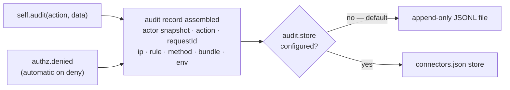

# Audit trail

*New in 0.5.19*

An audit trail is an append-only, user-attributed record of **who did what to
which record when** — the log a compliance review, an incident investigation,
or a plain "who deleted this invoice" question actually needs. It is
deliberately separate from application logging: the trail has its own store and
**never rides the logger sinks**, so log-level filtering or a rotated log file
can never lose an audit record. It is opt-in — off until you enable it.

---

## How a record is written

Two things append records — your explicit `self.audit()` calls and the
framework's automatic authorization-denial events — and both flow through the
same builder to the same backend:



---

## Enabling the trail

Turn it on in `settings.json`:

```json title="src/<bundle>/config/settings.json"
{
  "audit": {
    "enabled": true
  }
}
```

With just `enabled: true`, records append to the default JSONL file (below), and
the resolved path is logged at startup. `audit` is boot config — a change needs
a bundle restart.

---

## Recording an event — `self.audit()`

Call `self.audit()` from any controller action, after the thing you're
recording has happened:

```js title="src/<bundle>/controllers/controller.invoice.js"
var self = this;

this.remove = function(req, res, next) {
    var invoiceId = req.params.id;

    // ... delete the invoice ...

    self.audit('invoice.delete', { resource: invoiceId });
    self.renderJSON({ deleted: invoiceId });
};
```

`self.audit(action, data[, cb])`:

- **`action`** — a verb string you define (`"invoice.delete"`,
  `"user.role.grant"`).
- **`data`** — optional `{ resource, meta }`. `resource` is the subject the
  action touched (typically an id); `meta` is any extra structured context. Both
  are recorded only when you pass them.
- **`cb`** — optional `(err)` callback. Without it the write is fire-and-forget;
  a write failure is counted and logged, never thrown into your action.

Calling `self.audit()` on a request whose response has already been sent still
emits a **degraded** record (the request-derived fields are `null`) rather than
dropping it — for a compliance trail, present-but-partial beats absent.

---

## The audit record

Each call appends one JSON line to the trail:

```json
{
  "id":        "018f5b2c-...",
  "ts":        "2026-07-17T14:03:22.481Z",
  "requestId": "9f1e2a7c-...",
  "actor":     { "key": "user_42", "roles": ["admin"] },
  "action":    "invoice.delete",
  "resource":  "inv_10023",
  "ip":        "203.0.113.7",
  "rule":      "invoice-delete@api",
  "method":    "DELETE",
  "bundle":    "api",
  "env":       "production"
}
```

| Field | Source | Meaning |
|---|---|---|
| `id` | framework | Unique record id |
| `ts` | framework | ISO 8601 timestamp |
| `requestId` | framework | Per-request correlation id, shared with the JSON logs — see [below](#request-correlation) |
| `actor` | framework | `{ key, roles }` snapshot of the session user — see the note below |
| `action` | your call | The verb you passed to `self.audit()` (framework auto-events use `"authz.denied"`) |
| `resource` | your call | Optional — the subject the action touched (`data.resource`) |
| `meta` | your call | Optional — extra structured context (`data.meta`) |
| `ip` | framework | The socket remote address (`::ffff:`-normalized) |
| `rule` | framework | The matched route, in `<rule>@<bundle>` form |
| `method` | framework | HTTP method |
| `bundle` / `env` | framework | The bundle name and environment |

Two record fields carry security-relevant behavior worth calling out:

- **`actor` is a snapshot, not the live user.** Only `session.user[actorKey]`
  (the [`actorKey`](/reference/settings#audit) field, default `"id"`) plus a
  *copy* of `user.roles` are kept — never the whole user object (which would
  leak PII into the trail). Because the roles are copied, a later mutation of
  the session cannot retro-edit an already-written record.
- **`ip` is the socket address — `X-Forwarded-For` is never read.** That header
  is attacker-writable. If you run behind a proxy and need the real client IP in
  the trail, resolve it deliberately at the edge; the framework will not trust
  the header for you.

---

## Storage backends

### JSONL file (default)

Records append to `<project>/logs/audit-<bundle>-<env>.jsonl` — one file per
bundle per environment, so two environments of the same bundle never interleave
their writers. Writes are **serialized**, so the on-disk order matches the order
records were emitted. Override the destination with `audit.file` (a relative
path resolves against the project root, never the process working directory):

```json title="src/<bundle>/config/settings.json"
{
  "audit": {
    "enabled": true,
    "file":    "/var/log/myapp/audit.jsonl"
  }
}
```

### External store — `audit.store`

For a database-backed trail, point `audit.store` at a `connectors.json` entry
instead of a file. `store` and `file` are **mutually exclusive**:

```json
{
  "audit": {
    "enabled": true,
    "store":   "auditDb"
  }
}
```

:::caution No connector ships an audit store yet
An audit-store connector implementation is not shipped in this version. Setting
`audit.store` today **refuses the boot** with a clear message rather than
silently falling back to the file backend — so you can never believe you have a
database trail while quietly writing nowhere. Use the default JSONL file until a
connector store lands.
:::

---

## Automatic authorization denials — `authz.denied`

When the trail is on, every [route-authorization](/guides/route-authorization)
denial is recorded automatically — no `self.audit()` call needed — as an
`authz.denied` record whose `meta.outcome` distinguishes the four denial shapes:

| `meta.outcome` | Denial |
|---|---|
| `401` | Unauthenticated request to a `requireAuth` route |
| `login-bounce` | Unauthenticated browser navigation redirected to `auth.loginRoute` |
| `403-roles` | Authenticated caller lacked every required role |
| `403-policy` | A policy function denied the request |

Opt out with `audit.events.authz: false`. The emit is fully contained: an audit
write failure can **never** change an authorization outcome — enabling the trail
cannot break access control.

---

## `requestId` — correlation, not attribution {#request-correlation}

Every request now carries an always-on request id, surfaced as `requestId` on
each audit record. The same id appears on that request's JSON log lines, so a
record and its logs line up by construction — see
[Per-request requestId](/guides/logging#per-request-requestid-and-durationms).

The id honours a sanitized inbound `X-Request-Id` header when the client sends
one, which makes it **client-influenceable by design** — a request arriving from
a load balancer or an upstream service keeps its trace id. That is exactly why
`requestId` is a **correlation** key and never **attribution**: a client could
set it. Attribution is the `actor` fields, which are derived from the server-side
session and cannot be spoofed by a header.

---

## Failure modes

Audit settings are validated at boot; a malformed block refuses to start rather
than leaving a compliance control silently off:

| Condition | Result |
|---|---|
| `audit.enabled` is a non-boolean (`"true"`, `1`) | Refuses to boot |
| `audit.file`, `audit.store`, or `audit.actorKey` is an empty string | Refuses to boot |
| `audit.events.authz` is a non-boolean | Refuses to boot |
| `audit.store` and `audit.file` both set | Refuses to boot (mutually exclusive) |
| `audit.store` set (no audit-store connector exists yet) | Refuses to boot |
| The audit destination is unwritable at startup | Refuses to boot |
| `action` passed to `self.audit()` is empty or not a string | Record dropped (counted + logged), never thrown |

---

## See also

- [Route authorization](/guides/route-authorization) — the source of automatic `authz.denied` events
- [Controllers](/guides/controller) — `self.audit()` and the other controller helpers
- [Logging — per-request requestId](/guides/logging#per-request-requestid-and-durationms) — the correlation id the trail shares with JSON logs
- [settings.json reference](/reference/settings#audit) — the full `audit` block schema
- [connectors.json reference](/reference/connectors) — where an `audit.store` entry lives
- [Migration Guide — 0.5.18 → 0.5.19](/migration#0518--0519) — the release notes
