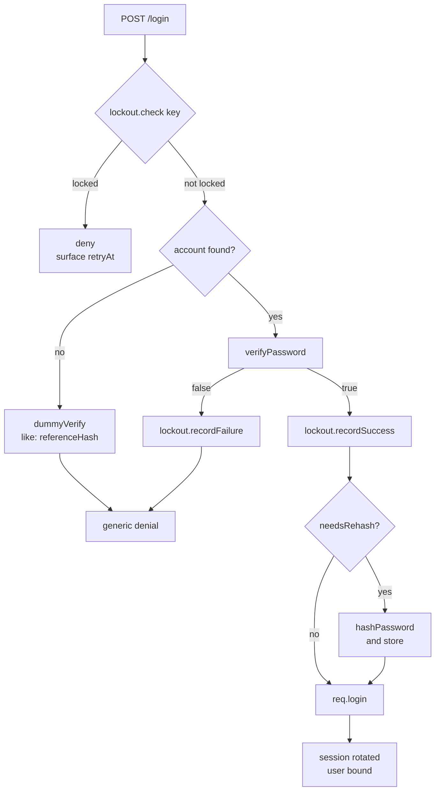

# Authentication

*New in 0.6.0*

`lib.authn` supplies the handful of authentication primitives that are
dangerous to hand-roll: a memory-hard password hash with a self-describing
encoding, a constant-time verify, a password policy check, an account-lockout
engine, and RFC 6238 TOTP.

```js
var authn = require('gina').lib.authn;
```

## The boundary

**Gina is not an identity provider, and this module does not try to be one.**
It owns no user record, no credential store, no login route, and no session id
— those are yours, because only your application knows what a user *is*.

The module ends where [`req.login()`](/guides/sessions#reqloginuser-done)
begins, and [route authorization](/guides/route-authorization) takes over from
`req.session.user`:

| Gina supplies | You supply |
|---|---|
| Hashing, verification, policy, lockout, TOTP | The user record and where it is stored |
| The `auth.lockout` audit record | The login route and its form |
| Session rotation at `req.login()` | The lockout key, and the TOTP secret's storage |

Deliberately **not** built: password reset and email flows, breach-corpus
checks (they need a network service), password history (it needs the store
Gina does not own), and TOTP recovery codes — those are single-use random
strings, so `hashPassword` plus your own table already expresses them.

## The login flow



Two properties of that shape are load-bearing:

- **The lockout check comes first**, before any key derivation. A hash costs
  ~100 ms of memory-hard work; letting a locked account reach it turns your
  login route into an amplifier.
- **Both branches of "account found?" cost the same.** A login that returns
  instantly for an unknown account and slowly for a known one is a
  user-enumeration oracle, and it is measurable across a network.

## Registration — policy, then hash

`validatePasswordPolicy(password[, options])` is synchronous and returns
`{ valid, errors }`, where `errors` are stable machine-readable codes:

```js
var check = authn.validatePasswordPolicy(self.post.password, {
    deny: [ self.post.email, 'acme' ]
});
if (!check.valid) {
    return self.renderJSON({ errors: check.errors });
    // e.g. [ 'too-short', 'denied-substring' ]
}
```

| Option | Default | Meaning |
|---|---|---|
| `minLength` | `12` | Minimum **code points** (an emoji counts once, not twice) |
| `maxLength` | `1024` | Maximum **bytes** of UTF-8 |
| `requireUppercase` / `requireLowercase` | `false` | Character-class rules |
| `requireDigit` / `requireSymbol` | `false` | Character-class rules |
| `deny` | `[]` | Case-insensitive substrings to reject |

Codes: `too-short`, `too-long`, `missing-uppercase`, `missing-lowercase`,
`missing-digit`, `missing-symbol`, `denied-substring`, `not-a-string`.

:::note Why length beats composition
The default is a 12-character minimum with **no** character-class requirements,
per NIST SP 800-63B: mandatory class mixing measurably pushes users toward
predictable substitutions (`Password1!`). The composition rules exist for
consumers whose auditor requires them — reach for `deny` first.
:::

Then hash. `hashPassword(password[, options], cb)` is asynchronous by
construction — there is no synchronous variant, because a ~100 ms KDF on the
request path would block the event loop for every other connection:

```js
authn.hashPassword(self.post.password, function (err, hash) {
    if (err) { return self.throwError(res, 500, err); }
    // hash === '$scrypt$ln=17,r=8,p=1$<salt>$<key>'  — store this one string
    account.passwordHash = hash;
});
```

The result is a **PHC string** that carries its own parameters, so nothing else
needs storing and the cost can be raised later without a flag day. Defaults are
`ln: 17, r: 8, p: 1` — scrypt with `N = 2^17`, roughly a 128 MiB working set,
the OWASP guidance for scrypt.

## Login, end to end

```js
var authn   = require('gina').lib.authn;
var lockout = authn.createLockout({
    normalizeKey: function (k) { return k.trim().toLowerCase(); }
});

this.login = function (req, res, next) {
    var self  = this;
    var email = req.post.email;
    var pw    = req.post.password;

    lockout.check(email, function (err, state) {
        if (err) { return self.throwError(res, 500, err); }
        if (state.locked) {
            return self.renderJSON({
                error   : 'too many attempts',
                retryAt : state.retryAt
            });
        }

        Account.findByEmail(email, function (err, account) {
            if (err) { return self.throwError(res, 500, err); }

            // Unknown account — spend the same work, then deny identically.
            if (!account) {
                return authn.dummyVerify(pw, { like: referenceHash }, function (dErr) {
                    if (dErr) { return self.throwError(res, 503, dErr); }
                    self.renderJSON({ error: 'invalid credentials' });
                });
            }

            authn.verifyPassword(pw, account.passwordHash, function (err, ok) {
                if (err) { return self.throwError(res, 500, err); }

                if (!ok) {
                    return lockout.recordFailure(email, function () {
                        self.renderJSON({ error: 'invalid credentials' });
                    });
                }

                lockout.recordSuccess(email, function () {
                    // The one moment the plaintext is in hand — upgrade if stale.
                    if (authn.needsRehash(account.passwordHash)) {
                        authn.hashPassword(pw, function (err, fresh) {
                            if (!err) { account.passwordHash = fresh; account.save(); }
                        });
                    }
                    req.login({ id: account.id, roles: account.roles }, function (err) {
                        if (err) { return self.throwError(res, 500, err); }
                        self.renderJSON({ ok: true });
                    });
                });
            });
        });
    });
};
```

`req.login()` rotates the session id **before** binding the user — the
session-fixation defense. See [Sessions](/guides/sessions#reqloginuser-done)
for what survives rotation (CSRF tokens do; anything else in the pre-login
session does not).

### `verifyPassword` never throws for a bad password

A malformed, truncated, or unrecognised stored hash is `cb(null, false)` — not
an error. A corrupted record must not be distinguishable from a wrong password
by an attacker watching responses. A genuine operational failure *is* an
error, because it needs an operator rather than a login form.

## `dummyVerify` — always pass a cost

This is the one API in the module with a requirement you cannot see from its
signature.

`dummyVerify` has no stored hash to read a cost from, so left alone it runs at
the *shipped defaults*. If your stored hashes were minted cheaper — a lowered
`ln`, or legacy hashes not yet migrated — the unknown-account branch then costs
**more** than the known-account one, and you have not merely failed to close
the enumeration oracle, you have **inverted** it. Measured at defaults against
`ln=14` hashes: the unknown branch ran **13.9× slower**, a louder signal than
doing nothing at all.

```js
// ✅ read the cost from real data — stays matched as you raise parameters
authn.dummyVerify(pw, { like: referenceHash }, function () { deny(); });

// ✅ or state it explicitly
authn.dummyVerify(pw, { ln: 14 }, function () { deny(); });

// ❌ silently mismatches any non-default hash
authn.dummyVerify(pw, function () { deny(); });
```

`referenceHash` is any hash from your own store — seed one at install time, or
read one row. Reading the cost from real data is what keeps the two branches
matched automatically; a separate setting drifts.

:::warning Handle the error identically on both branches
Under load the hashing queue sheds with `err.code === 'AUTHN_QUEUE_FULL'`, and
**both** `verifyPassword` and `dummyVerify` surface it. Respond 503 in both
cases. If one branch 500s while the other returns "invalid credentials",
saturation itself becomes the enumeration signal `dummyVerify` exists to
remove.
:::

## Migrating existing hashes

`verifyPassword` also verifies `$argon2i$` / `$argon2d$` / `$argon2id$` and
`$2a$` / `$2b$` / `$2y$` (bcrypt) hashes, through **your own project's**
package — the same project-path resolution Gina's connectors use for their
drivers:

```bash
npm install argon2   # or: npm install bcrypt
```

Gina never *mints* those formats — one mint path means one set of parameters to
reason about. The verify branch exists so a bundle arriving with credentials
already hashed keeps working, including one that followed Gina's own earlier
interim guidance to use argon2 or bcrypt directly.

Pair it with `needsRehash(stored)`, which returns `true` for any hash that is
not current-policy Gina scrypt — foreign formats included — and re-hash on the
next successful login, as in the recipe above. Over a login cycle your store
migrates itself with no password resets.

## Account lockout

`createLockout([options])` is the credential-stuffing brake.

```js
var lockout = authn.createLockout({
    maxAttempts  : 10,          // PCI-DSS v4.0.1 §8.3.4: not more than 10
    lockMs       : 30 * 60000,  // §8.3.4: minimum 30 minutes
    normalizeKey : function (k) { return k.trim().toLowerCase(); }
});
```

| Method | Returns | Use |
|---|---|---|
| `check(key, cb)` | `cb(err, state)` | **Before** verifying — records nothing |
| `recordFailure(key, cb)` | `cb(err, state)` | After a failed attempt |
| `recordSuccess(key, cb)` | `cb(err)` | After a good one — clears the counter |
| `reset(key, cb)` | `cb(err)` | Administrative unlock |
| `close()` | — | Release the memory store's sweep timer |

`state` is `{ locked, attempts, remaining, retryAt }`; `retryAt` is epoch
milliseconds when the lock lifts, or `null`.

The defaults are PCI-DSS v4.0.1 **§8.3.4** — lock out after not more than 10
invalid attempts, for a minimum of 30 minutes "or until the user's identity is
confirmed", which is what `reset()` is for.

### Normalise the key, or the threshold multiplies

The key is **yours** to choose — a user id, an email, an `email + ':' + ip`
pair. Gina never derives it, because Gina does not own the user record.

Counters are indexed by the exact string you pass. If the key comes from a form
field, then `ada@x.com`, `Ada@x.com` and `ada@X.com` are three separate
counters and an attacker gets the full threshold once per spelling. Pass
`normalizeKey` whenever the key is user-supplied.

There is no safe default here: a user id or an opaque token may legitimately be
case-sensitive, so Gina will not guess.

### Multi-replica correctness

State lives in memory by default, which is **per-process**: two replicas keep
independent counters, so an attacker spreading attempts across N replicas gets
N times the threshold. Pass a shared `store` — the same callback shape the job
and audit seams use:

```js
authn.createLockout({
    store: {
        get : function (key, cb) { /* cb(err, entry|null) */ },
        set : function (key, entry, cb) { /* cb(err) */ },
        del : function (key, cb) { /* cb(err) */ }
    }
});
```

Operations on a single key are serialized in-process, so failures arriving in
the same tick cannot each read the same counter and lose the count. Across
replicas that guarantee degrades to roughly `maxAttempts` per replica unless
your store's backend offers an atomic increment.

:::note The memory store is deliberately uncapped
Every distinct key costs an entry until its window expires, so hostile traffic
can inflate it. It is **not** capped on purpose: evicting under pressure would
let an attacker flush a victim's counter by flooding the map — trading a memory
bound for a lockout bypass, which is strictly worse than the memory saved.
Bound key *creation* upstream with request-rate limiting, or use a persistent
store with its own eviction policy.
:::

### Lockout is not rate limiting

These are different controls on different axes, and **neither substitutes for
the other**:

| | Lockout | Rate limiting |
|---|---|---|
| Counts | Credential *failures* | *Requests* |
| Keyed on | An **account** | A **client** |
| Stops | One account, many passwords | Many accounts, one source |

Gina ships lockout. Application-level request-rate limiting is a separate
[roadmap](/roadmap) item, deferred until a consumer asks for it — put
throttling in front of the login route at your ingress, WAF, or reverse proxy.
Do not read "lockout is enabled" as "the endpoint is throttled".

### The audit record

Crossing the threshold writes one `auth.lockout` record to the
[audit trail](/guides/audit-trail) — on the **transition** into locked, never
per attempt, so an attacker hammering a locked account cannot flood the trail.
Its `meta` carries `key`, `attempts` and `lockedUntil`. Pass `audit: false` to
disable. An audit failure never changes an authentication outcome.

## Two-factor — TOTP

RFC 6238, implemented against the specification rather than taking a
dependency, and compatible with every standard authenticator app.

### Enrolment

```js
var secret = authn.generateTotpSecret();          // base32, 20 bytes (160 bits)
var uri    = authn.otpauthURL({
    secret  : secret,
    account : user.email,
    issuer  : 'Acme'
});
// render `uri` as a QR code
```

Store the secret **only after** the user confirms a code from their app —
otherwise a failed enrolment locks them out of their own second factor. Treat
it as a credential: encrypt it at rest, and keep it out of every log and error
path.

### Verification and replay defence

`verifyTotp(token, secret[, options])` returns `{ valid, counter }` and checks
the current step plus `window` steps either side (default `1`, so ±30 seconds
of clock drift), comparing in constant time.

**`counter` is the absolute step counter that matched** — an index, not an
offset from now — and it is how you stop replay:

```js
var res = authn.verifyTotp(req.post.code, user.totpSecret);
if (!res.valid)                          { return deny(); }
if (res.counter <= user.totpLastCounter) { return deny(); }   // replayed
user.totpLastCounter = res.counter;
user.save();
```

:::warning Replay defence is yours, and it is not optional
Without the `counter` check a code stays valid for its whole acceptance
window, so anyone who observes one — over your shoulder, in a phishing proxy,
in a log — can reuse it. The RFC assigns this to the verifier, and Gina cannot
do it: it has no place to write. Persist the accepted counter per user and
require the next one to be **strictly greater**.
:::

Widening `window` linearly widens the interval an observed code stays usable,
so it is a security parameter, not a convenience one. It is capped at 10.

A malformed code is `{ valid: false }` — the same shape as a wrong one, so an
attacker learns nothing from the difference. An *unusable secret* does throw:
that is a configuration fault, not a login attempt.

## Operational notes

**Concurrency.** Each hash reserves ~128 MiB and occupies a libuv threadpool
slot (default pool size 4). In-flight hashes are capped at **2** by default so
a login burst cannot exhaust memory or starve fs, zlib and dns of threads.
Raise it only alongside a matching `UV_THREADPOOL_SIZE` and memory budget:

```js
authn.setMaxConcurrentHashes(4);   // needs UV_THREADPOOL_SIZE >= 6, ~512 MiB headroom
```

**Load shedding.** Beyond the concurrency cap, up to 100 hashes may wait; past
that, calls fail fast with `err.code === 'AUTHN_QUEUE_FULL'` instead of queueing
without limit. Respond **503**. Reaching it steadily means the login endpoint
needs request-rate limiting in front of it.

**Input bounds.** Passwords are capped at 1024 bytes of UTF-8 and rejected as
an error rather than truncated — a silent truncation would make two different
passwords authenticate each other. Lockout keys are capped at 512 characters.

**Unicode.** Passwords are normalised to NFC on both sides, so a user who
registers on one device and signs in from another is not locked out by an
encoding difference in the same accented character.

## Configuration

**There are none.** `lib.authn` introduces no `settings.json` keys by design —
every option is passed at the call site, because the right cost, policy and
lockout thresholds depend on the route and the account class, not on the
deployment. The only related settings key is
[`session.absoluteTimeout`](/reference/settings), which belongs to the Session
plugin.

## See also

- [Sessions](/guides/sessions) — `req.login()`, rotation, idle and absolute timeouts
- [Route authorization](/guides/route-authorization) — gating routes once the user is bound
- [Audit trail](/guides/audit-trail) — where `auth.lockout` records land
- [Compliance control mapping](/guides/compliance) — the PCI-DSS, SOC 2 and HIPAA requirements these controls support
