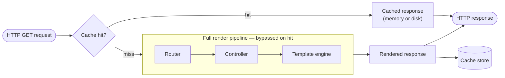

# Caching

Gina can cache rendered HTML pages and JSON responses so that repeated
requests to the same URL are served directly from memory or disk, bypassing
the controller and template engine entirely.



Caching is opt-in and configured per route in `routing.json`.

---

## Quick start

Add a `cache` field to any route:

```json title="src/<bundle>/config/routing.json"
{
  "home": {
    "url": "/",
    "param": { "control": "home" },
    "cache": {
      "type": "memory",
      "ttl": 3600
    }
  }
}
```

The first `GET /` request renders and stores the response. Every subsequent
request is served from the cache until the entry expires.

---

## Configuration reference

The `cache` field accepts either a shorthand string or a full object.

```json
"cache": "memory"
```

```json
"cache": {
  "type"              : "memory",
  "ttl"               : 3600,
  "sliding"           : false,
  "maxAge"            : 86400,
  "invalidateOnEvents": ["invoice#saved"]
}
```

| Field | Type | Default | Description |
|---|---|---|---|
| `type` | `"memory"` \| `"fs"` | — | Storage backend (see [Storage backends](#storage-backends)). |
| `ttl` | number (seconds) | server default | Expiry duration. Meaning depends on `sliding` — see [Expiration modes](#expiration-modes). |
| `sliding` | boolean | `false` | Enable sliding-window expiration. |
| `maxAge` | number (seconds) | — | Absolute lifetime ceiling. Only meaningful when `sliding: true`. |
| `invalidateOnEvents` | string[] | — | Event names that immediately evict this entry (see [Event-driven invalidation](#event-driven-invalidation)). |

Only `GET` requests are cached. `POST`, `PUT`, `DELETE`, and other methods
always bypass the cache.

---

## Storage backends

### `memory`

The rendered response is stored as a string in the server's in-process `Map`.

```json
"cache": { "type": "memory", "ttl": 3600 }
```

**Use for:** the most frequently accessed, session-independent pages where
raw speed matters.

**Trade-off:** every cached page consumes heap. Keep the entry count bounded
with a short `ttl` or use `invalidateOnEvents` to evict on data changes.

### `fs` (file system)

The rendered response is written to disk. Only the file path is stored in the
in-process `Map`, so heap use is minimal regardless of response size.

```json
"cache": { "type": "fs", "ttl": 3600 }
```

Files are written to:
```
{cache.path}/{bundle}/html{url}.html      ← HTML responses
{cache.path}/{bundle}/data{url}.json      ← JSON responses
```

When an entry expires or is invalidated the cached file is deleted
automatically.

**Use for:** large HTML pages, session-aware content where payload size would
strain the heap.

---

## Expiration modes

### Absolute TTL (default)

```json
"cache": { "type": "memory", "ttl": 3600 }
```

The entry is evicted exactly `ttl` seconds after it was first written,
regardless of traffic. The simplest mode: a cached page is at most `ttl`
seconds stale.

### Sliding window

```json
"cache": { "type": "memory", "ttl": 300, "sliding": true }
```

`ttl` becomes an **idle threshold**. The timer resets on every cache hit.
The entry stays alive as long as it keeps receiving requests more frequently
than once every `ttl` seconds. When traffic stops, the entry expires `ttl`
seconds after the last hit.

This keeps popular routes permanently warm without pre-tuning a large fixed
TTL.

:::caution No hard ceiling
Without `maxAge`, a constantly-accessed entry never expires. Stale data can
persist indefinitely on busy routes. Add `maxAge` unless you have a separate
invalidation strategy via `invalidateOnEvents`.
:::

### Sliding window + absolute ceiling (recommended)

```json
"cache": { "type": "memory", "ttl": 300, "sliding": true, "maxAge": 3600 }
```

Combines both: the entry is evicted when it has been **idle for `ttl`
seconds** or when it reaches **`maxAge` seconds of age** — whichever comes
first.

This is the recommended pattern when `sliding` is enabled. Popular routes
stay warm; no entry can outlive `maxAge`, bounding data staleness even under
constant traffic.

### Choosing a mode

| Scenario | Recommended config |
|---|---|
| Static content, predictable staleness window | `{ ttl }` |
| Popular page, keep warm, no freshness requirement | `{ ttl, sliding: true }` |
| Popular page with a maximum staleness guarantee | `{ ttl, sliding: true, maxAge }` |
| Data invalidated by application events | `{ ttl, invalidateOnEvents: [...] }` |

---

## `ttl` and `maxAge` — what is the difference?

Both are durations in **seconds** (fractional values such as `0.5` are
supported), but they measure from different reference points:

| Field | Measures from | Active when |
|---|---|---|
| `ttl` | Last **access** time (sliding) or creation time (non-sliding) | Always |
| `maxAge` | **Creation** time, always | `sliding: true` only |

Without `sliding`, `ttl` already defines the absolute lifetime — `maxAge` is
redundant. With `sliding`, `ttl` is the idle window and `maxAge` is the hard
ceiling. They are genuinely independent: a route with `ttl: 300, maxAge: 3600`
can serve thousands of hits in an hour and still be evicted at the 1-hour
mark.

---

## Event-driven invalidation

Use `invalidateOnEvents` to evict a cached entry immediately when your
application emits a named event — for example, when a record is saved.

```json
"invoice-list": {
  "url": "/invoices",
  "param": { "control": "invoices", "file": "list" },
  "cache": {
    "type"              : "memory",
    "ttl"               : 3600,
    "invalidateOnEvents": ["invoice#saved", "invoice#deleted"]
  }
}
```

Then in your controller or model, call:

```js
self.cache.invalidateByEvent('invoice#saved');
```

All cache entries registered to `invoice#saved` are evicted immediately,
regardless of their remaining TTL.

---

## Cache-Status response header

Every `GET` response includes a `Cache-Status` header:

| Value | Meaning |
|---|---|
| `gina-cache; uri-miss` | No cached entry for this URL — response was rendered normally. |
| `gina-cache; hit; ttl=NNN` | Served from cache. `NNN` seconds of absolute TTL remaining. |
| `gina-cache; hit; ttl=NNN; max-age=MMM` | Served from cache (sliding). `NNN` seconds until idle eviction; `MMM` seconds until absolute ceiling. |

Use this header to verify caching behavior during development without
inspecting server logs.

---

## Server-level cache config

The `cache` block in `settings.server.json` controls global cache behavior:

```json
{
  "cache": {
    "enable": "true",
    "path"  : "/path/to/cache/dir",
    "ttl"   : 3600
  }
}
```

| Field | Description |
|---|---|
| `enable` | Master switch. Set to `"true"` to activate caching. Per-route `cache` fields are ignored when this is `"false"`. |
| `path` | Directory for `fs`-type cached files. |
| `ttl` | Default TTL (seconds) used when a route's `cache` config does not specify one. |

---

## Caching and sessions

Cached responses are served **before** the controller runs, which means
session data is not available when serving from cache. Avoid caching routes
that render session-specific content (e.g. user dashboards, shopping carts).

Use the `fs` backend and short TTLs for pages that are mostly static but
occasionally personalised, or rely on `invalidateOnEvents` to evict when the
underlying data changes.
