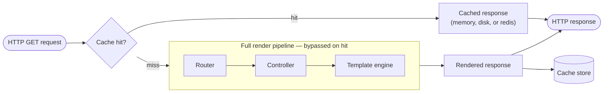

# Caching

Gina can cache rendered HTML pages and JSON responses so that repeated
requests to the same URL are served directly from memory or disk, bypassing
the controller and template engine entirely. Caching is configured per route in `routing.json` and controlled at the server level in `settings.json`, giving you fine-grained control over what is cached, for how long, and when entries are evicted.



Caching is opt-in and configured per route in `routing.json`.

---

## Quick start

Add a `cache` field to any route:

```json title="src/<bundle>/config/routing.json"
{
  "home": {
    "url": "/",
    "param": { "control": "home" },
    "cache": {
      "type": "memory",
      "ttl": 3600
    }
  }
}
```

The first `GET /` request renders and stores the response. Every subsequent
request is served from the cache until the entry expires.

---

## Configuration reference

The `cache` field accepts either a shorthand string or a full object.

```json
"cache": "memory"
```

```json
"cache": {
  "type"              : "memory",
  "ttl"               : 3600,
  "sliding"           : false,
  "maxAge"            : 86400,
  "invalidateOnEvents": ["invoice#saved"]
}
```

| Field | Type | Default | Description |
|---|---|---|---|
| `type` | `"memory"` \| `"fs"` \| `"redis"` | server default | Storage backend (see [Storage backends](#storage-backends)). Inherits [`server.cache.type`](#server-level-cache-config) (default `"memory"`) when omitted. `redis` also needs [`server.cache.store`](#server-level-cache-config) and a `ttl` (or `invalidateOnEvents`). |
| `ttl` | number (seconds, fractional ok) | server default | Expiry duration. Meaning depends on `sliding` — see [Expiration modes](#expiration-modes). |
| `sliding` | boolean | server default | Enable sliding-window expiration. Inherits [`server.cache.sliding`](#server-level-cache-config) (default `false`) when omitted. |
| `maxAge` | number (seconds, fractional ok) | server default | Absolute lifetime ceiling. Only meaningful when `sliding: true`. Inherits [`server.cache.maxAge`](#server-level-cache-config) when omitted. |
| `invalidateOnEvents` | string[] | — | Event names that immediately evict this entry (see [Event-driven invalidation](#event-driven-invalidation)). |

Only `GET` requests are cached. `POST`, `PUT`, `DELETE`, and other methods
always bypass the cache.

---

## Storage backends

### `memory`

The rendered response is stored as a string in the server's in-process `Map`.

```json
"cache": { "type": "memory", "ttl": 3600 }
```

**Use for:** the most frequently accessed, session-independent pages where
raw speed matters.

**Trade-off:** every cached page consumes heap. Keep the entry count bounded
with a short `ttl` or use `invalidateOnEvents` to evict on data changes.

### `fs` (file system)

The rendered response is written to disk. Only the file path is stored in the
in-process `Map`, so heap use is minimal regardless of response size.

```json
"cache": { "type": "fs", "ttl": 3600 }
```

Files are written to:
```
${cache.path}/${bundle}/html${url}.html      ← HTML responses
${cache.path}/${bundle}/data${url}.json      ← JSON responses
```

When an entry expires or is invalidated the cached file is deleted
automatically.

**Use for:** large HTML pages, session-aware content where payload size would
strain the heap.

#### Surviving a restart

Unlike `memory` (which is volatile and cold on every boot), the `fs` backend
**persists across a server restart**. The in-process index starts empty on
boot, but on the first request to a cached URL Gina reads the response back
from disk and repopulates the index — so a restart does not cold-start your
cache.

The original expiry is preserved: **a restart never extends a TTL**. A
non-sliding entry still expires at its original creation time plus `ttl`; a
sliding entry keeps its absolute `maxAge` ceiling. (The idle `ttl` window of a
sliding entry restarts on the first post-restart access, since last-access time
is not persisted to disk.)

Each cached file has a small sibling `<file>.meta` JSON file holding the
entry's expiry metadata (created-at, `ttl`, `sliding`, `maxAge`, visibility,
response headers). Both files are removed together on eviction. Leave the
`.meta` files in place — deleting one turns its entry into a cache miss (the
response is simply re-rendered on the next request).

:::note Cache path
Restart read-back resolves files under `server.cache.path`, which the framework
default ties to the top-level `cachePath` (`${projectPath}/cache`). If you
override either independently, keep both pointing at the same directory so the
read-back finds the written files.
:::

### `redis` (shared L2 across replicas)

The `redis` backend adds a **shared second tier (L2)** on top of each replica's
in-process `memory` tier (L1). A rendered response is written to L1 synchronously
*and* to a shared redis, so every replica behind your load balancer serves the same
cached page — and a freshly-started or scaled-up replica serves content a peer
already rendered, instead of cold-starting its own cache.

```json title="src/<bundle>/config/routing.json"
"cache": { "type": "redis", "ttl": 3600 }
```

Redis needs a connection, named by `server.cache.store` in `settings.json`, which
points at a `connectors.json` redis entry:

```json title="src/<bundle>/config/settings.json"
{
  "cache": { "type": "redis", "store": "cacheRedis" }
}
```

```json title="src/<bundle>/config/connectors.json"
{
  "cacheRedis": { "connector": "redis", "host": "127.0.0.1", "port": 6379 }
}
```

The `redis` connector uses `ioredis`, resolved from your project's
`node_modules` — run `npm install ioredis` in the project.

**How the two tiers cooperate:**

- **Write** — the response is stored in L1 (this replica's heap) synchronously and
  pushed to redis fire-and-forget with the entry's TTL. The response never waits on
  redis.
- **Read** — a request that misses L1 *warms* it from redis, repopulating L1 with
  the authoritative remaining TTL (an L1 entry can never outlive its L2 key), then
  serves it. A cold replica's first hit to a cached URL therefore comes straight
  from the shared L2.
- **Invalidate** — `delete` / `clear` / `invalidateByEvent` remove the matching
  redis keys as well as the L1 entries.

**Fail-open** — if redis is down or a command fails, caching transparently degrades
to per-replica `memory` behaviour (one diagnostic warning per process); a render is
never blocked or failed by a redis outage.

:::note Cross-replica invalidation reaches only registered keys
An event invalidation DELs from redis only the keys **this** replica registered via
`invalidateOnEvents`. A page cached solely on another replica stays in L2 until its
natural expiry. Give redis routes a `ttl` so nothing lives forever — see the boot
check below.
:::

#### Boot-time validation

A mis-configured redis cache fails in ways invisible until the first cache miss, so
Gina validates the resolved cache config **at boot** and refuses to start
(fail-fast) on an unsupported shape:

| Condition | Result |
|---|---|
| A `redis` route with `sliding: true` | **Boot aborts** — redis TTL is per-key absolute; sliding is not supported. Drop `sliding`, or use `memory` / `fs`. |
| A `redis` route with no `ttl` **and** no `invalidateOnEvents` | **Boot aborts** — a non-expiring redis key is orphaned permanently on a [release-namespace](#release-namespacing) change. Add a `ttl` (or `invalidateOnEvents`). |
| Any `redis` route but no `server.cache.store` | **Boot aborts** — the L2 connection cannot be built. |
| An unknown `cache.type` (per-route or bundle-wide) | **Warning** — that surface is simply not cached. |
| A `redis` route with `invalidateOnEvents` but no `ttl` | **Warning** — the invalidate-only pattern works, but the key is still orphaned on a namespace change. |

Validation and the redis connection are both gated on
[`server.cache.enable`](#server-level-cache-config): a bundle with caching disabled
boots normally and opens no redis connection, even if a route names the redis
strategy (a would-be-fatal config logs a warning naming the future error instead of
aborting).

**Use for:** multi-replica / horizontally-scaled deployments where every instance
should share one cache and a new instance should start warm.

---

## Expiration modes

### Absolute TTL (default)

```json
"cache": { "type": "memory", "ttl": 3600 }
```

The entry is evicted exactly `ttl` seconds after it was first written,
regardless of traffic. The simplest mode: a cached page is at most `ttl`
seconds stale.

### Sliding window

```json
"cache": { "type": "memory", "ttl": 300, "sliding": true }
```

`ttl` becomes an **idle threshold**. The timer resets on every cache hit.
The entry stays alive as long as it keeps receiving requests more frequently
than once every `ttl` seconds. When traffic stops, the entry expires `ttl`
seconds after the last hit.

This keeps popular routes permanently warm without pre-tuning a large fixed
TTL.

:::caution No hard ceiling
Without `maxAge`, a constantly-accessed entry never expires. Stale data can
persist indefinitely on busy routes. Add `maxAge` unless you have a separate
invalidation strategy via `invalidateOnEvents`.
:::

### Sliding window + absolute ceiling (recommended)

```json
"cache": { "type": "memory", "ttl": 300, "sliding": true, "maxAge": 3600 }
```

Combines both: the entry is evicted when it has been **idle for `ttl`
seconds** or when it reaches **`maxAge` seconds of age** — whichever comes
first.

This is the recommended pattern when `sliding` is enabled. Popular routes
stay warm; no entry can outlive `maxAge`, bounding data staleness even under
constant traffic.

### Choosing a mode

| Scenario | Recommended config |
|---|---|
| Static content, predictable staleness window | `{ ttl }` |
| Popular page, keep warm, no freshness requirement | `{ ttl, sliding: true }` |
| Popular page with a maximum staleness guarantee | `{ ttl, sliding: true, maxAge }` |
| Data invalidated by application events | `{ ttl, invalidateOnEvents: [...] }` |

---

## `ttl` and `maxAge` — what is the difference?

Both are durations in **seconds** (fractional values such as `0.5` are
supported), but they measure from different reference points:

| Field | Measures from | Active when |
|---|---|---|
| `ttl` | Last **access** time (sliding) or creation time (non-sliding) | Always |
| `maxAge` | **Creation** time, always | `sliding: true` only |

Without `sliding`, `ttl` already defines the absolute lifetime — `maxAge` is
redundant. With `sliding`, `ttl` is the idle window and `maxAge` is the hard
ceiling. They are genuinely independent: a route with `ttl: 300, maxAge: 3600`
can serve thousands of hits in an hour and still be evicted at the 1-hour
mark.

---

## Event-driven invalidation

Use `invalidateOnEvents` to evict a cached entry immediately when your
application emits a named event — for example, when a record is saved.

```json
"invoice-list": {
  "url": "/invoices",
  "param": { "control": "invoices", "file": "list" },
  "cache": {
    "type"              : "memory",
    "ttl"               : 3600,
    "invalidateOnEvents": ["invoice#saved", "invoice#deleted"]
  }
}
```

Then fire it from your controller:

```js
self.cache.invalidateByEvent('invoice#saved'); // => 2
```

All cache entries registered to `invoice#saved` are evicted immediately,
regardless of their remaining TTL, and the call returns how many were evicted.
For an `fs`-cached entry the file on disk is removed with it — including after a
restart, since the registration is stored alongside the cached body.

:::caution Scope is the calling process
`self.cache` reaches **its own bundle's cache only** — the `memory` store lives in
that bundle's heap. When a write in one bundle must evict pages cached by
*another* bundle, use the external trigger below.
:::

### Invalidating across bundles

```tty
$ gina cache:clear @<project_name> --event=invoice#saved
```

or, for a deploy pipeline / a webhook:

```tty
$ curl -X POST 'http://127.0.0.1:<port>/_gina/cache/clear?event=invoice%23saved'
```

```json
{ "ok": true, "event": "invoice#saved", "cleared": 2 }
```

Both evict only the entries registered to that event — not the whole cache. The
endpoint is admin-gated exactly like `?bundle=` (see
[Flushing the cache](#flushing-the-cache)), and `event` takes precedence over
`bundle` when both are given.

---

## Cache-Status response header

Responses that interact with the render cache carry an
[RFC 9211](https://www.rfc-editor.org/rfc/rfc9211.html) `Cache-Status` header:

| Value | Meaning |
|---|---|
| `gina-cache; fwd=uri-miss` | No cached entry for this URL — the response was rendered normally. |
| `gina-cache; hit; ttl=NNN; detail=memory` | Served from the in-process tier (L1). `NNN` seconds of absolute TTL remaining. |
| `gina-cache; hit; ttl=NNN; detail=redis` | Served from the shared redis tier (L2) by a replica whose own L1 missed — the **cross-replica warm**. The entry is repopulated into L1, so this replica's next request reports `detail=memory`. |
| `gina-cache; hit; ttl=NNN; detail=fs` | Served from the on-disk `fs` backend (read back from disk after a restart). |
| `gina-cache; hit; ttl=NNN; max-age=MMM; detail=memory` | Served from cache in sliding mode. `NNN` seconds until idle eviction; `MMM` seconds until the absolute ceiling. |

`detail` names the physical tier that served the bytes **on this request**
(RFC 9211 §2.8 — implementation-specific by design). `ttl` is the remaining
freshness lifetime in seconds, and `fwd=uri-miss` is the RFC miss form — "the
cache did not contain any responses that matched the request URI".

:::note Which responses carry the header
With the Isaac engine (the default), every `GET` on a cache-enabled bundle
carries the header — including the miss form on routes that never opted into
caching. With the Express engine, the header is emitted on routes served
through the shared cache read path (`redis`-backed routes today).
:::

Use this header to verify caching behavior — including that cross-replica
warms actually happen — without inspecting server logs (the server's
`[200][…]` log lines carry the same string).

---

## Server-level cache config

The `cache` block in `settings.json` controls global cache behavior:

```json title="src/<bundle>/config/settings.json"
{
  "cache": {
    "type"   : "memory",
    "enable" : "true",
    "path"   : "/path/to/cache/dir",
    "ttl"    : 3600,
    "sliding": false,
    "maxAge" : 86400
  }
}
```

| Field | Description |
|---|---|
| `enable` | Master switch. Set to `"true"` to activate caching. Per-route `cache` fields are ignored when this is `"false"`. |
| `type` | Bundle-wide default storage backend (`"memory"` \| `"fs"` \| `"redis"`), inherited by routes that set `cache` but omit `type`. Defaults to `"memory"`. A per-route `cache.type` always wins. |
| `store` | **Required for `redis`.** The name of a `connectors.json` redis entry (`{ "<name>": { "connector": "redis", "host": …, "port": … } }`) that provides the shared L2 connection. Ignored by `memory` / `fs`. See [redis](#redis-shared-l2-across-replicas). |
| `path` | Directory for `fs`-type cached files. |
| `ttl` | Default TTL in seconds (fractional values such as `0.5` are supported) used when a route's `cache` config does not specify one. |
| `sliding` | Bundle-wide [sliding-window](#expiration-modes) default, inherited by routes that omit `sliding`. Boolean; defaults to `false`. |
| `maxAge` | Bundle-wide [absolute lifetime ceiling](#expiration-modes) in seconds, inherited by routes that omit `maxAge`. Only meaningful when `sliding` is `true`. |

---

## Release namespacing

Cached entries are scoped to a **release namespace** so a new deployment never
serves a page that was rendered by old code. The namespace is prepended to every
cache key and (for `fs`) is a directory segment in the cache path:

| Source | When used |
|---|---|
| `GINA_CACHE_NAMESPACE` env var | Whenever it is set — an operator-chosen id such as a git commit SHA or a CI build number. Bump it on every deploy for exact per-release invalidation. |
| `GINA_VERSION` env var | The fallback (set automatically to the framework version). |
| _(neither set)_ | The flat, un-namespaced layout — rare, since `GINA_VERSION` is normally set at runtime. |

By default the cache is therefore namespaced by **framework version**: upgrading
Gina automatically invalidates every cached page. To invalidate on your *own*
release cadence — independent of framework upgrades — set `GINA_CACHE_NAMESPACE`
to a value that changes on each deploy:

```bash
export GINA_CACHE_NAMESPACE=$(git rev-parse --short HEAD)
```

The value is treated as a simple identifier (characters outside
`A-Z a-z 0-9 . _ -` are replaced with `_`).

For the `fs` backend, each namespace gets its own subdirectory:

```
${cache.path}/${bundle}/${namespace}/html${url}.html
${cache.path}/${bundle}/${namespace}/data${url}.json
```

When the namespace changes, new files are written under the new directory and
the previous namespace's files are left in place (orphaned) until cleared.
Reclaim them with [`gina cache:clear`](#flushing-the-cache) (see below), or prune
the stale namespace directories under `server.cache.path` as part of your
deploy.

---

## Flushing the cache

To clear a bundle's render/output cache on demand — the `static:` (HTML) and
`data:` (JSON) namespaces only, never compiled templates or HTTP/2 sessions —
use the [`gina cache:clear`](/cli/cli-cache#cacheclear) CLI:

```bash
gina cache:clear <bundle> @<project>              # flush one bundle
gina cache:clear @<project>                       # flush every bundle
gina cache:clear <bundle> @<project> --dry-run    # preview — removes nothing
```

It runs two passes: an **offline** reclaim of the on-disk cache directories
(including the orphaned prior-namespace directories described above), and an
**in-heap** flush of the running bundle. A bundle that is not running still gets
its on-disk cache reclaimed offline.

### The `POST /_gina/cache/clear` endpoint

The in-heap flush is backed by a built-in admin endpoint the CLI posts to. You
can also call it directly — for example, from a deploy hook:

```bash
curl -X POST 'http://127.0.0.1:<port>/_gina/cache/clear?bundle=<name>'
# → {"ok":true,"bundle":"<name>","cleared":<n>}
```

- **POST only** — a flush is a mutation, never a safe/idempotent `GET` (which a
  prefetch or crawler could fire).
- **Admin-gated** — the same IP allowlist as `/_gina/cache/stats`, read from
  `app.json` `admin.allowFrom` (default: loopback only). A request from a
  disallowed address gets `403`.
- The optional `?bundle=<name>` query restricts the flush to one bundle; omit it
  to flush every bundle's output entries in the shared cache.
- It drops the live cache entries and, for `fs` entries, removes the
  current-namespace body file and its `.meta` sidecar. Orphaned
  prior-namespace files on disk are reclaimed by the CLI's offline pass, not the
  endpoint.

### Inspecting the cache — the `GET /_gina/cache/stats` endpoint

The sibling read endpoint reports the live in-process cache plus — when the
bundle uses the [`redis` backend](#redis-shared-l2-across-replicas) — the
health of the shared L2 connection:

```bash
curl 'http://127.0.0.1:<port>/_gina/cache/stats'
```

```json
{
  "size": 1,
  "entries": [
    { "key": "0.5.18:data:demo:/", "type": "memory", "sliding": false,
      "createdAt": "…", "lastAccessedAt": "…", "ttlRemaining": 569.3, "maxAgeRemaining": null }
  ],
  "l2": {
    "store": "redis", "status": "ready", "mode": "standalone", "prefix": "cache:",
    "errorCount": 0, "lastError": null, "lastErrorAt": null
  }
}
```

- **Admin-gated** like `/_gina/cache/clear` (`app.json` `admin.allowFrom`,
  default loopback only).
- The `l2` block is **additive** — it is absent on `memory`/`fs`-only bundles,
  so existing consumers of `{ size, entries }` are unaffected.
- `l2.status` is the redis driver's live connection state (`ready`,
  `connecting`, `reconnecting`, `close`, `end`). Reading it costs **no network
  round-trip**, so the endpoint never hangs on a dead redis. During an outage
  you will see `status` leave `ready` while `errorCount` climbs and
  `lastError` names the failure (for example `connect ECONNREFUSED …`) —
  cached routes keep serving via fail-open rendering meanwhile.
- `errorCount` tallies **connection-level** driver errors only; per-command
  failures (timeouts on a black-holed socket, rejected reads) fail open into a
  normal render and are not counted here.

---

## Caching and sessions

Cached responses are served **before** the controller runs, which means
session data is not available when serving from cache. Avoid caching routes
that render session-specific content (e.g. user dashboards, shopping carts).

Use the `fs` backend and short TTLs for pages that are mostly static but
occasionally personalised, or rely on `invalidateOnEvents` to evict when the
underlying data changes.
