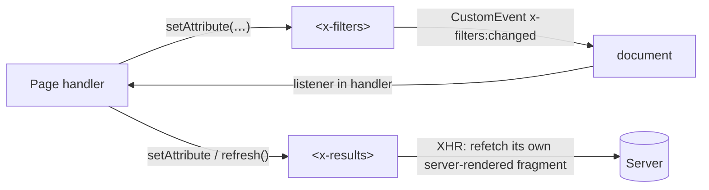

# Client-Side Components

Gina's answer for stateful client-side widgets is the **platform primitive**: [custom elements v1](https://developer.mozilla.org/en-US/docs/Web/API/Web_components/Using_custom_elements) — `customElements.define('x-widget', class extends HTMLElement { … })`. No framework dependency, no build tooling, no second rendering paradigm beside your server templates. What gina adds are the **integration seams**: authoring conventions, a reference component in every view scaffold, and guarantees about how components behave in gina-rendered and gina-injected content.

:::info
*New in 0.5.15* — the conventions, the scaffold reference component, and the e2e coverage ship with the framework. No framework runtime code is involved: components are plain platform features that gina's render pipeline passes through verbatim.
:::

Two long-standing pain points this retires:

1. **Widgets going dead in XHR-injected content.** Handler-bound code needs manual rebinding after a popin or AJAX swap replaces DOM. Custom elements don't: the browser upgrades them **automatically on insertion**, wherever the markup lands — including popin bodies. No rebind hook, no re-scan.
2. **No sanctioned non-framework answer for stateful widgets.** These conventions are that answer.

---

## The authoring model — HTML and JS stay separated

A component has two files, owned by two roles:

- **The markup is a template partial** (the *designer* surface). It lives in the bundle's template tree like any page fragment, and the server renders it as the element's **light DOM**. Regular engine tooling, regular stylesheets — and the content ships in the initial HTML.
- **The class is behavior-only** (the *developer* surface). It lives in `public/js/`, binds and enhances its own server-rendered subtree — listeners, state via `classList`/attributes/`textContent` — and holds **no markup strings**: no `innerHTML` template literals, no JS-built render trees.

Repeatable or dynamic markup comes from a server-rendered `<template>` **inside** the component's light DOM, cloned and filled by the class — or, for larger content, a server-rendered fragment fetched over XHR (the popin pattern). The markup source is always a file a designer edits.

### The reference component

`gina view:add` scaffolds a working example. The partial (`templates/html/includes/x-checklist.html`):

```html
<x-checklist data-x-checklist='{ "statusText": "%s of %s done" }'>
    <h2>Getting started checklist</h2>
    <p data-role="status" hidden></p>
    <ul>
        <li><label><input type="checkbox" checked> Scaffold your project and start the bundle</label></li>
        <li><label><input type="checkbox"> Add a route in <code>config/routing.json</code></label></li>
        <li><label><input type="checkbox"> Point it at a controller action</label></li>
        <li><label><input type="checkbox"> Read the <a href="https://gina.io/docs/">documentation</a></label></li>
    </ul>
    <template data-role="item">
        <li><label><input type="checkbox"> <span data-role="item-label"></span></label></li>
    </template>
    <form data-role="add" action="#" method="get">
        <input type="text" name="label" placeholder="Add a step" aria-label="New checklist item">
        <button type="submit">Add</button>
    </form>
</x-checklist>
```

Everything meaningful is server-rendered, semantic HTML — headings, list items, a real `<a href>` link. The `<template data-role="item">` is the component's only source of dynamic markup.

The class (`public/js/components/x-checklist.js`, abridged):

```js
class XChecklist extends HTMLElement {

    static get observedAttributes() {
        return ['collapsed'];
    }

    connectedCallback() {
        if (this._bound) { return; }        // re-fires when the element is moved
        this._bound = true;

        var config = {};
        try {
            config = JSON.parse(this.getAttribute('data-x-checklist') || '{}');
        } catch (err) {
            config = {};
        }
        this._statusText = config.statusText || '%s of %s done';

        this._list     = this.querySelector('ul');
        this._template = this.querySelector('template[data-role="item"]');
        // … bind change/submit listeners on the subtree, render the status line
    }

    attributeChangedCallback(name) {
        // data DOWN — react to attribute writes from outside
    }

    addItem(label) {
        // dynamic markup never comes from JS strings — clone the template
        var fragment = this._template.content.cloneNode(true);
        fragment.querySelector('[data-role="item-label"]').textContent = label;
        this._list.appendChild(fragment);
    }
}

customElements.define('x-checklist', XChecklist);
```

## Placement and loading

Definition files live in **`public/js/`** and are declared once in `config/templates.json`:

```jsonc
"javascripts": [
    "/handlers/main.js",
    "/js/components/x-checklist.js"
]
```

Files under `public/` are served plain. Do **not** put component definitions in `templates/handlers/` — handler files are wrapped in the framework's `onGinaReady` bootstrap at serve time, which defers your `customElements.define()` behind the framework-load poll (a needless flash of undefined content) and implies handler semantics the definition doesn't have.

**Timing rules:**

- **Define eagerly.** A component definition is a plain external script with no gina dependency — it can (and should) register at parse time. Upgrade is retroactive, so ordering against other scripts is soft.
- A handler that needs a component's API waits for it: `customElements.whenDefined('x-checklist').then(…)`.
- Gate `connectedCallback` work on gina readiness **only** when the component actually needs `gina.config` / `gina.session` / `gina.validator`. `window.__ginaWebroot` is set synchronously at parse time and is safe for URL building without any gate.

## SSR and hydration

The server template is the single source of markup; the class hydrates from it:

- **Attributes for scalars** — `collapsed`, counts, modes. Observe the reactive ones with `static observedAttributes`.
- **One JSON payload** via a component-owned `data-*` attribute (use your tag name as the key: `data-x-checklist='{ … }'`). The component parses it defensively; mind HTML attribute escaping when the JSON carries user content.
- **Slotted light-DOM content** for everything textual — it's just server-rendered HTML the class reads in place.
- **Declarative shadow DOM** (`<template shadowrootmode="open">`) is available for pre-styled non-content chrome — it's plain markup to the template engines — but see the SEO section before reaching for it. Imperative shadow roots with JS-built markup are out by convention.

Components own their attribute namespace — gina parses none of it. The `data-gina-*` prefix stays framework-owned; don't squat it.

## SEO and GEO come first

All meaningful content must be present in the **initial server-rendered HTML** as light DOM. Most AI/answer-engine crawlers fetch raw HTML and do **not** execute JavaScript, and classic crawlers that do still defer JS-rendered content. The authoring model above makes conformance the default; keep it that way:

- Custom tags are SEO-neutral — crawlers read the text content of unknown elements normally. Use **semantic HTML inside** the component: headings, lists, real `<a href>` links (never JS-only navigation).
- Keep rankable content **out of shadow roots** entirely — even declarative shadow DOM sits inside an inert `<template>` for any non-DSD-aware fetcher.
- A component's XHR is for **interactivity and live data only**, never for content that must rank or be quotable by answer engines.
- Structured data (JSON-LD) stays a server-template concern, unaffected by components.

The framework's e2e suite locks this contract for the reference component: its meaningful content is asserted present in the raw served HTML with no browser at all.

## Communicating between components

Use the platform's native unidirectional protocol — never a shared two-way-bound model:

- **Data DOWN via attributes.** `static observedAttributes` + `attributeChangedCallback` is the built-in inbound observer: anything that writes an attribute triggers the component's reaction.
- **Events UP via composed, bubbling `CustomEvent`.** Naming convention: `<tag>:<verb>` — e.g. `x-filters:changed` — payload in `detail`.



**Cross-fragment coordination** (fragment B reacts to fragment A): either B listens document-level for A's event directly — peer components stay decoupled — or a small page **handler** wires A's event to B's attribute or refresh call. Orchestration lives in the handler, which gina already has as a concept; handlers are also where gina-API reactions (popin/validator lifecycle) belong.

**Server-truth coordination** (B's content must reflect the server after A's action): B refetches its own server-rendered fragment on A's event. The server stays the single source of truth — no duplicated client model, and the result is SEO-consistent.

**"Bi-directional" is two unidirectional links** — each direction its own event-to-attribute wire. A shared two-way-bound observed model is the classic feedback-loop footgun (cycle guards, batching, digest problems); if a screen genuinely needs coordinated client state, the on-philosophy answer is more server round-trips, not a client state layer.

A component inside a swapped fragment needs no observer at all — `connectedCallback` / `disconnectedCallback` **are** its fragment-change notifications. `MutationObserver` is sanctioned only over a component's own subtree; observing another component's internals couples you to markup you don't own.

## Components in popins and XHR-injected content

Custom elements inside a popin-injected body **upgrade automatically** — the platform handles it on DOM insertion, whatever template engine rendered the fragment server-side. The reference component's e2e coverage drives this against the real built bundle.

A popin body may even carry its **own external definition script**: the popin open path re-creates external `<script src>` tags in `<head>` with a global dedup guard, so the definition loads once and already-inserted elements upgrade retroactively.

One authoring caveat, engine-level not component-level: literal `{{ }}` in markup is interpreted server-side by the template engines. The hydration conventions above (attributes, `data-*` JSON, slots) carry no `{{ }}`, so components authored per this guide are immune; if you ever need literal braces client-side, use the engine's raw block.

## Live connections

Open live resources in `connectedCallback` and close them in `disconnectedCallback` — popin close and content replacement then tear your sockets down automatically (handler-bound sockets leak on content replacement unless you wire teardown by hand). This pairs naturally with gina's [WebSocket routes](/guides/websockets) (`"method": "ws"` in `routing.json`, over HTTP/2 extended CONNECT where the client supports it); `EventSource`/SSE is the HTTP/1.1-compatible alternative for server-push-only cases. Render incoming data with the same `<template>`-clone idiom — live data is interactivity, not rankable content.

## Strict CSP compatibility

The conventions are CSP-clean under a strict, nonce'd policy with no `'unsafe-inline'`:

- Definitions are **external files** — under a nonce'd `script-src`, the `<script src>` tag the framework emits for your `javascripts` entries carries the policy's nonce when you use the [Csp plugin](/guides/csp)'s `useNonce`.
- Light-DOM components ride the bundle's normal **external stylesheets** (`style-src 'self'`) — no inline styles needed. The rare shadow-DOM case uses constructable stylesheets (`new CSSStyleSheet()` + `adoptedStyleSheets`), which CSP does not gate.

The reference component's e2e coverage asserts exactly this: hydration and styling under a real nonce'd `Content-Security-Policy` header with zero component-caused violations.

## Naming and browser floor

- Tag names are yours to choose (the spec requires a dash). The **`gina-*` prefix is reserved** for future framework components — pick your own (docs use a neutral `x-`).
- Custom elements v1 are supported by **all evergreen browsers**. The wider set — ElementInternals form association, `adoptedStyleSheets`, declarative shadow DOM — floors at **Safari 16.4 (2023)**. Components are an opt-in per bundle; gina's own browser floor is unchanged.
