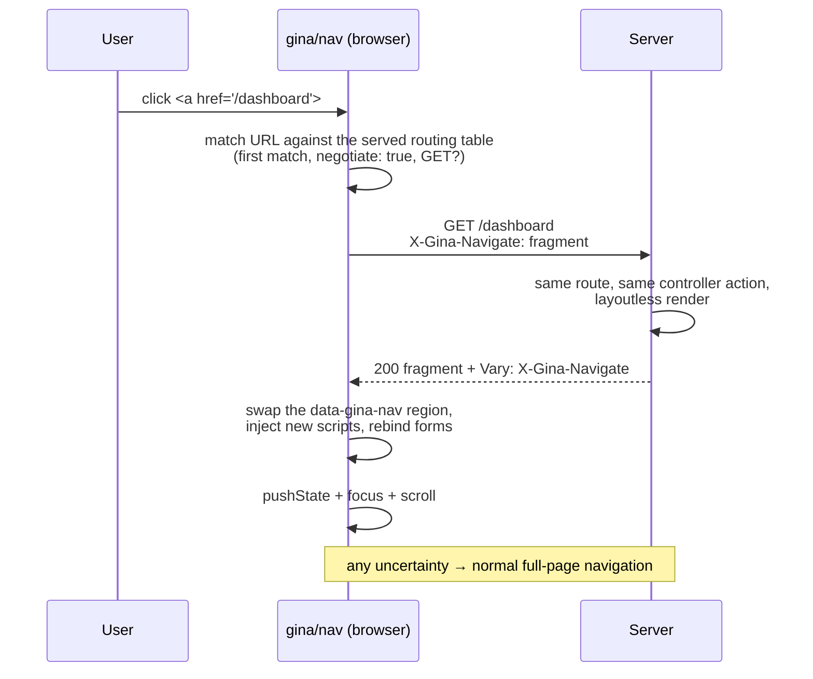

# Single-page apps without a frontend framework

Gina can give a server-rendered site SPA-style navigation — clicks swap page
content in place, the URL and history stay correct, and there is no full page
reload — **without a client-side framework, and without writing any client
JavaScript**. No React, no htmx attributes sprinkled through your templates, no
second set of routes for partials.

The idea is the hypermedia one: **HTML stays the wire format and the server
stays the single source of truth.** A route opts in with one flag, the layout
marks one swap region, and the built-in `gina/nav` module does the rest —
fetching each page as a layoutless fragment over the same URL and swapping it
into the region. Anything unexpected falls back to a normal full-page
navigation, so the enhancement can never strand a user.

---

## One route, two shapes

A page and the fragment inside it are the same content rendered two ways.
Instead of declaring a second route for the fragment, mark the route
[`negotiate: true`](/guides/routing#content-negotiation) and let the **request**
choose the shape:

```json
"dashboard": {
  "url": "/dashboard",
  "method": "GET",
  "negotiate": true,
  "param": { "control": "index" }
}
```

Nothing changes in the controller — the action still calls `self.render(data)`.
A normal browser request gets the full page. A request carrying
`X-Gina-Navigate: fragment` gets the same route rendered **without its layout**:
the content blocks alone. Any other header value — or none — renders the full
page, and the response always advertises `Vary: X-Gina-Navigate` so shared
caches know the URL has more than one representation.

The server half — headers, `Vary`, caching interaction, `fetch()` usage — is
documented in [Content negotiation](/guides/routing#content-negotiation). This
guide covers the browser half: turning that fragment shape into navigation.

## How it works



`gina/nav` installs one delegated click listener on the document. When a click
resolves to a same-origin link whose URL matches a route declaring
`negotiate: true`, it fetches that URL as a fragment and swaps it into the
marked region — managing history, scroll and focus. Links inside swapped
content are covered automatically; nothing is ever rebound per link.

## Quick start

**1. Opt the routes in** — add `"negotiate": true` to each route that should
navigate as a fragment (see above).

**2. Mark the swap region** — one attribute on the element of your layout that
wraps the per-page content:

```html
<!DOCTYPE html>
<html>
  <body>
    <nav>…site chrome, stays untouched…</nav>
    <main data-gina-nav>
      
    </main>
  </body>
</html>
```

**3. There is no step 3** — no client code, no per-link attributes. The
framework's browser bundle detects the marker at boot and activates navigation.
A page **without** the marker is byte-identical to before: no listener, no
`gina.nav` global, no history changes. Upgrading Gina never changes navigation
behaviour on existing pages.

:::caution Pick-up requires a bundle rebuild
`gina/nav` ships inside each bundle's **browser bundle**. Upgrading the
framework updates the server half only — run `gina bundle:build` (a re-bake)
for the module to reach your pages. The server-side `negotiate` flag alone
needs just a restart.
:::

## The swap region

The `data-gina-nav` marker is both the **page-level opt-in** and the **region
each fragment replaces**. Any value except `"false"` activates it — including
no value at all. If several elements carry it, the first in document order
wins.

Two more attributes complete the vocabulary:

| Attribute | Where | Effect |
|---|---|---|
| `data-gina-nav` | one element in the layout | Opts the page in; the element's content is what each navigation replaces |
| `data-gina-nav="false"` | an `<a>` | Per-link opt-out — that link always navigates normally |
| `data-gina-nav-title` | any element **inside a fragment** | Sets `document.title` to the attribute's value after the swap (a layoutless fragment cannot carry its own `<title>`) |

```html
{# a fragment template #}
<h1 data-gina-nav-title="Dashboard — MyApp">Dashboard</h1>
```

## Which clicks are intercepted

Exactly these: **a plain left-click on a same-origin `<a href>` whose URL's
first matching route declares `negotiate: true` and accepts GET.** Everything
else is deliberately left alone:

- **Browser-owned** — middle/right clicks, <kbd>Ctrl</kbd>/<kbd>Cmd</kbd>/<kbd>Shift</kbd>/<kbd>Alt</kbd>
  modified clicks, links with a `target` (other than `_self`) or `download`
  attribute, cross-origin URLs, `#hash`-only and in-page hash moves. Open in
  new tab, save as, and friends all keep working.
- **Plugin-owned** — links driven by the [link](/guides/forms-and-validation),
  dialog or popin plugins (`data-gina-link*`,
  `data-gina-dialog*`, `data-gina-popin-*`) keep their own handlers.
- **Opted out** — `data-gina-nav="false"` on the link.
- **Route-level** — no matching route, a first match without
  `negotiate: true`, or one that does not accept GET.

Two matching rules are worth designing around:

- **First match in table order wins** — the same rule the server uses. If the
  first route matching a URL is not negotiable, the click is *not* intercepted,
  even if a later route would match and be negotiable. Route order in
  `routing.json` is significant for navigation, exactly as it is for dispatch.
- **GET only.** Navigation is a read. Forms keep going through the
  [validator's XHR submit](/guides/forms-and-validation); non-GET links are
  left to the browser.

## After a swap

A successful fragment swap does more than set `innerHTML`:

- **Scripts** — `<script src>` elements in the fragment that the document does
  not already have are re-injected into `<head>`, once per page lifetime.
  **Inline scripts are never executed** — the same `innerHTML` contract popin
  content has always had. Anything a fragment needs must be a `src`-bearing
  script or already on the page.
- **Forms** — id-bearing forms in the new content are rebound through the live
  [validator](/guides/forms-and-validation), so validation rules keyed by form
  id keep working. Id-less forms are skipped (no rule can target them).
- **Popins** — an open popin is closed: a real navigation
  would have unloaded it, and after a swap it would sit over content it no
  longer belongs to.
- **History** — a `pushState` entry per navigation. Back/Forward re-fetch the
  fragment and restore the scroll position saved on the entry being left.
- **Focus and scroll** — the region receives focus (it is given
  `tabindex="-1"` if needed), then scroll goes to the restored position on
  Back/Forward, to the `#hash` target when the URL has one, or to the top.

## When it falls back

Every uncertainty degrades to a **normal full-page navigation** of the same
URL — progressive enhancement is the failure mode, not a feature flag:

| Answer | What happens |
|---|---|
| Non-2xx, network error, or timeout (10 s default) | Full-page navigation |
| 2xx **without** `Vary: X-Gina-Navigate` | Full-page navigation — the server dispatched a route the client matched differently; the honest recovery is a real page load |
| JSON body with a `location` field | Hard redirect — `window.location` follows it (the established XHR redirect protocol) |
| Any other JSON | Full-page navigation |
| A newer click superseded this one | Response silently dropped — two rapid navigations can never interleave content |

The `error` event fires before a fallback, so you can observe and log it — but
not cancel it.

## Programmatic API

Activation publishes `gina.nav` (and `gina.hasNavHandler = true`):

```js
// Navigate programmatically — same pipeline as an intercepted click.
gina.nav.navigate('/dashboard');

// Ask which route a pathname resolves to (first match, server semantics).
var matched = gina.nav.matchUrl('/dashboard');
// → { rule: 'dashboard', route: {…}, isGet: true } or null
```

`gina.nav.navigate(url)` on a page where navigation is not active — or toward
a non-negotiable route — behaves like `window.location.href = url`, so it is
always safe to call.

Events, observable with `gina.nav.on('<event>', handler)`:

| Event | Fires | Payload |
|---|---|---|
| `ready` | activation complete | the instance |
| `navigate` | before each fragment fetch | `{ url, isPopState }` |
| `success` | after a swap | `{ url, target, isPopState }` |
| `error` | before a full-page fallback | `{ status, error }` |

## Caveats

- **`negotiate` and `cache` are mutually exclusive.** A negotiable route never
  enters the [response cache](/guides/caching) — the cache key carries no shape
  dimension, so a cached entry could replay a fragment to a browser asking for
  a full page. If a route is cache-critical, keep it a normal route and declare
  a separate fragment route instead.
- **Nunjucks bundles: hold off.** On the [nunjucks](/templating/nunjucks)
  engine a negotiated request currently returns the **full page** (the
  layoutless flag only filters assets there). Avoid `negotiate: true` on
  nunjucks `` routes until this is resolved. Swig — the default
  engine — is the fully working path.
- **URLs with mixed literal+parameter segments** (like `/page:number`) are
  matchable by the server but deliberately not by the client — links to them
  navigate normally rather than risking a wrong match.
- **Browser floor:** `history.pushState` + `Element.closest`. Below it the
  module simply never intercepts — plain navigation, nothing breaks.

## Coming from htmx or Turbo?

Gina's navigation is not htmx — but if hypermedia, *HTML over the wire* and
server-rendered fragments are what brought you here, it is the same
philosophy with a different division of labour: **the opt-in lives in the
routing table, not in per-element attributes.**

| htmx habit | The Gina equivalent |
|---|---|
| `hx-boost` on the body | one `data-gina-nav` region in the layout |
| `hx-get` + `hx-target` per element | a plain `<a href>` — the *route* opts in via `negotiate: true`, the region is fixed |
| `hx-push-url="true"` | automatic — history, scroll and focus are managed |
| `hx-select` to trim the response | unnecessary — the server renders the fragment shape |
| a second endpoint for partials | the same URL, negotiated by request header |

Honest differences, so you can pick the right tool:

- **One swap region per page.** htmx targets arbitrary elements with
  per-element swap strategies; `gina/nav` swaps one region. For finer-grained
  server-driven updates inside a page, Gina's answer is
  [Web Components that refetch their own fragment](/guides/client-components)
  and the popin pattern.
- **GET navigation only.** htmx issues any verb from any element; in Gina,
  forms go through the [validator's XHR submit](/guides/forms-and-validation)
  with its own lifecycle.
- **No polling or SSE swap attributes.** For live content, see
  [Client Components — live connections](/guides/client-components) (WebSocket
  / EventSource patterns).
- **Less wire weight than Turbo Drive or pjax** for the same interaction:
  those fetch the *full* page and extract the interesting part client-side;
  Gina's server sends only the fragment.

And unlike all of them, there is no third-party script and no attribute
vocabulary to spread through templates: one flag per route, one marker per
layout.

## Related

- [Content negotiation](/guides/routing#content-negotiation) — the server
  half: headers, `Vary`, `fetch()` usage, caching interaction.
- [Client-Side Components](/guides/client-components) — stateful widgets that
  survive swaps and refetch their own server-rendered fragments.
- [Forms and Validation](/guides/forms-and-validation) — the XHR submit
  lifecycle that swapped forms are rebound into.
- [Caching](/guides/caching) — why negotiable routes stay out of the response
  cache.
- [Swig in the browser](/templating/swig/browser) — a different axis: running
  the template engine *client-side* (AOT-compiled bundles, CSP-safe runtime
  build) when you want to render templates in the browser yourself.
