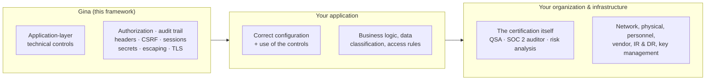

# Compliance control mapping

This page maps the **technical controls** Gina provides to the PCI-DSS, SOC 2,
and HIPAA technical requirements they support — and states plainly where a
framework's responsibility ends. It is distinct from the
[Security & CVE compliance](/security) page, which lists the HTTP/2 CVEs Gina
mitigates.

:::caution A framework cannot be "compliant" — and Gina does not claim to be
**Gina is not, and cannot be, "PCI-DSS compliant," "SOC 2 compliant," or "HIPAA
compliant" — and no framework can be.** Compliance is achieved by an
**organization**, through a QSA assessment (PCI-DSS), an independent auditor's
attestation (SOC 2), or a documented risk analysis plus Business Associate
Agreements (HIPAA). Those exercises span people, process, physical and network
infrastructure, and policy — the overwhelming majority of any standard. There
is no such thing as a "certified" open-source framework: assessors audit your
**application architecture and data handling**, not the library it is built on.

What a framework can supply is the **application-layer technical controls** — the
building blocks your application uses to *satisfy* the technical safeguards an
assessor will check. Deploying on Gina gives you those building blocks. It does
not give you an attestation, and it does not, by itself, make your application
compliant.
:::

---

## Who is responsible for what

Compliance is a shared-responsibility model. Gina owns only the leftmost column.

Gina reduces the surface **you** have to build and get right; everything to the
right of the framework remains yours.

---

## How to read the tables

- ✅ **Available** — shipped and usable today (release noted where it matters).
- 📋 **Planned** — on the [roadmap](/roadmap) under Security & Compliance
  Controls; **do not rely on it as a control until it ships.**
- References are **version-pinned**: PCI-DSS cites use the **v4.0.1**
  numbering (the current edition), SOC 2 cites use the **2017 Trust Services
  Criteria (Revised Points of Focus, 2022)**, and HIPAA cites are regulatory —
  45 CFR §164.312, the Security Rule's technical safeguards. Each row names the requirement family plus the directly
  supporting sub-clause where the mapping is unambiguous. A single control
  rarely satisfies a requirement on its own — every requirement also needs
  configuration, process, and evidence outside the framework, and your
  assessor confirms numbering for the edition in force in your assessment.

---

## Controls Gina provides today

| Control | What it gives you | Supports | Status | Guide |
|---|---|---|---|---|
| **Authorization / RBAC** | Per-route `requireAuth` / `roles` / `policy` gate before the action runs; generic 403; boot-refusal on a silently-ungated route | PCI-DSS Req 7 (7.2) · SOC 2 CC6.3 · HIPAA §164.312(a)(1) | ✅ 0.5.19 | [Route authorization](/guides/route-authorization) |
| **Audit trail** (record) | Append-only, user-attributed JSONL of who did what to which record when; auto-records authorization denials; own store, never the log sinks | PCI-DSS Req 10 (10.2) · SOC 2 CC7.2 · HIPAA §164.312(b) | ✅ 0.5.19 | [Audit trail](/guides/audit-trail) |
| **Security headers** | CSP, HSTS, X-Frame-Options, Referrer-Policy, COOP/COEP/CORP, and the rest of the header-plugin family; batteries-included or per-header. CSP in particular is a primary mechanism for PCI-DSS v4's payment-page script control | PCI-DSS Req 6 (6.4.3 via CSP) · SOC 2 CC6.6 | ✅ | [Security headers](/guides/security-headers) |
| **CSRF protection** | Signed double-submit token + Origin/Referer pre-filter; per-route exemptions | PCI-DSS Req 6 (6.2.4) · SOC 2 CC6.1 | ✅ | [CSRF](/guides/csrf) |
| **Session cookie hardening** | `HttpOnly` (default on), `SameSite` (default `lax`), and a boot-time invariant rejecting `SameSite=None` without `Secure`; per-bundle expiry policy | PCI-DSS Req 6 (6.2.4) · SOC 2 CC6.1 | ✅ | [Sessions](/guides/sessions) |
| **Secrets resolver** | `${secret:KEY}` placeholders keep credentials out of config and source; fail-closed on an unset key. Values are read from the environment — the standard delivery channel for cloud secret managers and KMS-backed stores | PCI-DSS Req 8 (8.6.2 — no hard-coded credentials) · SOC 2 CC6.1 | ✅ | [Secrets](/guides/secrets) |
| **Output escaping** | **Nunjucks bundles auto-escape variable output by default.** Swig bundles render variable output raw by default; enable auto-escaping per bundle with `settings.swig.autoescape: true` (`0.5.25`+), or escape explicitly with the `e` / `escape` filter | PCI-DSS Req 6 (6.2.4 — XSS) | ✅ Nunjucks · opt-in for Swig (`settings.swig.autoescape`) | [Templating](/templating) |
| **Parameterized queries** | Connector query APIs bind parameters — the primary injection defense | PCI-DSS Req 6 (6.2.4 — injection) | ✅ | [Connectors](/reference/connectors) |
| **Dependency / CVE scanning** | Socket, Dependabot, and an OSV workflow gate the framework's own supply chain; HTTP/2 CVEs mitigated by default | PCI-DSS Req 6 (6.3.1–6.3.2) · SOC 2 CC7.1 | ✅ | [Security & CVE compliance](/security) |
| **Transport security** | HTTP/2 + TLS, with HSTS emitted by the header plugin | PCI-DSS Req 4 (4.2.1) · SOC 2 CC6.7 | ✅ | [HTTPS](/guides/https) |

:::note Recording vs. making the trail tamper-resistant
Today's audit trail gives you the **record** an assessor asks for (PCI-DSS
Req 10: who did what, when, from where). Making it tamper-*resistant* has two
complementary halves:

- **Isolation — do this now, in your deployment.** The trail is written as an
  append-only JSONL file (`logs/audit-<bundle>-<env>.jsonl`). Point your
  platform's log agent (Fluent Bit, Vector, the CloudWatch or Datadog agent)
  at that file to stream records to a store your application cannot rewrite —
  CloudWatch, Datadog, or an S3 Object-Lock / WORM bucket. This runs *out of
  process*, off the request path, and is the recognized way to satisfy
  PCI-DSS v4.0.1's **10.3.3** — audit logs *"promptly backed up to a secure,
  central, internal log server(s) or other media that is difficult to modify."*
- **Tamper-evidence — planned.** An HMAC hash chain plus `gina audit:verify`,
  making an edited, deleted, or reordered record *detectable* — see the
  roadmap row below.
:::

---

## Controls on the roadmap (not yet available)

These are scoped on the [roadmap](/roadmap) targeting `0.6.x`. **Treat them as
absent until the release notes say otherwise.**

| Planned control | Will support | Status |
|---|---|---|
| **Audit tamper-evidence** — HMAC hash chain + `gina audit:verify` | PCI-DSS Req 10 (10.3.2, 10.3.4) · SOC 2 CC7 · HIPAA §164.312(b) | 📋 `0.6.x` |
| **Authentication hardening** — password hashing/policy helpers, account lockout, MFA/TOTP hooks | PCI-DSS Req 8 (8.3.2 auth-factor storage · 8.3.4 lockout · 8.4 MFA) · HIPAA §164.312(d) | 📋 `0.6.x` |
| **Session lifecycle hardening** — session-id rotation on privilege change, idle + absolute timeout | PCI-DSS Req 8 (8.2.8 idle timeout) | 📋 `0.6.x` |
| **PII/PHI protection** — production log-field redaction, data classification, retention helpers | SOC 2 (Privacy) · HIPAA | 📋 `0.6.x` |
| **Application-level rate limiting** — per-endpoint / per-client throttling at the route layer | PCI-DSS (anti-automation) · SOC 2 (Availability) | 📋 `0.6.x` |
| **Data-at-rest / field-level encryption helpers** — field encryption + key-management utilities | PCI-DSS Req 3 (3.5) · HIPAA §164.312(a)(2)(iv) | 📋 `0.6.x` |

:::tip Interim guidance while the planned controls ship
A planned row is not a blocker — each has an established interim pattern:

- **Password hashing** — until the authentication-hardening helpers ship, hash
  credentials in your bundle with a maintained library (**argon2** or
  **bcrypt**) — never a homegrown scheme, and never a plain digest.
- **Audit-log integrity** — use the isolation pattern above (agent-shipped
  JSONL to an immutable store); it is an accepted control on its own.
- **Keys & encryption** — deliver secrets from your KMS / secret manager
  through the environment (the `${secret:KEY}` resolver reads it); perform
  field-level encryption with your platform's KMS SDK until the framework
  helpers ship. HSM/KMS *infrastructure* remains yours in every scenario.
:::

---

## What Gina does not — and cannot — cover

No framework provides these. They are the organizational, infrastructure, and
process controls an assessor evaluates alongside your application:

- **The certification itself** — the PCI-DSS QSA assessment (ROC/AOC), the SOC 2
  Type I/II auditor's report, the HIPAA risk analysis and remediation.
- **Legal instruments** — HIPAA Business Associate Agreements, data-processing
  agreements with your subprocessors.
- **Network & physical security** — segmentation, firewalls/WAF, DDoS protection,
  data-center physical controls, endpoint security.
- **Personnel & process** — background checks, security-awareness training,
  periodic access reviews, separation of duties, onboarding/offboarding.
- **Operations** — incident-response and disaster-recovery plans, change
  management, continuous monitoring / SIEM operation. Gina *emits* the signals
  (structured logs, the audit trail, Prometheus metrics); operating on them is
  yours.
- **Key-management infrastructure** — a KMS/HSM and its key lifecycle. Framework
  helpers (shipped or planned) *use* your key infrastructure; they never replace
  it.
- **Vendor / third-party risk management** — of every dependency and service your
  application relies on beyond the framework.

---

## Per-standard summary

**PCI-DSS** — Gina contributes to the application-layer requirements: access
control (Req 7), audit logging (Req 10), secure development practices (Req 6),
credential hygiene (Req 8), and transport security (Req 4). It does **not**
address cardholder-data environment scoping, network segmentation, stored
cardholder-data controls beyond the planned encryption helpers, or the QSA
assessment — the bulk of the standard.

**SOC 2** — Gina supports Common Criteria controls, mostly under **CC6**
(logical access: authorization, sessions, secrets, transport) and **CC7**
(system operations: audit signals, vulnerability management). The Trust
Services Criteria as a whole, and the auditor's examination of your controls
over a period, are organizational.

**HIPAA** — Gina supplies technical-safeguard building blocks under
**§164.312**: access control (a)(1), audit controls (b), and — once shipped —
authentication (d) and encryption (a)(2)(iv). Administrative and physical
safeguards, the risk analysis, and BAAs are outside any framework.

---

## Status

This is a **living reference**. As Security & Compliance Controls ship, their
rows move from *planned* to *available* here and on the
[roadmap](/roadmap). ✅ marks what you can use today; 📋 marks what is scoped but
not yet built. If a control you need is 📋, it is not a control you have.
