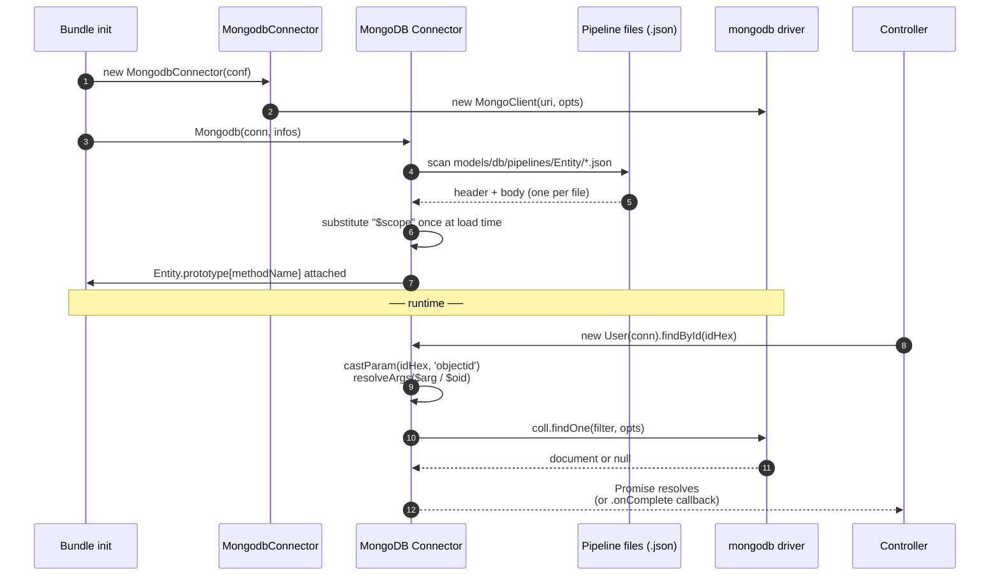

# MongoDB ORM for Node.js

MongoDB is a general-purpose document database. Gina's `mongodb` connector
wraps the official `mongodb` driver so you can write entity classes with JSON
pipeline files, the same way you'd write SQL files for MySQL or CQL files for
ScyllaDB.

- **Entities** — JavaScript classes that map to Mongo collections, with
  generated CRUD methods and the standard `EventEmitter` / `.onComplete()` shim
- **Pipeline files** — Mongo operations stored as `.json` files alongside
  entity code, with JSDoc-style headers describing parameters and return shapes
- **Type-safe parameters** — `@param` annotations cast inputs to BSON types
  (objectid, int, long, double, boolean, date, etc.)
- **Placeholder shapes** — `{$arg: N}` for caller-supplied positional args,
  `{$oid: "<hex>"}` for ObjectId literals, `"$scope"` for environment isolation
- **Session store** — express-session-compatible store using a TTL index, with
  the index auto-created on the first `set()` call

---

## Driver

Gina wraps the official [`mongodb`](https://www.npmjs.com/package/mongodb)
Node.js driver maintained by MongoDB Inc. The connector's registry pin is
`>=7.0.0` (current GA is the `7.x` series), which supports MongoDB server
versions back to 5.0 and forward to the latest major.

The driver is loaded from your project's `node_modules` at runtime — Gina has
zero hard dependency on it.

:::caution Node 16+ recommended
The `mongodb@7.x` driver supports Node 16+. Gina itself supports Node `>=16 <26`,
so any supported gina runtime can use the connector.
:::

---

## Installation

```bash
npm install mongodb
```

---

## Architecture

```mermaid
flowchart TD
    subgraph Bundle["Bundle Process"]
        C[Controller] -->|"entity.findById()"| E[Entity<br/>EventEmitter]
        E -->|"resolveArgs<br/>$arg / $oid"| MC[MongoDB Connector]
        MC -->|"pipeline-loader"| PL[(JSON pipeline files<br/>models/db/pipelines/Entity/*.json)]
        MC -->|"coll.findOne / find / aggregate / ..."| MD[mongodb driver]
        MD -->|"BSON / wire protocol"| MO[(MongoDB<br/>Replica set / Cluster)]
    end

    subgraph SessionStore["Session Store"]
        SS[express-session] -->|"set / get / touch / destroy"| MS[MongodbStore]
        MS -->|"TTL index<br/>auto-create on first set()"| MO
    end

    subgraph DevMode["Dev Mode"]
        MC -->|"push _queryEntry"| QI[Query Instrumentation]
        QI --> INS[Inspector<br/>Query Tab]
    end

    style Bundle fill:#1a1a2e,stroke:#f2af0d
    style SessionStore fill:#1a2e2a,stroke:#4caf50
    style DevMode fill:#2a2a3e,stroke:#4caf50
```



Entity wiring scans `models/<database>/entities/` and
`models/<database>/pipelines/<Entity>/` once at bundle startup. Each `.json`
pipeline file becomes a method on the entity prototype, with parameter coercion
and placeholder substitution wired in:



---

## Connector config (connectors.json)

The connector accepts either a fully-formed `uri` (preferred when set) OR
decomposed fields. Provide `uri` for Atlas (`mongodb+srv://`) or replica-set
connection strings; provide decomposed fields for simple single-host setups.

**URI form** — Atlas, replica set, or any complex connection string:

```json title="src/api/config/connectors.json"
{
  "primary": {
    "connector": "mongodb",
    "uri":       "mongodb+srv://<user>:<pass>@cluster0.example.net/myapp?authSource=admin",
    "database":  "myapp"
  }
}
```

**Decomposed form** — self-hosted single node:

```json title="src/api/config/connectors.json"
{
  "primary": {
    "connector":  "mongodb",
    "host":       "127.0.0.1",
    "port":       27017,
    "database":   "myapp",
    "username":   "appuser",
    "password":   "${MONGO_PASSWORD}",
    "authSource": "admin"
  }
}
```

Connection options:

| Option | Default | Notes |
|---|---|---|
| `connector` | (required) | Must be `"mongodb"` |
| `uri` | — | Full connection string. Preferred when set; takes priority over decomposed fields |
| `host` | `"127.0.0.1"` | Server host (decomposed mode only) |
| `port` | `27017` | Server port (decomposed mode only) |
| `database` | (required) | Database name. Also names the model directory (`models/<database>/`) |
| `username` | — | Auth user. URL-encoded automatically when assembling the URI |
| `password` | — | Auth password. Supports `${ENV_VAR}` substitution. URL-encoded automatically |
| `authSource` | — | Auth database, when different from `database` |
| `replicaSet` | — | Replica set name |
| `ssl` | — | `true` to enable TLS, or an object whose keys are passed through to the driver as `tlsOptions` |

You can also write the entry from the CLI:

```bash
gina connector:add primary @myproject \
    --connector=mongodb \
    --driver-version='>=7.0.0'
```

---

## Defining an entity

Entities live under `bundle/models/<database>/entities/`. The class extends the
gina `Entity` super-class via `inherits`:

```javascript
// bundle/models/myapp/entities/user.js
var lib    = require('gina').lib;
var Entity = lib.entities.Entity;

function User(conn, caller) {
    Entity.call(this, conn, caller);
}

module.exports = User;
```

Methods are attached automatically from JSON pipeline files at
`bundle/models/<database>/pipelines/User/*.json`:

```text
bundle/models/myapp/
├── entities/
│   └── user.js
└── pipelines/
    └── User/
        ├── findById.json
        ├── insert.json
        └── activeByEmail.json
```

The directory is `pipelines/` (not `sql/` or `cql/`) because Mongo's operations
are JSON aggregation pipelines and operation documents — not SQL strings. The
file extension is `.json` to match.

---

## Pipeline file format

Each `.json` file describes one Mongo operation. The body is a JSON document;
the JSDoc-style header in a leading block comment declares parameters and the
return shape.

```json title="pipelines/User/findById.json"
/**
 * @param  {objectid} arg0  user id
 * @return {object}
 */
{
  "op":     "findOne",
  "filter": { "_id": {"$arg": 0}, "_scope": "$scope" }
}
```

Annotations:

- `@param {<type>} <pos> <description>` — pre-execute coercion of positional
  arguments. BSON types supported: `objectid`, `int`, `int32`, `long`, `int64`,
  `double`, `number`, `boolean`, `string`, `text`, `date`, `timestamp`. Unknown
  types pass through; `null` and `undefined` always pass through regardless of
  the declared type.
- `@return {<shape>}` — controls the response shape returned by the entity
  method:

| Annotation | `findOne` | `find` / `aggregate` | Write op |
|---|---|---|---|
| `{object}` | document or `null` | first doc or `null` | result document |
| `{Array}` | — | all docs as an array | — |
| `{boolean}` | match boolean | `result.length > 0` | `acknowledged` flag |
| `{number}` | — | `result.length` | `modifiedCount` / `deletedCount` / `insertedCount` |

### Placeholder shapes

| Shape | Resolved when | Replaced with |
|---|---|---|
| `{"$arg": N}` | per request, after `castParam` | the Nth caller-supplied argument, coerced to its declared `@param` type |
| `{"$oid": "<hex>"}` | per request | `new ObjectId("<hex>")` |
| `"$scope"` (literal string anywhere in the body) | once at load time | the bundle's scope (`local`, `beta`, `production`, …) |

`$scope` is substituted once when the connector boots, so the parsed body is
reused across requests. `$arg` and `$oid` are resolved per call, after the
caller's argument has been coerced to its declared `@param` type.

### Worked examples

Aggregate with two arguments:

```json title="pipelines/Order/topByCustomer.json"
/**
 * @param  {objectid} arg0  customer id
 * @param  {int}      arg1  limit
 * @return {Array}
 */
{
  "op":       "aggregate",
  "pipeline": [
    { "$match": { "customerId": {"$arg": 0}, "_scope": "$scope" } },
    { "$sort":  { "total": -1 } },
    { "$limit": {"$arg": 1} }
  ]
}
```

Update with upsert:

```json title="pipelines/Counter/increment.json"
/**
 * @param  {string} arg0  counter name
 * @param  {int}    arg1  increment value
 * @return {number}
 */
{
  "op":     "updateOne",
  "filter": { "_id": {"$arg": 0}, "_scope": "$scope" },
  "update": { "$inc": { "value": {"$arg": 1} } },
  "options": { "upsert": true }
}
```

Insert one with an ObjectId literal:

```json title="pipelines/Audit/logEvent.json"
/**
 * @param  {string} arg0  event type
 * @param  {object} arg1  payload
 * @return {object}
 */
{
  "op":  "insertOne",
  "doc": {
    "_userId":  {"$oid": "65b4d11c0e1a2f0001a2b3c4"},
    "_scope":   "$scope",
    "type":     {"$arg": 0},
    "payload":  {"$arg": 1},
    "createdAt": {"$arg": 2}
  }
}
```

---

## Supported operations

The `op` field selects the driver method. All eleven operations on the standard
`Collection` API are supported:

| `op` | Driver call | Result shape |
|---|---|---|
| `findOne` | `coll.findOne(filter, options)` | Single match — document or `null` |
| `find` | `coll.find(filter, options).toArray()` | Cursor materialised to array |
| `aggregate` | `coll.aggregate(pipeline, options).toArray()` | Pipeline stages → array |
| `countDocuments` | `coll.countDocuments(filter)` | Number |
| `insertOne` | `coll.insertOne(doc, options)` | `InsertOneResult` |
| `insertMany` | `coll.insertMany(docs, options)` | `InsertManyResult` |
| `updateOne` | `coll.updateOne(filter, update, options)` | `UpdateResult` |
| `updateMany` | `coll.updateMany(filter, update, options)` | `UpdateResult` |
| `replaceOne` | `coll.replaceOne(filter, replacement, options)` | `UpdateResult` |
| `deleteOne` | `coll.deleteOne(filter, options)` | `DeleteResult` |
| `deleteMany` | `coll.deleteMany(filter, options)` | `DeleteResult` |

Any other value for `op` throws `unknown op` annotated with the source file
path.

The body fields read by each op are the natural ones — `filter`, `update`,
`replacement`, `pipeline`, `doc`, `docs`, `options`. Unrecognised fields are
ignored.

---

## Calling entity methods

Methods return a native `Promise` with `.onComplete()` shim for backward
compatibility:

```javascript
// Promise + await
var user = await new User(conn).findById(idHex);

// EventEmitter-style callback
new User(conn).findById(idHex).onComplete(function(err, user) {
    if (err) return next(err);
    self.renderJSON(user);
});

// Direct callback (util.promisify-compatible)
new User(conn).findById(idHex, function(err, user) {
    // ...
});
```

Argument order matches the `@param` declarations in the pipeline file, in
declaration order. The framework coerces each argument to its declared BSON
type before placeholders are resolved.

---

## Session store via TTL index

MongoDB has built-in support for **TTL indexes** — a special index on a `Date`
field with `expireAfterSeconds: 0` causes the server to delete documents once
their date has passed. The session store wraps that idiom for express-session
compatibility.

### Configuration

```json title="src/api/config/connectors.json"
{
  "session": {
    "connector":  "mongodb",
    "uri":        "mongodb://127.0.0.1:27017",
    "database":   "session_store",
    "collection": "sessions",
    "ttl":        86400
  }
}
```

| Option | Default | Notes |
|---|---|---|
| `collection` | `"sessions"` | Collection name |
| `ttl` | `86400` | Default expiry in seconds. Falls back to the cookie's `maxAge` (truncated to integer seconds) when set, then to a one-day floor |

### Bundle bootstrap

The framework exposes a generic `SessionStore` factory on `gina.lib`. It reads
`config/connectors.json`, looks up the entry whose key matches `session.name`,
and returns the connector-specific Store class — the same one-line wiring used
for every other connector (Redis, SQLite, Couchbase, ScyllaDB).

```javascript
var myapp        = require('gina');
var session      = require('express-session');
var SessionStore = myapp.lib.SessionStore;

myapp.onInitialize(function(event, app) {
    session.name = 'session';                        // key in connectors.json
    var MongodbStore = new SessionStore(session);    // returns the MongodbStore class

    app.use(session({
        secret           : process.env.SESSION_SECRET,
        resave           : false,
        saveUninitialized: false,
        store            : new MongodbStore()
    }));

    event.emit('complete', app);
});

myapp.onError(function(err, req, res, next) { next(err); });
myapp.start();
```

`session.name` must match the key in `connectors.json` whose `connector` field
is `"mongodb"` (above the entry is named `"session"`, so `session.name = 'session'`).
No framework path or version string ever appears in user code — `require('gina')`
and the `lib.SessionStore` factory shield bundles from version drift.

### TTL index — auto-create on first `set()`

The store creates the TTL index on **first `set()` call**, not at bundle init.
That defers the DDL until the bundle actually stores a session, so ORM-only
setups never touch index creation, and read-only role accounts that legitimately
can't run `createIndex` aren't blocked at startup.

```javascript
coll.createIndex(
    { expiresAt: 1 },
    { expireAfterSeconds: 0, name: 'sessionsExpiresTTL' }
)
```

Concurrent first-`set()` calls share a single in-flight promise; once the index
is ready, subsequent calls skip the check entirely. If the collection already
has a TTL index with different options (a different `expireAfterSeconds`, for
instance), the store warns and continues — operator intent wins.

### Active-session filtering

MongoDB's TTL monitor runs on a 60-second tick, so a recently-expired document
can linger up to a minute before deletion. Returning it would re-authenticate a
user who has just logged out. To avoid that, `get()`, `length()`, and `all()`
filter on `expiresAt`:

```javascript
coll.findOne({ _id: sid, expiresAt: { $gt: new Date() } })
coll.countDocuments({ expiresAt: { $gt: new Date() } })
coll.find({ expiresAt: { $gt: new Date() } }).toArray()
```

The filter cost is one indexed range scan — the index already exists for the
TTL itself.

### API mapping

| Express-session method | Mongo operation |
|---|---|
| `set(sid, sess, fn)` | `updateOne({_id: sid}, {$set: {sess, expiresAt}}, {upsert: true})` |
| `touch(sid, sess, fn)` | `updateOne({_id: sid}, {$set: {sess, expiresAt}})` |
| `get(sid, fn)` | `findOne({_id: sid, expiresAt: {$gt: now}})` |
| `destroy(sid, fn)` | `deleteOne({_id: sid})` |
| `length(fn)` | `countDocuments({expiresAt: {$gt: now}})` |
| `clear(fn)` | `deleteMany({})` |
| `all(fn)` | `find({expiresAt: {$gt: now}}).toArray()` |

`clear()` uses `deleteMany({})` rather than `drop()` so the TTL index is
preserved — the next `set()` does not have to recreate it.

### Document shape

```json
{
  "_id":       "abc123…",
  "sess":      "{\"user\":{\"id\":\"…\"}}",
  "expiresAt": ISODate("2026-05-10T16:00:00Z")
}
```

`sess` is stored as a JSON string (parity with the ScyllaDB / SQLite / Redis
session stores). This avoids BSON-roundtrip pitfalls with values that
express-session middleware may stamp on the session object — `undefined`,
dot-keyed objects, `RegExp` — none of which round-trip cleanly through BSON.
`expiresAt` is a BSON `Date` because MongoDB's TTL monitor only fires on
`Date`-typed fields.

The session store builds its own `MongoClient` instance and is decoupled from
any ORM-side connector. Restarting the entity layer does not disrupt active
sessions, and vice versa.

---

## Trade-offs

**Pros**:

- Flexible document model — no schema migration for evolving data shapes
- Native TTL support — automatic session expiry without a sweeper job
- Replica set + sharding — horizontal scaling and automatic failover
- Wide ecosystem — mature drivers, hosted offerings (Atlas), strong tooling

**Cons**:

- No JOINs (use `$lookup` aggregation stages or denormalize at write time)
- TTL monitor runs on a 60-second tick — recently-expired documents linger up
  to a minute (the session store filters on `expiresAt` to compensate)
- BSON ↔ JSON quirks — `undefined`, `RegExp`, dot-keyed objects are not
  representable as BSON, so the session store stores `sess` as a JSON string

If your workload is heavily relational, prefer
[PostgreSQL](/guides/models) or [MySQL](/guides/models). If you need
N1QL and per-document scope isolation, prefer
[Couchbase](/guides/couchbase-orm). For high-throughput wide-column workloads,
prefer [ScyllaDB](/guides/scylladb-orm).

---

## Reference reading

- [Official MongoDB Node.js driver documentation](https://www.mongodb.com/docs/drivers/node/current/)
- [MongoDB CRUD operations](https://www.mongodb.com/docs/manual/crud/)
- [Aggregation pipeline](https://www.mongodb.com/docs/manual/aggregation/)
- [TTL indexes](https://www.mongodb.com/docs/manual/core/index-ttl/)
- [BSON types](https://www.mongodb.com/docs/manual/reference/bson-types/)
- [Connectors reference](/reference/connectors)
