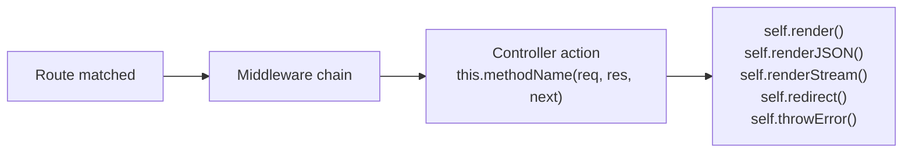
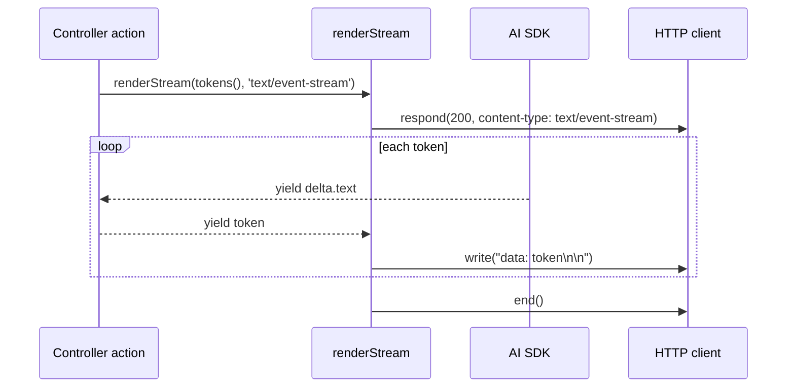
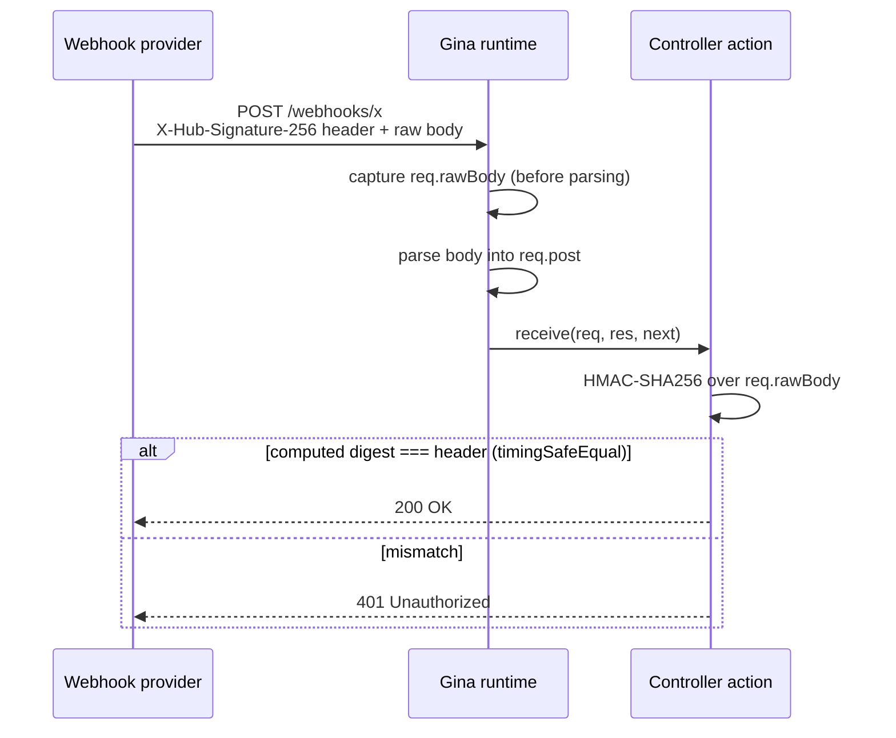
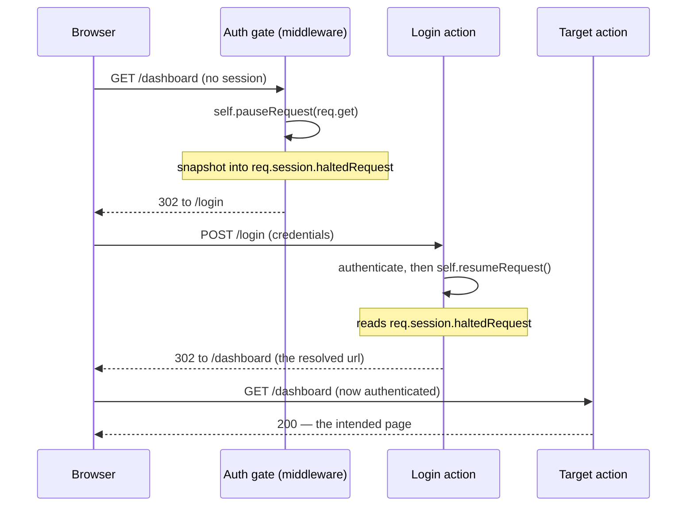

# Controllers

A controller is where request handling logic lives in a Gina bundle. It receives the matched route, reads request data, calls queries or services, and terminates the request with a render or response method. Every incoming HTTP request gets its own controller instance, so action methods can safely use local variables without worrying about concurrent request interference.

---

## How it works

After route matching and the middleware chain, the framework calls the controller method
named by `param.control` in `routing.json`.



Every action must call exactly one terminal method. If an action returns without calling
any of them, the request hangs.

---

## Controller files

The default controller for a bundle lives at `src/<bundle>/controllers/controller.js`.

```js
// src/frontend/controllers/controller.js

var FrontendController = function() {
  var self = this;

  this.home = function(req, res, next) {
    self.render({ title: 'Home' });
  };

  this.status = function(req, res, next) {
    self.renderJSON({ status: 200, ok: true });
  };
};

module.exports = FrontendController;
```

The route that calls `this.home` looks like this in `routing.json`:

```json
{
  "home": {
    "url": "/",
    "param": { "control": "home" }
  }
}
```

---

## Per-request instances — no shared state on `this`

Each incoming request gets a **fresh controller instance** created via the framework's `inherits()` mechanism. Even so, you should not store per-request data on `this` in the constructor — keep state local to the action function for clarity and safety:

```js
// WRONG — constructor-level state is unclear and error-prone
var FrontendController = function() {
  this.currentUser = null;

  this.profile = function(req, res, next) {
    this.currentUser = req.session.user;  // works, but obscures intent — use a local variable instead
    self.render({ user: this.currentUser });
  };
};
```

```js
// CORRECT — keep data local to the action function
var FrontendController = function() {
  var self = this;

  this.profile = function(req, res, next) {
    var user = req.session.user;  // local to this invocation only
    self.render({ user: user });
  };
};
```

`req`, `res`, and `next` are re-injected on every request. Any state you need for the
duration of a request should live in local variables inside the action function.

`var self = this;` at the top of the constructor is the standard pattern — `this`
loses binding inside callbacks and async functions, so `self` is used throughout.

---

## Response methods

Every action must terminate with exactly one of these.

### `self.render(data)`

Renders an HTML template using [Swig](/templating/swig). The template is resolved from the route's `param.file`
value (defaults to the rule name). Data is merged with environment and routing metadata before
being passed to the template.

```js
this.home = function(req, res, next) {
  self.render({
      title   : 'Home'
    , message : 'Hello, World!'
  });
};
```

Template variables are accessed with `{{ title }}`, `{{ message }}`, etc. See
[Views and templates](./views) for the full template guide.

:::note Error interception
If `data.status` is non-2xx **and** `data.error` is defined, `render()` does not execute the
template — it intercepts the call and routes to `throwError()` instead, showing the configured
error page. This means you can pass an upstream error object directly to `render()` and the
framework will display the error page automatically:

```js
self.query(opt, function(err, data) {
  if (err) {
    // err has { status, error, message } — render() intercepts and shows the error page
    return self.render(err);
  }
  self.render(data);
});
```

The actual error reason is logged at the point of interception. If you need to handle the
error in the action instead (degraded mode, fallback data), pass a 2xx-compatible data object
to `render()`, or call `self.throwError(err)` explicitly.
:::

### `self.renderJSON(data)`

Sends a JSON response. The object is serialised automatically.

```js
this.apiStatus = function(req, res, next) {
  self.renderJSON({ status: 200, ok: true });
};
```

If `data` has a `status` or `errno` field with a non-200 value, the HTTP response code
is set accordingly:

```js
self.renderJSON({ status: 404, error: 'Not found' });  // HTTP 404
```

### `self.renderTEXT(content)`

Sends a plain-text response.

```js
this.healthcheck = function(req, res, next) {
  self.renderTEXT('OK');
};
```

### `self.renderStream(asyncIterable, contentType)`

Streams an `AsyncIterable` as a chunked HTTP response without buffering. Required for
LLM token streaming, SSE endpoints, and any response where the full body is not known
upfront.

| Argument | Type | Default | Description |
|---|---|---|---|
| `asyncIterable` | `AsyncIterable` | required | Yields `string` or `Buffer` chunks |
| `contentType` | `string` | `text/event-stream` | Response `Content-Type` |

**Content-type determines framing:**
- `text/event-stream` — each yielded chunk is wrapped as `data: {chunk}\n\n` (SSE)
- any other type — raw chunks are written in sequence

The `asyncIterable` should yield plain strings or Buffers. Object values are coerced
via `String()`. The caller controls what each chunk contains — typically a token or
a line of text.



**SSE — LLM token streaming (Anthropic):**

```js
this.chat = async function(req, res, next) {
    var self = this;
    var ai   = getModel('claude');

    async function* tokens() {
        var stream = ai.client.messages.stream({
            model      : ai.model
          , max_tokens : 1024
          , messages   : [{ role: 'user', content: req.post.message }]
        });
        for await (var event of stream) {
            if (event.type === 'content_block_delta' && event.delta.type === 'text_delta') {
                yield event.delta.text;
            }
        }
    }

    self.renderStream(tokens());
};
```

**SSE — LLM token streaming (OpenAI-compatible, e.g. DeepSeek, Ollama):**

```js
this.chat = async function(req, res, next) {
    var self = this;
    var ai   = getModel('deepseek');

    async function* tokens() {
        var stream = await ai.client.chat.completions.create({
            model    : ai.model
          , messages : [{ role: 'user', content: req.post.message }]
          , stream   : true
        });
        for await (var chunk of stream) {
            var text = chunk.choices[0].delta.content;
            if (text) yield text;
        }
    }

    self.renderStream(tokens());
};
```

**Chunked JSON (NDJSON):**

```js
this.export = async function(req, res, next) {
    var self = this;

    async function* rows() {
        var cursor = await db.myEntity.streamAll();
        for await (var row of cursor) {
            yield JSON.stringify(row) + '\n';
        }
    }

    self.renderStream(rows(), 'application/x-ndjson');
};
```

**Notes:**
- `renderStream` is fire-and-forget. Do not `await` it — the stream runs in the
  background while the async IIFE manages the connection lifetime.
- Upstream response headers set before `renderStream` is called (CORS, cookies, etc.)
  are automatically preserved in the initial headers frame.
- HTTP/2: uses `stream.respond()` + `stream.write()` + `stream.end()`.
- HTTP/1.1: uses automatic chunked transfer-encoding via `response.write()`.
- `x-accel-buffering: no` is set automatically for `text/event-stream` responses to
  disable nginx proxy buffering.

### `self.renderWithoutLayout(data)`

Same as `self.render()` but skips the layout wrapper. Useful for rendering partial HTML
fragments (AJAX responses, popins).

```js
this.partialNav = function(req, res, next) {
  self.renderWithoutLayout({ items: navItems });
};
```

### `self.redirect(url, ignoreWebRoot)`

Redirects the client. Accepts a path, a full URL, a route name, or a cross-bundle route:

```js
self.redirect('/dashboard');             // relative path — webroot is prepended automatically
self.redirect('https://example.com');    // external URL
self.redirect('home');                   // route name in the current bundle
self.redirect('settings@account');       // route in another bundle
self.redirect('/admin', true);           // ignoreWebRoot — skips webroot prefix
```

Default status code is `301`.

:::note Redirects and browser caching
In the `dev` environment, and on any request the framework classifies as reverse-proxied, redirects are emitted with `Cache-Control: no-cache, no-store, must-revalidate` (plus `Pragma` and `Expires`) so browsers never cache them — this covers both full-page (`30x`) redirects and redirects returned to an AJAX or popin request (the `isXhrRedirect` JSON payload). A proxied redirect's target host is derived from the proxy context, and a browser-cached `301` would pin that value permanently — a stale copy would keep replaying from the client cache even after the server-side target changes. On direct (non-proxied) production requests, redirects are emitted without cache directives, so a `301` keeps its usual cacheable semantics.

Because `self.redirect()` defaults to a cacheable `301`, a client that received a redirect **before** you deployed a change can keep replaying the old one from cache — so verify redirect changes from a fresh profile or a private window, and expect "still broken" reports from clients that cached the previous response.
:::

### `self.throwError(res, code, err)`

Sends an error response. For XHR/API requests the response is JSON. For HTML requests,
the framework renders a custom error page if one is configured.

```js
// Explicit form
self.throwError(res, 404, new Error('Invoice not found'));

// Shorthand — uses the current response object automatically
self.throwError(404, 'Not found');

// Error object with a status property
self.throwError(new Error('Forbidden'));  // reads err.status for the HTTP code
```

---

## Reading request data

### URL parameters

URL parameters captured in `routing.json` are available on `req.params.<key>` (and on the method-specific object, e.g. `req.get.<key>` for GET):

```json
"invoice": {
  "url": "/invoice/:id",
  "param": { "control": "get", "id": ":id" }
}
```

```js
this.get = function(req, res, next) {
  var id = req.params.id;  // actual URL value, e.g. "abc-123"
};
```

:::note `req.params` vs `req.routing.param`
`req.params.<key>` — the actual URL segment value captured at request time.

`req.routing.param` — the raw routing configuration object (contains placeholder declarations like `":id"` and static values like `"code": 302`). Use it only to read static routing metadata you declared in `routing.json`, not URL parameter values.
:::

### Request objects by HTTP method

Each HTTP method gets its own object on `req`. The framework populates only the
object that matches the incoming method; the others are set to `undefined`.

| Property | Set for | Contains |
|---|---|---|
| `req.get` | `GET` | Query-string parameters (`?key=value`) |
| `req.post` | `POST` | Parsed request body (JSON or form-encoded) |
| `req.put` | `PUT` | Parsed request body, merged with URI params |
| `req.patch` | `PATCH` | Parsed request body — fields to apply as a partial update |
| `req.delete` | `DELETE` | Query-string parameters |
| `req.head` | `HEAD` | Query-string parameters — body is suppressed in the response |
| `req.body` | `POST`, `PUT`, `PATCH` | Alias — same reference as `req.post`, `req.put`, or `req.patch` |
| `req.rawBody` | non-multipart POST/PUT/PATCH | The exact **unparsed** body string, captured before parsing — `''` for an empty body; not set for `multipart/form-data` uploads (use `req.files`). Use it to verify webhook signatures (see below). |

**`req.body`** is the method-agnostic shortcut. Use it when the action doesn't
need to distinguish between POST, PUT, and PATCH:

```js
// Works for POST, PUT, and PATCH — req.body points to the right object automatically
this.save = async function(req, res, next) {
    var title = req.body.title;
    // ...
};
```

Use the method-specific name when the action is intentionally method-aware:

```js
// Explicit POST — create a new resource
this.create = function(req, res, next) {
    var name = req.post.name;
};

// Explicit PUT — replace the full resource
this.replace = function(req, res, next) {
    var data = req.put;
};

// Explicit PATCH — partial update (only the fields sent are changed)
this.update = function(req, res, next) {
    var data = req.patch;
};
```

### Raw request body — req.rawBody {#raw-request-body}

`req.rawBody` is the exact, **unparsed** request body — the raw bytes as received,
captured *before* the framework parses them into `req.post` / `req.put` / `req.patch`.
You need it to verify an **inbound webhook signature**: providers (Stripe, GitHub, …)
sign a digest of the literal request bytes, so an HMAC recomputed over a parsed and
re-serialized object would differ (whitespace, key order) and never match — only
`req.rawBody` reproduces the bytes that were signed.

- Populated for non-multipart request bodies (POST/PUT/PATCH). It is the empty
  string `''` for an empty body.
- `multipart/form-data` uploads stream to `req.files` and do **not** set
  `req.rawBody`.
- It is a reference to the already-buffered body — always available, no opt-in,
  no extra copy.



Mark the route `csrfExempt: true` — a webhook can't present a CSRF token (see
[CSRF · Per-route opt-out](/guides/csrf#per-route-opt-out)) — then verify the
signature over `req.rawBody` in the action:

```js title="src/api/controllers/controller.webhook.js"
var crypto = require('crypto');

var WebhookController = function() {
    var self = this;

    // POST /webhooks/x  — the route is marked csrfExempt: true in routing.json
    this.receive = function(req, res, next) {
        var secret    = getEnvVar('WEBHOOK_SECRET');
        var signature = req.headers['x-hub-signature-256'] || '';

        // Recompute the HMAC over the EXACT bytes received. Signing a parsed and
        // re-serialized object would differ (whitespace, key order) and never match.
        var expected = 'sha256=' + crypto
            .createHmac('sha256', secret)
            .update(req.rawBody || '')
            .digest('hex');

        // Constant-time compare. timingSafeEqual throws on a length mismatch,
        // so guard the lengths first.
        var a = Buffer.from(signature);
        var b = Buffer.from(expected);
        if (a.length !== b.length || !crypto.timingSafeEqual(a, b)) {
            return self.throwError(res, 401, 'invalid webhook signature');
        }

        // Verified — req.post holds the parsed JSON payload as usual.
        self.renderJSON({ status: 200, received: req.post.type });
    };
};

module.exports = WebhookController;
```

### PUT vs PATCH — when to use which

**PUT** replaces the entire resource. The client sends a complete representation
and the server stores it verbatim — fields that are absent in the body are treated
as removed or reset to defaults.

**PATCH** applies a partial update. Only the fields present in the request body are
changed; everything else is left as-is on the server.

Most ORMs and HTTP clients treat the two differently. Sending a PATCH when you
intend a full replacement silently loses fields. Sending PUT when you only want to
change one field forces the client to first fetch the full object, modify it, then
send it back.

```js
// PUT /users/42  — full replacement
// Body: { name: "Alice", email: "alice@example.com", role: "admin" }
// All three fields are written; missing fields are removed.
this.replace = async function(req, res, next) {
    var ok = await db.userEntity.replaceById(req.params.id, req.put);
    self.renderJSON({ ok: ok });
};

// PATCH /users/42  — partial update
// Body: { email: "new@example.com" }
// Only email is updated; name and role are untouched.
this.update = async function(req, res, next) {
    var ok = await db.userEntity.patchById(req.params.id, req.patch);
    self.renderJSON({ ok: ok });
};
```

### HEAD — resource metadata without the body

HEAD works exactly like GET but the response body is suppressed. The framework
runs the full controller action (database queries, header logic), then drops the
body before writing to the wire. This makes HEAD useful for:

- Checking whether a resource exists (status code)
- Reading `content-type`, `content-length`, or `etag` before downloading
- Cache validation by CDNs and reverse proxies
- Health checks that confirm an endpoint is reachable

Routes declared as `GET` automatically accept `HEAD` requests — no extra routing
rule is needed.

```js
// routing.json — one rule covers both GET and HEAD
{
  "document-get": {
    "method": "GET",
    "url": "/documents/:id",
    "param": { "control": "get" }
  }
}
```

```js
// controller
this.get = async function(req, res, next) {
    var doc = await db.documentEntity.getById(req.params.id);
    if (!doc) return self.throwError(404, 'Not found');
    // For HEAD: headers are sent, body is suppressed automatically
    self.renderJSON(doc);
};
```

```bash
# Check existence and content-type without downloading the document
curl -I https://api.example.com/documents/42
# HTTP/1.1 200 OK
# content-type: application/json; charset=utf-8
# content-length: 847
```

Query-string parameters and URI params are merged in automatically for all methods:

```js
// GET /search?q=gina&page=2
var query = req.get.q;    // "gina"
var page  = req.get.page; // 2  — auto-cast from "2"

// POST { username: "alice", password: "..." }
var username = req.post.username;
```

Use `count()` to check whether any data was submitted:

```js
if (req.post.count() > 0) {
  // Form was submitted
}
```

String values `"null"`, `"true"`, and `"false"` are automatically cast to their
JavaScript equivalents.

:::note OPTIONS
`OPTIONS` is reserved for CORS preflight and is handled internally — it never
reaches a controller action.
:::

### Session and authentication state

Auth state is stored on `req.session.user`, not `req.user`:

```js
this.dashboard = function(req, res, next) {
  var user = req.session.user;

  if (!user) {
    return self.redirect('/login', true);
  }

  self.render({ user: user });
};
```

---

## Pausing and resuming requests {#pausing-resuming-requests}

When an unauthenticated visitor hits a protected route, redirecting them straight to
`/login` loses *where they were trying to go*. The controller trio `pauseRequest()` /
`resumeRequest()` / `isHaltedRequest()` implements the "deep-link before login" pattern:
**snapshot** the intended request, redirect to login, then **replay** the original request
once the visitor has authenticated. The snapshot — url, method, data and url params — is
stored on `req.session` under `haltedRequest`, so it survives the redirect round-trip.



### The methods

| Method | What it does |
|---|---|
| `self.pauseRequest(data[, requestStorage])` | Snapshots the current request (`{ url, routing, method, data, params }`) into `requestStorage.haltedRequest`. `requestStorage` defaults to `req.session`. Returns the storage object. |
| `self.isHaltedRequest([session])` | `true` when the session (or the passed object) holds a `haltedRequest`. Defaults to `req.session` / `req.session.user`. |
| `self.resumeRequest([requestStorage])` | Replays the snapshot — restores the original url / method / data / params onto the live request and re-dispatches it, then clears the snapshot. |

### Pausing before the login redirect

Call `pauseRequest()` in your auth gate, right before bouncing the visitor to login:

```js
// src/frontend/middlewares/auth/index.js
this.require = function(req, res, next, done) {
  if (!req.session || !req.session.user) {
    self.pauseRequest(req.get);            // snapshot into req.session.haltedRequest
    return self.redirect('/login', true);
  }

  done(req, res, next);
};
```

### Resuming after authentication

After a successful login, replay whatever the visitor was reaching for:

```js
this.login = function(req, res, next) {
  // ... validate credentials, set req.session.user ...

  if (self.isHaltedRequest()) {
    return self.resumeRequest();           // replays req.session.haltedRequest
  }

  self.redirect('/dashboard', true);       // no paused request — go to a default
};
```

### How the replay works

`resumeRequest()` dispatches differently depending on the paused request's method:

- **GET** — replayed by redirecting to the resolved url; the browser re-issues the
  now-authenticated GET. For an XHR / popin request it returns a JSON redirect instead.
- **non-GET** (POST / PUT / …) — re-dispatched **in-process**: the original method, data
  and params are restored onto the live request and the target controller action is invoked
  directly, crossing namespaces via `requireController()` when the paused route lived in a
  different namespace.

Either way, the `haltedRequest` snapshot is cleared from storage once it has been consumed.

:::tip Custom storage
Pass a second argument to `pauseRequest(data, requestStorage)` (and to
`resumeRequest(requestStorage)`) to snapshot into your own persistent object instead of
`req.session` — for example a store keyed by a one-time token when you don't want to rely on
the session cookie.
:::

See also: the [Middleware guide](./middleware) (auth gates) and [Sessions](./sessions),
where the `haltedRequest` snapshot lives.

---

## Configuration

`self.getConfig()` returns a deep clone of the bundle configuration. Pass a key to
read a specific config file:

```js
var settings = self.getConfig('settings');  // settings.json
var app      = self.getConfig('app');       // app.json
var conf     = self.getConfig();            // full conf object
```

---

## Outgoing requests

`self.query()` makes an outbound HTTP or HTTPS request. Use it to call a backend API
or microservice from a controller action.

```js
this.invoice = function(req, res, next) {
  var id = req.params.id;

  self.query(
    { hostname: 'api-internal', path: '/invoices/' + id },
    function(err, data) {
      if (err) return self.render(err);   // render() intercepts and shows the error page
      self.renderJSON(data);
    }
  );
};
```

Key options:

| Option | Default | Description |
|---|---|---|
| `hostname` | — | Target host (resolved via `app.json` proxy config) |
| `path` | — | Request path |
| `method` | `"GET"` | HTTP method |
| `port` | `80` | Target port |
| `requestTimeout` | route `queryTimeout` or `"10s"` | Accepts `"30s"`, `"500ms"`, `"2m"`, or ms integer |

When the callback is omitted, `self.query()` returns a Promise.

**Error shape**

When the upstream returns a non-2xx status, the callback receives a plain object —
not an `Error` instance:

```js
{
    status  : 502           // HTTP status code from the upstream response
  , error   : "Bad Gateway" // human-readable label for the status
  , message : "..."         // upstream response body or reason phrase
}
```

When the connection itself fails (TCP error, timeout), the callback receives a
native `Error` with a `.stack` property.

**Handling errors**

```js
self.query(opt, function(err, data) {
  if (err) {
    // Option A — show the framework error page automatically
    return self.render(err);

    // Option B — custom degraded response
    // return self.renderJSON({ status: 200, items: [], degraded: true });

    // Option C — explicit error page with a specific code
    // return self.throwError(err.status || 500, err.message);
  }
  self.render(data);
});
```

---

## Async actions

Actions can be declared `async`. The router automatically attaches `.catch()` to
any thenable returned by an action — unhandled rejections become `500` responses
rather than crashing the process. You can still add an explicit `try/catch` when
you want to map specific errors to different status codes.

```js
// Minimal async action — router handles unhandled rejections automatically
var Controller = function() {
    var self = this;

    this.report = async function(req, res, next) {
        var data = await self.query({
            hostname : 'api-internal'
          , path     : '/report/' + req.params.id
        });
        self.renderJSON(data);
    };
};
module.exports = Controller;
```

```js
// Explicit try/catch when you want fine-grained status codes
var Controller = function() {
    var self = this;

    this.report = async function(req, res, next) {
        try {
            var data = await self.query({
                hostname : 'api-internal'
              , path     : '/report/' + req.params.id
            });
            self.renderJSON(data);
        } catch (err) {
            self.throwError(res, err.statusCode || 500, err);
        }
    };
};
module.exports = Controller;
```

### Long-running work — start an async job instead of awaiting

`await` holds the request open until the work finishes. For work too slow to block a request — an LLM `.infer()` taking 1–30s, a heavy report — start an **async job** instead: `self.startJob(fn)` returns a job id immediately and runs `fn` out-of-band on a concurrency-limited worker. Poll the built-in `GET /_gina/jobs/:id` for state, or opt into a completion webhook. See the [Async jobs guide](./async-jobs).

```js
this.summarise = function(req, res, next) {
    var jobId = self.inferAsync(
        [{ role: 'user', content: req.post.text }],
        { connector: 'myModel' }
    );
    self.renderJSON({ jobId: jobId }); // returns immediately
};
```

### `await` with entity methods

Entity methods return a native Promise — use `await` directly:

```js
var db = getModel('blog'); // your database, schema, or bucket name

var Controller = function() {
    var self = this;

    this.profile = async function(req, res, next) {
        var user = await db.userEntity.getById(req.session.user.id);
        self.renderJSON(user);
    };
};
module.exports = Controller;
```

### `await` with PathObject and Shell — `onCompleteCall()`

PathObject file operations (`mkdir`, `cp`, `mv`, `rm`) and `Shell` commands fire
an `.onComplete(cb)` event instead of returning a Promise. Wrap them with the
global [`onCompleteCall(emitter)`](../globals/async.md#oncompletecallemitter) adapter:

```js
var Controller = function() {
    var self = this;

    this.upload = async function(req, res, next) {
        // mkdir returns an EventEmitter; onCompleteCall wraps it in a Promise
        await onCompleteCall( _(self.uploadDir).mkdir() );
        self.renderJSON({ ok: true });
    };
};
module.exports = Controller;
```

---

## Namespace controllers

A route with a `namespace` field is handled by a separate controller file:

```json
"account-settings": {
  "namespace": "account",
  "url":        "/account/settings",
  "param":      { "control": "settings" }
}
```

The framework loads `controllers/controller.account.js` and calls `this.settings()`.

```js
// src/frontend/controllers/controller.account.js

var AccountController = function() {
  var self = this;

  this.settings = function(req, res, next) {
    self.render({ title: 'Account settings' });
  };
};

module.exports = AccountController;
```

The inheritance chain is:

```
AccountController → FrontendController (controller.js) → SuperController
```

All `self.*` methods (`render`, `renderJSON`, `throwError`, etc.) are available in
namespace controllers through this chain. Dot notation nests deeper:
`"namespace": "account.billing"` resolves to `controller.account.billing.js`.

---

## Detecting request type

Two helpers are useful when one action handles both HTML and XHR requests:

```js
this.login = function(req, res, next) {
  if (req.post.count() > 0) {
    var ok = authenticate(req.post.username, req.post.password);

    if (self.isXMLRequest()) {
      return self.renderJSON({ status: ok ? 200 : 401 });
    }

    return ok ? self.redirect('/dashboard') : self.redirect('/login');
  }

  self.render({ title: 'Log in' });
};
```

| Method | Returns `true` when |
|---|---|
| `self.isXMLRequest()` | Request has `X-Requested-With: XMLHttpRequest` |
| `self.isWithCredentials()` | Request was made with credentials |

---

## 103 Early Hints

The framework sends `103 Early Hints` in two ways: **automatically** for the
bundle's known CSS/JS resources, and **manually** via `self.setEarlyHints(links)`
for anything else.

### Automatic (zero config)

When `render()` is called over HTTP/2 in production mode, the framework sends a
103 automatically with the CSS and JS preload links it already collected for
the page — before `getAssets()` runs and before Swig compiles the template. The
browser can start loading stylesheet and script files during the entire render
latency window with no developer action required.

The same `Link` headers are also included on the final `200` response for proxies
and CDNs that may have missed the informational response.

### Manual: `self.setEarlyHints(links)`

Call this at the start of an action for resources the framework cannot know about
— API-driven images, fonts selected at runtime, above-the-fold hero images, etc.
The 103 is sent immediately when called.

| Transport | Mechanism |
|---|---|
| HTTP/2 | `stream.additionalHeaders({ ':status': 103, 'link': '...' })` |
| HTTP/1.1 | `res.writeEarlyHints({ link: '...' })` |

`links` is a `Link` header value string or an array of strings. Multiple values
are joined with `', '` into one header.

```js
this.home = function(req, res, next) {
    // Hint resources the framework doesn't know about
    self.setEarlyHints([
        '</fonts/Inter.woff2>; rel=preload; as=font; crossorigin',
        '</img/hero.webp>; rel=preload; as=image'
    ]);

    // ... fetch data ...
    self.render({ title: 'Home' });
    // ↑ also auto-sends 103 for bundle CSS/JS before Swig compiles
};
```

`setEarlyHints` returns `self` for optional chaining:

```js
self
    .setEarlyHints('</css/critical.css>; rel=preload; as=style')
    .setEarlyHints('</fonts/Inter.woff2>; rel=preload; as=font; crossorigin');
```

**Behaviour:**
- Silent no-op when headers have already been sent (guards against double-call).
- Errors from the underlying write are caught and discarded — a hint failure never
  affects the main response.

:::note HTTP/2 only delivers measurable gains
Browsers only act on 103 responses over HTTPS/HTTP/2 connections. On plain HTTP/1.1
the informational response is still sent but many browsers ignore it. The automatic
103 from CSS/JS hints only fires in HTTP/2 non-dev mode (dev mode uses per-request
cache eviction, not the preload list).
:::

---

## Dev mode hot-reload

In dev mode (`NODE_ENV_IS_DEV=true`) the framework automatically starts `WatcherService`
and registers watchers for:

| Watched path | Dirty flag | Effect |
|---|---|---|
| `${core}/controller/controller.js` | `core` | Re-requires `SuperController` on next request |
| `${core}/controller/controller.render-swig.js` | `core` | Re-requires render delegate on next request |
| `${bundle}/controllers/` (directory) | `action` | Re-requires the matched controller file on next request |

`require.cache` is evicted **only when a watched file has actually changed** — not on every
request. This eliminates the per-request eviction overhead while keeping the instant-feedback
DX. If the watcher context is unavailable (production or non-dev env), the router falls
back to per-request eviction transparently.

> **Do not rely on module-level variables** in controller files or `controller.js` — they are
> evicted and re-required on each change, resetting any state they hold.

---

## See also

- [Routing guide](./routing) — Declaring routes and mapping them to controller actions
- [Views and templates](./views) — Template rendering and the Swig template engine
- [Swig reference](/templating/swig) — Swig syntax, tags, filters, and API
- [Middleware guide](./middleware) — Code that runs between route matching and the controller
- [Async jobs](./async-jobs) — Run slow work (LLM calls, heavy reports) out-of-band with `self.startJob` / `self.inferAsync`
