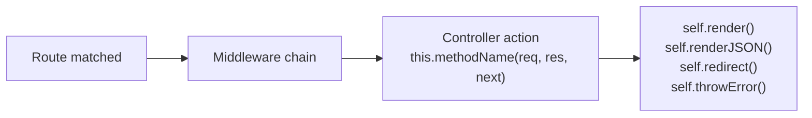

# Controllers

A controller is where request handling logic lives. It receives the matched route, reads
request data, calls queries or services, and terminates the request with a render or
response method.

---

## How it works

After route matching and the middleware chain, the framework calls the controller method
named by `param.control` in `routing.json`.



Every action must call exactly one terminal method. If an action returns without calling
any of them, the request hangs.

---

## Controller files

The default controller for a bundle lives at `src/<bundle>/controllers/controller.js`.

```js
// src/frontend/controllers/controller.js

var FrontendController = function() {
  var self = this;

  this.home = function(req, res, next) {
    self.render({ title: 'Home' });
  };

  this.status = function(req, res, next) {
    self.renderJSON({ status: 200, ok: true });
  };
};

module.exports = FrontendController;
```

The route that calls `this.home` looks like this in `routing.json`:

```json
{
  "home": {
    "url": "/",
    "param": { "control": "home" }
  }
}
```

---

## The singleton — no per-request state on `this`

The controller is a **singleton**. Every incoming request uses the same instance. Do not
store per-request data on `this` in the constructor:

```js
// WRONG — data is shared across all concurrent requests
var FrontendController = function() {
  this.currentUser = null;

  this.profile = function(req, res, next) {
    this.currentUser = req.session.user;  // overwritten by the next request mid-flight
    self.render({ user: this.currentUser });
  };
};
```

```js
// CORRECT — keep data local to the action function
var FrontendController = function() {
  var self = this;

  this.profile = function(req, res, next) {
    var user = req.session.user;  // local to this invocation only
    self.render({ user: user });
  };
};
```

`req`, `res`, and `next` are re-injected on every request. Any state you need for the
duration of a request should live in local variables inside the action function.

`var self = this;` at the top of the constructor is the standard pattern — `this`
loses binding inside callbacks and async functions, so `self` is used throughout.

---

## Response methods

Every action must terminate with exactly one of these.

### `self.render(data)`

Renders an HTML template using Swig. The template is resolved from the route's `param.file`
value (defaults to the rule name). Data is merged with environment and routing metadata before
being passed to the template.

```js
this.home = function(req, res, next) {
  self.render({
    title:   'Home',
    message: 'Hello, World!'
  });
};
```

Template variables are accessed with `{{ title }}`, `{{ message }}`, etc. See
[Views and templates](./views) for the full template guide.

### `self.renderJSON(data)`

Sends a JSON response. The object is serialised automatically.

```js
this.apiStatus = function(req, res, next) {
  self.renderJSON({ status: 200, ok: true });
};
```

If `data` has a `status` or `errno` field with a non-200 value, the HTTP response code
is set accordingly:

```js
self.renderJSON({ status: 404, error: 'Not found' });  // HTTP 404
```

### `self.renderTEXT(content)`

Sends a plain-text response.

```js
this.healthcheck = function(req, res, next) {
  self.renderTEXT('OK');
};
```

### `self.renderWithoutLayout(data)`

Same as `self.render()` but skips the layout wrapper. Useful for rendering partial HTML
fragments (AJAX responses, popins).

```js
this.partialNav = function(req, res, next) {
  self.renderWithoutLayout({ items: navItems });
};
```

### `self.redirect(url, ignoreWebRoot)`

Redirects the client. Accepts a path, a full URL, a route name, or a cross-bundle route:

```js
self.redirect('/dashboard');             // relative path — webroot is prepended automatically
self.redirect('https://example.com');    // external URL
self.redirect('home');                   // route name in the current bundle
self.redirect('settings@account');       // route in another bundle
self.redirect('/admin', true);           // ignoreWebRoot — skips webroot prefix
```

Default status code is `301`.

### `self.throwError(res, code, err)`

Sends an error response. For XHR/API requests the response is JSON. For HTML requests,
the framework renders a custom error page if one is configured.

```js
// Explicit form
self.throwError(res, 404, new Error('Invoice not found'));

// Shorthand — uses the current response object automatically
self.throwError(404, 'Not found');

// Error object with a status property
self.throwError(new Error('Forbidden'));  // reads err.status for the HTTP code
```

---

## Reading request data

### URL parameters

Route parameters declared in `routing.json` are resolved on `req.routing.param`:

```json
"invoice": {
  "url": "/invoice/:id",
  "param": { "control": "get", "id": ":id" }
}
```

```js
this.get = function(req, res, next) {
  var id = req.routing.param.id;
};
```

### POST / PUT body and query strings

Parsed request data lives on the method-named object (`req.get`, `req.post`, `req.put`,
`req.delete`). URL parameters and query strings are merged in automatically.

```js
// GET /search?q=gina&page=2
var query = req.get.q;    // "gina"
var page  = req.get.page; // 2  — auto-cast from "2"

// POST { username: "alice", password: "..." }
var username = req.post.username;
```

Use `count()` to check whether any data was submitted:

```js
if (req.post.count() > 0) {
  // Form was submitted
}
```

String values `"null"`, `"true"`, and `"false"` are automatically cast to their
JavaScript equivalents.

### Session and authentication state

Auth state is stored on `req.session.user`, not `req.user`:

```js
this.dashboard = function(req, res, next) {
  var user = req.session.user;

  if (!user) {
    return self.redirect('/login', true);
  }

  self.render({ user: user });
};
```

---

## Configuration

`self.getConfig()` returns a deep clone of the bundle configuration. Pass a key to
read a specific config file:

```js
var settings = self.getConfig('settings');  // settings.json
var app      = self.getConfig('app');       // app.json
var conf     = self.getConfig();            // full conf object
```

---

## Outgoing requests

`self.query()` makes an outbound HTTP or HTTPS request. Use it to call a backend API
or microservice from a controller action.

```js
this.invoice = function(req, res, next) {
  var id = req.routing.param.id;

  self.query(
    { hostname: 'api-internal', path: '/invoices/' + id },
    function(err, data) {
      if (err) return self.throwError(res, 502, err);
      self.renderJSON(data);
    }
  );
};
```

Key options:

| Option | Default | Description |
|---|---|---|
| `hostname` | — | Target host (resolved via `app.json` proxy config) |
| `path` | — | Request path |
| `method` | `"GET"` | HTTP method |
| `port` | `80` | Target port |
| `requestTimeout` | route `queryTimeout` or `"10s"` | Accepts `"30s"`, `"500ms"`, `"2m"`, or ms integer |

When the callback is omitted, `self.query()` returns a Promise.

---

## Async actions

Actions can be declared `async`. Wrap them in `try/catch` and call `self.throwError`
explicitly — do not let rejections propagate silently:

```js
this.report = async function(req, res, next) {
  try {
    var data = await self.query({ hostname: 'api-internal', path: '/report/' + req.routing.param.id });
    self.renderJSON(data);
  } catch (err) {
    self.throwError(res, 500, err);
  }
};
```

---

## Namespace controllers

A route with a `namespace` field is handled by a separate controller file:

```json
"account-settings": {
  "namespace": "account",
  "url":        "/account/settings",
  "param":      { "control": "settings" }
}
```

The framework loads `controllers/controller.account.js` and calls `this.settings()`.

```js
// src/frontend/controllers/controller.account.js

var AccountController = function() {
  var self = this;

  this.settings = function(req, res, next) {
    self.render({ title: 'Account settings' });
  };
};

module.exports = AccountController;
```

The inheritance chain is:

```
AccountController → FrontendController (controller.js) → SuperController
```

All `self.*` methods (`render`, `renderJSON`, `throwError`, etc.) are available in
namespace controllers through this chain. Dot notation nests deeper:
`"namespace": "account.billing"` resolves to `controller.account.billing.js`.

---

## Detecting request type

Two helpers are useful when one action handles both HTML and XHR requests:

```js
this.login = function(req, res, next) {
  if (req.post.count() > 0) {
    var ok = authenticate(req.post.username, req.post.password);

    if (self.isXMLRequest()) {
      return self.renderJSON({ status: ok ? 200 : 401 });
    }

    return ok ? self.redirect('/dashboard') : self.redirect('/login');
  }

  self.render({ title: 'Log in' });
};
```

| Method | Returns `true` when |
|---|---|
| `self.isXMLRequest()` | Request has `X-Requested-With: XMLHttpRequest` |
| `self.isWithCredentials()` | Request was made with credentials |

---

## See also

- [Routing guide](./routing) — Declaring routes and mapping them to controller actions
- [Views and templates](./views) — Template rendering and the Swig template engine
- [Middleware guide](./middleware) — Code that runs between route matching and the controller
