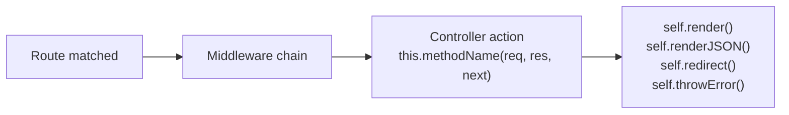

# Controllers

A controller is where request handling logic lives in a Gina bundle. It receives the matched route, reads request data, calls queries or services, and terminates the request with a render or response method. Every incoming HTTP request gets its own controller instance, so action methods can safely use local variables without worrying about concurrent request interference.

---

## How it works

After route matching and the middleware chain, the framework calls the controller method
named by `param.control` in `routing.json`.



Every action must call exactly one terminal method. If an action returns without calling
any of them, the request hangs.

---

## Controller files

The default controller for a bundle lives at `src/<bundle>/controllers/controller.js`.

```js
// src/frontend/controllers/controller.js

var FrontendController = function() {
  var self = this;

  this.home = function(req, res, next) {
    self.render({ title: 'Home' });
  };

  this.status = function(req, res, next) {
    self.renderJSON({ status: 200, ok: true });
  };
};

module.exports = FrontendController;
```

The route that calls `this.home` looks like this in `routing.json`:

```json
{
  "home": {
    "url": "/",
    "param": { "control": "home" }
  }
}
```

---

## Per-request instances — no shared state on `this`

Each incoming request gets a **fresh controller instance** created via the framework's `inherits()` mechanism. Even so, you should not store per-request data on `this` in the constructor — keep state local to the action function for clarity and safety:

```js
// WRONG — constructor-level state is unclear and error-prone
var FrontendController = function() {
  this.currentUser = null;

  this.profile = function(req, res, next) {
    this.currentUser = req.session.user;  // works, but obscures intent — use a local variable instead
    self.render({ user: this.currentUser });
  };
};
```

```js
// CORRECT — keep data local to the action function
var FrontendController = function() {
  var self = this;

  this.profile = function(req, res, next) {
    var user = req.session.user;  // local to this invocation only
    self.render({ user: user });
  };
};
```

`req`, `res`, and `next` are re-injected on every request. Any state you need for the
duration of a request should live in local variables inside the action function.

`var self = this;` at the top of the constructor is the standard pattern — `this`
loses binding inside callbacks and async functions, so `self` is used throughout.

---

## Response methods

Every action must terminate with exactly one of these.

### `self.render(data)`

Renders an HTML template using Swig. The template is resolved from the route's `param.file`
value (defaults to the rule name). Data is merged with environment and routing metadata before
being passed to the template.

```js
this.home = function(req, res, next) {
  self.render({
    title:   'Home',
    message: 'Hello, World!'
  });
};
```

Template variables are accessed with `{{ title }}`, `{{ message }}`, etc. See
[Views and templates](./views) for the full template guide.

:::note Error interception
If `data.status` is non-2xx **and** `data.error` is defined, `render()` does not execute the
template — it intercepts the call and routes to `throwError()` instead, showing the configured
error page. This means you can pass an upstream error object directly to `render()` and the
framework will display the error page automatically:

```js
self.query(opt, function(err, data) {
  if (err) {
    // err has { status, error, message } — render() intercepts and shows the error page
    return self.render(err);
  }
  self.render(data);
});
```

The actual error reason is logged at the point of interception. If you need to handle the
error in the action instead (degraded mode, fallback data), pass a 2xx-compatible data object
to `render()`, or call `self.throwError(err)` explicitly.
:::

### `self.renderJSON(data)`

Sends a JSON response. The object is serialised automatically.

```js
this.apiStatus = function(req, res, next) {
  self.renderJSON({ status: 200, ok: true });
};
```

If `data` has a `status` or `errno` field with a non-200 value, the HTTP response code
is set accordingly:

```js
self.renderJSON({ status: 404, error: 'Not found' });  // HTTP 404
```

### `self.renderTEXT(content)`

Sends a plain-text response.

```js
this.healthcheck = function(req, res, next) {
  self.renderTEXT('OK');
};
```

### `self.renderWithoutLayout(data)`

Same as `self.render()` but skips the layout wrapper. Useful for rendering partial HTML
fragments (AJAX responses, popins).

```js
this.partialNav = function(req, res, next) {
  self.renderWithoutLayout({ items: navItems });
};
```

### `self.redirect(url, ignoreWebRoot)`

Redirects the client. Accepts a path, a full URL, a route name, or a cross-bundle route:

```js
self.redirect('/dashboard');             // relative path — webroot is prepended automatically
self.redirect('https://example.com');    // external URL
self.redirect('home');                   // route name in the current bundle
self.redirect('settings@account');       // route in another bundle
self.redirect('/admin', true);           // ignoreWebRoot — skips webroot prefix
```

Default status code is `301`.

### `self.throwError(res, code, err)`

Sends an error response. For XHR/API requests the response is JSON. For HTML requests,
the framework renders a custom error page if one is configured.

```js
// Explicit form
self.throwError(res, 404, new Error('Invoice not found'));

// Shorthand — uses the current response object automatically
self.throwError(404, 'Not found');

// Error object with a status property
self.throwError(new Error('Forbidden'));  // reads err.status for the HTTP code
```

---

## Reading request data

### URL parameters

Route parameters declared in `routing.json` are resolved on `req.routing.param`:

```json
"invoice": {
  "url": "/invoice/:id",
  "param": { "control": "get", "id": ":id" }
}
```

```js
this.get = function(req, res, next) {
  var id = req.routing.param.id;
};
```

### POST / PUT body and query strings

Parsed request data lives on the method-named object (`req.get`, `req.post`, `req.put`,
`req.delete`). URL parameters and query strings are merged in automatically.

```js
// GET /search?q=gina&page=2
var query = req.get.q;    // "gina"
var page  = req.get.page; // 2  — auto-cast from "2"

// POST { username: "alice", password: "..." }
var username = req.post.username;
```

Use `count()` to check whether any data was submitted:

```js
if (req.post.count() > 0) {
  // Form was submitted
}
```

String values `"null"`, `"true"`, and `"false"` are automatically cast to their
JavaScript equivalents.

### Session and authentication state

Auth state is stored on `req.session.user`, not `req.user`:

```js
this.dashboard = function(req, res, next) {
  var user = req.session.user;

  if (!user) {
    return self.redirect('/login', true);
  }

  self.render({ user: user });
};
```

---

## Configuration

`self.getConfig()` returns a deep clone of the bundle configuration. Pass a key to
read a specific config file:

```js
var settings = self.getConfig('settings');  // settings.json
var app      = self.getConfig('app');       // app.json
var conf     = self.getConfig();            // full conf object
```

---

## Outgoing requests

`self.query()` makes an outbound HTTP or HTTPS request. Use it to call a backend API
or microservice from a controller action.

```js
this.invoice = function(req, res, next) {
  var id = req.routing.param.id;

  self.query(
    { hostname: 'api-internal', path: '/invoices/' + id },
    function(err, data) {
      if (err) return self.render(err);   // render() intercepts and shows the error page
      self.renderJSON(data);
    }
  );
};
```

Key options:

| Option | Default | Description |
|---|---|---|
| `hostname` | — | Target host (resolved via `app.json` proxy config) |
| `path` | — | Request path |
| `method` | `"GET"` | HTTP method |
| `port` | `80` | Target port |
| `requestTimeout` | route `queryTimeout` or `"10s"` | Accepts `"30s"`, `"500ms"`, `"2m"`, or ms integer |

When the callback is omitted, `self.query()` returns a Promise.

**Error shape**

When the upstream returns a non-2xx status, the callback receives a plain object —
not an `Error` instance:

```js
{
  status:  502,           // HTTP status code from the upstream response
  error:   "Bad Gateway", // human-readable label for the status
  message: "..."          // upstream response body or reason phrase
}
```

When the connection itself fails (TCP error, timeout), the callback receives a
native `Error` with a `.stack` property.

**Handling errors**

```js
self.query(opt, function(err, data) {
  if (err) {
    // Option A — show the framework error page automatically
    return self.render(err);

    // Option B — custom degraded response
    // return self.renderJSON({ status: 200, items: [], degraded: true });

    // Option C — explicit error page with a specific code
    // return self.throwError(err.status || 500, err.message);
  }
  self.render(data);
});
```

---

## Async actions

Actions can be declared `async`. The router automatically attaches `.catch()` to
any thenable returned by an action — unhandled rejections become `500` responses
rather than crashing the process. You can still add an explicit `try/catch` when
you want to map specific errors to different status codes.

```js
// Minimal async action — router handles unhandled rejections automatically
var Controller = function() {
    var self = this;

    this.report = async function(req, res, next) {
        var data = await self.query({
            hostname: 'api-internal',
            path: '/report/' + req.routing.param.id
        });
        self.renderJSON(data);
    };
};
module.exports = Controller;
```

```js
// Explicit try/catch when you want fine-grained status codes
var Controller = function() {
    var self = this;

    this.report = async function(req, res, next) {
        try {
            var data = await self.query({
                hostname: 'api-internal',
                path: '/report/' + req.routing.param.id
            });
            self.renderJSON(data);
        } catch (err) {
            self.throwError(res, err.statusCode || 500, err);
        }
    };
};
module.exports = Controller;
```

### `await` with entity methods

Entity methods return a native Promise — use `await` directly:

```js
var db = getModel('blog'); // your database, schema, or bucket name

var Controller = function() {
    var self = this;

    this.profile = async function(req, res, next) {
        var user = await db.userEntity.getById(req.session.user.id);
        self.renderJSON(user);
    };
};
module.exports = Controller;
```

### `await` with PathObject and Shell — `onCompleteCall()`

PathObject file operations (`mkdir`, `cp`, `mv`, `rm`) and `Shell` commands fire
an `.onComplete(cb)` event instead of returning a Promise. Wrap them with the
global [`onCompleteCall(emitter)`](../globals/async.md#oncompletecallemitter) adapter:

```js
var Controller = function() {
    var self = this;

    this.upload = async function(req, res, next) {
        // mkdir returns an EventEmitter; onCompleteCall wraps it in a Promise
        await onCompleteCall( _(self.uploadDir).mkdir() );
        self.renderJSON({ ok: true });
    };
};
module.exports = Controller;
```

---

## Namespace controllers

A route with a `namespace` field is handled by a separate controller file:

```json
"account-settings": {
  "namespace": "account",
  "url":        "/account/settings",
  "param":      { "control": "settings" }
}
```

The framework loads `controllers/controller.account.js` and calls `this.settings()`.

```js
// src/frontend/controllers/controller.account.js

var AccountController = function() {
  var self = this;

  this.settings = function(req, res, next) {
    self.render({ title: 'Account settings' });
  };
};

module.exports = AccountController;
```

The inheritance chain is:

```
AccountController → FrontendController (controller.js) → SuperController
```

All `self.*` methods (`render`, `renderJSON`, `throwError`, etc.) are available in
namespace controllers through this chain. Dot notation nests deeper:
`"namespace": "account.billing"` resolves to `controller.account.billing.js`.

---

## Detecting request type

Two helpers are useful when one action handles both HTML and XHR requests:

```js
this.login = function(req, res, next) {
  if (req.post.count() > 0) {
    var ok = authenticate(req.post.username, req.post.password);

    if (self.isXMLRequest()) {
      return self.renderJSON({ status: ok ? 200 : 401 });
    }

    return ok ? self.redirect('/dashboard') : self.redirect('/login');
  }

  self.render({ title: 'Log in' });
};
```

| Method | Returns `true` when |
|---|---|
| `self.isXMLRequest()` | Request has `X-Requested-With: XMLHttpRequest` |
| `self.isWithCredentials()` | Request was made with credentials |

---

## 103 Early Hints

The framework sends `103 Early Hints` in two ways: **automatically** for the
bundle's known CSS/JS resources, and **manually** via `self.setEarlyHints(links)`
for anything else.

### Automatic (zero config)

When `render()` is called over HTTP/2 in production mode, the framework sends a
103 automatically with the CSS and JS preload links it already collected for
the page — before `getAssets()` runs and before Swig compiles the template. The
browser can start loading stylesheet and script files during the entire render
latency window with no developer action required.

The same `Link` headers are also included on the final `200` response for proxies
and CDNs that may have missed the informational response.

### Manual: `self.setEarlyHints(links)`

Call this at the start of an action for resources the framework cannot know about
— API-driven images, fonts selected at runtime, above-the-fold hero images, etc.
The 103 is sent immediately when called.

| Transport | Mechanism |
|---|---|
| HTTP/2 | `stream.additionalHeaders({ ':status': 103, 'link': '...' })` |
| HTTP/1.1 | `res.writeEarlyHints({ link: '...' })` (Node.js 18.11+) |

`links` is a `Link` header value string or an array of strings. Multiple values
are joined with `', '` into one header.

```js
this.home = function(req, res, next) {
    // Hint resources the framework doesn't know about
    self.setEarlyHints([
        '</fonts/Inter.woff2>; rel=preload; as=font; crossorigin',
        '</img/hero.webp>; rel=preload; as=image'
    ]);

    // ... fetch data ...
    self.render({ title: 'Home' });
    // ↑ also auto-sends 103 for bundle CSS/JS before Swig compiles
};
```

`setEarlyHints` returns `self` for optional chaining:

```js
self
    .setEarlyHints('</css/critical.css>; rel=preload; as=style')
    .setEarlyHints('</fonts/Inter.woff2>; rel=preload; as=font; crossorigin');
```

**Behaviour:**
- Silent no-op when headers have already been sent (guards against double-call).
- Silent no-op on Node.js < 18.11 that don't support `writeEarlyHints`.
- Errors from the underlying write are caught and discarded — a hint failure never
  affects the main response.

:::note HTTP/2 only delivers measurable gains
Browsers only act on 103 responses over HTTPS/HTTP/2 connections. On plain HTTP/1.1
the informational response is still sent but many browsers ignore it. The automatic
103 from CSS/JS hints only fires in HTTP/2 non-dev mode (dev mode uses per-request
cache eviction, not the preload list).
:::

---

## Dev mode hot-reload

In dev mode (`NODE_ENV_IS_DEV=true`) the framework automatically starts `WatcherService`
and registers watchers for:

| Watched path | Dirty flag | Effect |
|---|---|---|
| `{core}/controller/controller.js` | `core` | Re-requires `SuperController` on next request |
| `{core}/controller/controller.render-swig.js` | `core` | Re-requires render delegate on next request |
| `{bundle}/controllers/` (directory) | `action` | Re-requires the matched controller file on next request |

`require.cache` is evicted **only when a watched file has actually changed** — not on every
request. This eliminates the per-request eviction overhead while keeping the instant-feedback
DX. If the watcher context is unavailable (production or non-dev env), the router falls
back to per-request eviction transparently.

> **Do not rely on module-level variables** in controller files or `controller.js` — they are
> evicted and re-required on each change, resetting any state they hold.

---

## See also

- [Routing guide](./routing) — Declaring routes and mapping them to controller actions
- [Views and templates](./views) — Template rendering and the Swig template engine
- [Middleware guide](./middleware) — Code that runs between route matching and the controller
