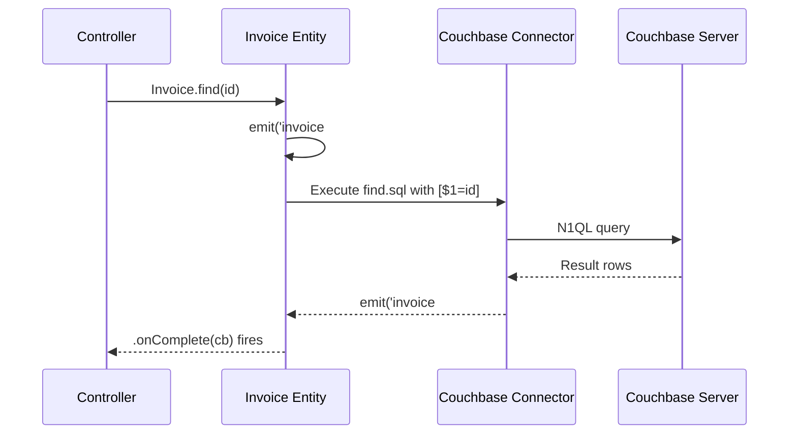

# Couchbase ORM for Node.js

Couchbase is a document database with a SQL-like query language (N1QL) and
key-value access. Most Node.js projects interact with it through the raw SDK,
writing ad-hoc queries in string concatenations and managing connections manually.

Gina's Couchbase connector provides a structured ORM layer:

- **Entities** -- JavaScript classes that map to document types, with generated
  CRUD methods and EventEmitter-based lifecycle hooks
- **SQL files** -- N1QL queries stored as `.sql` files alongside entity code,
  version-controlled and reusable
- **`$scope` isolation** -- automatic multi-tenant data partitioning at the query
  level
- **Auto-stamping** -- `_createdAt`, `_updatedAt`, `_scope` fields injected on
  every insert
- **Query instrumentation** -- every query captured in dev mode for the Inspector

---

## Architecture

```mermaid
flowchart TD
    subgraph Bundle["Bundle Process"]
        C[Controller] -->|"entity.find()"| E[Entity<br/>EventEmitter]
        E -->|"emit trigger"| CN[Couchbase Connector]
        CN -->|"N1QL via SDK"| CB[(Couchbase Server)]
    end

    subgraph DevMode["Dev Mode"]
        CN -->|"push to _devQueryLog"| QI[Query Instrumentation<br/>AsyncLocalStorage]
        QI --> INS[Inspector<br/>Query Tab]
    end

    style Bundle fill:#1a1a2e,stroke:#f2af0d
    style DevMode fill:#2a2a3e,stroke:#4caf50
```



The entity layer sits between your controller and the Couchbase SDK. You interact
with entity methods (`.find()`, `.save()`, `.remove()`). The connector translates
those into N1QL queries, manages the connection, and handles result mapping.

---

## Defining an entity

Entities are defined as JavaScript classes in the `models/` directory of a bundle.
The naming convention is `{entityName}.js`:

```javascript
// models/invoice.js
var EntitySuper = require('gina').entities;

function Invoice(conn, caller) {
    // Call parent constructor
    EntitySuper.call(this, conn, caller);

    var self = this;

    /**
     * Custom method: find invoices by customer
     * @param {string} customerId
     * @fires Invoice#event:invoicesByCustomer
     */
    this.findByCustomer = function(customerId) {
        self.emit('invoice#findByCustomer', customerId);
    };
}

// Inherit from EntitySuper (EventEmitter-based)
Invoice.prototype = Object.create(EntitySuper.prototype);
Invoice.prototype.constructor = Invoice;

module.exports = Invoice;
```

The connector automatically generates standard CRUD methods based on the entity
name and the N1QL queries defined in `.sql` files.

---

## N1QL query files

Queries are stored as `.sql` files alongside the entity definition:

```
models/
  invoice.js
  invoice/
    find.sql
    findByCustomer.sql
    save.sql
    remove.sql
```

Each file contains a single N1QL statement:

```sql
-- models/invoice/findByCustomer.sql
SELECT i.*
FROM `myBucket` i
WHERE i.type = 'invoice'
  AND i._scope = $scope
  AND i.customerId = $1
ORDER BY i._createdAt DESC
```

**Key features of SQL files:**

| Feature | Syntax | Purpose |
|---|---|---|
| Scope filter | `$scope` | Replaced with the current scope string at execution time |
| Positional params | `$1`, `$2`, ... | Bound to method arguments -- parameterized, injection-safe |
| Type filter | `i.type = 'invoice'` | Convention: one document type per entity |
| Annotations | `@options` | Control query execution settings (see below) |

:::info
`$scope` is a **string substitution**, not a query parameter. It is replaced with
a quoted literal (`'local'`, `'production'`, etc.) before the query is sent to
Couchbase. This ensures scope isolation is enforced at the data layer, not in
application code.
:::

---

## `@options` annotations

Control query behavior directly in the SQL file using annotations:

```sql
-- @options scanConsistency=request_plus
SELECT u.*
FROM `myBucket` u
WHERE u.type = 'user'
  AND u._scope = $scope
  AND u.email = $1
```

| Annotation | Values | Default | Purpose |
|---|---|---|---|
| `scanConsistency` | `not_bounded`, `request_plus` | `not_bounded` | Index consistency level |
| `adhoc` | `true`, `false` | `true` | Whether to use prepared statements |
| `profile` | `off`, `phases`, `timings` | `off` (dev: `timings`) | Query execution profiling |

`request_plus` ensures the query sees all mutations up to the current moment --
useful for read-after-write patterns. `not_bounded` (the default) is faster but
may return stale data.

---

## EventEmitter-based lifecycle

Entities extend `EventEmitter`. Method calls emit trigger events, and results are
delivered through callbacks:

```javascript
// In a controller action (var self = this; declared at constructor top)
this.showInvoice = function(req, res, next) {
    var Invoice = self.getModel('invoice');

    Invoice.find(req.routing.param.id).onComplete(function(err, invoice) {
        if (err) return self.throwError(err);

        self.render({ invoice: invoice });
    });
};
```

The flow:



**Why EventEmitter instead of Promises?**

The entity system predates native Promises in Node.js. The `.onComplete(cb)` pattern
provides a consistent callback interface. For modern code that needs `async/await`,
use the `onCompleteCall()` global helper:

```javascript
// var self = this; declared at constructor top
this.showInvoice = async function(req, res, next) {
    var Invoice = self.getModel('invoice');

    try {
        var invoice = await onCompleteCall(Invoice.find(req.routing.param.id));
        self.render({ invoice: invoice });
    } catch (err) {
        self.throwError(err);
    }
};
```

See [Async helpers](/globals/async) for details on `onCompleteCall()`.

---

## Auto-stamping on insert

When a new document is inserted, the connector automatically adds metadata fields:

| Field | Type | Value |
|---|---|---|
| `_createdAt` | string (ISO 8601) | Timestamp of insertion |
| `_updatedAt` | string (ISO 8601) | Same as `_createdAt` on insert, updated on save |
| `_scope` | string | Current scope (`local`, `beta`, `production`) |

These fields are set by the connector, not by application code. You do not need to
include them in your entity or save logic:

```javascript
// This is all you need — _createdAt, _updatedAt, _scope are injected
Invoice.save({
    type       : 'invoice'
  , customerId : 'cust-123'
  , amount     : 250.00
  , currency   : 'USD'
}).onComplete(function(err, result) {
    // Saved document now has _createdAt, _updatedAt, _scope
});
```

---

## Multi-tenant isolation with `$scope`

Every N1QL query that includes `$scope` is automatically partitioned by the
current environment's scope. This means:

- A developer running in `local` scope sees only `local` documents
- A staging environment in `beta` scope sees only `beta` documents
- Production sees only `production` documents

**All from the same Couchbase bucket.** No separate databases, no separate clusters,
no manual filtering in application code.

```mermaid
flowchart LR
    subgraph App["Same Application Code"]
        Q["SELECT * FROM bucket<br/>WHERE _scope = $scope"]
    end

    subgraph Envs["Environments"]
        L["local<br/>$scope = 'local'"]
        B["beta<br/>$scope = 'beta'"]
        P["production<br/>$scope = 'production'"]
    end

    App --> L
    App --> B
    App --> P

    style App fill:#1a1a2e,stroke:#f2af0d
    style Envs fill:#2a2a3e,stroke:#666
```



:::tip
Always include `AND _scope = $scope` in your N1QL queries. Omitting it causes the
query to return documents from all scopes -- a data isolation breach. The
[Inspector](/guides/inspector) Query tab highlights queries that are missing scope
filters.
:::

---

## SDK compatibility

The Couchbase connector supports both SDK v3 and SDK v4:

| Feature | SDK v3 | SDK v4 |
|---|---|---|
| N1QL queries | Supported | Supported |
| Query profiling (`meta.profile`) | Works | C++ binding does not surface `profile` field |
| Index reporting | Via `meta.profile` | EXPLAIN fallback (async, cached) |
| Scan consistency | Supported | Supported |
| Prepared statements | Supported | Supported |

The connector detects the SDK version and adjusts its behavior automatically. The
only user-visible difference is in dev-mode query instrumentation: SDK v4 uses an
`EXPLAIN` fallback for index reporting, which may show "N/A" on the first request
for a new query (the EXPLAIN runs asynchronously and caches the result for
subsequent requests).

---

## Dev-mode query instrumentation

In dev mode, every Couchbase query is captured and surfaced in the Inspector:

| Inspector feature | What it shows |
|---|---|
| Query tab | Every N1QL query with statement, params, timing, result count, indexes |
| Flow tab | Database queries as waterfall bars alongside HTTP phases |
| Cross-bundle tracing | Queries from upstream bundles (via `self.query()`) are merged |

Each query entry includes:

```javascript
{
    type        : 'N1QL'
  , trigger     : 'invoice#findByCustomer'
  , statement   : 'SELECT i.* FROM `myBucket` i WHERE ...'
  , params      : ['cust-123']
  , durationMs  : 12
  , resultCount : 5
  , resultSize  : 2048
  , indexes     : [{ name: 'idx_invoice_customer', primary: false }]
  , connector   : 'couchbase'
  , origin      : 'api'
}
```

**Index badges** in the Inspector show which indexes each query used:

| Badge | Meaning |
|---|---|
| Green | Secondary index (efficient) |
| Amber | Primary index scan (full bucket scan -- slow) |
| Red | No index used |
| Grey (N/A) | Index information not available (SDK v4 first request) |

This is powered by `extractIndexes()`, which walks the N1QL execution plan tree
to find `IndexScan3`, `PrimaryScan3`, and `ExpressionScan` operators.

See the [Inspector guide](/guides/inspector) for the full Query tab documentation.

---

## Connector configuration

The Couchbase connector is configured in `connectors.json`:

```json
{
  "couchbase": {
    "type": "couchbase",
    "host": "couchbase://localhost",
    "bucket": "myBucket",
    "username": "admin",
    "password": "password",
    "scope": "local"
  }
}
```

The `scope` field sets the default `$scope` value for all queries through this
connector. It can be overridden per environment in `env.json`.

---

## Session store via per-document `expiry`

The connector also ships an express-session-compatible session store. Couchbase
has native per-document expiry — the `expiry` argument on `upsert` tells the
server to delete the document automatically when its TTL elapses. There is no
separate TTL index or sweeper job.

Three implementations live alongside the ORM connector at
`core/connectors/couchbase/lib/session-store.v{2,3,4}.js`. The dispatcher at
`session-store.js` reads the project's `couchbase` SDK version pin from
`package.json` and selects the matching variant automatically — `v2` (legacy
callbacks), `v3` (Promise + bucket API), or `v4` (Promise + cluster /
collection API). v2 has been deprecated since `0.2.0` and emits a deprecation warning at
connection time; new bundles should pin v3 or v4.

### Configuration

A bundle can use the same Couchbase cluster for both ORM and sessions, or
declare a separate connector entry. The store reads from the entry whose key
matches `session.name`:

```json title="src/api/config/connectors.json"
{
  "session": {
    "connector": "couchbase",
    "protocol":  "couchbase://",
    "host":      "127.0.0.1:8091",
    "bucket":    "sessions",
    "username":  "appuser",
    "password":  "${COUCHBASE_PASSWORD}",
    "ttl":       86400,
    "prefix":    "sess:"
  }
}
```

| Option | Default | Notes |
|---|---|---|
| `connector` | (required) | Must be `"couchbase"` |
| `protocol` | `"couchbase://"` | `couchbases://` for TLS (Capella, Couchbase Cloud) |
| `host` | — | One or more `host:port` entries; `;`-separated string or array |
| `bucket` | — | Bucket dedicated to sessions (recommended — separates session lifecycle from primary data) |
| `username` | — | Bucket / RBAC user |
| `password` | — | RBAC password. Supports `${ENV_VAR}` substitution |
| `ttl` | (cookie `maxAge` / 1000, then `86400`) | Default expiry in seconds. Stamped into each document via Couchbase's `expiry` argument |
| `prefix` | `"sess:"` | Document key prefix. Combined with the session id (`sess:<sid>`) to form the document key |
| `operationTimeout` | `10000` | Per-operation timeout in ms |
| `connectionTimeout` | `10000` | Connect-time timeout in ms |

### Bundle bootstrap

The same `lib.SessionStore` factory used for every other connector resolves to
the right `CouchbaseStore` class — no version path, no explicit
SDK-variant import:

```javascript
var myapp        = require('gina');
var session      = require('express-session');
var SessionStore = myapp.lib.SessionStore;

myapp.onInitialize(function(event, app) {
    session.name = 'session';                          // key in connectors.json
    var CouchbaseStore = new SessionStore(session);    // returns the CouchbaseStore class

    app.use(session({
        secret           : process.env.SESSION_SECRET,
        resave           : false,
        saveUninitialized: false,
        store            : new CouchbaseStore()
    }));

    event.emit('complete', app);
});

myapp.onError(function(err, req, res, next) { next(err); });
myapp.start();
```

### TTL strategy — `expiry` on `upsert`

Couchbase documents carry their TTL in document metadata. Every `set()` writes
the session with the resolved TTL, and the server reaps the document
server-side once it elapses. `touch()` rewrites with the same body + fresh TTL,
short-circuiting if `lastModified` was stamped recently enough to skip the
rewrite (an internal throttle to avoid hot-row-style write amplification on
every request).

| Express-session method | Couchbase operation |
|---|---|
| `set(sid, sess, fn)` | `cluster.upsert("<prefix><sid>", JSON.stringify(sess), { expiry: ttl })` |
| `touch(sid, sess, fn)` | Same as `set`, with throttled `lastModified` updates |
| `get(sid, fn)` | `cluster.get("<prefix><sid>")` (returns parsed session or `null` on key-not-found) |
| `destroy(sid, fn)` | `cluster.remove("<prefix><sid>")` |

### Document shape

```json
{
  "<prefix><sid>": {
    "cookie":       { "originalMaxAge": 86400000, "secure": false, "httpOnly": true, "sameSite": "lax" },
    "user":         { "id": 42, "name": "Martin", "role": "admin" },
    "lastModified": "2026-05-09T22:32:38.000Z"
  }
}
```

The session body is stored as a JSON string (Couchbase's binary format
roundtrips strings transparently). Couchbase Node.js SDK 4.x uses
`JsonTranscoder` by default and returns the parsed object — the connector's
`get()` handles both pre-parsed and raw-bytes shapes for forward compatibility.

### Promise → callback safety

`destroy()` and `touch()` go through a `.then(function() { fn(null); })` /
`.catch(fn)` pattern rather than `.then(fn)` directly. The Couchbase
`MutationResult` (`{ cas, token }`) returned from a successful Promise would
otherwise reach express-session as the `err` argument, propagate as a 500, and
render the result token in the response body. This trap is documented in
[architecture/connectors.md §8 — `#CB-BUG-4`](https://github.com/gina-io/gina/blob/develop/llms.txt) and applies to every Promise-based store.

:::caution `length()`, `clear()`, `all()` are not implemented
The CouchbaseStore exposes `get` / `set` / `destroy` / `touch` only. Couchbase
discourages full-bucket scans without a secondary view or N1QL index, so
sweeping all sessions or counting them is left to operators (run a one-off
`SELECT COUNT(*) FROM <bucket>` from the Couchbase UI / `cbq` shell when
needed). express-session does not call these methods on the request path —
they are only used by admin tooling like `connect-test-suite`.
:::

---

## Further reading

- [Models guide](/guides/models) -- entity definitions, relationships, validation
- [Sessions guide](/guides/sessions) -- choose-a-store overview, cookie options, controller patterns
- [Connectors reference](/reference/connectors) -- all supported connectors (Couchbase, MongoDB, ScyllaDB, MySQL, PostgreSQL, SQLite, Redis)
- [Scopes](/concepts/scopes) -- scope model and data isolation
- [Inspector guide](/guides/inspector) -- query instrumentation and flow waterfall
- [Async helpers](/globals/async) -- `onCompleteCall()` for Promise/async-await bridging
