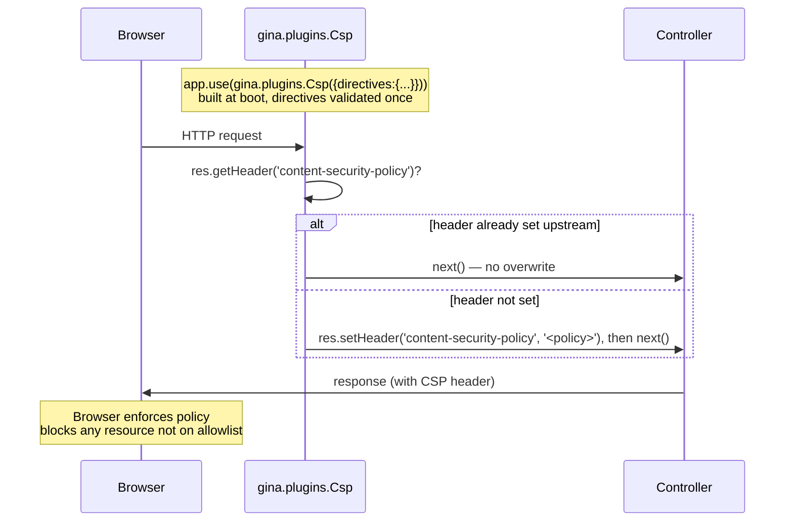
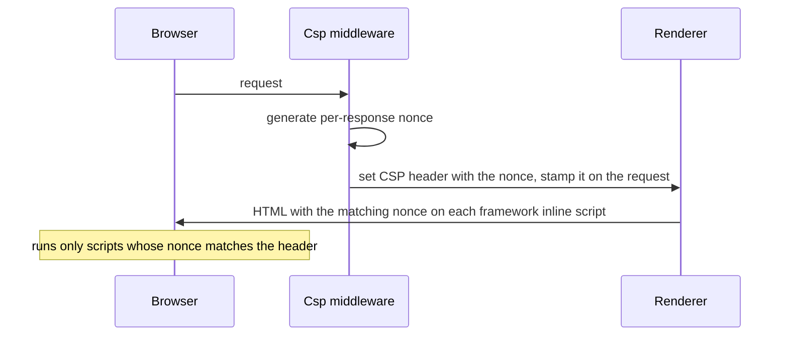

# Content-Security-Policy (`#HDR5`)

`gina.plugins.Csp({ directives, reportOnly })` emits the `Content-Security-Policy` (or `Content-Security-Policy-Report-Only`) response header on every response, limiting which resources the browser is allowed to load and from where.

CSP is the modern defense against cross-site scripting (XSS) and data injection. By declaring an allowlist of permitted source origins for scripts, styles, images, fonts, frames, and connections, the browser refuses to execute or load anything that doesn't match the policy — even if an attacker manages to inject a `<script>` tag via stored XSS, the script won't load unless its source is on the allowlist.

CSP also defeats whole classes of:

- **Clickjacking** — via the `frame-ancestors` directive (modern replacement for `X-Frame-Options`).
- **Mixed-content downgrade** — via `upgrade-insecure-requests` (upgrades HTTP sub-resource loads to HTTPS automatically).
- **Base-tag manipulation** — via `base-uri` (prevents injected `<base href="...">` from redirecting relative URLs).

**Opens Phase 2** of the gina security-headers track. Phase 1 (HDR1-4 + HDR7) shipped in `0.3.15-alpha`; CSP is the most-requested helmet header that wasn't yet covered.

## How it works



The plugin is **idempotent** — if an earlier middleware already set the header, the existing value is preserved and `next()` is called immediately. First-writer-wins. Safe to stack with helmet-style upstream gates or with multiple registrations of the same plugin.

## Adoption

One block in the bundle bootstrap (`src/<bundle>/index.js`):

```js title="src/<bundle>/index.js"
var myapp = require('gina');
var csp   = require('gina').plugins.Csp({
    directives: {
        'default-src': ["'self'"],
        'script-src':  ["'self'", 'https://cdn.example.com'],
        'style-src':   ["'self'", "'unsafe-inline'"],
        'img-src':     ["'self'", 'data:', 'https:'],
        'upgrade-insecure-requests': true
    }
});

myapp.onInitialize(function(event, app) {
    app.use(csp);
    event.emit('complete', app);
});
```

Order with other gina security plugins does not matter — the header is emitted on the response, not consumed from the request.

## Configuration

Settings.json shape — caller-supplied options always win over settings:

```jsonc title="src/<bundle>/config/settings.json"
{
  "csp": {
    "directives": {
      "default-src": ["'self'"],
      "script-src":  ["'self'", "https://cdn.example.com"],
      "style-src":   ["'self'", "'unsafe-inline'"],
      "img-src":     ["'self'", "data:"]
    },
    "reportOnly": false
  }
}
```

| Field        | Type    | Default | Notes                                                                |
|--------------|---------|---------|----------------------------------------------------------------------|
| `directives` | object  | —       | **Required.** Throws if missing or empty. See "Directives" below.   |
| `reportOnly` | boolean | `false` | When `true`, emits `Content-Security-Policy-Report-Only` instead.   |

There is no sensible cross-bundle default for `directives`. Every bundle has its own resource graph; a default policy would either be too restrictive (breaks every bundle that loads external resources) or too permissive (gives no real protection). **The factory throws at call time if `directives` is missing or empty.**

## Directives

The plugin enforces a **strict whitelist of 27 CSP Level 3 standard directives**. Unknown directive names throw at factory call time — fail-fast is the only way to catch typos like `scrpt-src` (browsers silently ignore unknown directives, so without the throw the page would be unprotected with no error).

### Full whitelist

| Category            | Directives                                                                                                                                                                                                |
|---------------------|-----------------------------------------------------------------------------------------------------------------------------------------------------------------------------------------------------------|
| Fetch (17)          | `child-src`, `connect-src`, `default-src`, `font-src`, `frame-src`, `img-src`, `manifest-src`, `media-src`, `object-src`, `prefetch-src`, `script-src`, `script-src-attr`, `script-src-elem`, `style-src`, `style-src-attr`, `style-src-elem`, `worker-src` |
| Document (2)        | `base-uri`, `sandbox`                                                                                                                                                                                     |
| Navigation (2)      | `form-action`, `frame-ancestors`                                                                                                                                                                          |
| Reporting (2)       | `report-to`, `report-uri`                                                                                                                                                                                 |
| Document policies (2) | `block-all-mixed-content`, `upgrade-insecure-requests`                                                                                                                                                  |
| Trusted Types (2)   | `require-trusted-types-for`, `trusted-types`                                                                                                                                                              |

Tracks the [W3C CSP Level 3 spec](https://www.w3.org/TR/CSP3/#csp-directives). Experimental / future directives (`webrtc`, `fenced-frame-src`, etc.) are not yet supported — users wanting them get a clear "unknown directive" error and can open an issue to request inclusion in a future release.

### Value formats

Each directive value can be one of:

- **Array of source-list tokens** (recommended) — joined with space:

  ```js
  { 'default-src': ["'self'", 'https://cdn.example.com'] }
  // → "default-src 'self' https://cdn.example.com"
  ```

- **String** (pre-formatted source list) — emitted as-is:

  ```js
  { 'default-src': "'self' https://cdn.example.com" }
  // → "default-src 'self' https://cdn.example.com"
  ```

- **`true`** — emit the directive name alone (for boolean-only directives, or `sandbox` with no value):

  ```js
  { 'upgrade-insecure-requests': true }
  // → "upgrade-insecure-requests"
  ```

- **`false`** — omit the directive entirely:

  ```js
  { 'default-src': ["'self'"], 'script-src': false }
  // → "default-src 'self'"  (script-src omitted)
  ```

### Directive categories

The whitelist splits into three categories based on accepted value shapes:

- **Source-list directives** (string / array / `false`):
  `child-src`, `connect-src`, `default-src`, `font-src`, `frame-src`, `img-src`, `manifest-src`, `media-src`, `object-src`, `prefetch-src`, `script-src`, `script-src-attr`, `script-src-elem`, `style-src`, `style-src-attr`, `style-src-elem`, `worker-src`, `base-uri`, `form-action`, `frame-ancestors`, `report-to`, `report-uri`, `require-trusted-types-for`, `trusted-types`. Boolean `true` is **not** accepted — the factory throws.

- **Boolean-only directives** (`true` / `false` only):
  `block-all-mixed-content`, `upgrade-insecure-requests`. String / array values are **not** accepted — the factory throws.

- **Hybrid directives** (string / array / `true` / `false`):
  `sandbox` — `true` applies all sandbox restrictions; a string/array adds specific exceptions (e.g. `sandbox allow-scripts allow-same-origin`).

## Recipes

### A typical strict policy

```js
require('gina').plugins.Csp({
    directives: {
        'default-src':                 ["'self'"],
        'script-src':                  ["'self'"],
        'style-src':                   ["'self'", "'unsafe-inline'"],
        'img-src':                     ["'self'", 'data:'],
        'font-src':                    ["'self'"],
        'connect-src':                 ["'self'"],
        'frame-ancestors':             ["'none'"],
        'base-uri':                    ["'self'"],
        'form-action':                 ["'self'"],
        'object-src':                  ["'none'"],
        'upgrade-insecure-requests':   true
    }
});
```

### Loading from a CDN

```js
require('gina').plugins.Csp({
    directives: {
        'default-src': ["'self'"],
        'script-src':  ["'self'", 'https://cdn.example.com'],
        'style-src':   ["'self'", 'https://cdn.example.com'],
        'img-src':     ["'self'", 'data:', 'https://cdn.example.com'],
        'font-src':    ["'self'", 'https://cdn.example.com']
    }
});
```

### Report-only mode for migration

```js
require('gina').plugins.Csp({
    reportOnly: true,
    directives: {
        'default-src': ["'self'"],
        'script-src':  ["'self'"],
        'report-uri':  ['/csp/report']
    }
});
```

Browsers report violations to `/csp/report` (or to the configured `report-to` endpoint, or to the browser console) but do not block any resources. Useful when rolling out a new policy: ship it as report-only first, collect violations from real traffic for a few days, refine the policy, then flip to enforcing by removing `reportOnly: true`.

## Security guidance

### Avoid `'unsafe-inline'` and `'unsafe-eval'`

`'unsafe-inline'` allows any inline `<script>` or `<style>` in your HTML to execute — which means CSP no longer protects against injected inline scripts. It's a frequent pragmatic compromise (especially for `style-src` to allow inline styles from third-party libraries) but every use weakens the policy substantially.

`'unsafe-eval'` allows `eval(...)`, `new Function(...)`, and `setTimeout(string, ...)` — which is a similar weakening for code-evaluation primitives. Avoid unless you have a specific dependency that requires it.

### Use `nonce-*` for inline scripts

The modern pattern for legitimate inline scripts: emit `script-src 'nonce-<random>'` in the CSP header and add `<script nonce="<random>">...</script>` to each inline tag. The browser only executes inline scripts whose nonce matches the per-response value, defeating XSS injection.

Gina supports this directly — set `useNonce: true` and the framework's own injected inline scripts carry the nonce automatically, so you can drop `'unsafe-inline'` from `script-src`. See [Per-response nonce (`useNonce`)](#per-response-nonce-usenonce) below.

### Lock down `frame-ancestors` and `object-src`

- `frame-ancestors 'none'` — prevents your page from being framed by any other origin (modern clickjacking defense, more expressive than `X-Frame-Options`).
- `object-src 'none'` — prevents `<object>` / `<embed>` / `<applet>` loads (the only plugin types modern browsers still honour are Flash / Java, both end-of-life).

### Set `upgrade-insecure-requests`

`upgrade-insecure-requests: true` tells the browser to silently upgrade any `http://` sub-resource URL in your page to `https://` before fetching. Catches mixed-content errors from third-party libraries that hardcode `http://` URLs.

## Per-response nonce (`useNonce`)

Set `useNonce: true` to drop `'unsafe-inline'` from `script-src` without breaking the framework's own injected inline scripts:

```js
var csp = require('gina').plugins.Csp({
    directives: { 'script-src': ["'self'"] },
    useNonce: true
});
// → Content-Security-Policy: script-src 'self' 'nonce-<base64>'
```

When enabled, the `Csp` middleware generates a fresh cryptographically-random nonce per response (`crypto.randomBytes(16).toString('base64')` — 128 bits, the W3C CSP Level 3 entropy floor), appends `'nonce-<value>'` to the `script-src` directive (falling back to `default-src` when `script-src` is absent), and stamps the value on the request so the renderer can mirror it onto every framework-injected inline `<script>`. No application template changes are required — the framework injection sites (the `onGinaLoaded` runtime bootstrap, plus the dev-only Inspector blocks) carry the matching `nonce="<value>"` attribute automatically.



`useNonce` defaults to `false` — the header is then computed once and reused per response (zero per-request cost), and the framework emits no `nonce` attribute, so bundles that do not opt in are completely unaffected.

The nonce is generated **only when Gina is the one setting the CSP header** (the idempotent first-writer-wins guard). If an upstream proxy or ingress already set the header, Gina generates no nonce and emits none on the tags — so the header and the tags stay consistent. (If you set CSP at a proxy AND want nonces, generate them at that layer instead.)

**Factory requirement:** `useNonce: true` needs a `script-src` (or `default-src`) directive for the nonce to attach to — the factory throws at call time if neither is present.

**Application-side inline scripts:** marking your *own* inline `<script>` tags with the nonce (via a template helper) is a separate, planned change. `useNonce` currently covers the framework-injected scripts so you can drop `'unsafe-inline'` for those; if your bundle also has its own inline scripts, either extract them to external files or keep `'unsafe-inline'` until the template-helper change lands.

## `reportOnly` — non-enforcing migration testing

Setting `reportOnly: true` switches the response header name from `Content-Security-Policy` to `Content-Security-Policy-Report-Only`. Browsers report violations (to the configured `report-to` / `report-uri` endpoint, or to the browser console) but **do not block any resources**.

Useful when rolling out a new policy:

1. Ship the policy as `reportOnly: true` first.
2. Collect violations from real traffic for a few days.
3. Refine the policy to eliminate the false positives (legitimate resources that the initial policy blocked).
4. Flip to enforcing (`reportOnly: false` or remove the field).

Without report-only mode, a too-strict policy in enforcing mode breaks the application for real users on first deploy — there is no graceful rollout path.

## Strict whitelist rationale

The plugin's whitelist tracks the [W3C CSP Level 3 spec](https://www.w3.org/TR/CSP3/#csp-directives). Experimental / future directives are not yet supported.

This is a **stricter posture than helmet's CSP middleware**, which is more permissive on directive names. The tradeoff:

- **Gina** catches typos at factory call time — your bundle won't start with a misconfigured CSP. The cost: you need to wait for a gina release to add a new directive that hits the spec.
- **Helmet** catches typos at runtime via browser-console warnings (if a developer happens to be looking) or via CSP violation reports (if you have report-to wired). The cost: silent typos can ship to production unnoticed.

Gina favours fail-fast. If you need a directive that's not yet on the whitelist, open an issue — it's a one-line addition once the spec is finalised.

## Failure modes

| Condition                                                | Outcome                                              |
|----------------------------------------------------------|------------------------------------------------------|
| `directives` omitted / null / non-object                 | Factory throws at call time                          |
| `directives` is an empty object                          | Factory throws with directives-list pointer          |
| `directives` contains an unknown directive name          | Factory throws with full whitelist in message        |
| Boolean-only directive given a non-boolean value         | Factory throws with directive name in message        |
| Source-list directive given `true` (and not `sandbox`)   | Factory throws with directive-category explanation   |
| Source-list directive array contains a non-string entry  | Factory throws with index in message                 |
| All directives resolve to `false` (omitted)              | Factory throws — empty CSP is invalid                |
| `reportOnly` is non-boolean                              | Factory throws                                       |
| Plugin not registered                                    | Header not emitted; browser applies no CSP           |
| Header already set by an earlier middleware              | Existing value preserved (idempotent)                |
| Response already sent (`res.headersSent === true`)       | Node's `setHeader` no-ops; request resumes           |

The idempotent behaviour makes the plugin safe to register more than once or alongside another middleware that emits the same header — the first writer wins.

## See also

- [Security Headers guide](/guides/security-headers) — the full HDR1-7 + HDR5 reference for all single-header response-side security plugins.
- [Sessions guide](/guides/sessions) — `gina.plugins.Session()` hardened cookie defaults (#CSRF1).
- [CSRF guide](/guides/csrf) — `gina.plugins.Csrf()` signed double-submit token middleware (#CSRF2/#CSRF3).
- [Roadmap — Web Security Headers](/roadmap) — track status, Phase 2 plans, and the future `SecurityHeaders` combined wrapper (#HDR15).
- [W3C CSP Level 3 spec](https://www.w3.org/TR/CSP3/) — the source-of-truth directive reference.
- [MDN — Content-Security-Policy](https://developer.mozilla.org/en-US/docs/Web/HTTP/Headers/Content-Security-Policy) — directive examples + browser compatibility tables.
