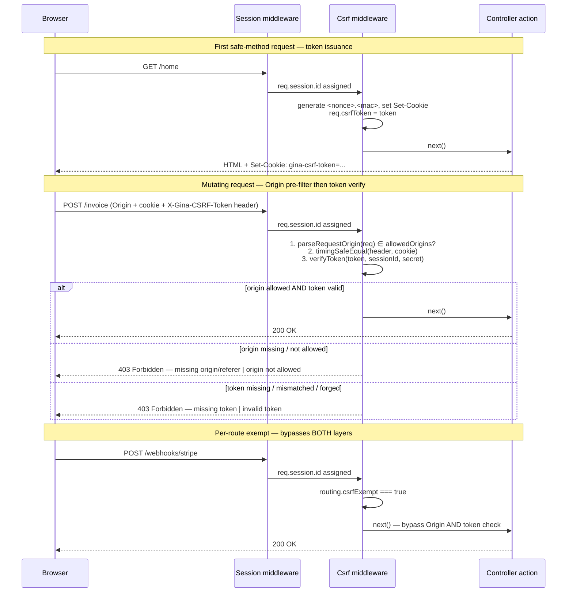

import DocMeta from '@site/src/components/DocMeta';

<DocMeta
  minutes={11}
  level="intermediate"
  prereqs={[
    '[Sessions](/guides/sessions)',
    '[routing.json reference](/reference/routing)',
    '[settings.json reference](/reference/settings)',
    '[OWASP ASVS V4.2.1](https://owasp.org/www-project-application-security-verification-standard/)',
  ]}
/>

# CSRF Protection

Cross-site request forgery (CSRF) lets a malicious page trigger an authenticated
request to your bundle from a victim's browser — without ever reading the
response. The attack works because the browser attaches the session cookie
automatically on every navigation.

`gina.plugins.Csrf` is the framework's stateless defense, aligned with
[OWASP ASVS 4.0 V4.2.1](https://owasp.org/www-project-application-security-verification-standard/).
On every mutating request (POST / PUT / PATCH / DELETE) it runs two layers
in order:

1. **Origin / Referer pre-filter (`#CSRF3`).** Reads the request's `Origin`
   header (or parses the host out of `Referer` as a fallback) and rejects
   with 403 if it doesn't appear in `csrf.allowedOrigins`. Cheap, runs
   before any cryptographic work.
2. **Signed double-submit token (`#CSRF2`).** Verifies an HMAC-signed
   cookie against a matching `X-Gina-CSRF-Token` header (or `_csrf` form
   field). The HMAC commits to the session ID, so a sibling subdomain that
   can set cookies on the parent domain cannot forge a usable value.

Safe methods (GET / HEAD / OPTIONS) issue a fresh token cookie and pass
through without either check.

The plugin builds on top of [`gina.plugins.Session`](/guides/sessions#hardened-cookie-defaults--ginapluginssession)
(the `#CSRF1` cookie hardening baseline) — Session must be registered first.

---

## How it works



The token shape is `<nonce_b64url>.<mac_b64url>` where the MAC commits to
`sessionId + ':' + nonce_b64url` under your `GINA_CSRF_SECRET`. The nonce is
16 random bytes from `crypto.getRandomValues`. Both halves are base64url
encoded, and the verify path uses `crypto.timingSafeEqual` with a length
guard.

---

## Adoption

Two lines in your bundle bootstrap, **after** the session middleware:

```js title="src/api/index.js"
var myapp   = require('gina');
var session = require('gina').plugins.Session(require('express-session'));
var csrf    = require('gina').plugins.Csrf();

myapp.onInitialize(function(event, app) {
    app.use(session({
        secret           : process.env.SESSION_SECRET
      , resave           : false
      , saveUninitialized: false
      , cookie           : { secure: 'auto', maxAge: 86400000 }
    }));
    app.use(csrf);   // must come AFTER session

    event.emit('complete', app);
});

myapp.onError(function(err, req, res, next) { next(err); });
myapp.start();
```

Order matters. The Csrf middleware reads `req.session.id`, so registering
it before `session` produces a clear error on the first request:

```text
[csrf] no req.session.id - Csrf plugin requires the Session plugin to be
registered before it. If your bundle uses Bearer-token auth (cookies
disabled), remove the Csrf plugin - CSRF doesn't apply to non-cookie
authentication.
```

If your bundle uses Bearer-token auth (cookies disabled, no session), CSRF
does not apply — remove the Csrf plugin entirely rather than try to feed it a
session id.

---

## Server secret

The plugin reads `process.env.GINA_CSRF_SECRET` once, at factory call time,
and refuses to start if the variable is missing — there is **no dev fallback**.

Generate the secret once and store it in your bundle's `env.json` or your
shell profile:

```bash
openssl rand -base64 64
```

```json title="src/api/config/env.json"
{
  "dev": {
    "GINA_CSRF_SECRET": "<paste output of openssl rand -base64 64>"
  }
}
```

A missing secret throws at factory call time (before the server starts):

```text
[gina csrf] GINA_CSRF_SECRET env var is required. Generate once: openssl rand
-base64 64. Place in your bundle's env.json or your shell profile.
```

Rotating the secret invalidates every outstanding token — every browser tab
will silently re-issue on its next safe-method request.

---

## Configuration

All keys live under `csrf` in `settings.json`. Every key is optional — the
defaults below are what ships with the framework.

```json title="src/api/config/settings.json"
{
  "csrf": {
    "cookieName":     "gina-csrf-token",
    "headerName":     "X-Gina-CSRF-Token",
    "fieldName":      "_csrf",
    "rotate":         "per-session",
    "safeMethods":    ["GET", "HEAD", "OPTIONS"],
    "allowedOrigins": []
  }
}
```

| Key | Type | Default | Description |
|---|---|---|---|
| `cookieName` | string | `"gina-csrf-token"` | Name of the cookie issued on safe methods. |
| `headerName` | string | `"X-Gina-CSRF-Token"` | Request header read on mutating methods. The header name is matched case-insensitively. |
| `fieldName` | string | `"_csrf"` | Form field read on mutating methods. Picked up from `req.body`, `req.post`, `req.put`, `req.patch`, `req.delete` (in that order). |
| `rotate` | `"per-session"` \| `"per-request"` | `"per-session"` | When to mint a fresh token. `"per-session"` reuses the same token for the lifetime of the session cookie. `"per-request"` issues a brand-new token on every safe-method response — strictest, but breaks browser back/forward navigation that reuses a cached form. |
| `safeMethods` | string[] | `["GET", "HEAD", "OPTIONS"]` | Methods that issue a token without verifying. Methods outside this list always require a verified token (unless the route is exempt — see [Per-route opt-out](#per-route-opt-out)). |
| `allowedOrigins` | string[] | `[]` | #CSRF3 allowlist matched against `Origin` (or `Referer` host fallback) on mutating methods. Empty/unset = bundle's configured hostname only; non-empty = explicit allowlist. Format: `["https://example.com", "https://www.example.com"]`. See [Origin / Referer pre-filter](#origin--referer-pre-filter). |

The secret is **never** stored in `settings.json` — env var only.

---

## Reading the token in a controller

The middleware sets `req.csrfToken` on every request that issues or verifies
a token. Read it directly when you need to render the value into a non-form
context (header preview, debug page, JSON API for a SPA you control):

```js title="src/api/controllers/controller.csrf.js"
var self = this;

this.show = function(req, res, next) {
    self.renderJSON({
        token: req.csrfToken          // string, or undefined when unset
    });
};
```

Note: it is `req.csrfToken` — no underscore. (`req._csrfToken` does **not**
exist.) Templates have access through `gina.csrfToken` and `gina.csrfInput`
without any controller plumbing.

---

## Templates — pre-formatted hidden input

`gina.csrfInput` is a pre-formatted `<input type="hidden" name="_csrf" value="<token>">`
string. Render it inside any `<form>` and you are done:

```swig title="src/api/views/invoice.html"
<form method="POST" action="/invoice">
    {{ gina.csrfInput | safe }}

    <label>Amount <input type="number" name="amount" required></label>
    <button type="submit">Send invoice</button>
</form>
```

The `| safe` filter is required — Swig escapes by default, and the value is
trusted HTML produced by the framework (the field name is HTML-escaped
defensively).

When the bundle has not adopted the Csrf plugin, neither `gina.csrfToken` nor
`gina.csrfInput` is exposed. Guard with `` for
templates that should render in either mode:

```swig

    {{ gina.csrfInput | safe }}

```

---

## Templates — manual rendering

If you need control over the field name, attributes, or surrounding markup,
read `gina.csrfToken` directly:

```swig
<form method="POST" action="/invoice">
    <input type="hidden" name="_csrf" value="{{ gina.csrfToken }}" data-csrf>

    <label>Amount <input type="number" name="amount" required></label>
    <button type="submit">Send invoice</button>
</form>
```

The token value is base64url (`[A-Za-z0-9_-]`) so it never needs escaping
inside an HTML attribute.

---

## AJAX integration

### With the validator plugin — zero config

If your forms use Gina's built-in form validator (the default for any form
declared in `forms.json`), the AJAX submit path automatically reads the
`gina-csrf-token` cookie and sets the `X-Gina-CSRF-Token` header on mutating
methods (POST / PUT / PATCH / DELETE). Safe methods (GET / HEAD / OPTIONS)
bypass injection. **No bundle code change required.**

This covers three integration points inside the validator plugin:

- Form submit XHR
- File-removal DELETE / POST
- Live-validation queries

### Without the validator plugin — manual injection

For hand-rolled `fetch` / `XMLHttpRequest` calls, read the `gina-csrf-token`
cookie and set the matching header on mutating methods:

```js title="src/api/views/static/js/api-client.js"
function readCsrfCookie() {
    var prefix = 'gina-csrf-token=';
    var parts  = (document.cookie || '').split(';');
    for (var i = 0; i < parts.length; i++) {
        var p = parts[i].replace(/^\s+/, '');
        if (p.indexOf(prefix) === 0) {
            try { return decodeURIComponent(p.slice(prefix.length)); }
            catch (e) { return p.slice(prefix.length); }
        }
    }
    return null;
}

function postJson(url, body) {
    var token = readCsrfCookie();
    var opts  = {
        method     : 'POST',
        credentials: 'same-origin',
        headers    : { 'Content-Type': 'application/json' },
        body       : JSON.stringify(body)
    };
    if (token) opts.headers['X-Gina-CSRF-Token'] = token;
    return fetch(url, opts);
}
```

If the cookie is absent (the user never made a safe-method request), the
server rejects with 403 and the controller never runs. Reload any page on
the bundle to seed the cookie.

---

## Origin / Referer pre-filter

A second layer runs **before** the token check on every mutating request:
the bundle reads the request's `Origin` header (falling back to parsing the
host out of `Referer` when `Origin` is absent — rare, but seen on some
same-origin legacy browsers) and rejects with `403 Forbidden` if the parsed
origin doesn't appear in `csrf.allowedOrigins`. Both headers missing → 403.

The pre-filter is belt-and-suspenders for the token middleware: it catches
edge cases tokens might miss — referrer-header log leaks, legacy browser
bugs that leak tokens in URLs, misconfigured reverse proxies that accept
cross-origin requests. A forged token with a matching cookie still gets
rejected here when the request didn't come from an allowed origin —
**token layer ≠ Origin layer**.

By default the allowlist contains a single entry: the bundle's configured
hostname (`scheme://host[:port]`, derived from
`conf[bundle][env].hostname` or composed from `server.scheme + host +
server.port`). Multi-domain bundles can override it via `settings.json`:

```json title="src/api/config/settings.json"
{
  "csrf": {
    "allowedOrigins": [
      "https://example.com",
      "https://www.example.com"
    ]
  }
}
```

Entries are matched literally (case-insensitive). Different scheme on the
same host doesn't match (`http://example.com` ≠ `https://example.com`),
and different port doesn't match (`http://example.com` ≠
`http://example.com:8443`). Browsers send the actual port the request was
issued from — list each origin exactly as the browser will present it.

| Condition | Outcome | Reject reason |
|---|---|---|
| `Origin` matches an allowlist entry | Pass to token verify | — |
| `Origin` missing, `Referer` host matches | Pass to token verify | — |
| Both `Origin` and `Referer` missing | 403 | `missing origin/referer` |
| `Origin: null` (sandboxed iframe) + no `Referer` | 403 | `missing origin/referer` |
| `Origin` (or `Referer` host) outside the allowlist | 403 | `origin not allowed` |
| Route marked `csrfExempt: true` | Pre-filter bypassed (consistent with token check) | — |
| Safe method (`GET`/`HEAD`/`OPTIONS`) | Pre-filter bypassed | — |

The pre-filter is unconditional on mutating methods — there is no opt-out
short of `csrfExempt: true` or appending the offending origin to
`allowedOrigins`. If the factory cannot resolve any origin (no bundle
hostname in conf, empty `allowedOrigins`), `Csrf()` throws at startup
with a clear error pointing at the fix.

---

## Per-route opt-out

Webhook receivers (Stripe, GitHub, third-party callbacks) are not driven by a
browser session and cannot present a CSRF token. Mark those routes exempt in
`routing.json`:

```jsonc title="src/api/config/routing.json"
{
  "stripe-webhook": {
    "url":        "/webhooks/stripe",
    "method":     "POST",
    "csrfExempt": true,
    "param":      { "control": "@webhook:stripe", "file": "stripe.js" }
  }
}
```

The opt-out is **positive** — `csrfExempt: true`. A misread leaves a webhook
broken (an obvious 403 in the third-party dashboard) rather than silently
making a public endpoint CSRF-vulnerable.

Apply this only to routes that have an alternative origin verification
mechanism — webhook signature headers (Stripe `Stripe-Signature`, GitHub
`X-Hub-Signature-256`), HMAC over the body, or mutual TLS. Never use
`csrfExempt: true` to "fix" a 403 on a browser-driven endpoint.

---

## Errors and failure modes

| Condition | Outcome | Fix |
|---|---|---|
| `GINA_CSRF_SECRET` missing at startup | Factory throws — bundle does not start | Set the env var in `env.json` or shell profile |
| `csrf.allowedOrigins` empty AND bundle hostname unresolvable | Factory throws — bundle does not start | Set `csrf.allowedOrigins` in `settings.json` or fix `conf[bundle][env].hostname` |
| Csrf registered before Session | First request: `next(err)` with the sessionless message | Swap the `app.use()` order — Session first, then Csrf |
| `req.session.id` missing on mutating request | `next(err)` with the sessionless message | Confirm session middleware is producing an `id`; if using Bearer auth, remove the Csrf plugin |
| Mutating request with no `Origin` and no `Referer` | `403 Forbidden` + `[csrf] forbidden — missing origin/referer` | Some clients strip both headers; if the call is server-to-server, mark the route `csrfExempt: true` and verify origin another way |
| `Origin` (or `Referer` host) outside `allowedOrigins` | `403 Forbidden` + `[csrf] forbidden — origin not allowed` | Add the missing origin to `csrf.allowedOrigins` if it is legitimate (e.g. a sibling domain serving the same bundle) |
| Mutating request with no token / no cookie | `403 Forbidden` + `[csrf] forbidden — missing token on POST /...` | Check that the form rendered the token, or that the AJAX path injects the header |
| Token / cookie length mismatch | `403 Forbidden` + `[csrf] forbidden — token/cookie length mismatch` | Often caused by a stale cookie surviving across logout — clear cookies |
| Token / cookie value mismatch | `403 Forbidden` + `[csrf] forbidden — token/cookie mismatch` | Form was rendered for a different session (e.g. user logged out in another tab) |
| HMAC mismatch (forged or stale token) | `403 Forbidden` + `[csrf] forbidden — invalid token` | Token was minted with a different `GINA_CSRF_SECRET` (rotated) or by a different bundle |
| Route marked `csrfExempt: true` | Bypass — no Origin check, no token check, no log line | Intentional — confirm the route has alternative origin verification |

The reject log line includes the request method and URL so you can correlate
across multiple bundles in a multi-service setup.

---

## See also

- [Sessions](/guides/sessions) — `gina.plugins.Session` cookie hardening (the `#CSRF1` baseline)
- [routing.json reference](/reference/routing) — `csrfExempt: true` and the rest of the route schema
- [settings.json reference](/reference/settings) — the `csrf` block schema
- [Migration Guide — 0.3.6 → 0.3.7](/migration#036--037) — `#CSRF2` and `#CSRF3` adoption notes
- [OWASP ASVS V4.2.1 — CSRF](https://owasp.org/www-project-application-security-verification-standard/) — the verification standard the plugin aligns with
