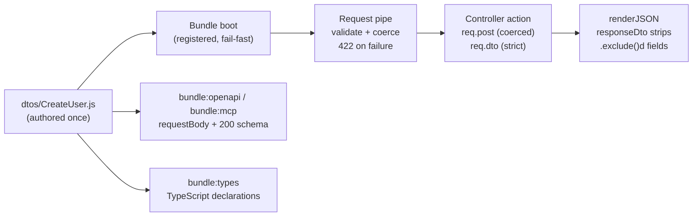

# Route DTOs

*New in 0.5.18*

A **DTO** (data transfer object) is a named data shape you author **once** per bundle and reuse for four things that would otherwise drift apart:

1. **Request validation** — the framework validates and coerces the payload *before* your action runs, and answers a clean **422** on failure (`param.dto`).
2. **Response shaping** — `.exclude()`d fields never reach the wire, or the render cache (`param.responseDto`).
3. **API schemas** — `bundle:openapi` and `bundle:mcp` emit the DTO as the route's `requestBody` / response schema.
4. **TypeScript types** — `bundle:types` emits `.d.ts` declarations for your payloads.



Routes that declare no DTO are completely untouched — the pipe is a strict no-op for them.

## Authoring a DTO

A DTO lives at `<bundle>/dtos/<Name>.js` and **must export a factory**:

```js
// dtos/CreateUser.js
module.exports = function (dto) {

    return dto.object({
        email  : dto.string().email().required(),
        age    : dto.integer().min(18),
        active : dto.boolean(),
        role   : dto.enum(['admin', 'user']).required(),
        secret : dto.string().exclude()
    }, 'CreateUser');
};
```

:::caution Always the factory form
Do **not** call `require('gina')` inside a DTO file. The offline CLI commands (`bundle:openapi`, `bundle:mcp`, `bundle:types`) load DTO files outside a running bundle, where requiring the framework throws. The factory receives the same builder in both contexts.
:::

Elsewhere (a controller, a script running inside a bundle) the builder is available as `require('gina').dto`, and registered DTOs can be read back with `dto.get('CreateUser')`.

### Field vocabulary

| Builder | Payload type after coercion | Modifiers |
| --- | --- | --- |
| `dto.string()` | `string` | `.email()`, `.minLength(n)`, `.maxLength(n)`, `.pattern(re)`, `.trim()` |
| `dto.integer()` / `dto.number()` | `number` (`'30'` → `30`) | `.min(v)`, `.max(v)` — **schema-only, see below** |
| `dto.boolean()` | `boolean` (`'true'` → `true`) | |
| `dto.enum([...])` | one of the listed values | |
| `dto.date()` | **`string`** — an ISO date-time string, **not** a `Date` | `.mask('yyyy-mm-dd')` |

Every field also accepts `.required()` / `.optional()` (the default), `.exclude()`, `.description(text)`, `.default(value)` (documentation-only) and `.example(...)`.

:::caution The honest fine print
- **`.min()` / `.max()` are schema-only.** The bounds ride into the JSON Schema (`minimum` / `maximum`) for OpenAPI and MCP consumers, but the runtime pipe does **not** enforce numeric ranges. Enforce ranges in your action until a runtime range rule ships.
- **`dto.date()` produces a `string`, not a `Date`.** The validation engine coerces a date field to an ISO date-time string (shifting it to UTC in the process, e.g. `'2020-01-02'` can become `'2020-01-01T23:00:00.000Z'`). Parse it yourself if you need a `Date` object.
- **`.pattern()` is documentation-only** on the runtime side too.
:::

## Wiring a route

Two optional keys in a route's `param` block:

```json
{
    "create-user": {
        "url": "/users/:tenant",
        "method": "POST",
        "param": {
            "control": "createUser",
            "tenant": ":tenant",
            "dto": "CreateUser",
            "responseDto": "UserView"
        }
    }
}
```

- **`param.dto`** — the payload is validated and coerced against `dtos/CreateUser.js` before `createUser` runs.
- **`param.responseDto`** — 2xx JSON responses from this route are projected through `dtos/UserView.js`.

:::info DTOs register at bundle boot — a DTO edit needs a restart
Every `param.dto` / `param.responseDto` is resolved and registered when the bundle boots, exactly like `routing.json`, `forms/` and `connectors.json`. A missing or broken DTO **refuses the boot** (so a typo'd name fails at deploy instead of silently disabling validation in production). The flip side: editing a DTO file requires a bundle restart to take effect — dev hot-reload does not re-register DTOs.
:::

## What the request pipe does

For a route with `param.dto`:

1. **Validates** the payload with the same rule engine the [forms layer](/guides/forms-and-validation#server-side-validation) uses. A **required field the client simply omitted fails validation** — omission is not a bypass.
2. On failure, answers **422** and your action never runs:

   ```json
   {
       "status": 422,
       "error": "Invalid payload",
       "fields": {
           "email": { "isEmail": "A valid email is required" }
       }
   }
   ```

   The `fields` map is `field → rule → message`, localised through the request's culture like every other validator message.
3. On success, your action receives the **coerced** payload on `req.post` (or `req.put` / `req.patch` / `req.delete`): declared fields carry real types (`'30'` → `30`, `'true'` → `true`), `.exclude()`d fields are dropped, and everything else — URL params included — is passed through verbatim.
4. **`req.dto`** additionally carries the **strict projection**: declared, non-excluded fields only. Use it when you want exactly the contract and nothing else.

```js
// controllers/controller.js
this.createUser = function (req, res, next) {

    var self = this;

    // req.post.age is a number, req.post.role is 'admin' or 'user',
    // req.post.tenant is the URL param, req.post.secret is GONE.
    // req.dto holds only the declared fields.

    self.renderJSON({ status: 201, user: req.dto });
};
```

:::caution `additionalProperties: false` documents — it does not gate
A DTO advertises `additionalProperties: false` in its JSON Schema by default (`.passthrough()` flips it), and that statement flows into OpenAPI/MCP. At **runtime**, undeclared keys are deliberately **passed through, never stripped and never rejected** — URL params arrive merged alongside the body, so rejecting undeclared keys would break every parameterised route. If you need a strict object, read `req.dto`.
:::

## Response shaping

With `param.responseDto`, every **2xx JSON** response from the route is projected through the DTO just before serialisation:

- Declared fields are kept; **`.exclude()`d fields are removed** — a password hash on the entity can never leave the process, and the render cache stores the same shaped body the wire carries.
- Undeclared keys are dropped unless the DTO declares `.passthrough()`.
- Error payloads (non-2xx) are never touched, and the framework's own `__gina*` sidecar keys survive.
- In dev mode, a declared-required field the payload does not carry logs a warning — that is usually a server bug the projection would otherwise hide.

## OpenAPI, MCP and generated types

The same DTO feeds the machine-readable surfaces:

```bash
# OpenAPI: param.dto becomes the requestBody schema, param.responseDto the 200 schema
$ gina bundle:openapi <bundle_name> @<project_name>

# MCP: inputSchema.body / outputSchema on the generated tools
$ gina bundle:mcp <bundle_name> @<project_name>

# TypeScript declarations for your DTO payloads
$ gina bundle:types <bundle_name> @<project_name>

# Emit types for all bundles in a project
$ gina bundle:types @<project_name>

# Write to a custom output path
$ gina bundle:types <bundle_name> @<project_name> --output=/path/to/dtos.d.ts
```

`bundle:types` writes `<bundle>/dtos/index.d.ts` by default and emits **two types per DTO**:

- **`CreateUser`** — the *declared* shape: what a client sends, what OpenAPI documents.
- **`CreateUserProjected`** — the declared shape minus `.exclude()`d fields: what your action actually holds (`req.dto`) and what a `responseDto` puts on the wire.

In a TypeScript (or `// @ts-check`ed) controller, thread the projected type through the request:

```ts
import type { GinaRequest } from 'gina';
import type { CreateUserProjected } from '../dtos';

function createUser(req: GinaRequest<CreateUserProjected>) {
    req.dto?.email;        // string
    req.post?.age;         // number
    req.post?.tenant;      // still reachable — URL params ride alongside
}
```

## Limitations

- The vocabulary is **flat and scalar** — no `dto.array()`, no nested object fields yet.
- `.min()` / `.max()` and `.pattern()` are **schema-only** (documented above).
- There is **no reject-unknown mode** — undeclared keys pass through by design; use `req.dto` for the strict view.
- Client-side (browser) validation from a DTO is a separate, future concern — today the browser side stays on [form rules](/guides/forms-and-validation#step-1--define-a-rule-set).

## See also

- [Forms and Validation](/guides/forms-and-validation) — the shared rule engine, live browser checking, and `forms/rules/*.json`.
- [Routing](/guides/routing) — the route object `param.dto` / `param.responseDto` hang off.
- [CLI — bundle namespace](/cli/cli-bundle) — `bundle:openapi`, `bundle:mcp`, `bundle:types`.
