# DuckDB Analytics for Node.js

DuckDB is an embedded **analytical** (columnar / OLAP) database — the
analytics-side sibling of SQLite's embedded OLTP role. Gina's `duckdb` connector
wires it into the standard entity system, so reporting and analytics SQL lives
in `.sql` files next to your entities, exactly like the MySQL / PostgreSQL
connectors:

- **Entities** — JavaScript classes that map to tables, with methods generated
  from SQL files and the standard `EventEmitter` / `.onComplete()` shim
- **Analytical SQL** — `WITH` CTEs, `FROM`-first queries, `SUMMARIZE`,
  `PIVOT` / `UNPIVOT`, `DESCRIBE` and `SHOW` are all recognised as row-returning
- **File querying** — scan Parquet / CSV / JSON files directly from SQL, no
  import or ETL step
- **Type-safe parameters** — `@param` annotations cast positional arguments
- **Read-only sharing** — `readOnly` opens a database file that any number of
  processes can read concurrently
- **Both runtimes** — the `@duckdb/node-api` native addon loads and queries
  under Node.js and under [Bun](https://bun.sh) (Gina's supported Bun floor is 1.2)

---

## When to use DuckDB

**Good fits:**

- In-process analytics and reporting bundles over application data
- Querying Parquet / CSV / JSON files directly, without an ETL hop into a server
  database
- Larger-than-memory local aggregation (DuckDB spills to disk)
- Ephemeral analytical scratch space (`":memory:"`) in tests and jobs

**Not for:**

- OLTP request paths — use [SQLite, MySQL or PostgreSQL](/guides/models)
- Session storage — DuckDB is a single-writer engine across processes; the
  [session stores](/guides/sessions) (Redis, SQLite, and friends) cover that
- Multi-pod shared state — the database is a local file

---

## Installation

```bash
npm install @duckdb/node-api
```

The driver is loaded from your project's `node_modules` at runtime — Gina has
zero hard dependency on it.

:::caution Version pinning — the driver publishes prerelease-suffixed versions

`@duckdb/node-api` publishes versions like `1.5.5-r.2`. A caret range such as
`^1.5.5` does **not** match them — npm refuses the install with "No matching
version found" — because semver ranges never match another version's prerelease
tuple. Install the latest directly (`npm install @duckdb/node-api`, as above) or
pin an explicit range such as `">=1.5.5-r.0 <2"` in your `package.json`.

:::

---

## Architecture

```mermaid
flowchart TD
    subgraph Bundle["Bundle Process"]
        C[Controller] -->|"getModel('analytics')"| E[Entity<br/>EventEmitter]
        E -->|"SQL method"| CN[DuckDB Connector]
        CN -->|"runAndReadAll / run"| DRV["@duckdb/node-api<br/>(native addon, in-process)"]
        DRV --> DB[("DuckDB file<br/>or :memory:")]
        DRV -->|"read_parquet / read_csv"| FILES[("Parquet · CSV · JSON<br/>files")]
    end

    subgraph DevMode["Dev Mode"]
        CN -->|"push _queryEntry"| QI[Query Instrumentation]
        QI --> INS[Inspector<br/>Query Tab]
    end

    style Bundle fill:#1a1a2e,stroke:#f2af0d
    style DevMode fill:#2a2a3e,stroke:#4caf50
```



The database runs **inside the bundle process** — there is no server, no
connection pool, no network round-trip. `onReady` resolves once the instance +
connection handshake completes; a successful open *is* the connectivity proof.

---

## Connector config (connectors.json)

```json
{
  "analytics": {
    "connector": "duckdb",
    "database": "analytics",
    "file": "/data/analytics.duckdb"
  }
}
```

Connection options:

| Option | Default | Notes |
|---|---|---|
| `database` | (required) | Logical name — names the model directory (`models/<database>/`) and the default file name |
| `file` | `~/.gina/{version}/{database}.duckdb` | Path to the DuckDB file, or `":memory:"` for an ephemeral in-process database |
| `readOnly` | `false` | Open read-only (driver `access_mode: 'READ_ONLY'`). The engine refuses writes, and any number of read-only processes can share one file |
| `scope` | `process.env.NODE_SCOPE` | Stamped on every entity as `_scope` |

You can also use `connector:add` to write the entry:

```bash
gina connector:add analytics @myproject --connector=duckdb
```

---

## Defining an entity

Entities live under `bundle/models/<database>/entities/`. The connector wires
each class into the gina entity system automatically:

```javascript
// bundle/models/analytics/entities/report.js
function Report(conn, caller) {}

module.exports = Report;
```

SQL methods are attached from `bundle/models/analytics/sql/report/*.sql` — the
subdirectory name matches the entity file name, and each SQL file name (without
`.sql`) becomes a method:

```text
bundle/models/analytics/
├── entities/
│   └── report.js
└── sql/
    └── report/
        ├── findById.sql
        ├── totals.sql
        └── insert.sql
```

A flat-file alternative also works: `sql/report_findById.sql` (entity name
prefix, then `_`, then the method name).

In a controller, the model is resolved by connector name and each entity is
exposed as `<entityName>Entity`:

```javascript
var db = getModel('analytics');

var report = await db.reportEntity.findById(42);
```

---

## SQL file format

```sql
/*
 * @param  {integer} $1   report id
 * @return {object}
 */
SELECT * FROM reports WHERE id = ?
```

Placeholders are **positional** — DuckDB accepts both `?` and `$1` forms, and
the connector binds the method's arguments as an array either way.

The annotations:

- `@param {<type>} <pos> <description>` — pre-execute coercion of positional
  arguments: `number` / `integer` → `parseInt`, `float` → `parseFloat` (a comma
  decimal such as `"10,5"` is normalised to `10.5`), `string` → `String`.
- `@return {<shape>}` — controls the response shape:

| Annotation | Row-returning statement | Write statement |
|---|---|---|
| `{object}` | first row or `null` | `{ changes }` |
| `{Array}` (default) | all rows or `null` | `{ changes }` |
| `{boolean}` | `rows.length > 0` | `rowsChanged > 0` |
| `{number}` (with `COUNT`) | first column of first row, as a real number | `rowsChanged` |
| (none) | all rows or `null` | `{ changes }` |

DuckDB reports the affected-row count for writes; there is **no `insertId`
analog**. Note that `INSERT … RETURNING` does not surface its rows through an
entity method — the statement head is `INSERT`, so it executes on the write
path and resolves to `{ changes }`. When you need the inserted key, select the
row back in a second method (or derive the key before inserting).

---

## Row-returning detection — CTEs and friends

Analytics SQL leans on CTEs, and DuckDB's dialect has several row-returning
statement heads beyond `SELECT`. The connector recognises all of them:

```text
SELECT · WITH · FROM · SUMMARIZE · PIVOT · UNPIVOT · DESCRIBE · SHOW
```

```sql
/*
 * @return {array}
 */
WITH monthly AS (
    SELECT date_trunc('month', created_at) AS month, SUM(amount) AS total
    FROM orders
    GROUP BY 1
)
SELECT month, total FROM monthly ORDER BY month
```

Anything else executes as a write and resolves to `{ changes }`. This matters:
an engine-level write call reports `rowsChanged: 0` for a `WITH` query and
discards its rows — so a connector that only tested for a leading `SELECT`
would silently lose CTE results. Gina's classifier routes the whole analytical
dialect to the row path.

---

## Result values — big types arrive as strings

Rows come from the driver's JSON-safe getter: `BIGINT`, `HUGEINT`, `DECIMAL`,
`DATE` and `TIMESTAMP` values arrive as **strings**, the same behaviour as the
PostgreSQL driver's bigint/numeric handling. Results always survive
`JSON.stringify` — `self.renderJSON(rows)` never meets a `BigInt`.

One consequence: `COUNT(*)` is a `BIGINT`, so an unannotated count query returns
`[{ n: "6" }]`. Annotate count queries with `@return {number}` to get a real
number back:

```sql
/*
 * @return {number}
 */
SELECT COUNT(*) FROM reports
```

---

## Querying Parquet / CSV / JSON files

DuckDB can scan files directly in SQL — no import step, no staging table. The
file-reading functions (`read_parquet`, `read_csv`, `read_json_auto`, and
globs) are DuckDB built-ins; see the
[DuckDB data-import docs](https://duckdb.org/docs/stable/data/overview) for the
full surface. They work unchanged through entity methods:

```sql
/*
 * @param  {string} $1   category filter
 * @return {array}
 */
SELECT category, SUM(amount) AS total
FROM read_parquet('/data/events/*.parquet')
WHERE category = ?
GROUP BY category
ORDER BY total DESC
```

Aggregations larger than memory spill to disk automatically — an out-of-core
query over a directory of Parquet files runs in-process in the bundle, without
an ETL hop into a server database.

---

## Calling entity methods

Methods return a native `Promise` with an `.onComplete()` shim for backward
compatibility:

```javascript
// Promise + await
var rows = await db.reportEntity.totals();

// EventEmitter-style callback
db.reportEntity.totals().onComplete(function(err, rows) {
    if (err) return next(err);
    self.renderJSON(rows);
});

// Direct callback (util.promisify-compatible)
db.reportEntity.totals(function(err, rows) {
    // ...
});
```

Errors are prefixed with the source `.sql` file path and carry Gina's
connector-error classification — an embedded engine has no transient network
class, so DuckDB errors classify as permanent (see
[Transient vs permanent errors](/guides/models#transient-vs-permanent-errors)
in the Models guide).

---

## Reserved method names — `count` cannot be used

The loader attaches each `.sql` file as an entity prototype method and
**silently skips any name that already exists on the entity's prototype
chain**. Gina extends `Object.prototype` with two helpers — `count()` (an
object property counter) and `functionCount()` — so a file named `count.sql`
is never attached: calling `entity.count()` runs the global property counter
and returns a number that has nothing to do with your query.

The same applies to any inherited API name — `EventEmitter` methods (`on`,
`once`, `emit`, …) and the entity base API (`getConnection`, `getConfig`,
`name`, `model`, …).

**Rename the file** — `countRows.sql` works, and `@return {number}` gives you
the count as a real number.

This is not DuckDB-specific. Six connectors share the same guard, and only the
colliding filename differs:

| Connector | Colliding file |
|---|---|
| MySQL, PostgreSQL, SQLite, DuckDB | `sql/<Entity>/count.sql` |
| ScyllaDB | `cql/<Entity>/count.sql` |
| MongoDB | `pipelines/<Entity>/count.json` |

Couchbase is the exception: it attaches every query method unconditionally, so
there a colliding name **shadows** the inherited helper rather than being
skipped. Count queries are simply where the collision is most often met.

Since 0.6.1 the skip is no longer silent: the connector logs a startup warning
naming the file and suggesting a rename. Earlier versions skip without any
signal. A file matching a method your entity class itself defines still skips
silently — that is by design, your code wins.

---

## Single writer across processes — locking and `readOnly`

DuckDB's file locking is stricter than SQLite's. The measured matrix:

| Scenario | Result |
|---|---|
| Same process re-opens the same file | ✅ OK — merged-process bundles share cleanly |
| A second **process** opens while a read-write holder is up | ❌ Refused — even read-only |
| Read-write holder released, then open with `readOnly` | ✅ OK — the engine refuses writes |
| N processes, **all** `readOnly` | ✅ All share the file concurrently |

Practical patterns:

- **Single bundle (or merged-process bundles)** — open read-write, no
  restrictions.
- **Produce, then publish** — a writer job builds the `.duckdb` file and exits;
  any number of reporting bundles then open it with `"readOnly": true` and
  serve queries concurrently.
- **Writer and readers at the same time, across processes** — not possible on
  one DuckDB file. Split the topology (writer produces to a file the readers
  swap in), or keep everything in one process.

---

## Dev-mode instrumentation

In dev mode every query is pushed to the
[Inspector's Query tab](/guides/inspector) with its statement, bound
parameters, duration, and result size (type `DUCKDB`). Index usage is
annotated from an optional `sql/indexes.sql` file (your `CREATE INDEX`
statements), and the Inspector's index endpoint live-introspects
`duckdb_indexes()` so the index map stays current without a restart.

---

## Trade-offs

**Pros**:

- Zero-server embedded analytics — no connection pool, no network, no
  credentials
- Columnar execution — aggregation and scan performance far beyond row stores
  at analytical shapes
- Direct Parquet / CSV / JSON querying, including globs and larger-than-memory
  spilling
- `":memory:"` databases for tests and ephemeral crunching
- JSON-safe results by construction

**Cons**:

- Single writer **across processes** — a read-write holder blocks every other
  process entirely
- Not an OLTP engine — high-frequency small writes belong in SQLite /
  MySQL / PostgreSQL
- No `insertId` — use `RETURNING` or select the row back
- `BIGINT` / `DECIMAL` / dates arrive as strings — coerce where you need
  numbers (`@return {number}` for counts)
- Session store is a non-goal — see [Sessions](/guides/sessions)

---

## Reference reading

- [DuckDB documentation](https://duckdb.org/docs/)
- [DuckDB Node.js client (`@duckdb/node-api`)](https://duckdb.org/docs/stable/clients/node_neo/overview)
- [Connectors reference](/reference/connectors)
- [Models guide](/guides/models)
