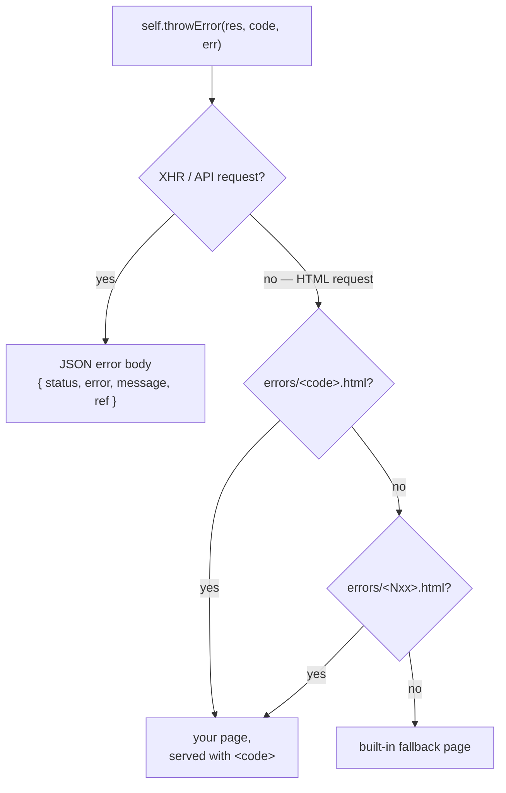

# Custom error pages

When an error reaches `self.throwError()` on an HTML request, gina serves a
built-in fallback error page. To replace it with your own, drop status-named
templates into your bundle's `templates/html/errors/` directory — no
configuration required. The page is rendered by your bundle's template engine
(swig or nunjucks) with the error's details and served with the real HTTP
status code.

## Adding error pages

```text
src/<bundle>/templates/html/
└── errors/
    ├── 404.html      ← exact status match
    ├── 500.html
    └── 5xx.html      ← family fallback: any 5xx code without an exact file
```

- **The filename is the status key.** `404.html` handles 404; a family file
  named after the first digit (`4xx.html`, `5xx.html`) catches every code in
  that class that has no exact file. An exact match always wins over the
  family file.
- **Discovery is automatic.** The directory is scanned when the bundle's
  configuration loads — restart the bundle after adding a new file. Dotfiles
  and subdirectories are ignored.
- **Shared fallbacks.** A project that defines a shared templates directory
  (`sharedPath` in the project configuration) can also provide pages in
  `<sharedPath>/errors/`; for the same status key, the bundle-local file wins.



## A working example

A controller action that fails:

```js
this.home = function(req, res) {
    return self.throwError(500, new Error('Upstream service unavailable'));
}
```

`templates/html/errors/500.html`:

```html
<!DOCTYPE html>
<html>
<head><title>{{ page.data.title }} ({{ page.data.status }})</title></head>
<body>
    <h1>{{ page.data.status }} — {{ page.data.title }}</h1>
    <p>{{ page.data.message }}</p>
    <p>Incident ref: {{ page.data.ref }}</p>
</body>
</html>
```

The response goes out as `HTTP/1.1 500` and renders:

- `page.data.status` → `500`
- `page.data.title` → `Internal Server Error`
- `page.data.message` → `Upstream service unavailable`
- `page.data.ref` → the same six-character incident ref the server log line
  carries

The same template works unchanged under both engines (`render.engine:
"swig"` or `"nunjucks"`): read the error fields via **`page.data.*`**, which
both engines expose. Nunjucks additionally exposes the same fields at the top
level (`{{ status }}`), but swig does not — `page.data.*` is the portable
form. As with any rendered view, the framework injects the bundle's
stylesheet and script assets into the page's `<head>`, so your error page is
styled like the rest of the bundle.

## What the template receives

All fields live under `page.data`:

| Field | Content |
| --- | --- |
| `status` | The HTTP status code (number). |
| `title` | The status text for the code — `Not Found`, `Internal Server Error`, … |
| `error` | The user-facing error text — the status text for the code by default. |
| `message` | The human message — the `message` of the `Error` (or object) passed to `throwError`. |
| `ref` | The six-character incident ref, identical to the one on the JSON wire and in the server log — users can relay it to support. |
| `pathname` | The requested URL, decoded. |
| `bundle` | The bundle name. |
| `session` | A snapshot of the session user (or of the session itself when no user is set). |
| `stack` | The stack trace, when an `Error` object carried one. Present in **every** scope — see the caution below. |

The `error` / `message` split matches the JSON error surface: `error` holds
the status text, and the text you passed to `throwError` lands in `message`
(see [Controllers → Incident ref](/guides/controller#incident-ref)).

:::caution Render `stack` deliberately
On the JSON error surface the framework strips `stack` outside the local
scope. A custom error template is **consumer-owned**: whatever it renders is
served, in every scope — a presence gate like
`<pre>{{ page.data.stack }}</pre>`
still prints the trace in production whenever a stack exists. Keep `stack`
out of templates you deploy, or template it only in bundles that never leave
development.
:::

## When your page is served

- **XHR / API requests always get JSON** — `{ status, error, message, ref }`
  — never the HTML page.
- **Only HTML-looking URLs qualify**: a URL with no extension, or ending in
  `.html` / `.htm`. An HTML-branch request whose URL carries another
  extension (`.json`, `.png`, …) gets the built-in fallback page instead.
- **Errors while rendering the error page fall back to the built-in page** —
  the framework never loops through your template a second time.
- The built-in fallback page also shows the status and the incident ref, so
  even an unconfigured error stays relayable.

## Status codes on the wire

Custom pages are served with their configured status — a `404.html` goes out
as HTTP 404. In gina 0.6.2 and earlier, pages rendered by the **nunjucks**
engine (and by either async-loader delegate) were served `200 OK` with the
error page as the body; this was fixed in 0.6.3. The swig engine always
served the real status.

## Transient errors and Retry-After

With [`server.transientErrors`](/guides/models#rendering-transients-as-503--retry-after-opt-in)
enabled, a transient datastore failure that would have rendered as 500 is
served as **503** — through your `503.html` or `5xx.html` page when one is
configured — with a `Retry-After` header, and with `page.data.error`
carrying your configured `transientErrors.message` instead of the raw
datastore error.

## Route authorization

The error renderer runs on a framework-injected route
(`custom-error-page@<bundle>`) that ships `public: true`, so enabling
[deny-by-default route authorization](/guides/route-authorization) cannot
take your error pages offline.

## See also

- [Views](/guides/views) — template roots, layouts and asset injection
- [Controllers](/guides/controller) — `self.throwError()` forms and the JSON
  error contract
- [templates.json reference](/reference/templates) — the file the
  `errorFiles` map belongs to
