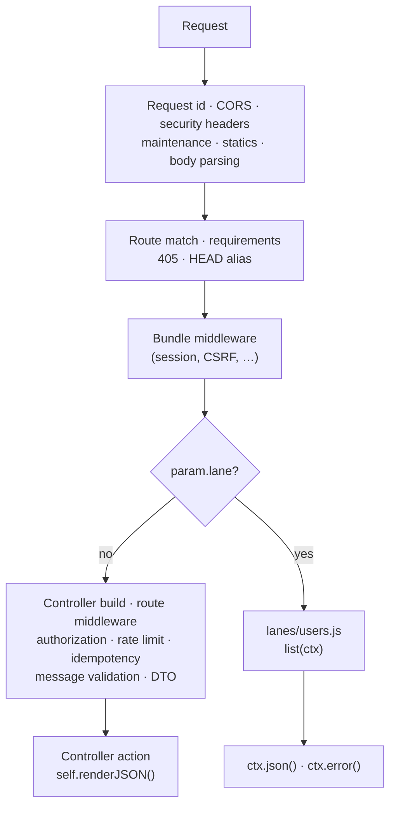

# Fast lane

*New in 0.7.2*

Before a controller route runs its action, gina builds a controller for the request: it
loads the controller file, creates a fresh instance with its per-request methods, copies
the route options, and runs the route's middleware. For a page or a form, that work pays
for itself. For a small JSON endpoint whose own work is light — a lookup, a list read from
a cache, a status probe — it is most of the request's cost.

A **lane route** skips it. The request still goes through everything gina does before the
router — the request id, CORS, the security headers, maintenance mode, statics, body
parsing, the route match and its requirements — and through the bundle's own middleware,
such as the session and CSRF layers. Then, instead of building a controller, gina calls a
plain function exported by a module in the bundle's `lanes/` directory and hands it one
context object to answer with.



Lane routes and controller routes live side by side in the same `routing.json`; a route
opts in on its own.

## When to use it

A lane route suits a JSON route that:

- answers from data its handler reads itself — a cache, a computation, an entity method;
- needs no route middleware, template, redirect, upload or render cache, and makes no
  `self.query()` call to another bundle;
- declares no authorization, rate-limit, idempotency, message-validation or request-DTO
  gate — in 0.7.2 the lane does not run these gates, and the bundle refuses to boot
  rather than skip one (see [Boot refusals](#boot-refusals)).

Keep a controller route for everything else.

**What it saves.** Measured with one bundle process serving the same JSON answer (an
object holding ten short records) both ways, over HTTP/1.1 on loopback, with the access
log line on and no gate: the lane route used a median **0.39×** the CPU of the controller
route (0.25–0.54 over ten rounds), about **150 µs less per request** on the test machine.
The saving is a fixed amount per request, so it matters most when the handler's own work
is small. A route that spends milliseconds in a database or a sibling bundle gains
proportionally less.

## Declaring a lane route

A route opts in with `param.lane`:

```json title="src/api/config/routing.json"
{
  "users-list": {
    "url"   : "/users",
    "method": "GET",
    "param" : { "lane": "users", "control": "list" }
  },
  "user-get": {
    "url"   : "/users/:id",
    "method": "GET",
    "param" : { "lane": "users", "control": "get", "id": ":id" }
  }
}
```

- **`param.lane`** names a module under the bundle's `lanes/` directory, without the `.js`
  extension: `"users"` is `src/api/lanes/users.js`, and `"admin/users"` is
  `src/api/lanes/admin/users.js`. A name is made of letters, digits and `_`, then `.` or
  `-`, with `/` between directories — no `..`, no leading `.` or `/`.
- **`param.control`** keeps its meaning — the name of the action — and here names the
  function the module exports for this route. `bundle:openapi` and `bundle:mcp` read it as
  they do on any route.
- A **URL parameter** is bound as on any route: declare `"id": ":id"` in `param` and read
  the value from `ctx.params.id` (see [Parameterized URL](/guides/routing#parameterized-url)).
  Without the binding, the route does not match a URL that carries the segment.

## Writing a handler

```js title="src/api/lanes/users.js"
// Module scope runs once, when the bundle boots.
var users = new Map([
    ['1', { id: '1', name: 'Ada' }],
    ['2', { id: '2', name: 'Grace' }]
]);

module.exports.list = function (ctx) {
    ctx.json({ users: Array.from(users.values()) });
};

module.exports.get = async function (ctx) {
    var user = users.get(ctx.params.id);
    if (!user) {
        return ctx.error(404, 'No user ' + ctx.params.id);
    }
    ctx.json({ user: user });
};
```

- The module is required **once, at bundle boot**: setup — opening a client, compiling a
  table — belongs at module scope.
- Each export a route names in `param.control` is a handler: `function (ctx)`, synchronous
  or `async`. Inside it, `this` is the module's exports object.
- A handler answers **once**, with `ctx.json()` or `ctx.error()`. A second call is logged
  and ignored. A handler that returns without answering leaves the request open, like a
  controller action that never renders.
- `ctx`'s methods are shared by every request, so a handler that passes one to a callback
  binds it first: `ctx.json.bind(ctx)`.

## The context

| Member | What it is |
|---|---|
| `ctx.params` | URL parameters (`req.params`) |
| `ctx.get` | The query-string parameters of a `GET` or `HEAD` request (`req.get`); `undefined` on other methods — see [Request objects by HTTP method](/guides/controller#request-objects-by-http-method) |
| `ctx.body` | The parsed body of a `POST`, `PUT` or `PATCH` request (`req.body`) |
| `ctx.routing` | The matched route (`req.routing`) |
| `ctx.requestId` | The request's correlation id, the one echoed in `X-Request-Id` |
| `ctx.culture` | The negotiated culture (`req.culture`) |
| `ctx.session` | `req.session` when the bundle's session middleware set one, else `undefined` |
| `ctx.req`, `ctx.res` | The live request and response; both become `null` once the response is written |
| `ctx.json(data)` | Answer with JSON — [below](#answering-with-json--ctxjsondata) |
| `ctx.error(…)` | Answer with the JSON error envelope — [below](#answering-with-an-error--ctxerror). `ctx.throwError` is the same function |
| `ctx.getConfig(name)` | The bundle configuration, or one config file's content when `name` is given — the view [`self.getConfig()`](/guides/controller#configuration) returns |
| `ctx.hasRole(role)` | `true` when the session user holds `role` — as [`self.hasRole()`](/guides/route-authorization). It also reads a machine caller the authorization gate verified, which never happens on a lane route in 0.7.2 |
| `ctx.isXMLRequest()` | `true` for an XHR or API call — see [Detecting request type](/guides/controller#detecting-request-type) |
| `ctx.pauseRequest(data)` | Keep the request in the session to replay it after a login — see [Pausing and resuming](/guides/controller#pausing-resuming-requests) |

The rest of the controller is not there: `self.query()`, `self.render()` and the other
template methods, `self.redirect()`, uploads (`self.store()`), `self.startJob()`, `self.t()`,
`self.audit()`, Early Hints, trailers and `self.setPriority()`. A route that needs one of
them stays a controller route.

## Answering with JSON — `ctx.json(data)`

`ctx.json()` behaves like [`self.renderJSON()`](/guides/controller#selfrenderjsondata):

- A `status` key naming a valid non-200 code sets the response status, and stays in the
  body. An `errno` key alone does not.
- On a 2xx, the route's `param.responseDto` shapes the payload
  (see [Response shaping](/guides/dtos#response-shaping)).
- A string is parsed as JSON first; a falsy value sends `{}`.
- A `HEAD` request gets the headers, with the `content-length` the body would have had, and
  no body.
- The access log line (`GET [200] /users`) is written as for any route.

```js
ctx.json({ items: items });                          // 200
ctx.json({ status: 201, id: created.id });           // 201
ctx.json({ status: 409, error: 'Already exists' });  // 409, the body as given
```

## Answering with an error — `ctx.error(…)`

`ctx.error()` answers with the JSON envelope of
[`self.throwError()`](/guides/controller#selfthrowerrorres-code-err): `status`, `error`
(the status text), `message` (your sentence), `fields` or `errors` when the error object
carries them, a `stack` in local scope only, and the incident `ref`. It also logs the one
error line that pairs that `ref` with the full detail and the request id.

```js
ctx.error(404, 'No such invoice');
// {"status":404,"error":"Not Found","message":"No such invoice","ref":"A1B2C3"}

ctx.error(500, err);    // the error's message; its stack in local scope only
ctx.error({ status: 422, error: 'Validation failed', fields: { email: { isEmail: 'Invalid email' } } });
ctx.error(500, { ref: 'ORDER-42', message: 'payment capture failed' });   // a relay-safe ref is kept
```

The log line names the lane:

```text
[ BUNDLE ][ api ][ Lane ][ ref A1B2C3 ][ req 9f3c… ] GET [ 404 ] /invoice/abc-123
```

A lane route always answers JSON: it has no HTML error page and no `fallback` redirect.

**A thrown error, or a rejected promise**, answers `500` through `ctx.error(500, err)`: the
envelope above, with the error's message in `message`. A controller route differs here:
its thrown action is answered by the server's own error writer, which, when it answers
JSON, puts the error text in `error` and sends no `message`. A throw after the handler has answered is logged, not
sent.

## What a lane route keeps

Everything gina does before the router runs for a lane route as for any other:

- the request id, taken from an inbound `X-Request-Id` and echoed on the response, and the
  `requestId` and `durationMs` fields of
  [JSON log lines](/guides/logging#per-request-requestid-and-durationms);
- CORS, the security headers and the headers configured under `server.response.header`;
- maintenance mode, statics, body limits and body parsing (`req.body`, `req.rawBody`);
- the route match with its `requirements`, the `405` with `Allow`, and the `HEAD` alias;
- the bundle's own middleware — the `app.use` layers of its `onInitialize`, such as the
  [session](/guides/sessions) and [CSRF](/guides/csrf) middleware — so `ctx.session` is set
  and [`csrfExempt`](/guides/csrf#per-route-opt-out) works as on any route;
- the [metrics](/guides/observability) counter and duration histogram, labelled by route;
- the access log line and the error log line.

On the Express adapter, the bundle's Express layers run before gina's request handler, so
they have run by the time the route is matched; the result is the same.

## What a lane route does not run

- **Route middleware**, declared on the route or inherited from `routing.global.json` —
  middleware is built on the controller.
- **The controller**, and everything that comes with it: templates, `self.query()`,
  redirects, uploads.
- **The render cache** — a lane route does not write it.
- **The gates** (authorization, rate limit, idempotency, message validation, request DTO),
  in 0.7.2.
- **Query capture in the dev Inspector**: the Inspector does not list the queries a lane
  handler runs. Its Flow view shows a `lane-dispatch` bar and a `response-write` bar.

## Boot refusals

Lane routes are checked when the bundle boots. Each of these refuses the boot, with an
error that names the route, so a route never runs without something it declares:

| Refused on a lane route | Why |
|---|---|
| A `param.lane` that is not a module name under `lanes/` | `..`, a leading `.` or `/`, an empty segment, or not a string |
| A `param.control` that is empty, not a string, `onReady`, `setup` or `redirect` | `onReady` and `setup` are reserved; `redirect` marks a redirect route |
| A rule that belongs to another bundle | a lane module lives in its own bundle's `lanes/` |
| Route `middleware`, declared or inherited from `routing.global.json` | middleware is built on the controller |
| `cache` | the lane does not write the render cache, so the entry would never warm |
| `negotiate`, `namespace`, or `method: "ws"` | a lane route answers JSON, loads no controller file, and is not a WebSocket route |
| `param.requireAuth` (other than `false`), `param.roles`, `param.policy`, `rateLimit` or `idempotency` (other than `false`), `param.messageValidator`, `param.dto` | in 0.7.2 the lane does not run these gates, so the gate would be skipped |
| A route not marked `"public": true` in a bundle with `auth.requireAuthByDefault` | the mode gates every route; mark an open route `public: true` |
| A route without `"rateLimit": false` in a bundle with `server.rateLimit.enabled` | the bundle-wide quota applies to every route; exempt the route explicitly |
| A missing module, a module that fails to load, or no function of that name among its own exports | the refusal carries the load error; name the module without `.js` |

Allowed on a lane route: `param.responseDto`, `csrfExempt`, `requirements`, `scopes`,
`param.public`, `param.requireAuth: false` and `rateLimit: false`.

To serve a refused route anyway, drop `param.lane` and it is a controller route again.

## Engines

| Engine | How the lane is reached |
|---|---|
| Isaac (the default), HTTP/1.1 and HTTP/2 | The lane is the last step of the bundle's middleware chain |
| Express adapter, HTTP/1.1 | The bundle's Express layers run first, then gina hands the route to the lane |

The Express adapter does not serve HTTP/2 (see [Without Express](/guides/no-express#the-express-compatibility-layer)).

## Dev mode and restarts

In dev mode an edit to a lane module is picked up by the next lane request, without a
restart:

- when the bundle's file watcher runs, gina watches the `lanes/` directories and reloads the
  lane modules after a change. The watcher starts when the bundle calls `onStarted()` in its
  `index.js` (see [Watchers](/reference/watchers)); the `index.js` gina scaffolds leaves that
  call commented out;
- without the watcher, gina reloads the lane modules on every lane request.

A module that fails to reload answers `500`, naming it, until the file is fixed. In
production the modules are loaded once, at boot.

A routing change — a new lane route, a different `param.control` — needs a bundle restart,
like any change to `routing.json`. A lane route the bundle did not register at boot
answers `500`, naming it.

## See also

- [Controllers](/guides/controller) — the request lifecycle a lane route skips
- [Routing](/guides/routing) — URL patterns, parameters and requirements
- [routing.json reference](/reference/routing) — every route field
- [Route DTOs](/guides/dtos) — `param.responseDto`, which a lane route applies
- [Middleware](/guides/middleware) — route middleware, which a lane route cannot run
