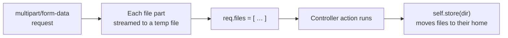
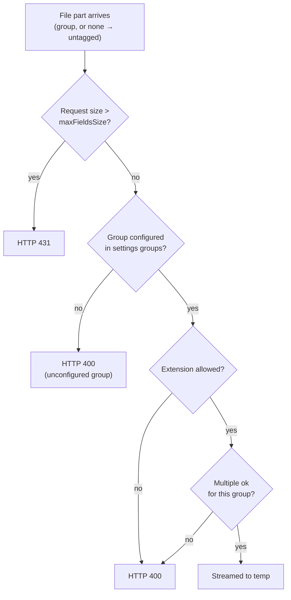
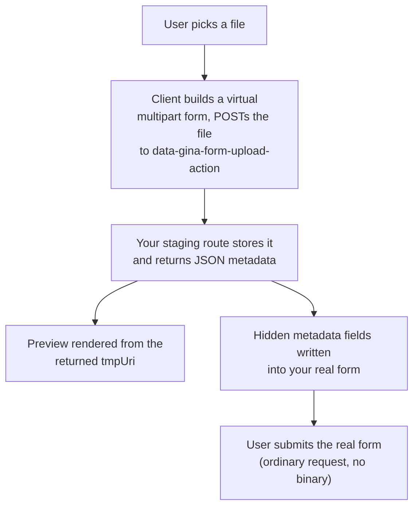

# File uploads

A file upload in Gina is an ordinary `multipart/form-data` request. The server
streams each uploaded file to a temporary file on disk and hands your controller
an array, `req.files`. From there you decide where the files live by calling
`self.store()`.

There are **two ways** to drive that, and you can use either on its own:

- **A plain multipart form** — a normal `<form enctype="multipart/form-data">`
  posts its files, your controller reads `req.files` and persists them. Nothing
  client-side to wire. This is the whole story for simple uploads.
- **The `data-gina-form-upload-*` client layer** — richer UX: the file uploads
  to a temporary endpoint the moment it is selected, an image preview appears,
  and each file gets its own reset/delete control. It is opt-in and needs a
  couple of routes you provide.

The server side (`req.files` + `self.store()` + upload groups) is the same for
both. Start there.

---

## Receiving uploads in a controller

When a request arrives as `multipart/form-data`, Gina parses it with a streaming
parser: every file part is written to a temporary file as it arrives (files are
**not** buffered in memory), and the finished list is attached to the request as
`req.files` before your controller action runs.



`req.files` is an **array**; each entry describes one uploaded file:

| Field | What it is |
|---|---|
| `name` | The form field name the file came from. |
| `originalFilename` | The filename as the client sent it. |
| `type` | The MIME type (e.g. `image/png`). |
| `size` | Size in bytes. |
| `encoding` | The part's transfer encoding. |
| `group` | The upload group the part was tagged with (see [Configuring uploads](#configuring-uploads)). |
| `path` | The absolute path of the **temporary** file on disk. |

A minimal controller that accepts an upload and moves it into place:

```js
// src/myapp/controllers/controller.media.js
this.upload = function(req, res, next) {
  if (!req.files || req.files.length === 0) {
    return self.throwError(res, 400, 'No file uploaded');
  }

  // Move the temp files into a permanent directory, then respond.
  self.store(getPath('myapp') + '/var/uploads').onComplete(function(err, files) {
    if (err) {
      return self.throwError(res, 500, err.message);
    }
    self.renderJSON({ status: 200, files: files });
  });
};
```

:::warning Multipart requests drop non-file fields
In a `multipart/form-data` request, **only files reach your controller.** Text
inputs in the same form are *not* parsed — `req.post` and `req.body` stay empty,
and `req.files` is the only thing populated. (The framework's multipart parser
intentionally ignores non-file parts.)

So a plain multipart form that mixes a `<input type="text">` with a
`<input type="file">` will give you the file but **silently lose the text
field.** If you need metadata alongside the file, either send it in a separate
(non-multipart) request, or use the [client upload layer](#the-client-upload-layer)
below — it stages the file separately so your real form submit (carrying the
text fields) is an ordinary request.
:::

---

## Persisting files — `self.store()`

Uploaded files start life in a temporary directory, so you must move them
somewhere permanent. `self.store(targetDir)` does that: it creates `targetDir`
if needed, moves every file in `req.files` into it (keeping each file's original
name), and reports back.

Two call shapes:

```js
// 1) Fluent — store everything currently in req.files:
self.store(targetDir).onComplete(function(err, files) {
  // err is false on success; files is the stored list (see below)
});

// 2) Explicit — pass the file list and a node-style callback:
self.store(targetDir, req.files, function(err, files) { /* … */ });
```

On success `err` is `false` and `files` is an array describing what was stored:

| Field | What it is |
|---|---|
| `file` | The stored file's name. |
| `filename` | The absolute path of the stored file. |
| `size` | Size in bytes. |
| `type` | The MIME type. |
| `encoding` | The part's transfer encoding. |

:::note `store()` moves; it does not validate
`self.store()` does no size, extension, or count checking — it just relocates
the temp files. Those constraints are enforced earlier, at parse time, from your
upload-group configuration (next section). Validate anything else (ownership,
business rules) in your action before or after the move.
:::

---

## Configuring uploads

Upload behaviour is configured in your bundle's `settings.json`, under the
`upload` key:

```json title="config/settings.json"
"upload": {
  "encoding": "utf8",
  "maxFieldsSize": "2MB",
  "groups": {
    "avatars": {
      "allowedExtensions": ["jpg", "jpeg", "png", "svg"],
      "isMultipleAllowed": false
    },
    "documents": {
      "allowedExtensions": ["pdf"],
      "isMultipleAllowed": true
    }
  }
}
```

| Key | Effect |
|---|---|
| `maxFieldsSize` | Maximum size of the **whole request**, in megabytes. A request larger than this is rejected with **HTTP 431** before any file is read. (The value is read as a number of MB — see the gotcha below.) |
| `groups` | Named upload groups. A file is checked against its group's rules at parse time. |
| `groups.<name>.allowedExtensions` | An array of permitted extensions (e.g. `["jpg","png"]`), or `"*"` for any. A disallowed extension is rejected with **HTTP 400**. |
| `groups.<name>.isMultipleAllowed` | When `false`, a request carrying more than one file for that group is rejected with **HTTP 400**. |

A file is tagged with a group on the client via
`data-gina-form-upload-group` (see below); on the wire the group travels in each
multipart part. **Every file must map to a configured group:** a file with no
group falls back to the default `untagged` group, and a group that is not declared
in `groups` is rejected with **HTTP 400**. Each group's `allowedExtensions` and
`isMultipleAllowed` are then enforced — `untagged` included.



---

## The client upload layer

The `data-gina-form-upload-*` attributes turn a plain `<input type="file">` into
a staged uploader: the file is sent to a temporary endpoint **as soon as it is
chosen**, a preview appears, and hidden metadata fields are written into your
real form so its eventual submit carries only lightweight references — not the
binary. This is what sidesteps the
[multipart drops non-file fields](#receiving-uploads-in-a-controller) limitation:
the file travels in its own request, and your real form submit stays an ordinary
request that keeps its text fields.



### Wire it up

Mark the file input with the attributes you need. At minimum, an upload action
and a preview container:

```html
<form id="profile" data-gina-form-rule="profile" method="POST" action="/profile">
  <input
    type="file"
    name="avatar"
    data-gina-form-upload-action="/media/stage"
    data-gina-form-upload-group="avatars"
    data-gina-form-upload-preview="avatar-preview">

  <ul id="avatar-preview"></ul>

  <button type="submit">Save</button>
</form>
```

### You provide the staging routes

The client posts the file to `data-gina-form-upload-action` and posts removals to
`data-gina-form-upload-reset-action` / `-delete-action`. **Gina does not ship
these endpoints** — you define them in your bundle. If you omit the attributes,
the client falls back to the route names `upload-to-tmp-xml` (stage) and
`upload-delete-from-tmp-xml` (remove), so you can either name your routes that or
point the attributes at routes of your own.

Your staging action receives the file as an ordinary multipart request
(`req.files`), stores it somewhere temporary with `self.store()`, and responds
with JSON the client understands:

```json
{
  "files": [
    {
      "originalFilename": "me.png",
      "mime": "image/png",
      "ext": "png",
      "size": 20480,
      "encoding": "7bit",
      "location": "/var/tmp/uploads/me.png",
      "tmpUri": "/media/tmp/me.png"
    }
  ]
}
```

The client uses each entry to render the preview (`tmpUri`, for `image/*` MIME
types) and to populate the hidden fields it injects into your real form
(`name`, `group`, `originalFilename`, `ext`, `encoding`, `size`, `location`,
`mime`, and `height`/`width` for images). Note the field names the client
expects — `mime` and `tmpUri` — differ from what `self.store()` returns
(`type`, `filename`); your staging action maps between them and supplies a
browse-able `tmpUri` for the preview.

### Attributes

| Attribute | Effect |
|---|---|
| `data-gina-form-upload-action` | URL (or route name) the chosen file is POSTed to for staging. Defaults to the route `upload-to-tmp-xml`. |
| `data-gina-form-upload-group` | The upload group tagged onto the file (drives the server-side extension/count checks). Defaults to `untagged`. |
| `data-gina-form-upload-preview` | Id of the element that receives image previews. Defaults to `<fieldId>-preview`. |
| `data-gina-form-upload-error` | Id of the element that displays staging errors. Defaults to `<fieldId>-error`. |
| `data-gina-form-upload-prefix` | Field-name prefix for the generated hidden fields. Defaults to the input's `name`. |
| `data-gina-form-upload-on-success` | Bare name of a `window` callback run when staging succeeds. |
| `data-gina-form-upload-on-error` | Bare name of a `window` callback run when staging fails. |
| `data-gina-form-upload-reset-label` | Text of the auto-generated reset link. Defaults to `Reset`. |
| `data-gina-form-upload-reset-action` | URL/route for removing a *staged* (not-yet-saved) file. Defaults to the route `upload-delete-from-tmp-xml`. |
| `data-gina-form-upload-delete-action` | URL/route for removing an *already-saved* file. |
| `data-gina-form-upload-reset-trigger` / `-delete-trigger` | Id override for the reset/delete trigger element. |
| `data-gina-form-upload-is-locked` | When set on a generated hidden field, that field is kept even if its file is removed. |

### Previews and removal

If the staging response describes an image (`mime` starting with `image/`) and a
preview container exists, the client builds an `` from the returned `tmpUri`
and appends it to the container — wrapped in an `<li>` when the container is a
`<ul>`. Cap the rendered width with a `data-preview-max-width` attribute on the
container.

Each preview gets a **Reset** link. Clicking it removes the preview and the
generated hidden fields and sends a removal request to the reset (staged) or
delete (saved) action URL.

---

## Limitations and gotchas

- **Multipart requests drop non-file fields.** Only `req.files` is populated; a
  `<input type="text">` in the same multipart form is not parsed. Send metadata
  in a separate request, or use the client layer (which keeps your real form
  submit ordinary). See the [warning above](#receiving-uploads-in-a-controller).
- **Uploaded temp files always land in the OS temp directory.** The
  `upload.tmpPath` and per-group `path` keys shown in the default `settings.json`
  are **not** honoured by the upload write path — files are written under the
  operating system's temp dir regardless. Move them to a known location promptly
  with `self.store()`; do not rely on `tmpPath` to place them.
- **`untagged` is the permissive default — restrict it if you need to.** A file
  with no group is treated as `untagged`, which ships with `allowedExtensions: "*"`
  (any extension) and `isMultipleAllowed: true`. A group that is *not* configured is
  rejected (HTTP 400), and every configured group's rules — `untagged` included —
  are enforced. But because untagged accepts any extension by default, a client can
  still sidestep a restrictive *named* group by tagging its file `untagged`: if you
  rely on an allow-list, give `untagged` its own `allowedExtensions`, or require an
  explicit group.
- **`maxFieldsSize` is read as a number of megabytes; the unit suffix is
  ignored.** `"2MB"` means 2 MB, but `"512K"` is read as `512` — i.e. 512 **MB**,
  not 512 KB. Express the limit as a plain MB number to avoid surprises.
- **`maxFields` is not enforced.** The key appears in the default config but has
  no effect; use per-group `isMultipleAllowed` to cap counts.
- **No client-side size or type checking.** The client does not pre-validate a
  file's size or extension before staging — enforcement is server-side only (the
  upload-group rules). Do not assume the browser blocked anything.
- **No upload progress bar and no drag-and-drop.** The client layer renders
  previews and reset/delete controls but does not expose upload progress, and
  files are chosen through the native file input only.

---

## See also

- [Controllers](/guides/controller) — `self.store()`, `self.renderJSON()`,
  `self.throwError()`, and reading the request.
- [Forms and Validation](/guides/forms-and-validation) — the
  `data-gina-form-*` form layer the upload attributes extend.
- [settings.json](/reference/settings) — the `upload` configuration block.
