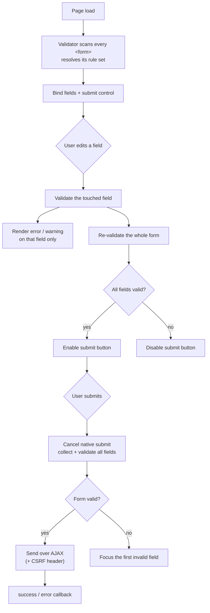
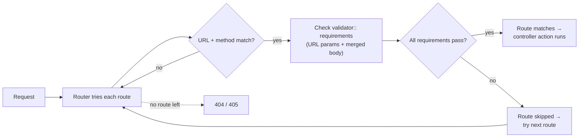

# Forms and Validation

Gina ships a form validator built on a single rule engine that runs in **two
places from one definition**:

- **In the browser**, the validator self-runs at page load. It binds your forms,
  checks fields live as the user types, gates the submit button, renders error
  messages, and submits over AJAX — no JavaScript to write.
- **On the server**, the same rule grammar validates incoming URL parameters
  through a route's `requirements`, so a request that fails validation never
  reaches your controller.

You write the rules once, as JSON. The browser uses them for fast feedback; the
server uses them to keep bad input out. The two halves never disagree, because
they execute the same code.

:::tip Where to go for the rule catalog
This guide is the how-to. For the full list of rules, transforms, signatures,
default messages, and chaining gotchas, see the
[Validation rules reference](/reference/validation-rules).
:::

---

## How live validation works

When the page loads, the validator scans every `<form>`, matches it to a rule
set, and wires the events below. Each keystroke or change runs a two-stage pass:
the touched field updates its own error display, then the whole form is
re-checked to enable or disable the submit button.



---

## Step 1 — Define a rule set

Rule sets are JSON files under your bundle's `forms/rules/` directory:

```
src/<bundle>/forms/rules/<name>.json
```

Each top-level key is a **field name** (matching the `name` attribute of an
input). Its value is an object of `ruleName: argument` pairs:

```json title="src/myapp/forms/rules/signup.json"
{
  "email": {
    "isRequired": true,
    "isEmail": true
  },
  "password": {
    "isRequired": true,
    "isString": [8, 72]
  },
  "age": {
    "isInteger": true
  }
}
```

The argument shape depends on the rule:

| Value in JSON | Passed to the rule as | Example |
|---|---|---|
| `true` | a single `true` argument | `"isRequired": true` |
| a number | one scalar argument | `"isString": 8` (minimum length 8) |
| a string | one scalar argument | `"isDate": "dd/mm/yyyy"` |
| an array | spread as positional arguments | `"isString": [8, 72]` → min 8, max 72 |

:::note Order matters
Rules run in the order they appear. `isRequired` must come **first** — the
"optional fields may be left blank" behaviour keys off whether `isRequired`
already recorded an error. See
[Chaining and ordering](/reference/validation-rules#chaining-and-ordering) in
the reference.
:::

Sub-directories become dotted paths: `forms/rules/account/signin.json` is the
rule set `account/signin`. The full catalog of rules lives in the
[Validation rules reference](/reference/validation-rules).

---

## Step 2 — Bind a form to its rules

Point a form at a rule set with `data-gina-form-rule`. The value is the rule-set
name (a `/`- or `.`-separated path resolved against `forms/rules/`):

```html
<form id="signup" data-gina-form-rule="signup" method="POST" action="/signup">
  <label>
    Email
    <input type="email" name="email" data-gina-form-field-label="Email">
  </label>

  <label>
    Password
    <input type="password" name="password" data-gina-form-field-label="Password">
  </label>

  <label>
    Age
    <input type="text" name="age" data-gina-form-field-label="Age">
  </label>

  <button type="submit">Create account</button>
</form>
```

That is the entire integration. No script tag, no initialisation call. When the
page loads, Gina:

1. finds the form, resolves the `signup` rule set, and binds each named field;
2. turns **live checking on** (it is on by default for any rule-bound form);
3. tracks the `<button type="submit">` as the form's **submit control** and
   toggles its `disabled` state as validity changes;
4. publishes the running instance as `window.gina.validator`.

:::note Binding by form id
If you omit `data-gina-form-rule`, Gina also matches the **form's `id`**
(with `-` treated as `.`) against your rule-set names. A `<form id="signup">`
with no `data-gina-form-rule` still picks up `forms/rules/signup.json`.
A form with neither a matching rule set nor the attribute is left untouched.
:::

---

## Live checking

Live checking is **on by default** for every rule-bound form. As the user
interacts with a field, Gina validates it and updates its display; it also
re-checks the whole form to enable or disable the submit control.

To turn it off for a specific form, set the attribute explicitly to `false`:

```html
<form id="signup" data-gina-form-rule="signup" data-gina-form-live-check-enabled="false">
```

A few behaviours worth knowing:

- **Only the touched field shows its error.** The whole-form pass controls the
  submit button, but error messages appear for fields the user has actually
  interacted with — untouched invalid fields stay quiet until submit.
- **Warnings vs. errors.** While a field is still being edited it shows only a
  soft *warning* border (`form-item-warning`) — the error message itself stays
  hidden. Once the field is committed (blur, or submit), it becomes a hard
  *error* (`form-item-error`) and its message is revealed. Style these two
  classes to taste.
- **Field labels.** `data-gina-form-field-label` provides the human label used
  in messages — the `%l` placeholder in a message resolves to it.

### Accessibility

Error rendering is wired for assistive technology out of the box:

- committed errors set `aria-invalid="true"` on the field (mirroring the native
  `:user-invalid` state);
- each error message is linked to its field with `aria-errormessage` (Gina does
  not override an `aria-errormessage` you set yourself);
- a visually-hidden `role="status" aria-live="polite"` region announces
  blur-time errors;
- on a failed submit, focus moves to the **first invalid field in document
  order**, so screen readers announce it immediately.

---

## Checkboxes

*Changed in 0.5.18.*

A checkbox follows the HTML standard: the **`checked` attribute decides its
initial state**, and the **live checked state decides what is posted**. The
`value` attribute never drives the rendering.

```html
<label>
  <input type="checkbox" name="remember" checked>
  Remember me
</label>
```

### What gets posted

Gina classifies a checkbox as **boolean** when any of these hold:

- it has **no `value` attribute**, or
- its `value` reads `true` or `false`, or
- its validation rule declares `isBoolean`.

A boolean checkbox always posts a real JSON boolean — `true` when checked,
`false` when not — derived from its live checked state. Anything else is a
**value-carrying** checkbox (ids, emails, any payload): it posts its `value`
string when checked and is absent from the payload when not, exactly like a
plain HTML form.

Two consequences worth naming when migrating a server: a value-less checkbox
used to post the string `"on"` when checked and nothing when unchecked — it
now posts `true`/`false` in both states, so read the boolean rather than
testing for `"on"` or for the field's mere presence. And a `FormData` you
build yourself and hand to `.send()` is posted with native multipart semantics
(entries verbatim, unchecked boxes omitted) — the classification above applies
to the fields gina collects from the form.

```json
{ "remember": { "isBoolean": true } }
```

### Migrating from value-driven state

Before 0.5.18, a checkbox whose `value` read `true` was ticked at bind time by
the framework (a value-less one was ticked on form *reset*, through the cached
default state), `value="false"` un-ticked it, and the posted boolean was
derived from the `value` string. If your markup relied on that — e.g.
`value="{{ flag }}"` with no `checked` attribute — it renders unticked under
the corrected model. Two ways forward:

- **Migrate the markup** (recommended): render the state as the standard
  attribute — `checked` — and keep or drop `value` as
  you wish.
- **Opt the form into the legacy behavior** while you migrate: set
  `data-gina-form-checkbox-value-as-state="true"` on the `<form>`. The opt-in
  is **deprecated** and kept as a transitional aid only.

In the default mode, a console warning flags the markup whose meaning changed,
in both directions: a checkbox whose `value` reads `true`/`on` without a
`checked` attribute (it used to render ticked), and a checkbox carrying the
`checked` attribute whose `value` — or `data-value` — reads `false` or empty
(it used to render unticked, and now stays ticked). Each field warns once.

---

## The submit control

The form's submit control is the element whose `disabled` state Gina toggles to
gate submission. Gina discovers it automatically:

- a `<button type="submit">` owned by the form, or
- an `<a data-gina-form-submit="true">` acting as a submit link (anchors are not
  native form controls, so this attribute opts them in).

You do not need to give the button an `id` — Gina assigns one if it is missing.

:::warning The gate is the disabled button, not an attribute
The only thing that prevents submission of an invalid form is the **disabled
state of the submit control**. There is no "block submit" data attribute. If a
form has no discoverable submit control, Gina logs a console warning and submit
gating quietly does nothing — so make sure every validated form has a
`<button type="submit">` or an `<a data-gina-form-submit="true">`.
:::

To override the HTTP method a submit link uses, add
`data-gina-form-submit-method` (e.g. `"PUT"`).

---

## Submission is always AJAX

For a validator-bound form, Gina **always cancels the native submit** and sends
the request over `XMLHttpRequest` instead — the browser never navigates away.
On submit it re-collects the fields, validates them once more, and:

- **if valid**, sends the data to the form's `action` (merging in any
  [inherited data](#inheriting-data-into-the-payload) first);
- **if invalid**, moves focus to the first invalid field and shows the errors.

### CSRF

On mutating methods (`POST` / `PUT` / `PATCH` / `DELETE`), Gina automatically
attaches an `X-Gina-CSRF-Token` request header, read from the `gina-csrf-token`
cookie. This is the header the [CSRF plugin](/guides/csrf) verifies — register
`gina.plugins.Csrf` and the token round-trips with no extra work. If the cookie
is absent (the CSRF plugin is not active), the header is simply omitted.

### Inheriting data into the payload

`data-gina-form-inherits-data` holds URL-encoded JSON that Gina merges into the
payload just before sending — useful for carrying context that is not a visible
field:

```html
<form id="signup" data-gina-form-rule="signup"
      data-gina-form-inherits-data="%7B%22source%22%3A%22landing%22%7D">
```

:::caution Treat inherited data as untrusted
Because it lives in the DOM, the client can read **and edit** this attribute, and
the merged values reach the server indistinguishable from regular form fields.
Validate and authorize them exactly as you would any other submitted input — never
put secrets or authorization scope here, and never trust a value because Gina
merged it in.
:::

---

## Reacting to the result

### Declarative callbacks

The simplest way to react to a submission is to name a callback on `window`:

```html
<form id="signup" data-gina-form-rule="signup"
      data-gina-form-event-on-submit-success="onSignupSuccess"
      data-gina-form-event-on-submit-error="onSignupError">
```

```js
// Registered on window — bare identifier, not a call expression.
window.onSignupSuccess = function (event, data) {
  // the XHR succeeded
};

window.onSignupError = function (event, data) {
  // the server returned an error
};
```

:::warning Use a bare identifier
The attribute value must be the **name** of a `window` function
(`"onSignupSuccess"`), not a call expression (`"onSignupSuccess()"`). The
call-expression form is rejected with a console warning and the handler is
not registered.
:::

### Programmatic API and events

For finer control, the live instance is published as `window.gina.validator`
once a form is ready. Each form has a handle at `gina.validator.$forms[formId]`
exposing:

| Method | Effect |
|---|---|
| `.submit()` | trigger validation + submit programmatically |
| `.send(data)` | send a payload over AJAX (skips re-validation) |
| `.reBind()` | re-scan the form after you have changed its DOM |
| `.destroy()` | unbind the form and remove its listeners |
| `.resetFields()` | restore fields to their initial values |
| `.resetErrorsDisplay()` | clear rendered error/warning state |

Events are attached with `.on(eventName, handler)`:

```js
// gina is the global; the form id here is "signup".
gina.validator.$forms['signup'].on('submit', function (event, result) {
  // Binding 'submit' intercepts the validated submit BEFORE the default
  // AJAX send — you take over from here (e.g. call .send() yourself).
  if (result.isValid()) {
    gina.validator.$forms['signup'].send(result.toData());
  }
});
```

A `ready.<formId>` event fires once a form is wired, in case you need to run
setup after binding. Binding `submit` replaces Gina's default auto-send for
that form — only do it when you mean to take control of submission.

:::note You don't construct the validator to make it run
The validator **boots itself at page load**, so a rule-bound form
(`data-gina-form-rule` + a rule set) validates with no bundle code at all — the
`window.gina.validator` instance shown above is constructed and published for
you. Bundle code constructs it explicitly —
`new (require('gina/validator'))(gina.forms.rules).on('ready', fn)` — only to
attach a lifecycle handler (`ready` / `submit`) as forms are wired, or to hand
the instance to another plugin. That explicit construction is **idempotent**
with the auto-boot: its `ready` handler still fires and forms already bound at
page load are not re-scanned — so a bundle that constructed the validator before
auto-boot keeps working unchanged.
:::

---

## Localizing built-in error labels

Gina's built-in rule error messages (`Cannot be left empty`, `A valid email is
required`, …) default to English. They localize **per culture** from the same
per-bundle catalog as the rest of [i18n](/guides/i18n) — Gina ships no
translations of its own, and both the server engine and the client validator read
that one file.

### Translate them in the catalog

Add a `_validator` block to the bundle's catalog, keyed by rule name:

```json title="locales/fr.json"
{
  "greeting": "Bonjour",
  "_validator": {
    "isRequired": "Ce champ est requis",
    "isEmail": "Une adresse e-mail valide est requise",
    "isStringMinLength": "Doit contenir au moins %s caractères"
  }
}
```

That is the whole setup — no `setErrorLabels()` call and no page bootstrap. Gina
resolves the negotiated culture's `_validator` subset server-side and whispers it
to the browser as `gina.config.validatorLabels`, so the client validator renders
localized labels too.

- **English fills the gaps, per key.** Any built-in rule you do not translate
  keeps its English default, so a partial block is fine.
- **Culture fallback.** Lookup is exact culture (`fr_FR`) → base language (`fr`)
  → English. Ship `fr.json` to cover every French variant, or `fr_FR.json` for a
  region-specific set.
- **Your custom rules are already localized.** A rule's own message (the rule
  set's `error` key, or `setFlash`) always wins over the built-in label.

:::caution Keep the `%` placeholders — and mind a bare `%`
A label may contain `%l` (the field label), `%n` (the field name) and `%s` (the
size — a length bound, or the allowed-values list). Gina substitutes them wherever
they appear, **including in your translations**, so a rule like `isStringMinLength`
must keep its `%s` or the bound vanishes from the message. This matters more than
it looks: length bounds are declared as array arguments (`"isString": [5]`), so
`isStringMinLength` applies to rule sets that never name it.

Those three are the **only** tokens, and the lookup is case-sensitive. Any other
`%` immediately followed by letters is read as a placeholder and renders as the
literal text `undefined` — including an innocent `20%sur le prix`, which matches
`%sur`. Write `20 % sur le prix`, or reword. Gina warns at bundle boot when it
spots one, naming the offending rule and catalog file.
:::

### Overriding a label at runtime

`gina.validator.setErrorLabels(labels[, culture])` overlays the catalog **per key**
— it is not a wholesale replacement:

```js
// Overrides isEmail only; every other label still comes from the catalog.
gina.validator.setErrorLabels({ isEmail: 'Adresse e-mail invalide' }, 'fr');
```

Resolution order, lowest to highest:

```text
English defaults  <  bundle catalog  <  setErrorLabels()  <  per-field message
```

Culture lookup for an override is exact culture (`fr_FR`) → base language (`fr`).
Pass an explicit second argument to target a culture other than the current one:
`setErrorLabels(labels, 'de_DE')`.

Labels are **late-bound**: the validator re-reads them on every validation pass, so
a `setErrorLabels()` call made *after* the validator is constructed — inside a
`ready` handler, say — applies from the next pass onward. It does not retroactively
change a validation already in flight.

### A label must be a string

Every label — in the catalog, in `setErrorLabels()`, as a rule's `errorMessage`
argument, or as a per-field `error` — must be a **string**. Anything else (an
object, a number, an array) is discarded: the validator warns once in the browser
console, naming the rule, and renders that rule's English default instead.

```js
// locales/fr.json  ->  { "_validator": { "isRequired": { "message": "Requis" } } }
//                                                       ^^^^^^^^^^^^^^^^^^^^^^^ object, not a string
//
// console: [FormValidator] error label for rule `isRequired` must be a string —
//          got object. Falling back to `Cannot be left empty`. …
//
// The field still fails validation; only the message falls back.
```

Only the *other* labels degrade — a sibling rule with a valid label keeps it, and a
bad `errorMessage` still renders the rule's translated catalog label if one exists.
The bundle also warns at boot for the catalog case, naming the file:

```text
[i18n] `_validator.isRequired` in …/locales/fr.json must be a string
       — the validator discards it and renders the English default
```

:::caution Before 0.5.14 this was fatal, not cosmetic
A non-string label threw, and nothing on the path caught it. The validation pass
aborted, so no error message appeared, the form never submitted through gina, and —
because the check also runs when forms are first bound — **every form further down
the page was left unbound**, silently reverting to a plain browser submit with no
client-side validation at all. If you are on an older version, treat the boot
warning above as a build-breaking error.
:::

:::note Where the catalog is read from
Catalogs are eager-loaded once at bundle boot from the bundle's `locales/`
directory, which is optional — a bundle without one is skipped silently. Two
consequences worth knowing:

- **Editing a catalog needs a bundle restart.** There is no hot reload.
- **If your build emits a release tree separate from your sources**, make sure
  `locales/` lands where the bundle is actually served from, or the block quietly
  does nothing.

The load-bearing check is the browser: `gina.config.validatorLabels` should hold
your `_validator` keys. If the server resolves the catalog but the browser still
shows English, suspect a stale client bundle rather than the catalog.
:::

:::note Server-side labels
The same catalog localizes the built-in labels in the server engine when the
negotiated `req.culture` reaches the validator. Two things stay English by design:
**route-requirement labels** (`validator::{}` in `routing.json`), because those
validators run while the route is still being matched — before the culture has
been negotiated — and any message you write yourself in a controller check.
:::

---

## Form-associated custom elements

A [custom element](/guides/client-components) can act as a form control. When it
opts into form association — `static formAssociated = true` plus
`this.internals_ = this.attachInternals()` and `internals.setFormValue(value)` on
commit — it appears in the form's `elements` collection like a native `<input>`.
FormValidator picks it up automatically: give it a `name`, reference that name in a
rule set, and the element is collected, validated, serialized into the AJAX
payload, and error-rendered exactly like a native field. Live checking runs on the
element's own **composed, bubbling `change`** event, so dispatch one whenever the
component commits a new value.

```html
<form id="review" data-gina-form-rule="review" method="POST" action="/reviews">
  <x-rating name="score" data-gina-form-field-label="Rating"></x-rating>
  <button type="submit">Submit</button>
</form>
```

```json title="src/myapp/forms/rules/review.json"
{
  "score": {
    "isRequired": true
  }
}
```

To participate, a component must:

- declare `static formAssociated = true`;
- carry a `name` attribute — the key its rule set and the submitted payload use;
- expose a `.value` getter returning the current value (a string, like every other
  field);
- dispatch a **composed, bubbling** `change` (or `input`) event on commit, so the
  form-level listener sees it;
- reflect validity through `ElementInternals` — `internals.setValidity(...)` and
  `internals.ariaInvalid` — so screen readers get the same feedback native controls
  give (see [Accessibility](#accessibility)).

:::caution A named element rides the payload — validate it server-side
A form-associated element with a `name` is serialized into the submission **even
without a rule**, exactly like [inherited data](#inheriting-data-into-the-payload):
its value lives in the DOM, so the client can read and edit it, and it reaches the
server indistinguishable from a regular field. A client-side rule is UX, not a trust
boundary. Validate and authorize every named element on the server — with or without
a rule — just as you would any other submitted input.
:::

---

## Server-side validation

**Client-side validation is for user experience, not trust.** Anyone can bypass
the browser and post directly to your endpoint, so the server must validate
independently. Gina gives you one automatic server-side layer and leaves the
rest to your controller.

### Route requirements (automatic)

A route's `requirements` validate incoming values **before the route is
considered a match**, using the same `is*` rule grammar. A route whose
requirements fail is skipped — the router moves on as if it did not exist.

```json title="config/routing.json"
"account-email-update": {
  "url": "/account/email",
  "method": "PUT",
  "requirements": {
    "email": "validator::{ isRequired: true, isEmail: true }"
  },
  "param": { "control": "emailUpdate" }
}
```

Requirements see both **URL parameters** and the **merged request body**, so on
a `POST`/`PUT` route a requirement keyed on a posted field name is checked too.



:::warning Requirements gate routing, not form errors
A failed requirement makes the route **not match** — the eventual response is a
`404`/`405` if no other route matches, not a per-field validation message. Use
requirements to keep malformed requests out (the trust gate), not to produce a
friendly "this field is wrong" response. See
[Routing → Validator requirements](/guides/routing#validator-requirements) for
the full requirements syntax.
:::

### Validating a submitted body in the controller

There is **no built-in controller method that re-runs the rule engine against a
submitted body and hands you field-level errors.** When you need to re-validate
a posted body for trust and respond with your own error shape, do it explicitly
in the action by reading the parsed body and checking the values you care about:

```js
this.emailUpdate = function(req, res, next) {
  var email = req.put.email;

  if (!email || !/^[^@\s]+@[^@\s]+\.[^@\s]+$/.test(email)) {
    return self.throwError(res, 422, 'A valid email is required');
  }

  // ... trusted from here
};
```

This keeps the trust decision in your hands. The client-side rules already gave
the user fast feedback; the route `requirements` already rejected the most
malformed requests; the controller check is the final, explicit gate for
anything that must be true before you act on the data.

---

## Attribute reference

### Form-level

| Attribute | Effect |
|---|---|
| `data-gina-form-rule` | Name of the rule set (a `/`- or `.`-path under `forms/rules/`). |
| `data-gina-form-live-check-enabled` | Toggle live checking. **On by default** for a rule-bound form; set `"false"` to disable. |
| `data-gina-form-inherits-data` | URL-encoded JSON merged into the payload before sending. |
| `data-gina-form-event-on-submit-success` | Bare name of a `window` callback run when the AJAX submit succeeds. |
| `data-gina-form-event-on-submit-error` | Bare name of a `window` callback run when the submit errors. |
| `data-gina-form-checkbox-value-as-state` | **Deprecated, transitional.** Set `"true"` to restore the pre-0.5.18 behavior where a checkbox's `value` decides its checked state. See [Checkboxes](#checkboxes). |

### Field-level

| Attribute | Effect |
|---|---|
| `data-gina-form-field-label` | Human label for the field, used by the `%l` message placeholder. |
| `data-gina-form-element-group` | Groups related radios/checkboxes for collective validation. |

### Submit control

| Attribute | Effect |
|---|---|
| `data-gina-form-submit` | Marks an `<a>` as a submit control (anchors are not native form controls). |
| `data-gina-form-submit-method` | Overrides the HTTP method a submit link uses. |

---

## Not covered here

File uploads use a separate set of `data-gina-form-upload-*` attributes and a
different submission path (multipart, staged previews). That subsystem is
documented in its own chapter — see [File uploads](/guides/file-uploads).

---

## See also

- [Validation rules reference](/reference/validation-rules) — every rule,
  transform, signature, default message, and chaining gotcha.
- [Routing → Validator requirements](/guides/routing#validator-requirements) —
  the server-side `validator::{ ... }` syntax.
- [CSRF Protection](/guides/csrf) — the plugin behind the automatic
  `X-Gina-CSRF-Token` header.
- [Controllers](/guides/controller) — reading `req.post` / `req.put` and
  responding with `self.throwError()`.
- [Client-side components](/guides/client-components) — the custom-element
  authoring model that form-associated elements build on.
