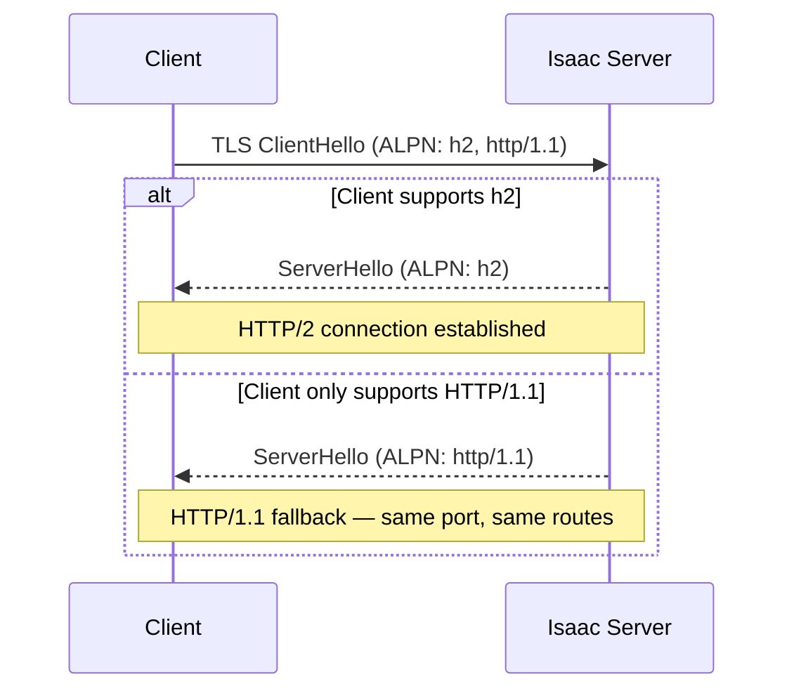

# Native HTTP/2 Server in Node.js

Most Node.js frameworks treat HTTP/2 as an afterthought. Express requires an adapter
like `http2-express-bridge` or manual wrapping with `http2.createSecureServer()`.
Fastify added HTTP/2 support later but still routes through its own abstraction layer.

Gina takes a different approach. Its built-in server engine, **Isaac**, uses Node.js
`node:http2` directly as the primary transport. HTTP/2 is not bolted on — it is the
default protocol when TLS is configured.

---

## How Isaac differs from Express-based HTTP/2

```mermaid
flowchart LR
    subgraph Express["Express + http2-express-bridge"]
        A[HTTP/2 request] --> B[http2-express-bridge]
        B --> C[Express app]
        C --> D[Middleware stack]
        D --> E[Route handler]
    end

    subgraph Gina["Gina Isaac Engine"]
        F[HTTP/2 request] --> G[Isaac server<br/>node:http2 direct]
        G --> H[Router<br/>routing.json]
        H --> I[Controller action]
    end

    style Express fill:#2a2a2a,stroke:#666
    style Gina fill:#1a1a2e,stroke:#f2af0d
```



| Capability | Express + adapter | Gina Isaac |
|---|---|---|
| HTTP/2 multiplexing | Partial — adapter translates to HTTP/1.1 semantics | Native — streams handled directly |
| Server push | Not supported by adapter | Supported (disabled by default) |
| ALPN negotiation | Manual TLS config | Built-in with `allowHTTP1` fallback |
| 103 Early Hints | Not available | Supported via `self.setEarlyHints()` |
| Stream priority | Lost in translation | Preserved |
| Per-stream flow control | Adapter limitation | Full `node:http2` control |
| Dependency count | express + http2-express-bridge + middleware | Zero external dependencies |

---

## Enabling HTTP/2

HTTP/2 activates automatically when TLS is configured in the bundle's `settings.json`:

```json title="src/<bundle>/config/settings.json"
{
  "server": {
    "engine"  : "isaac",
    "protocol": "http/2.0",
    "scheme"  : "https"
  }
}
```

Credentials (private key, certificate, CA) are configured in a separate file —
see [HTTPS & HTTP/2](/guides/https) for the full certificate setup.

No code changes are needed. Isaac detects the protocol and scheme settings and creates an
`http2.createSecureServer()` instance instead of `http.createServer()`.

### ALPN negotiation and HTTP/1.1 fallback

Isaac sets `allowHTTP1: true` by default. This enables ALPN (Application-Layer Protocol
Negotiation) during the TLS handshake — clients that support HTTP/2 negotiate `h2`,
while older clients fall back to HTTP/1.1 on the same port. No separate port or
reverse proxy is needed.



---

## HTTP/2 multiplexing

HTTP/2 multiplexing allows multiple requests and responses to be interleaved over a
single TCP connection. Isaac preserves this behavior natively because it operates
directly on `http2.Http2Stream` objects — there is no translation layer that
serializes streams back into sequential request/response pairs.

In practice, this means:

- A browser loading a page with 20 assets opens **one** TCP connection, not 6+
- API clients making concurrent calls to different endpoints share a single connection
- Latency drops significantly on high-latency links (mobile, cross-region)

---

## 103 Early Hints

Isaac supports [103 Early Hints](https://developer.mozilla.org/en-US/docs/Web/HTTP/Status/103)
via the framework's `self.setEarlyHints()` method. Early Hints let the server tell
the browser to start preloading critical resources before the final response is ready:

```javascript
// In a controller action
this.home = function(req, res, next) {
    self.setEarlyHints([
        '</css/main.css>; rel=preload; as=style',
        '</js/app.js>; rel=preload; as=script'
    ]);

    // Continue with normal rendering
    self.render(data);
};
```

On HTTP/2 connections, `setEarlyHints` sends a HEADERS frame with `:status: 103`
via `stream.additionalHeaders()`. On HTTP/1.1, it falls back to `res.writeEarlyHints()`.
The call is best-effort — a hint failure never affects the main response.

The browser receives the 103 response immediately and begins fetching the hinted
resources while the server computes the full response. This is particularly effective
for pages that require database queries or cross-bundle calls before rendering.

---

## HTTP/2 security hardening

Isaac includes built-in protection against known HTTP/2 attack vectors:

| Attack | Protection | Default |
|---|---|---|
| HPACK bomb | Header table size limit | 4 KB (`headerTableSize`) |
| Rapid Reset (CVE-2023-44487) | Rejected stream limit | 100 (`maxSessionRejectedStreams`) |
| CONTINUATION flood | Invalid frame limit | 1000 (`maxSessionInvalidFrames`) |
| Settings flood | Settings ACK timeout | 10 s |
| Stream exhaustion | Concurrent stream limit | 256 (`maxConcurrentStreams`) |

The stream and window settings are configurable in `settings.json` under `http2Options`.
Security limits (`headerTableSize`, `maxHeaderListSize`) remain hardcoded:

```json title="src/<bundle>/config/settings.json"
{
  "server": {
    "protocol": "http/2.0",
    "scheme": "https",
    "http2Options": {
      "maxConcurrentStreams": 256,
      "initialWindowSize": 655350,
      "maxSessionRejectedStreams": 100,
      "maxSessionInvalidFrames": 1000
    }
  }
}
```

:::tip
The defaults are tuned for general-purpose web applications. Increase
`maxConcurrentStreams` for API servers that handle many parallel requests per client.
Decrease `initialWindowSize` for memory-constrained environments.
:::

---

## HTTP/2 session metrics

Isaac tracks HTTP/2 session metrics internally (`server._h2Metrics`):

| Metric | Description |
|---|---|
| `activeSessions` | Currently open HTTP/2 sessions |
| `totalStreams` | Total streams opened since bundle start |
| `goawayCount` | GOAWAY frames received from clients |
| `rstCount` | RST_STREAM frames received |

The [Inspector](/guides/inspector) Flow tab visualizes HTTP/2 inter-bundle calls,
showing multiplexed request timelines in the waterfall chart.

---

## Inter-bundle communication over HTTP/2

When one bundle calls another via `self.query()`, the request travels over a cached
HTTP/2 session. Gina manages a per-hostname session cache with automatic eviction,
pre-flight PING validation, and retry with backoff. This is covered in detail in
the [HTTP/2 Resilience](/guides/http2-resilience) guide.

```mermaid
flowchart LR
    A["Bundle A<br/>(port 3100)"] -->|"self.query()<br/>HTTP/2"| B["Bundle B<br/>(port 3200)"]
    B -->|"self.query()<br/>HTTP/2"| C["Bundle C<br/>(port 3300)"]
    A -->|"self.query()<br/>HTTP/2"| C

    style A fill:#1a1a2e,stroke:#f2af0d
    style B fill:#1a1a2e,stroke:#f2af0d
    style C fill:#1a1a2e,stroke:#f2af0d
```



All inter-bundle calls use HTTP/2 multiplexing by default. Multiple concurrent
`self.query()` calls to the same upstream bundle share a single TCP connection.

---

## When to use Isaac vs Express

Isaac is the recommended engine for all new projects. The Express compatibility
layer (`server.express.js`) exists for projects that need specific Express middleware
that has no Gina equivalent.

| Use case | Recommended engine |
|---|---|
| New project | Isaac (default) |
| HTTP/2 required | Isaac |
| Specific Express middleware needed | Express adapter |
| Migrating from Express | Start with Express adapter, migrate to Isaac |

See [Architecture without Express](/guides/no-express) for more on this decision.

---

## Further reading

- [HTTPS & HTTP/2 setup](/guides/https) -- TLS certificate configuration
- [HTTP/2 client resilience](/guides/http2-resilience) -- retry, PING, session management
- [Settings reference](/reference/settings) -- full `http2Options` documentation
- [Security reference](/reference/security) -- HTTP/2 attack mitigation details
- [Multi-bundle architecture](/guides/multi-bundle) -- how bundles communicate over HTTP/2
