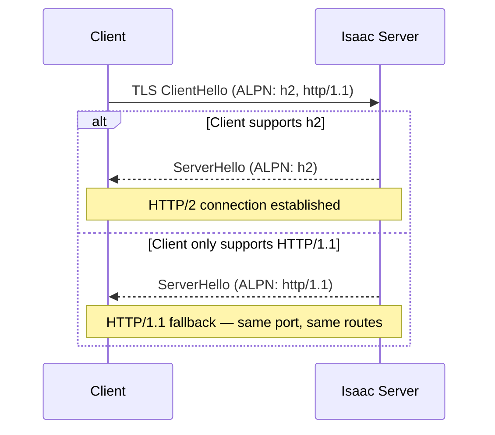

# Native HTTP/2 Server in Node.js

Most Node.js frameworks treat HTTP/2 as an afterthought. Express requires an adapter
like `http2-express-bridge` or manual wrapping with `http2.createSecureServer()`.
Fastify added HTTP/2 support later but still routes through its own abstraction layer.

Gina takes a different approach. Its built-in server engine, **Isaac**, uses Node.js
`node:http2` directly as the primary transport. HTTP/2 is not bolted on — it is the
default protocol when TLS is configured.

---

## How Isaac differs from Express-based HTTP/2


```mermaid
flowchart LR
    subgraph Express["Express + http2-express-bridge"]
        A[HTTP/2 request] --> B[http2-express-bridge]
        B --> C[Express app]
        C --> D[Middleware stack]
        D --> E[Route handler]
    end

    subgraph Gina["Gina Isaac Engine"]
        F[HTTP/2 request] --> G[Isaac server<br/>node:http2 direct]
        G --> H[Router<br/>routing.json]
        H --> I[Controller action]
    end

    style Express fill:#2a2a2a,stroke:#666
    style Gina fill:#1a1a2e,stroke:#f2af0d
```

| Capability | Express + adapter | Gina Isaac |
|---|---|---|
| HTTP/2 multiplexing | Partial — adapter translates to HTTP/1.1 semantics | Native — streams handled directly |
| Server push | Not supported by adapter | Not implemented — removed in 0.6.32 (browsers dropped it; the advertised `enablePush: false` alone never stopped a push-capable client) |
| ALPN negotiation | Manual TLS config | Built-in with `allowHTTP1` fallback |
| 103 Early Hints | Not available | Supported via `self.setEarlyHints()` |
| Stream priority | Lost in translation | Preserved |
| Per-stream flow control | Adapter limitation | Full `node:http2` control |
| Dependency count | express + http2-express-bridge + middleware | Zero external dependencies |

---

## Enabling HTTP/2

HTTP/2 activates automatically when TLS is configured in the bundle's `settings.json`:

```json title="src/<bundle>/config/settings.json"
{
  "server": {
    "engine"  : "isaac",
    "protocol": "http/2.0",
    "scheme"  : "https"
  }
}
```

Credentials (private key, certificate, CA) are configured in a separate file —
see [HTTPS & HTTP/2](/guides/https) for the full certificate setup.

No code changes are needed. Isaac detects the protocol and scheme settings and creates an
`http2.createSecureServer()` instance instead of `http.createServer()`.

### ALPN negotiation and HTTP/1.1 fallback

Isaac sets `allowHTTP1: true` by default. This enables ALPN (Application-Layer Protocol
Negotiation) during the TLS handshake — clients that support HTTP/2 negotiate `h2`,
while older clients fall back to HTTP/1.1 on the same port. No separate port or
reverse proxy is needed.


```mermaid
sequenceDiagram
    participant Client
    participant Isaac as Isaac Server

    Client->>Isaac: TLS ClientHello (ALPN: h2, http/1.1)
    alt Client supports h2
        Isaac-->>Client: ServerHello (ALPN: h2)
        Note over Client,Isaac: HTTP/2 connection established
    else Client only supports HTTP/1.1
        Isaac-->>Client: ServerHello (ALPN: http/1.1)
        Note over Client,Isaac: HTTP/1.1 fallback — same port, same routes
    end
```

---

## HTTP/2 multiplexing

HTTP/2 multiplexing allows multiple requests and responses to be interleaved over a
single TCP connection. Isaac preserves this behavior natively because it operates
directly on `http2.Http2Stream` objects — there is no translation layer that
serializes streams back into sequential request/response pairs.

In practice, this means:

- A browser loading a page with 20 assets opens **one** TCP connection, not 6+
- API clients making concurrent calls to different endpoints share a single connection
- Latency drops significantly on high-latency links (mobile, cross-region)

---

## Request priorities (RFC 9218)

[RFC 9218](https://www.rfc-editor.org/rfc/rfc9218) replaces the HTTP/2 stream-priority
tree (deprecated by RFC 9113) with one request header, `Priority`, carrying an
**urgency** `u` (`0` = most urgent … `7`, default `3`) and an **incremental** flag `i`
(the response is usable as it arrives). Browsers send it over HTTP/2 — Chrome tells
the document (`u=0, i`), render-blocking CSS (`u=0`), blocking scripts (`u=1`),
`fetch()` (`u=1, i`) and images (`u=2, i`) apart — and it survives a reverse proxy such
as nginx unchanged. Over HTTP/1.1 browsers send nothing, but the header is
transport-neutral: gina reads it on any request, on both engines.

Since 0.6.31 gina carries the signal end to end:


```mermaid
flowchart LR
    C["Browser<br/>Priority: u=1, i"] -->|"HTTP/2"| W["web bundle<br/>req.priority.urgency = 1"]
    W -->|"self.query() / self.forward()<br/>Priority: u=1, i — propagated"| A["api bundle<br/>req.priority.urgency = 1"]
    A -->|"self.startJob(fn, { urgency: 1 })"| J["job queue<br/>lowest urgency starts first"]
    W -->|"self.setPriority(...)"| R["response<br/>Priority: u=6, i"]

    style W fill:#1a1a2e,stroke:#f2af0d
    style A fill:#1a1a2e,stroke:#f2af0d
```

### Reading it — `req.priority`

Every request carries a parsed `req.priority` on both engines — routed actions, static
files and the built-in `/_gina/*` endpoints alike:

```js
this.dashboard = function(req, res, next) {
    // { urgency: 0-7, incremental: boolean, present: boolean }
    if (req.priority.present && req.priority.urgency >= 6) {
        // a background prefetch: serve the cached copy rather than recompute
    }
    self.render(data);
};
```

`present` is `true` when the client sent a header the parser could read. The RFC's
rules apply exactly: an unknown member, an out-of-range `u` or a member of the wrong
type is ignored on its own (`u=9, i` reads `{ urgency: 3, incremental: true, present:
true }`), while a field that does not parse at all — `U=1`, a trailing comma — is
ignored whole and reads as absent. Several `Priority` lines combine as one field.

### Propagating it — `self.query()` and `self.forward()`

RFC 9218 is end to end: a sub-request made on behalf of a `u=0` page is itself `u=0`.
When the inbound request carried a header, every outbound call made while serving it
sends the same value — over HTTP/1.1 and HTTP/2, on every retry, and through
`control: "forward"` routes. The `priority` option overrides that:

```js
// an explicit priority for this call — an object or a wire string
self.query({ hostname: 'api-internal', path: '/report', priority: { urgency: 5 } }, cb);
self.query({ hostname: 'api-internal', path: '/report', priority: 'u=5, i' }, cb);

// send nothing, whatever the inbound request said
self.query({ hostname: 'api-internal', path: '/report', priority: false }, cb);
```

A `Priority` header you set yourself in `options.headers` is always left alone.

### Emitting it — `self.setPriority()`

An origin can state its own view of a response's priority; an intermediary that honours
the response header merges it with the client's. Browsers ignore it, so this is
signalling for the path between origin and client:

```js
this.export = function(req, res, next) {
    self.setPriority({ urgency: 6, incremental: true }); // → Priority: u=6, i
    self.renderStream(rows);
};
```

`setPriority` returns `self` for chaining, is a silent no-op once headers are sent, and
always emits an explicit urgency — including `3` — because on a response only an
explicit member overrides the client's value.

### Scheduling with it — async jobs

The one queue gina owns is the async-job worker: `self.startJob(fn, { urgency:
req.priority.urgency })` starts the lowest-urgency queued job first. The urgency is
never inherited automatically — a client-supplied ordering hint is the application's
decision to apply. See [Async jobs — Urgency](/guides/async-jobs#urgency-opt-in).

:::caution Advisory, and client-supplied
The header is a suggestion the client makes about itself. Read `req.priority` to
**yield** — serve a cached copy, defer, queue behind more urgent work — never to grant
more. And gina does not reorder its own response writes on its strength: Node exposes
no `PRIORITY_UPDATE` frame API and no send-scheduler hook, so the framework carries the
signal and leaves stream scheduling to the runtime. The circuit breaker and the rate
limiter do not consult it either.
:::

---

## 103 Early Hints

Isaac supports [103 Early Hints](https://developer.mozilla.org/en-US/docs/Web/HTTP/Status/103)
via the framework's `self.setEarlyHints()` method. Early Hints let the server tell
the browser to start preloading critical resources before the final response is ready:

```javascript
// In a controller action
this.home = function(req, res, next) {
    self.setEarlyHints([
        '</css/main.css>; rel=preload; as=style',
        '</js/app.js>; rel=preload; as=script'
    ]);

    // Continue with normal rendering
    self.render(data);
};
```

On HTTP/2 connections, `setEarlyHints` sends a HEADERS frame with `:status: 103`
via `stream.additionalHeaders()`. On HTTP/1.1, it falls back to `res.writeEarlyHints()`.
The call is best-effort — a hint failure never affects the main response.

The browser receives the 103 response immediately and begins fetching the hinted
resources while the server computes the full response. This is particularly effective
for pages that require database queries or cross-bundle calls before rendering.

---

## HTTP/2 security hardening

Isaac includes built-in protection against known HTTP/2 attack vectors:

| Attack | Protection | Default |
|---|---|---|
| HPACK bomb | Header table size limit | 4 KB (`headerTableSize`) |
| Rapid Reset (CVE-2023-44487) | Rejected stream limit | 100 (`maxSessionRejectedStreams`) |
| Rapid Reset (CVE-2023-44487) | Runtime reset rate limit (nghttp2, every received `RST_STREAM`) — Node.js only | 1,000 burst then 33/s (`streamResetBurst` / `streamResetRate`, set together; ignored on Bun) |
| Rapid Reset (CVE-2023-44487) | Per-session client-reset rate limit (streams cut short before the response) | 200/s (`maxStreamResetsPerSecond`) |
| CONTINUATION flood | Invalid frame limit | 1000 (`maxSessionInvalidFrames`) |
| Settings flood | Settings ACK timeout | 10 s |
| Stream exhaustion | Concurrent stream limit | 256 (`maxConcurrentStreams`) |

These protections apply to any `http/2.0` bundle — `https` and cleartext h2c
(`"scheme": "http"`, e.g. behind a TLS-terminating reverse proxy) alike.

The stream and window settings are configurable in `settings.json` under `http2Options`.
Security limits (`headerTableSize`, `maxHeaderListSize`) remain hardcoded:

```json title="src/<bundle>/config/settings.json"
{
  "server": {
    "protocol": "http/2.0",
    "scheme": "https",
    "http2Options": {
      "maxConcurrentStreams": 256,
      "initialWindowSize": 655350,
      "maxSessionRejectedStreams": 100,
      "maxSessionInvalidFrames": 1000,
      "maxStreamResetsPerSecond": 200,
      "enableConnectProtocol": false
    }
  }
}
```

`maxStreamResetsPerSecond` (default 200) bounds how many streams a single session's
*client* may cut short — reset with `RST_STREAM`, of any code, before the response
completed — within a rolling one-second window. That is the rapid-reset attack shape
(CVE-2023-44487); a client that merely opens many streams, such as a sibling bundle
multiplexing hundreds of `self.query()` calls per second on one session, never trips
it (new streams stay bounded by `maxConcurrentStreams`). When a session exceeds it,
Isaac sends `GOAWAY(ENHANCE_YOUR_CALM)` and closes that session, logs a warning, and
the `/_gina/info` endpoint's `rapidResetBlocked` counter increments. It sits on top of
the runtime's own frame-level reset limit (nghttp2: a 1,000-frame burst then 33/s,
closing the session with `GOAWAY(INTERNAL_ERROR)` and no server-side event), which
counts every received reset and can be tuned through `streamResetBurst` +
`streamResetRate` — both keys together, or neither.

On Bun that runtime layer does not exist: Bun's HTTP/2 server has no frame-level reset
limit (measured on Bun 1.2–1.4) and ignores the two keys — a bundle setting them on Bun
logs one boot warning — so `maxStreamResetsPerSecond` is the only rapid-reset limit
there. The guard reads Bun's stream state to recognise a client reset, every reset code
included, and trips at the same count as on Node.js.

Before `0.6.33` the key was `maxStreamsPerSecond` and it counted *new streams*; it is
no longer read (one boot warning names it) — see the
[migration notes](/migration#0632--0633).

`enableConnectProtocol` (default `false`) advertises the RFC 8441 extended
CONNECT capability, enabling WebSocket endpoints over the same HTTP/2
connection — see [WebSocket over HTTP/2](/guides/websockets).

:::tip
The defaults are tuned for general-purpose web applications. Increase
`maxConcurrentStreams` for API servers that handle many parallel requests per client.
Decrease `initialWindowSize` for memory-constrained environments.
:::

---

## HTTP/2 session metrics

Isaac tracks HTTP/2 session metrics internally (`server._h2Metrics`):

| Metric | Description |
|---|---|
| `activeSessions` | Currently open HTTP/2 sessions |
| `totalStreams` | Total streams opened since bundle start |
| `goawayCount` | GOAWAY frames received from clients |
| `rstCount` | Streams the client cut short before the response completed (a `RST_STREAM` of any code, or the peer destroying the stream) — the signal the rapid-reset guard counts. Before `0.6.33` it always read 0. |
| `rapidResetBlocked` | Sessions closed by the rapid-reset guard (one per breach) |
| `extendedConnect` | RFC 8441 extended-CONNECT streams seen (WebSocket over HTTP/2) |

The [Inspector](/guides/inspector) Flow tab visualizes HTTP/2 inter-bundle calls,
showing multiplexed request timelines in the waterfall chart.

---

## Inter-bundle communication over HTTP/2

When one bundle calls another via `self.query()`, the request travels over a cached
HTTP/2 session. Gina manages a per-hostname session cache with automatic eviction,
pre-flight PING validation, and retry with backoff. This is covered in detail in
the [HTTP/2 Resilience](/guides/http2-resilience) guide.


```mermaid
flowchart LR
    A["Bundle A<br/>(port 3100)"] -->|"self.query()<br/>HTTP/2"| B["Bundle B<br/>(port 3200)"]
    B -->|"self.query()<br/>HTTP/2"| C["Bundle C<br/>(port 3300)"]
    A -->|"self.query()<br/>HTTP/2"| C

    style A fill:#1a1a2e,stroke:#f2af0d
    style B fill:#1a1a2e,stroke:#f2af0d
    style C fill:#1a1a2e,stroke:#f2af0d
```

All inter-bundle calls use HTTP/2 multiplexing by default. Multiple concurrent
`self.query()` calls to the same upstream bundle share a single TCP connection.

---

## When to use Isaac vs Express

Isaac is the recommended engine for all new projects. The Express compatibility
layer (`server.express.js`) exists for projects that need specific Express middleware
that has no Gina equivalent.

| Use case | Recommended engine |
|---|---|
| New project | Isaac (default) |
| HTTP/2 required | Isaac |
| Specific Express middleware needed | Express adapter |
| Migrating from Express | Start with Express adapter, migrate to Isaac |

See [Architecture without Express](/guides/no-express) for more on this decision.

---

## Further reading

- [HTTPS & HTTP/2 setup](/guides/https) -- TLS certificate configuration
- [HTTP/2 client resilience](/guides/http2-resilience) -- retry, PING, session management
- [Settings reference](/reference/settings) -- full `http2Options` documentation
- [Security reference](/reference/security) -- HTTP/2 attack mitigation details
- [Multi-bundle architecture](/guides/multi-bundle) -- how bundles communicate over HTTP/2
