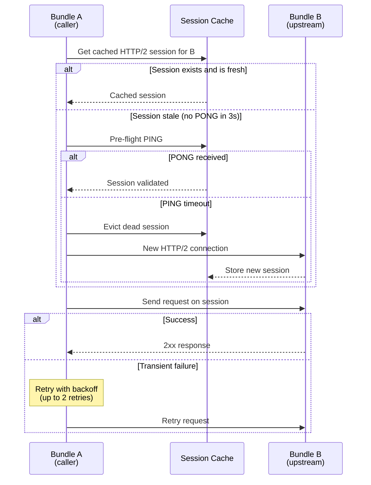

# HTTP/2 Client Resilience

When one Gina bundle calls another via `self.query()`, the request travels over a
cached HTTP/2 session. In containerised environments (Docker, OrbStack, Kubernetes),
the network layer can silently drop TCP connections without sending RST or FIN — the
cached session looks alive but is dead. Requests sent on dead sessions hang until
stream timeout, then fail with a 503.

Gina protects against this with four layers of resilience, all enabled automatically
with zero configuration.

---

## Architecture

---

## Layer 1 — Retry with backoff

Every HTTP/2 client request is retried up to 2 times (3 total attempts) on transient
failures. The first retry is immediate; subsequent retries are delayed by 500 ms to
give the network time to stabilise.

Retried error types:
- Stream timeout (no response within `requestTimeout`)
- Premature close (GOAWAY / network reset)
- Stream error (HTTP/2 protocol error)
- 502 Bad Gateway from upstream

**`ECONNREFUSED` is never retried** — the target process is down, retrying won't help.

---

## Layer 2 — Pre-flight PING

Before sending a request on a cached HTTP/2 session, Gina checks the session's
freshness. If the session hasn't received a PONG response in 3 seconds, a pre-flight
PING is sent with a 1.5-second deadline:

- **PONG received** — session is alive, proceed with the request
- **PING timeout or error** — evict the dead session from cache, create a fresh
  connection, and retry the request

This catches silently dropped connections before the application request is sent,
avoiding the full stream timeout wait.

---

## Layer 3 — Session freshness tracking

Every cached HTTP/2 session tracks when it last received a PONG response via a
`_lastPongAt` timestamp. This timestamp is:

- Set to `Date.now()` when a new session is created
- Updated on every PONG response during the keepalive interval

The pre-flight PING check uses this timestamp to decide whether to trust the session
or validate it first.

---

## Layer 4 — `retryCount` tracking

Each retry increments a numeric `retryCount` (replacing the older boolean `isRetry`).
The error object (`GinaHttp2Error`) carries both `retryCount` and a derived
`retriedOnce` boolean for backward compatibility.

---

## Constants

All constants are defined in `controller.js` and are not currently user-configurable:

| Constant | Value | Purpose |
|---|---|---|
| `HTTP2_MAX_RETRIES` | 2 | Maximum retry attempts (3 total tries) |
| `HTTP2_RETRY_DELAY_MS` | 500 | Backoff delay on 2nd+ retry |
| `HTTP2_PREFLIGHT_STALE_MS` | 3000 | Session age threshold before pre-flight PING |
| `HTTP2_PREFLIGHT_DEADLINE_MS` | 1500 | Pre-flight PING timeout |

---

## Error codes

When all retries are exhausted, `self.query()` returns a `GinaHttp2Error` with one
of these codes:

| Code | Meaning | Retried? |
|---|---|---|
| `TIMEOUT` | Stream timeout — no response within `requestTimeout` | Yes |
| `PREMATURE_CLOSE` | Stream closed before response complete (GOAWAY / reset) | Yes |
| `STREAM_ERROR` | HTTP/2 stream or session error | Yes |
| `ECONNRESET` | Connection reset by peer | Yes |
| `ECONNREFUSED` | Connection refused — target process is down | **No** |
| `PREFLIGHT_TIMEOUT` | Pre-flight PING got no PONG within deadline | Yes |
| `PREFLIGHT_FAILED` | Pre-flight PING errored | Yes |

---

## When does this matter?

This resilience layer is most important when:

- **Running in Docker/OrbStack** — OrbStack's networking silently drops TCP
  connections between host and container without sending RST or FIN
- **Multi-bundle architectures** — bundles calling each other via `self.query()`
  across containers or pods
- **Long-lived HTTP/2 sessions** — sessions cached for many minutes can go stale
  if the upstream restarts or the network path changes
- **Kubernetes pod cycling** — rolling deployments replace pods while HTTP/2
  sessions are still cached on the caller side

In single-process or same-host setups, transient failures are rare and the resilience
layer adds negligible overhead (one timestamp comparison per request).

---

## Observability

When a retry or pre-flight PING event occurs, Gina logs it at the `warn` level.
Look for these patterns in your logs:

- `[HTTP/2] Pre-flight PING timeout` — a cached session was evicted
- `[HTTP/2] Retrying request` — a transient failure triggered a retry
- `[HTTP/2] ECONNREFUSED` — the target process is unreachable (no retry)

The `/_gina/info` endpoint includes HTTP/2 session metrics (`activeSessions`,
`goawayCount`, `rstCount`) for monitoring session pool health.
