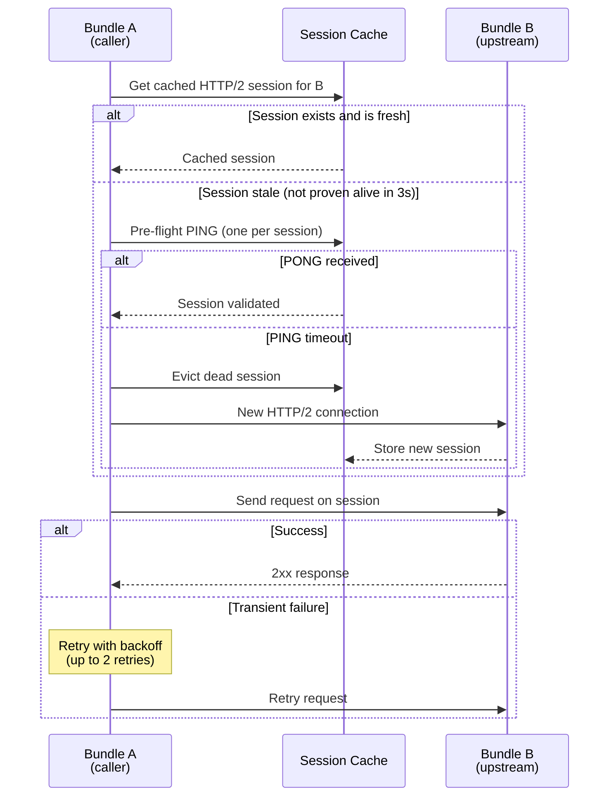

# HTTP/2 Client Resilience

When one Gina bundle calls another via `self.query()`, the request travels over a
cached HTTP/2 session. In containerised environments (Docker, OrbStack, Kubernetes),
the network layer can silently drop TCP connections without sending RST or FIN — the
cached session looks alive but is dead. Requests sent on dead sessions hang until
stream timeout, then fail with a 503.

Gina protects against this with four layers of resilience, all enabled automatically
with zero configuration.

---

## Architecture


```mermaid
sequenceDiagram
    participant A as Bundle A<br/>(caller)
    participant Cache as Session Cache
    participant B as Bundle B<br/>(upstream)

    A->>Cache: Get cached HTTP/2 session for B
    alt Session exists and is fresh
        Cache-->>A: Cached session
    else Session stale (not proven alive in 3s)
        A->>Cache: Pre-flight PING (one per session)
        alt PONG received
            Cache-->>A: Session validated
        else PING timeout
            A->>Cache: Evict dead session
            A->>B: New HTTP/2 connection
            B-->>Cache: Store new session
        end
    end
    A->>B: Send request on session
    alt Success
        B-->>A: 2xx response
    else Transient failure
        Note over A: Retry with backoff<br/>(up to 2 retries)
        A->>B: Retry request
    end
```

---

## Layer 1 — Retry with backoff

Every HTTP/2 client request is retried up to 2 times (3 total attempts) on transient
failures. The first retry is immediate; subsequent retries are delayed by 500 ms to
give the network time to stabilise.

Retried error types:
- Stream timeout (no response within `requestTimeout`)
- Premature close (GOAWAY / network reset)
- Stream error (HTTP/2 protocol error)
- Session error — every in-flight stream of a session the server closed with a GOAWAY
  (`ERR_HTTP2_SESSION_ERROR`, "Session closed with error code N"); retried since `0.6.33`
- 502 Bad Gateway from upstream

Every retry above re-sends a request the upstream may already have executed, so it is
gated on the method: only a safe method (`GET`, `HEAD`, `OPTIONS`, `TRACE`) is replayed
unless the call opts in with `retryUnsafe: true`. Two cases are exempt, because nothing
was sent or processed (both since `0.6.33`):

- a cached session that died between the cache lookup and the send — `request()` throws
  synchronously — is retried on a fresh session for any method;
- a request the upstream or the runtime **refused before processing it** — `REFUSED_STREAM`
  ([RFC 9113 §8.7](https://www.rfc-editor.org/rfc/rfc9113#section-8.7): closed "prior to
  any processing having occurred"), or the runtime declining to create the stream after a
  GOAWAY — is retried for any method too: on a fresh session when the old one was closing,
  on the same session when a healthy upstream merely refused a stream at its limit.

**`ECONNREFUSED` is never retried** — the target process is down, retrying won't help.

:::info A completed stream is never reset
Since `0.6.33` the client no longer sends an `RST_STREAM` after a completed response
(the settled-stream release used to `close()` a stream that had not yet been marked
closed). Those frames counted against the target's own reset rate limit, which closed
long-lived bundle-to-bundle sessions with `GOAWAY(INTERNAL_ERROR)` after roughly a
thousand calls — the `Session closed with error code 2` failures.
:::

---

## Layer 2 — Pre-flight PING

Before sending a request on a cached HTTP/2 session, Gina checks the session's
freshness. If the session hasn't been proven alive in the last 3 seconds — no PONG
and no response (see Layer 3) — a pre-flight PING is sent with a 1.5-second deadline:

- **PONG received** — session is alive, proceed with the request
- **PING timeout or error** — evict the dead session from cache, create a fresh
  connection, and retry the request

There is **one pre-flight PING per session**, however many calls find it stale at the
same moment: the first caller sends it, every caller arriving before the PONG waits on
that same PING, and all of them proceed — or retry — on its outcome. A **cancelled**
PING (`ERR_HTTP2_PING_CANCEL`) is inconclusive rather than proof of a dead session: the
request is sent anyway, and if the session really is gone, the send fails before
anything leaves and is retried on a fresh session.

:::info Since `0.6.33`
Before, every stale caller sent its own PING. Node.js keeps at most 10 PINGs
outstanding per session and cancels the rest at once, and a cancel was read as a dead
session — so above ten concurrent callers a healthy session was torn down, and each
caller then retried on a new connection.
:::

This catches silently dropped connections before the application request is sent,
avoiding the full stream timeout wait.

---

## Layer 3 — Session freshness tracking

Every cached HTTP/2 session tracks when it was last proven alive via a `_lastPongAt`
timestamp. This timestamp is:

- Set to `Date.now()` when a new session is created
- Updated on every PONG response during the keepalive interval
- Updated on every response received on the session (since `0.6.33`) — a busy session
  is never stale, so it never pays for a pre-flight PING

The pre-flight PING check uses this timestamp to decide whether to trust the session
or validate it first.

---

## Layer 4 — `retryCount` tracking

Each retry increments a numeric `retryCount` (replacing the older boolean `isRetry`).
The error object (`GinaHttp2Error`) carries both `retryCount` and a derived
`retriedOnce` boolean for backward compatibility.

---

## Session lifecycle

By default Gina keeps **one cached session per upstream authority**
(`scheme://host:port`) and multiplexes every concurrent `self.query()` to that
upstream on it. A keepalive PING goes out on it every 5 seconds; no PONG within 3
seconds evicts it.

Since `0.6.33`:

- **An eviction removes only the session that failed.** A dead session's `close`,
  `error` and `goaway` events fire asynchronously — often after a retry has already
  cached a fresh session for the same upstream. Every eviction now first checks that
  the cache still holds *that* session. Before, a late event evicted the fresh
  replacement, which kept running outside the cache with its own keepalive — an
  orphaned connection — and the next call opened yet another one.
- **A session that loses its place in the cache is closed gracefully.** When a session
  leaves the cache without having been found dead — evicted to make room, or deleted —
  its keepalive stops and it is closed once its in-flight requests have answered; no new
  request is sent on it.
- **At most 50 sessions are cached per bundle process**, all upstreams together. When a
  new session would exceed that, the oldest is evicted — gracefully: requests in flight
  on it still get their answers. Before `0.6.33` it was destroyed with them.

A request queued onto a session that has just started closing — the upstream's GOAWAY
landed between the pre-flight PING and the send — is refused before any processing
(`REFUSED_STREAM`; on Node.js 24 / 26 and Bun 1.4 an `ERR_HTTP2_GOAWAY_SESSION` stream
error) and is retried on a fresh session **for any method**, since nothing was
processed. Before `0.6.33` it went through the stream-error path, where only a safe
method is replayed, and a POST failed with a 503.

### The upstream closes idle sessions

Since `0.6.33` an Isaac upstream closes a session gracefully after
`http2Options.sessionIdleTimeout` of idleness — 120 s by default, on Node.js; see
[Session idle timeout](/guides/http2-native#session-idle-timeout). The keepalive PING
does **not** count as activity there, so a cached session that carried no request for
two minutes is closed by the upstream: the client receives the GOAWAY, evicts that
session (and only that one), and the next call opens a fresh connection. A call that
lands exactly as the close begins is refused before processing and retried, as above.

---

## Session pool

One session per upstream has a side effect behind a load balancer that balances **per
connection** — a Kubernetes `Service`, most TCP load balancers: every call from one
bundle process to that upstream rides the same connection, so it reaches the same
replica. Raise the pool to spread a caller over several connections:

```json title="src/<bundle>/config/settings.json"
{
  "server": {
    "query": {
      "http2SessionPool": 2
    }
  }
}
```

With a pool of N, Gina keeps up to N sessions per upstream authority and hands calls to
them in turn. Each session is its own connection, so a per-connection balancer can
place each one on a different replica. Measured through a per-connection round-robin
proxy over two replicas: a pool of 1 put 40 of 40 calls on one replica; a pool of 2
split them 20 and 20.

- **Default `1`** — the single session every earlier release used, unchanged.
- **An integer from 1 to 50**; anything else refuses the boot with a `[SERVER][#P43]`
  error naming the key. The pool counts toward the 50-session cap above, so keep
  *pool × upstreams* under 50 — past it the cap keeps evicting live sessions.
- Resolved once at engine start: changing it needs a **bundle restart**.
- A session stays on the replica its connection reached until it is closed, so the pool
  does not rebalance when replicas are added; new replicas are reached as sessions are
  replaced.

---

## Boot warmup

List the HTTP/2 upstreams a bundle calls in `server.warmup` to open their sessions when
the bundle starts, instead of on the first request:

```json title="src/<bundle>/config/settings.json"
{
  "server": {
    "warmup": ["https://api.internal:3100"]
  }
}
```

Write each entry as the `scheme://host:port` the upstream resolves to — the warmed
session is shared with `self.query()` only when that key matches exactly. The session
is validated with a PING once it is connected, then kept alive like any cached session.

:::info Since `0.6.33`
Before, the warmup kept no session on Node.js: it sent its first PING while the session
was still connecting, which Node.js always cancels, and discarded the session as dead.
:::

---

## Constants

All constants are defined in `controller.js` and are not currently user-configurable:

| Constant | Value | Purpose |
|---|---|---|
| `HTTP2_MAX_RETRIES` | 2 | Maximum retry attempts (3 total tries) |
| `HTTP2_RETRY_DELAY_MS` | 500 | Backoff delay on 2nd+ retry |
| `HTTP2_PREFLIGHT_STALE_MS` | 3000 | Session age threshold before pre-flight PING |
| `HTTP2_PREFLIGHT_DEADLINE_MS` | 1500 | Pre-flight PING timeout |
| `HTTP2_KEEPALIVE_MS` | 5000 | Keepalive PING cadence on a cached session |
| `HTTP2_KEEPALIVE_DEADLINE_MS` | 3000 | No PONG within this after a keepalive PING evicts the session |
| `HTTP2_SESSION_MAX` | 50 | Cached sessions per bundle process, all upstreams together (the [session pool](#session-pool) counts toward it) |

---

## Error codes

When all retries are exhausted, `self.query()` returns a `GinaHttp2Error` with one
of these codes:

| Code | Meaning | Retried? |
|---|---|---|
| `TIMEOUT` | Stream timeout — no response within `requestTimeout` | Yes |
| `PREMATURE_CLOSE` | Stream closed before response complete (GOAWAY / reset) | Yes |
| `STREAM_ERROR` | HTTP/2 stream error, or a session error (the session was closed by a GOAWAY while the stream was in flight; also the code a session gone before the send, or a request refused before processing, exhausts into) | Yes (safe methods, or `retryUnsafe`; the gone-before-send and refused-before-processing cases for any method) |
| `ECONNRESET` | Connection reset by peer | Yes |
| `ECONNREFUSED` | Connection refused — target process is down | **No** |
| `PREFLIGHT_TIMEOUT` | Pre-flight PING got no PONG within deadline | Yes |
| `PREFLIGHT_FAILED` | Pre-flight PING errored (a *cancelled* PING never produces this since `0.6.33` — the request is sent) | Yes |

---

## When does this matter?

This resilience layer is most important when:

- **Running in Docker/OrbStack** — OrbStack's networking silently drops TCP
  connections between host and container without sending RST or FIN
- **Multi-bundle architectures** — bundles calling each other via `self.query()`
  across containers or pods
- **Long-lived HTTP/2 sessions** — sessions cached for many minutes can go stale
  if the upstream restarts or the network path changes
- **Kubernetes pod cycling** — rolling deployments replace pods while HTTP/2
  sessions are still cached on the caller side

In single-process or same-host setups, transient failures are rare and the resilience
layer adds negligible overhead (one timestamp comparison per request).

---

## Observability

When a retry or pre-flight PING event occurs, Gina logs it at the `warn` level.
Look for these patterns in your logs:

- `[HTTP2] Pre-flight PING timeout` / `[HTTP2] Pre-flight PING error` — a cached
  session was evicted before the request was sent
- `[HTTP2][RETRYING]` — a transient failure triggered a retry
- `[HTTP2] PING timeout` / `[HTTP2] PING failed` — the keepalive found a dead session
- `[http2] GOAWAY received` — the upstream closed the session
- `[HTTP2] Session cache limit (50) reached` — the oldest session was evicted to make
  room

A refused connection (`ECONNREFUSED` — the target process is down) reaches the caller
as that error code and is never retried.

The `/_gina/info` endpoint includes HTTP/2 session metrics (`activeSessions`,
`goawayCount`, `rstCount`) for monitoring session pool health.

Every `self.query()` call also forwards the request's correlation id as
`x-request-id` (see [Request correlation](/guides/observability#request-correlation)),
so a retried or fanned-out inter-bundle request stays traceable across bundles.

Since 0.6.31 the same holds for the request's RFC 9218 `Priority` header: when the
inbound request carried one, `self.query()` resolves the outbound value **once, before
dispatch**, so every retry attempt — and every request sent on a freshly validated
session — carries the same `Priority`. Pass `priority: false` to send none, or
`priority: { urgency, incremental }` to override it for one call; see
[Request priorities](/guides/http2-native#request-priorities-rfc-9218).
