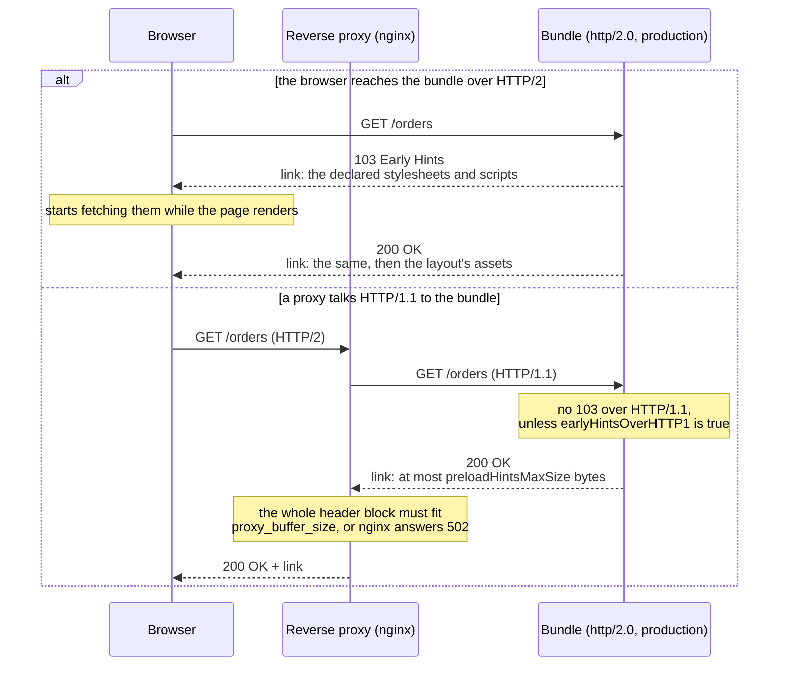

# HTTPS and HTTP/2

## Overview

Gina supports HTTPS and HTTP/2 out of the box. A new bundle serves HTTP/1.1 over `http`; for HTTP/2 over TLS, set its `protocol` to `http/2.0` and its `scheme` to `https` (both keys — see [HTTP/2](#http2)). Each bundle or service requires its own certificate (or a wildcard certificate with symlinks).

---

## Step 1 — Get a certificate

Gina does not generate certificates. Use a service like [SSL For Free](https://www.sslforfree.com) (free, 90-day certificates) to generate one for your domain.

SSL For Free will give you three files:

```
ca_bundle.crt
certificate.crt
private.key
```

---

## Step 2 — Install the certificate

Place the certificate folder in Gina's certificate directory:

```
~/.gina/certificates/scopes/<scope>/<hostname>/
```

- `<scope>`: `local` for development, `production` for your live host
- `<hostname>`: your bundle's hostname, e.g. `frontend.myproject.app`

**Example:**

```bash
mkdir -p ~/.gina/certificates/scopes/local/frontend.myproject.app
cp ca_bundle.crt certificate.crt private.key ~/.gina/certificates/scopes/local/frontend.myproject.app/
```

---

## Step 3 — Enable HTTPS

Check the current protocol status:

```bash
gina protocol:list @myproject
```

Enable HTTPS for the whole project:

```bash
gina protocol:set @myproject
```

Enable HTTPS for a specific bundle only:

```bash
gina protocol:set frontend @myproject
```

Then restart:

```bash
gina tail
```

In another terminal:

```bash
gina bundle:restart frontend @myproject
```

---

## Local development — fixing certificate errors

When developing locally, you may see:

```
Error: unable to get issuer certificate
```

This happens because the Root Certificate is not included in the downloaded certificate file. Browsers handle this automatically in production, but locally you need to chain it manually.

### Fix: generate a chained certificate

**Step 1** — Copy the content of `certificate.crt`:

```bash
cat ~/.gina/certificates/scopes/local/frontend.myproject.app/certificate.crt
```

**Step 2** — Paste it into [whatsmychaincert.com](https://whatsmychaincert.com) → _Generate the Correct Chain_. Check the **Include Root Certificate** option. Download the result and save it as:

```
~/.gina/certificates/scopes/local/frontend.myproject.app/certificate.chained+root.crt
```

**Step 3** — Combine the private key with the chained certificate:

```bash
cd ~/.gina/certificates/scopes/local/frontend.myproject.app
cat private.key certificate.chained+root.crt > certificate.combined.pem
```

Verify:

```bash
openssl verify -CAfile certificate.combined.pem certificate.crt
# => certificate.crt: OK
```

**Step 4** — Override the certificate path in your bundle config:

Create or edit `myproject/src/frontend/config/settings.server.credentials.dev.json`:

```json
{
  "ca": "${GINA_HOMEDIR}/certificates/scopes/${scope}/${host}/certificate.combined.pem"
}
```

`${GINA_HOMEDIR}`, `${scope}`, and `${host}` are substituted automatically by Gina at runtime.

Then restart all bundles:

```bash
gina bundle:restart @myproject
```

---

## Wildcard certificates

If you have a wildcard certificate (e.g. `*.myproject.app`), you only need to set it up once. Create symlinks for each bundle:

```bash
ln -s ~/.gina/certificates/scopes/local/myproject.app \
      ~/.gina/certificates/scopes/local/frontend.myproject.app
```

---

## HTTP/2

HTTPS alone does not switch a bundle to HTTP/2: with `scheme` `https` and the default `protocol`, `http/1.1`, it serves HTTPS over HTTP/1.1. Choose `http/2.0` as the protocol when you run [`gina protocol:set`](/cli/cli-protocol) (Step 3), or set both keys in the bundle's `settings.json`:

```json title="src/<bundle>/config/settings.json"
{
  "server": {
    "protocol": "http/2.0",
    "scheme"  : "https"
  }
}
```

When a client connects, Gina negotiates `h2` via ALPN. If the client does not support HTTP/2, it falls back to `http/1.1` — controlled by the `allowHTTP1` setting (default `true`). See the [server settings reference](../reference/settings#server) for the full field list.

### What Gina handles for you

- **Protocol negotiation** — `h2` via TLS ALPN, automatic `http/1.1` fallback
- **Session multiplexing** — multiple concurrent requests share a single TCP connection; the framework manages session reuse, idle eviction (120s), and dead-session detection
- **GOAWAY** — when the remote peer closes the session mid-flight, a `self.query()` call is retried on a fresh session, up to 2 times (safe methods, or `retryUnsafe`; a request refused before processing, for any method) — see [HTTP/2 client resilience](/guides/http2-resilience)
- **Forbidden headers** — `Connection`, `Transfer-Encoding`, and other HTTP/1.1-only headers are stripped automatically; you do not need to sanitise them

### What is different for your code

**Pseudo-headers replace standard headers.** On HTTP/2 requests, the client sends `:authority` instead of `Host`, `:method` instead of `Method`, and so on. Gina normalises these for you — `req.headers.host` and `req.method` work as expected in controllers.

**Status messages are suppressed.** HTTP/2 does not transmit a status reason phrase (RFC 9113 §8.3.1). `res.statusMessage` is ignored on HTTP/2 connections. Use meaningful status codes instead.

**`req.headers[':authority']`** is available if you need the raw HTTP/2 pseudo-header value (e.g. for SNI-aware routing or multi-tenant host detection).

### h2c — cleartext HTTP/2

HTTP/2 without TLS is available for internal services behind a TLS-terminating load balancer (nginx, Caddy, Cloudflare) or for local development without a certificate:

```json title="src/api/config/settings.json"
{
  "server": {
    "engine"  : "isaac",
    "protocol": "http/2.0",
    "scheme"  : "http"
  }
}
```

h2c does not use ALPN. The client must explicitly request HTTP/2 (e.g. `--http2-prior-knowledge` with curl). It is not suitable for direct browser traffic.

Since 0.5.26, a cleartext bundle outside the `local` scope announces itself at
boot with a single warning. The h2c-behind-a-terminator topology is exactly what
`settings.json > server.allowInsecure: true` acknowledges — set it and the
warning becomes one info line. To instead enforce TLS at the bundle itself, set
`server.requireHttps: true` (the cleartext bundle then refuses to start, before
anything binds). See [Settings → server](/reference/settings#server).

### Connection settings

The most common settings to tune, set in `settings.json`:

| Setting | Default | When to change |
|---|---|---|
| `allowHTTP1` | `true` | Set `false` on internal h2-only services to reject HTTP/1.1 clients |
| `keepAliveTimeout` | `"5s"` | Increase for long-lived API clients or mobile connections |
| `headersTimeout` | `"5500ms"` | Must stay above `keepAliveTimeout`; increase if slow clients time out during header send |

Full reference: [settings.json → server](../reference/settings#server).

### Preload hints

In production, a bundle whose `protocol` is `http/2.0` tells the browser which
stylesheets, scripts and images a page needs before the browser has read the page,
so it can start fetching them sooner. Gina sends these preload hints in two places:

- **`103 Early Hints`** — an informational response sent before the page is
  rendered. It lists the stylesheets and scripts declared for the page in
  [`templates.json`](/reference/templates): `_common`, the page's own entry, and
  gina's own CSS and JS. Over HTTP/2 only, unless you
  [turn it on over HTTP/1.1](#preload-hints-over-http11).
- **The `link` header of the final `200`** — the same declared stylesheets and
  scripts, then the images, stylesheets and scripts written in the page's layout.
  Pages rendered with Swig's default loader carry it; with Nunjucks or a custom
  async template loader, only the 103 is sent.



Each URL is hinted once, even when it is both declared and written in the layout.
No hint is sent in dev mode, for an XHR request, or for an asset with
[Subresource Integrity](/reference/templates#subresource-integrity-srienabled),
since a hint carries no integrity metadata. A tag written in the layout is not
hinted when the browser could not match the preload to it: a stylesheet whose
`media` is not `all` or `screen`, an alternate stylesheet, a `type="module"` or
`nomodule` script, and any tag with an `integrity` or `crossorigin` attribute.

#### Size limit

A reverse proxy reads a response's headers into a fixed buffer, and refuses a
response whose headers do not fit. nginx's
[`proxy_buffer_size`](https://nginx.org/en/docs/http/ngx_http_proxy_module.html#proxy_buffer_size)
holds the whole header block and defaults to one memory page, 4 KiB on most Linux
hosts; beyond it nginx answers `502 Bad Gateway` and logs « upstream sent too big
header ». Each hint grows by an entry of 50 to 70 bytes per asset, so a page
declaring a hundred stylesheets, or a layout holding two hundred images, could not
get through.

Since 0.7.3 each hint is limited to `preloadHintsMaxSize` bytes, 1,024 by default:
room for fifteen to twenty entries, which leaves about 3 KiB of nginx's default
buffer for the page's other headers (cookies, a Content-Security-Policy, the
security headers). The entries keep their order — the declared stylesheets, the
declared scripts, then the layout's assets — and a hint stops at the last entry
that fits. An asset left out is still loaded as usual, once the browser reads the
page.

| Proxy | Default limit on response headers |
|---|---|
| nginx | `proxy_buffer_size`: one memory page, 4 KiB or 8 KiB depending on the platform, for the whole header block |
| ingress-nginx (Kubernetes) | `proxy-buffer-size: 4k`, for the whole header block |
| Apache `mod_proxy_http` | `responsefieldsize`: 8,192 bytes per header line |

Most other proxies, load balancers and CDNs allow larger header blocks. Check each
proxy in front of the bundle before raising the limit.

#### Changing the limit

Set the two keys in `templates.json`, under `_common` for the whole bundle or in a
page's own entry:

```json title="src/<bundle>/config/templates.json"
{
  "_common": {
    "preloadHintsMaxSize": 2048
  },
  "report-print": {
    "preloadHintsEnabled": false
  }
}
```

| Key | Default | Effect |
|---|---|---|
| `preloadHintsMaxSize` | `1024` | Bytes per hint. `0` sends every entry. Any value that is not a whole number of 0 or more falls back to `1024`, with one warning per process |
| `preloadHintsEnabled` | `true` | `false` sends neither the 103 nor the `link` header. Calls to `self.setEarlyHints()` are not affected |

Raise the limit only when every proxy in front of the bundle has room for it. With
nginx, give the location that proxies your pages larger buffers:

```nginx
location / {
    proxy_pass        https://myproject_bundle;
    proxy_buffer_size 16k;
    proxy_buffers     8 16k;
}
```

#### Over HTTP/1.1 {#preload-hints-over-http11}

Since 0.7.3, gina sends no 103 over HTTP/1.1 — neither the automatic one nor those
of `self.setEarlyHints()` — unless the bundle asks for it. Browsers act on a 103
only over HTTP/2 and HTTP/3, so over HTTP/1.1 it reaches only what sits between
them and the bundle, typically a reverse proxy. nginx older than 1.29, which
includes the versions packaged by Ubuntu 22.04 and 24.04 and Debian 12, takes an
upstream 103 for the final response, and every HTML page behind it fails (in
Chromium: `ERR_HTTP2_PROTOCOL_ERROR`).

Behind a proxy that passes 103 responses on — nginx 1.29 or later with the
[`early_hints`](https://nginx.org/en/docs/http/ngx_http_core_module.html#early_hints)
directive, or Apache — turn it on in the bundle's `settings.json`:

```json title="src/<bundle>/config/settings.json"
{
  "server": {
    "earlyHintsOverHTTP1": true
  }
}
```

It must be the boolean `true`. The 103 then carries the same entries, limited to
`preloadHintsMaxSize`; nginx counts it against `proxy_buffer_size` as well.
Node.js checks each entry as a single `Link` value and refuses an entry whose
parameter holds a space, such as an `imagesrcset`: that whole 103 is then dropped.

#### Custom hints — `self.setEarlyHints()`

To hint an asset gina cannot know about, such as an image chosen at runtime or a
font, call `self.setEarlyHints()` at the start of the action:

```javascript
self.setEarlyHints([
    '</css/app.css>; rel=preload; as=style',
    '</js/app.js>; rel=preload; as=script'
]);
```

On HTTP/2 the 103 is sent at once, through
`stream.additionalHeaders({ ':status': 103 })`, with the entries joined into one
`link` header and no size limit. On HTTP/1.1 it is sent only when
`earlyHintsOverHTTP1` is `true`, through `res.writeEarlyHints()`, limited to
`preloadHintsMaxSize`. The call is best-effort: a hint that fails never affects
the main response.

### Stream limits

`maxConcurrentStreams` and `initialWindowSize` are configurable per bundle via `settings.json`:

```json title="src/api/config/settings.json"
{
  "server": {
    "http2Options": {
      "maxConcurrentStreams": 256,
      "initialWindowSize": 655350
    }
  }
}
```

Defaults are `256` concurrent streams and `655350` bytes initial window size. Security-related HTTP/2 settings remain hardcoded.
