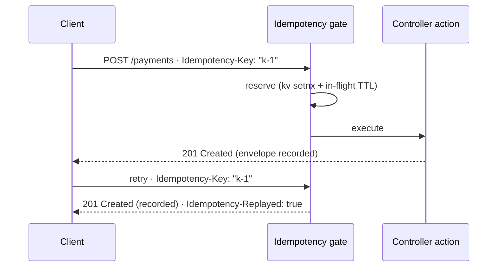

# Idempotency keys

A client sends a payment request, the connection drops before the response arrives, the
client retries — and the payment executes **twice**. The idempotency gate (per the IETF
draft `draft-ietf-httpapi-idempotency-key-header`) makes the retry safe: the first request
bearing an `Idempotency-Key` header reserves the operation and executes; a retry with the
same key and payload is answered with the **recorded first response** instead of executing
again.



## Enable it

Participation is opt-in **twice** — a server block arms the gate, and each route joins
explicitly. Everything else is untouched.

**1. Declare a kv namespace** for reservations and recorded envelopes
(`settings.json` — see the [Key-value store](/guides/kv) guide):

```json title="src/myapp/config/settings.json (excerpt)"
{
  "kv": {
    "namespaces": {
      "idempotency": { "store": "kvstore" }
    }
  },
  "server": {
    "idempotency": {
      "enabled": true,
      "namespace": "idempotency",
      "keyField": "id"
    }
  }
}
```

`keyField` names the `session.user` property that identifies a signed-in caller — the same
convention as `server.rateLimit.keyField`. Machine callers key on their registered name
automatically.

**2. Opt a route in** (`routing.json`, top-level key — not under `param`):

```json title="src/myapp/config/routing.json (excerpt)"
"payment-create": {
    "method": "POST",
    "url": "/payments",
    "idempotency": { "required": true },
    "param": {
        "control": "createPayment",
        "requireAuth": true
    }
}
```

`idempotency: true` enables deduplication when the client sends the header;
`{ "required": true }` additionally answers **400** when the header is missing. Restart the
bundle to apply — the policy is resolved once at engine start, and a structurally invalid
enabled block refuses the boot.

## The client contract

Clients generate a unique key per operation attempt (a UUID is the recommended shape) and
resend the **same key with the same payload** on every retry:

```
Idempotency-Key: "8e03978e-40d5-43e8-bc93-6894a57f9324"
```

| Situation | Answer |
|---|---|
| First request with a key | Executes normally; the rendered JSON response is recorded |
| Retry, same key + same payload | The **recorded** response, plus `Idempotency-Replayed: true` |
| Retry while the original is still executing | **409 Conflict** + `Retry-After` |
| Same key, **different** payload | **422** — a key must never be reused with another payload |
| Header missing on a `required` route | **400** |
| Reservation store unreachable (`failMode: "closed"`) | **503** + `Retry-After` |

The payload comparison uses a sha256 fingerprint over the verbatim request body
(`req.rawBody` for JSON bodies — byte-exact), so reformatting a JSON body counts as a
different payload.

## What is stored — and what is not

- A recorded envelope holds the **status**, the `content-type` and `location` headers, the
  serialized JSON body, and the payload fingerprint. `set-cookie` is **never** stored — a
  replay must not re-issue another execution's session material.
- Storage is **principal-scoped by construction**: the reservation key carries the caller
  identity, the HTTP method and the route, so a stored response can never be served to a
  different caller, and the same key on a different endpoint is simply a different
  operation. Requests with **no resolvable principal** (no session user, no machine caller)
  are skipped entirely — anonymous deduplication would let a guessed key replay another
  user's response.
- Responses with status **>= 500**, bodies over `maxBodySize` (default 256 KB), and any
  response that does not pass through `renderJSON` (a template render, a redirect, an error
  egress) **release** the reservation instead of storing — a retry then re-executes. Only
  what was recorded is ever replayed, and transient failures never become sticky.
- A crashed process cannot leave a key stuck: the in-flight reservation expires on its own
  (`inflightTtl`, default 2 minutes) and the retry re-executes.

## Scope and retention

The kv namespace's **backend chooses the deduplication scope**: an in-memory namespace
dedups per process (a retry landing on another replica re-executes — the boot resolver
warns about this), while a redis- or sqlite-backed namespace shares reservations across
replicas. Give the gate its **own** namespace so its `failMode` is unambiguously the dedup
outage policy: `"open"` proceeds without deduplication on a backend error, `"closed"`
answers 503.

Recorded envelopes live for `ttl` (default 24 hours). Per the draft, **publish your
retention policy** to API consumers — a retry after expiry re-executes the operation.

Tuning knobs on `server.idempotency`: `ttl`, `inflightTtl`, `maxBodySize`, `retryAfter`
(the `Retry-After` value on 409/503 answers). All accept duration strings (`"24h"`,
`"30s"`) or milliseconds.

## Ordering

The gate runs after route authorization and the [rate limiter](/guides/rate-limiting), and
before request-payload validation — [message validation](/guides/message-validation) when
a route declares it, then DTO field validation: `401 → 429 → 409/422/replay → message
validation → 422`. A throttled or
unauthenticated caller never touches the reservation store, and a replayed response never
re-runs the controller action.

## See also

- [Rate limiting](/guides/rate-limiting) — the sibling router-band gate, sharing the same
  caller-identity convention.
- [Key-value store](/guides/kv) — namespaces, backends and `failMode`.
- [Validation rules reference](/reference/validation-rules) — request-payload validation,
  which runs after this gate.
