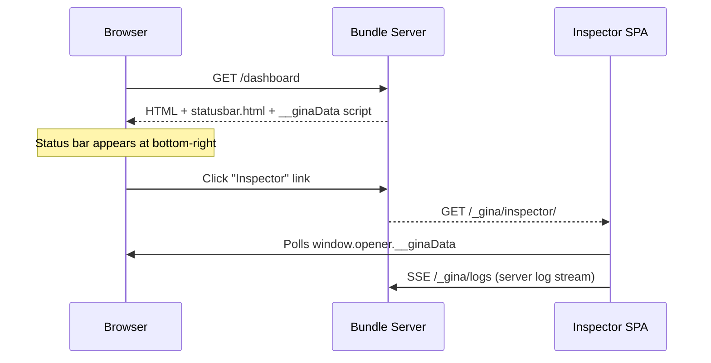
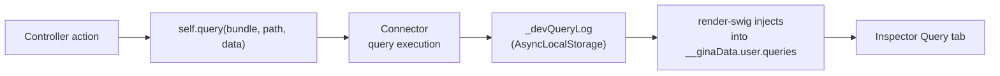

# Inspector

The Inspector is a built-in dev-mode SPA that shows you exactly what happens on every
HTTP request: controller data, DOM state, form values, database queries, and real-time
logs from both the client and server. It runs inside your bundle's own process at
`/_gina/inspector/` — no extra port, no separate service, no configuration.

---

## How it works

When `NODE_ENV_IS_DEV` is `true`, the framework injects a status bar into every HTML
response and serves the Inspector SPA on a built-in `/_gina/*` endpoint:



The Inspector reads data through three channels (in priority order):

1. **`window.opener.__ginaData`** — same-origin poll every 2 seconds (always available
   when opened via the statusbar link)
2. **`localStorage.__ginaData`** — fallback for direct URL access or cross-tab use
3. **engine.io socket** — real-time push when `ioServer` is configured

---

## Status bar

Every HTML response in dev mode includes a status bar fixed at the bottom-right corner:

- **Status dot** — green when the page rendered successfully, red when `data.error` is set
- **Bundle label** — shows `bundle@env` (e.g. `dashboard@dev`)
- **Inspector link** — opens the Inspector in a popup window (right third of screen, full height)

The status bar is rendered inside a Shadow DOM host (`#__gina-statusbar`) so its
styles never leak into your app's CSS.

### `ginaToolbar` shim

The status bar includes a compatibility shim for the legacy `ginaToolbar` API. The
validator plugin and the XHR event system call `ginaToolbar.update(section, data)` to
push form state and XHR response data — the shim captures these calls and syncs them
to `localStorage.__ginaData` so the Inspector can display them.

---

## Tabs

### Data

Displays the full `__ginaData.user` object as a collapsible JSON tree. Every key is
foldable; leaf values are click-to-copy. Features:

- **Dot-path search** — type `environment.bundle` to jump to a nested key
- **Raw JSON mode** — toggle to see the raw JSON string
- **Download** — export the current data snapshot as a `.json` file
- **Auto-expand** — expand all tree nodes at once (persisted in settings)

### View

Shows DOM and element state: properties, HTML attributes, computed styles. The header
displays page performance badges when data is available:

| Badge | Source | Shows |
|---|---|---|
| Engine | Template detection | e.g. `swig` |
| Weight | Performance API | Resource size vs transfer size |
| Time | Performance API | Load time vs transfer time |
| FCP | Performance API | First Contentful Paint |

**Performance anomaly alerts** — when a metric exceeds a built-in threshold, the
View tab label shows a pulsing dot (amber for warnings, red for critical) and the
affected badge border changes to highlight the issue. Hovering the badge shows which
threshold was exceeded.

| Metric | Warning | Critical |
|---|---|---|
| Load time | > 3 s | > 10 s |
| Transfer size | > 1 MB | > 5 MB |
| FCP | > 2.5 s | > 4 s |
| Query total duration | > 500 ms | > 2 s |
| Query count | > 20 | > 50 |

The anomaly check also considers query performance (total duration and count) when
query instrumentation is active, providing a holistic view of page health.

### Forms

Displays form field values and validation state from the validator plugin. Each form
is keyed by its `id` attribute. Fields show current value, validation rules, and
error messages.

### Query

Surfaces every database query tied to the current HTTP request. Supported connectors:
**Couchbase**, **MySQL**, **PostgreSQL**, and **SQLite**.



Each query entry shows:

- **Type** — query type (e.g. `N1QL`, `SQL`)
- **Trigger** — `entity#method` as a split badge
- **Statement** — SQL with syntax highlighting (keywords blue, functions purple, placeholders gold, strings green)
- **Params** — positional parameters `$1`, `$2` with color-coded values
- **Timing** — execution duration in ms
- **Origin** — which bundle executed the query
- **Connector** — which connector was used (e.g. `couchbase`, `mysql`, `postgresql`, `sqlite`)
- **Index badges** — which database indexes cover the query (see below)

A **search bar** filters across all fields. When bundle A calls bundle B via HTTP
(`self.query()`), B's queries travel back as a `__ginaQueries` JSON sidecar and are
merged into A's query log automatically — giving you full-page query visibility across
bundle boundaries.

#### Index reporting

The Query tab shows index badges below each query statement, indicating whether an
appropriate database index exists for the query's target table:

| Badge | Color | Meaning |
|---|---|---|
| Index name | Green | A secondary index covers the table |
| `PRIMARY` | Amber | Only a primary key scan is available |
| `no index` | Red | Index file exists but no index covers this table |
| `N/A` | Grey | Connector does not support index reporting |

**Couchbase** extracts indexes automatically from the query execution plan — no
configuration needed.

**MySQL, PostgreSQL, SQLite** read an `indexes.sql` file from your bundle's SQL
directory at startup. Create this file with the `CREATE INDEX` statements that match
your schema:

```sql title="src/api/models/sql/indexes.sql"
CREATE INDEX idx_invoice_date ON invoices (created_at);
CREATE UNIQUE INDEX idx_user_email ON users (email);
```

Index badge names are clickable — click to copy the index name to the clipboard.

The **tab badge** uses a three-tier color system: red when any query has a missing
index or is both slow and heavy, deep orange when one threshold is exceeded, and
default amber when everything is healthy.

### Logs

Combined real-time log stream from both client and server. Logs arrive through two
paths:

| Source | Transport | How |
|---|---|---|
| Client | `window.__ginaLogs` | Console capture script wraps `console.log/info/warn/error/debug` |
| Server | SSE via `/_gina/logs` | Taps `process.on('logger#default')`, strips ANSI codes |

**Controls:**

- **Source filter** — All / Client / Server
- **Level filter** — All / Error / Warn / Info / Log / Debug (rebuilds per source)
- **Search** — free-text filter with match highlighting
- **Pause / Resume** — freeze the log stream without losing entries
- **Clear** — empty the log buffer and reset the severity indicator

**Row selection:**

| Gesture | Effect |
|---|---|
| Click | Copy that single row (green flash feedback) |
| Drag | Range-select from start to end row |
| Shift+click | Range-select from last clicked row |
| Ctrl/Cmd+click | Toggle individual row |
| Ctrl/Cmd+C | Copy all selected rows |
| Escape | Deselect all |

Selected rows show an amber left accent line. The copy badge in the top-right shows
the count and fades out after copying.

**Log-dot indicator** — the tab icon pulses with the highest severity received since
the last clear (`debug` < `info` < `warn` < `error`).

---

## Settings

Click the gear icon in the Inspector toolbar to open the settings panel:

| Setting | Key | Default | Effect |
|---|---|---|---|
| Poll interval | `__gina_inspector_poll_interval` | 2000 ms | How often to poll `window.opener.__ginaData` |
| Theme | `__gina_inspector_theme` | `dark` | Dark or light theme |
| Auto-expand | `__gina_inspector_auto_expand` | `false` | Expand all tree nodes by default |

All settings are persisted in `localStorage` and restored on next open.

---

## Window geometry

The Inspector remembers its position and size across sessions. On `resize` and
`beforeunload`, the current `{ x, y, w, h }` is saved to
`localStorage.__gina_inspector_geometry`. The statusbar restores these values when
opening the Inspector popup via `window.open()`.

The Environment panel (View tab) also persists its resize height in
`localStorage.__gina_inspector_env_height`.

---

## Production

The Inspector only activates when `NODE_ENV_IS_DEV` is `true`. In production:

- The statusbar is not injected
- `/_gina/inspector/*` endpoints return 404
- `/_gina/logs` SSE endpoint is not available
- `window.__ginaData` is not emitted
- Query instrumentation is disabled (zero overhead)
- The `ginaToolbar` shim is not loaded — all `ginaToolbar.update()` calls are
  skipped via the `typeof(window.ginaToolbar) != 'undefined' && window.ginaToolbar`
  guard

No code changes are needed to disable the Inspector — it is fully gated on the
environment variable.

---

## Troubleshooting

**Inspector shows stale data**
The Inspector polls `window.opener.__ginaData` every 2 seconds by default. If you
navigate the parent page, the new page's `__ginaData` replaces the old one on the
next poll cycle. If the Inspector was opened via direct URL (not the statusbar link),
it falls back to `localStorage` which requires the statusbar shim to be active on
the page.

**No server logs appearing**
Server logs are streamed via SSE from `/_gina/logs`. Check that:
- The bundle is running with `NODE_ENV_IS_DEV=true`
- The source filter is set to "All" or "Server"
- The level filter includes the severity you expect

**Query tab is empty**
Query instrumentation is active for Couchbase, MySQL, PostgreSQL, and SQLite
connectors. Ensure your bundle has a connector configured in `connectors.json` and
that queries run through entity methods (not raw SDK calls). The instrumentation
point is inside each connector's query execution path.

**Index badges show N/A for SQL connectors**
Create an `indexes.sql` file in your bundle's SQL directory (`src/<bundle>/models/sql/indexes.sql`)
containing `CREATE INDEX` statements. The connector reads this file at startup. Without
it, index reporting is unavailable and a grey N/A badge is shown.

**Inspector window opens but is blank**
The browser may be blocking the popup. Check for a popup-blocked notification in the
address bar and allow popups for `localhost`.
