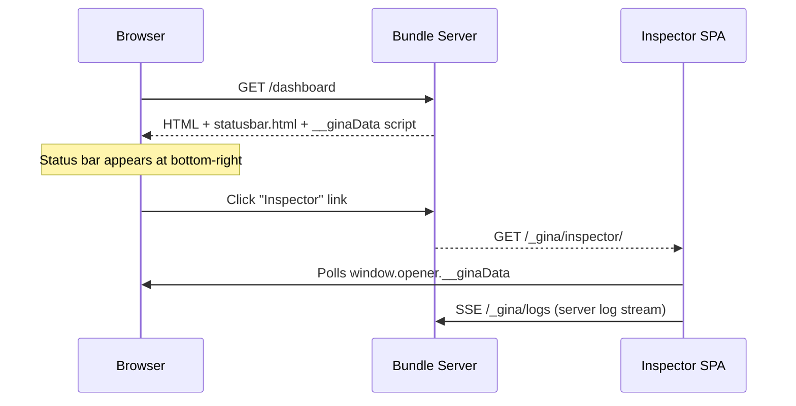
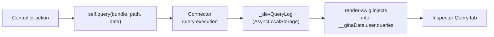
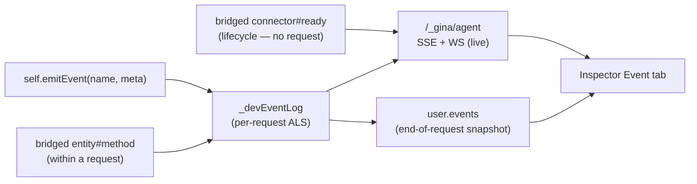
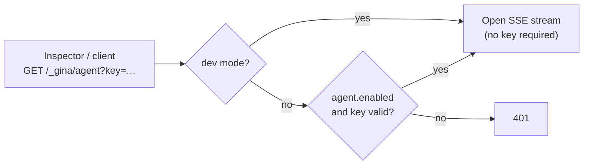
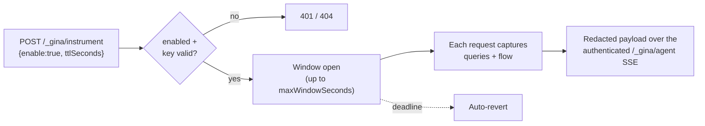

# Inspector

The Inspector is a built-in dev-mode SPA that shows you exactly what happens on every
HTTP request: controller data, DOM state, form values, database queries, and real-time
logs from both the client and server. It runs inside your bundle's own process at
`/_gina/inspector/` — no extra port, no separate service, no configuration.

---

## How it works

When `NODE_ENV_IS_DEV` is `true`, the framework injects a status bar into every HTML
response and serves the Inspector SPA on a built-in `/_gina/*` endpoint:



The Inspector reads data through three channels (in priority order):

1. **`window.opener.__ginaData`** — same-origin poll every 2 seconds (always available
   when opened via the statusbar link)
2. **`localStorage.__ginaData`** — fallback for direct URL access or cross-tab use
3. **engine.io socket** — real-time push when `ioServer` is configured

---

## Status bar

Every HTML response in dev mode includes a status bar fixed at the bottom-right corner:

- **Status dot** — green when the page rendered successfully, red when `data.error` is set
- **Bundle label** — shows `bundle@env` (e.g. `dashboard@dev`)
- **Inspector link** — opens the Inspector in a popup window (right third of screen, full height)

The status bar is rendered inside a Shadow DOM host (`#__gina-statusbar`) so its
styles never leak into your app's CSS.

### `ginaToolbar` shim

The status bar includes a compatibility shim for the legacy `ginaToolbar` API. The
validator plugin and the XHR event system call `ginaToolbar.update(section, data)` to
push form state and XHR response data — the shim captures these calls and syncs them
to `localStorage.__ginaData` so the Inspector can display them.

---

## Tabs

### Data

Displays the full `__ginaData.user` object as a collapsible JSON tree. Every key is
foldable; leaf values are click-to-copy. Features:

- **Dot-path search** — type `environment.bundle` to jump to a nested key
- **Raw JSON mode** — toggle to see the raw JSON string
- **Download** — export the current data snapshot as a `.json` file
- **Auto-expand** — expand all tree nodes at once (persisted in settings)

### View

Shows DOM and element state: properties, HTML attributes, computed styles. The header
displays page performance badges when data is available:

| Badge | Source | Shows |
|---|---|---|
| Engine | Template detection | e.g. `swig` |
| Weight | Performance API | Resource size vs transfer size |
| Time | Performance API | Load time vs transfer time |
| FCP | Performance API | First Contentful Paint |

**Performance anomaly alerts** — when a metric exceeds a built-in threshold, the
View tab label shows a pulsing dot (amber for warnings, red for critical) and the
affected badge border changes to highlight the issue. Hovering the badge shows which
threshold was exceeded.

| Metric | Warning | Critical |
|---|---|---|
| Load time | > 3 s | > 10 s |
| Transfer size | > 1 MB | > 5 MB |
| FCP | > 2.5 s | > 4 s |
| Query total duration | > 500 ms | > 2 s |
| Query count | > 20 | > 50 |

The anomaly check also considers query performance (total duration and count) when
query instrumentation is active, providing a holistic view of page health.

### Forms

Displays form field values and validation state from the validator plugin. Each form
is keyed by its `id` attribute. Fields show current value, validation rules, and
error messages.

### Query

Surfaces every database query tied to the current HTTP request. Supported connectors:
**Couchbase**, **MySQL**, **PostgreSQL**, and **SQLite**.



Each query entry shows:

- **Type** — query type (e.g. `N1QL`, `SQL`)
- **Trigger** — `entity#method` as a split badge
- **Statement** — SQL with syntax highlighting (keywords blue, functions purple, placeholders gold, strings green)
- **Params** — positional parameters `$1`, `$2` with color-coded values
- **Timing** — execution duration in ms
- **Origin** — which bundle executed the query
- **Connector** — which connector was used (e.g. `couchbase`, `mysql`, `postgresql`, `sqlite`)
- **Index badges** — which database indexes cover the query (see below)

A **search bar** filters across all fields. When bundle A calls bundle B via HTTP
(`self.query()`), B's queries travel back as a `__ginaQueries` JSON sidecar and are
merged into A's query log automatically — giving you full-page query visibility across
bundle boundaries.

#### Index reporting

The Query tab shows index badges below each query statement, indicating whether an
appropriate database index exists for the query's target table:

| Badge | Color | Meaning |
|---|---|---|
| Index name | Green | A secondary index covers the table |
| `PRIMARY` | Amber | Only a primary key scan is available |
| `no index` | Red | The query's target table has no index at all |
| `no index for filter` | Amber-gold | Indexes exist, but none cover the columns this query filters on (SQL connectors) |
| `N/A` | Grey | Connector does not support index reporting |

**Couchbase** extracts indexes automatically from the query execution plan — no
configuration needed.

**MySQL, PostgreSQL, SQLite** read an `indexes.sql` file from your bundle's SQL
directory at startup. Create this file with the `CREATE INDEX` statements that match
your schema:

```sql title="src/api/models/sql/indexes.sql"
CREATE INDEX idx_invoice_date ON invoices (created_at);
CREATE UNIQUE INDEX idx_user_email ON users (email);
```

For MySQL, PostgreSQL, and SQLite the badge also checks **column coverage**: a query counts as covered only when one of the table's declared indexes *leads with* a column the query filters on (the leftmost-prefix rule). If the table has indexes but none match the query's `WHERE` columns, an amber-gold "no index for filter" badge appears. This is a heuristic read of your `indexes.sql` against the query's `WHERE` clause — a design-time hint, not a guarantee of what the database planner does at runtime.

Index badge names are clickable — click to copy the index name to the clipboard.

The **tab badge** uses a three-tier color system: red when any query has a missing
index or is both slow and heavy, deep orange when one threshold is exceeded, and
default amber when everything is healthy.

### Logs

Combined real-time log stream from both client and server. Logs arrive through two
paths:

| Source | Transport | How |
|---|---|---|
| Client | `window.__ginaLogs` | Console capture script wraps `console.log/info/warn/error/debug` |
| Server | SSE via `/_gina/logs` | Taps `process.on('logger#default')`, strips ANSI codes |

**Controls:**

- **Source filter** — All / Client / Server
- **Level filter** — All / Error / Warn / Info / Log / Debug (rebuilds per source)
- **Search** — free-text filter with match highlighting
- **Pause / Resume** — freeze the log stream without losing entries
- **Clear** — empty the log buffer and reset the severity indicator

**Row selection:**

| Gesture | Effect |
|---|---|
| Click | Copy that single row (green flash feedback) |
| Drag | Range-select from start to end row |
| Shift+click | Range-select from last clicked row |
| Ctrl/Cmd+click | Toggle individual row |
| Ctrl/Cmd+C | Copy all selected rows |
| Escape | Deselect all |

Selected rows show an amber left accent line. The copy badge in the top-right shows
the count and fades out after copying.

**Log-dot indicator** — the tab icon pulses with the highest severity received since
the last clear (`debug` < `info` < `warn` < `error`).

---

### AI stream

Surfaces the AI token streams a request made — every call to `getModel('name').stream(...)`
(see the [AI connector guide](/guides/ai#streaming-responses)).

While a stream is in flight the tab tails it live: a header line (model, role), a running
meta line (chunk count, output tokens, status), and — when text capture is enabled — the
generated text as it arrives. When the request finishes, the tab shows an end-of-request
snapshot of **every** stream the request made, each with its model, provider, role, token
counts (in / out), and duration.

**Capturing prompt + generated text.** By default only stream *metadata* (model, role,
token counts, latency) is captured — never the prompt or the generated text. To include
them, set `inspector.ai.captureText` to `true` in `settings.json`:

```json title="settings.json"
{
  "inspector": {
    "ai": { "captureText": true }
  }
}
```

Capturing raw prompts and completions can expose sensitive content, so it is off by
default — treat it as a local development aid. The live token frames travel over the same
authenticated agent channel as the other tabs.

### Event

Surfaces the named application events a request emitted — domain signals such as
`order.created` or `cache.miss` that your own code raises. Emit one from anywhere in a
request's call path:

```js
// from a controller (self is the controller instance)
self.emitEvent('order.created', { orderId: order.id });

// from model / service code (resolve the lib by bare name)
require('lib/inspector-events').emit('cache.miss', { key: k });
```

While the request runs the tab tails events live over the same authenticated agent
channel (`/_gina/agent`, SSE + WebSocket) as the other tabs. When the request finishes,
the tab shows an end-of-request snapshot of every event it emitted, each with its name, a
sequence id, and — when metadata capture is enabled — the metadata you attached.

**Capturing event metadata.** The event *name* and framework stamps always ride the wire,
but the `metadata` values you attach are captured only when `inspector.events.captureArgs`
is `true` (default `false`). A separate `inspector.events.topics` allow-list (default `[]`,
so nothing is bridged) mirrors selected *framework* events onto the same Event signal — both
**entity-trigger** emits (`entity#method`, raised by a custom entity method) and **connector
lifecycle** events (a connector's `ready` emit, re-fired on every reconnect — e.g.
`couchbase#ready` — so database connection churn surfaces here too). Entries match by exact
name or a single leading or trailing `*` wildcard (e.g. `account#*`, `*#insert`, `*#ready`):

```json title="settings.json"
{
  "inspector": {
    "events": {
      "captureArgs": false,
      "topics": []
    }
  }
}
```

Bridged events are tagged `source: "framework"` (your own `self.emitEvent` calls are
`source: "app"`) and carry only a safe `{ ok, error }` summary — never raw entity-record data
or connection internals. That summary is itself metadata, so it rides the wire only when
`captureArgs` is on; with it off (the default) a bridged event shows just its name and
`source`.

**What to whitelist.** Custom entity methods (e.g. `account#save`) and connector lifecycle
(`couchbase#ready`, or `*#ready` for any connector) are the useful picks. Leave a connector's
CRUD signals (`N1QL:*` on Couchbase) out unless you specifically want them — they overlap the
[Query tab](#query), which already shows every query.

Capturing metadata values can expose sensitive content, so it is off by default — treat it
as a local development aid. Events are captured only in dev mode (or while an
instrumentation window is open), and the live frames travel over the same authenticated
agent channel as the other tabs; the gate, the opt-in, and the authenticated channel are
the protection.



---

## Settings

Click the gear icon in the Inspector toolbar to open the settings panel:

| Setting | Key | Default | Effect |
|---|---|---|---|
| Poll interval | `__gina_inspector_poll_interval` | 2000 ms | How often to poll `window.opener.__ginaData` |
| Theme | `__gina_inspector_theme` | `dark` | Dark or light theme |
| Auto-expand | `__gina_inspector_auto_expand` | `false` | Expand all tree nodes by default |

All settings are persisted in `localStorage` and restored on next open.

---

## Window geometry

The Inspector remembers its position and size across sessions. On `resize` and
`beforeunload`, the current `{ x, y, w, h }` is saved to
`localStorage.__gina_inspector_geometry`. The statusbar restores these values when
opening the Inspector popup via `window.open()`.

The Environment panel (View tab) also persists its resize height in
`localStorage.__gina_inspector_env_height`.

---

## Production

The Inspector only activates when `NODE_ENV_IS_DEV` is `true`. In production:

- The statusbar is not injected
- `/_gina/inspector/*` endpoints return 404
- `/_gina/logs` SSE endpoint is not available
- `window.__ginaData` is not emitted
- Query instrumentation is disabled (zero overhead)
- The `ginaToolbar` shim is not loaded — all `ginaToolbar.update()` calls are
  skipped via the `typeof(window.ginaToolbar) != 'undefined' && window.ginaToolbar`
  guard

No code changes are needed to disable the Inspector — it is fully gated on the
environment variable, with one opt-in exception described below.

### Authenticated agent endpoint outside dev mode (`inspector.agent`)

The single exception to the dev-only gating is the `/_gina/agent` stream,
which can be opted into **outside dev mode** for authenticated remote server-log
streaming (e.g. tailing a staging bundle's logs from the standalone Inspector).
It is disabled by default. Enable it in `settings.json`:

```json
"inspector": {
  "agent": {
    "enabled": true,
    "key": "${secret:INSPECTOR_AGENT_KEY}",
    "allowedOrigins": []
  }
}
```

- `enabled` (default `false`) exposes the endpoint outside dev mode; `key` is the
  shared secret. It supports `${secret:KEY}` placeholders, resolved from the
  environment at config-load — so the value never lives in the config file.
- Clients authenticate with the key via the `x-gina-inspector-key` request header
  **or** a `?key=` query parameter. Browsers using `EventSource` cannot send
  headers, so the Inspector's "Connect" form has an optional key field that
  travels as `?key=`. The key is compared in constant time; a missing or invalid
  key returns `401`. With `enabled: true` but no key configured, the endpoint
  stays closed (fail-closed).
- In dev mode the endpoint stays open and requires no key (unchanged).
- **Transport:** the standalone Inspector connects over a **WebSocket by default**
  (same endpoint, same auth — the key travels as `?key=`, since browsers cannot set
  WebSocket handshake headers any more than `EventSource` headers). It **falls back to
  SSE automatically** when the socket cannot open — e.g. an older bundle that only
  serves the SSE stream, or an HTTP/2-only target that cannot upgrade. Open the
  Inspector with `?transport=sse` to force the SSE transport.
- `allowedOrigins` (default `[]`) optionally restricts **WebSocket** upgrades to an
  allowlist of `Origin` values; when empty, any origin is accepted (parity with the
  SSE endpoint). Set it to the Inspector's origin(s) for production use.
- **Scope:** this authenticates server-log streaming and connection identity.
  Per-request data, query, and flow capture stays dev-gated by default — the
  **instrumentation window** (`inspector.instrumentation`, below) can opt it into
  a bounded production window.



### Instrumentation window — query + flow capture outside dev mode (`inspector.instrumentation`)

By default, query and flow instrumentation run only in dev mode. The **instrumentation
window** opts that capture into a **time-boxed, key-authenticated** window, so you can
trace a production issue for a few minutes without running the bundle in full dev mode.
It is disabled by default. Enable it in `settings.json`:

```json
"inspector": {
  "instrumentation": {
    "enabled": true,
    "key": "${secret:INSPECTOR_INSTRUMENT_KEY}",
    "defaultWindowSeconds": 300,
    "maxWindowSeconds": 3600
  }
}
```

- `enabled` (default `false`) allows a window to be opened at all — fail-closed, so a
  bundle that never opts in cannot be instrumented remotely even with a key.
- `key` is a secret **separate** from `inspector.agent.key` (capturing raw queries is
  more sensitive than streaming logs). It supports `${secret:KEY}` placeholders,
  resolved from the environment at config-load.
- `defaultWindowSeconds` (default `300`) applies when a request omits a TTL;
  `maxWindowSeconds` (default `3600`) caps a single window and is itself clamped to an
  absolute **3600-second hard ceiling** — a forgotten window always auto-reverts.

Open, query, or close a window with the control endpoint — served by both engines,
`POST` to toggle and `GET` to read status:

```bash
# open a 5-minute window
curl -X POST https://your-host/_gina/instrument \
  -H 'x-gina-inspector-key: <key>' -H 'content-type: application/json' \
  -d '{"enable":true,"ttlSeconds":300}'

# check status → { "active": true, "until": ..., "remainingMs": ... }
curl https://your-host/_gina/instrument -H 'x-gina-inspector-key: <key>'

# close early
curl -X POST https://your-host/_gina/instrument \
  -H 'x-gina-inspector-key: <key>' -H 'content-type: application/json' -d '{"enable":false}'
```

The key is compared in constant time and is **required even in dev**. With
`enabled: false` (or no key configured) the endpoint is invisible (`404`); a wrong key
returns `401`.

- **Egress is remote-only.** While a window is open, captured queries and flow are
  streamed over the **authenticated `/_gina/agent` SSE** — never injected into a
  response body. To view them, also enable the agent endpoint (`inspector.agent`,
  above) and connect the standalone Inspector with `?target=<host>&key=<agent-key>`.
  For a page assembled from multiple bundles, open a window on each participating bundle.
- **Redaction caveat.** Inspector redaction masks secret-*named* fields, but a query's
  statement text and positional parameters reach the key holder **as-is**. Treat the
  instrumentation key as privileged and keep windows short.
- A server-rendered HTML page's *own* controller queries and flow now also stream
  over the SSE during a window — alongside JSON/XHR responses and cross-bundle
  queries. The page HTML itself is never modified; the capture leaves only over the
  authenticated channel.



---

## Troubleshooting

**Inspector shows stale data**
The Inspector polls `window.opener.__ginaData` every 2 seconds by default. If you
navigate the parent page, the new page's `__ginaData` replaces the old one on the
next poll cycle. If the Inspector was opened via direct URL (not the statusbar link),
it falls back to `localStorage` which requires the statusbar shim to be active on
the page.

**No server logs appearing**
Server logs are streamed via SSE from `/_gina/logs`. Check that:
- The bundle is running with `NODE_ENV_IS_DEV=true`
- The source filter is set to "All" or "Server"
- The level filter includes the severity you expect

**`/_gina/agent` returns 401 outside dev mode**
Outside dev mode the agent endpoint is auth-gated (`inspector.agent`). A `401`
means the key is missing or wrong. Check that `inspector.agent.enabled` is `true`,
a non-empty `key` is configured (and, if you used a `${secret:KEY}` placeholder,
that the environment variable is set), and the client sends the matching key via
the `x-gina-inspector-key` header or a `?key=` query parameter. With no key
configured the endpoint stays closed even when `enabled` is `true`.

**`/_gina/instrument` returns 401 or 404**
The instrumentation control endpoint is opt-in and key-gated even in dev. A `404` means
`inspector.instrumentation.enabled` is not `true` (or no key is configured — fail-closed);
a `401` means the `x-gina-inspector-key` is missing or wrong. To view the captured data
remotely you must also enable the authenticated agent endpoint (`inspector.agent`),
because a window streams over `/_gina/agent`.

**Query tab is empty**
Query instrumentation is active for Couchbase, MySQL, PostgreSQL, and SQLite
connectors. Ensure your bundle has a connector configured in `connectors.json` and
that queries run through entity methods (not raw SDK calls). The instrumentation
point is inside each connector's query execution path.

**Index badges show N/A for SQL connectors**
Create an `indexes.sql` file in your bundle's SQL directory (`src/<bundle>/models/sql/indexes.sql`)
containing `CREATE INDEX` statements. The connector reads this file at startup. Without
it, index reporting is unavailable and a grey N/A badge is shown.

**Inspector window opens but is blank**
The browser may be blocking the popup. Check for a popup-blocked notification in the
address bar and allow popups for `localhost`.
