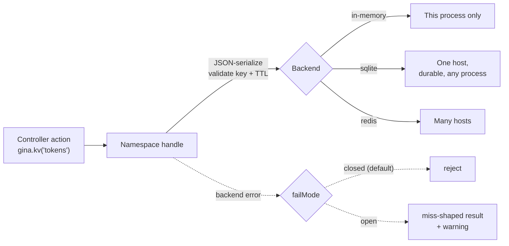

# Key-value store

Applications accumulate small pieces of state that are not application data: a
single-use link token, a rate-limit counter, a feature flag, a short-lived lock,
the result of an expensive lookup you would rather not repeat. None of it
belongs in your database, and all of it needs the same handful of operations.

The **key-value primitive** provides those. You declare named **namespaces** in
`settings.json`, each choosing its own backend and failure policy, and reach
them from application code through `gina.kv()`.

:::note Not a redis client
This is a key-value contract, deliberately narrow. It has no lists, hashes,
sets, streams or pub/sub, no batch operations, no key scanning and no binary
values. Those are real needs — they are just not key-value ones. An application
that needs them declares a `connectors.json` entry and creates its own client.
:::

---

## How it works



The handle is the same object whatever backs it. Namespaces are read once at
boot, so a configuration change needs a bundle restart.

---

## Declare a namespace

```json
{
  "kv": {
    "default": "cache",
    "namespaces": {
      "cache":  { "failMode": "open" },
      "tokens": {}
    }
  }
}
```

A namespace declared as `{}` is in-memory, which is the zero-config path.
`default` names the namespace a no-argument `gina.kv()` returns.

Namespaces are **strict**: asking for one that was never declared throws at the
call site.

```javascript
gina.kv('tokens');   // fine
gina.kv('tokenz');   // Error: [kv] no namespace `tokenz` (configured: cache, tokens)
```

That refusal is deliberate. The alternative — handing back a fresh empty
namespace — turns a typo into a store that silently reads empty forever, which
is a far more expensive bug than a boot-time error.

---

## Choose a backend

The axis that matters is **how widely the namespace is shared**.

| Backend | Configure | Shared with | Survives a restart |
|---|---|---|---|
| in-memory | omit `store` | nothing — this process only | no |
| `sqlite` | `store` → a sqlite `connectors.json` entry | any process on the same host | yes |
| `redis` | `store` → a redis `connectors.json` entry | every host | yes |

```json
{
  "kv": {
    "namespaces": {
      "tokens":   { "store": "kvRedis" },
      "flags":    { "store": "kvDb" },
      "scratch":  {}
    }
  }
}
```

```json
{
  "kvRedis": { "connector": "redis",  "host": "127.0.0.1", "port": 6379 },
  "kvDb":    { "connector": "sqlite", "file": "/var/lib/myapp/kv.db" }
}
```

The redis backend needs `ioredis` installed in your project
(`npm install ioredis`). The SQLite backend needs nothing — it uses the
runtime's built-in SQLite.

Two namespaces may share one `connectors.json` entry; they never collide.

:::caution Naming a connector that has no implementation refuses the boot
Only `redis` and `sqlite` implement a KV backend today. Pointing a namespace at,
say, a mysql entry stops the boot with a message naming the problem, rather than
falling back to memory — a namespace quietly serving different data than you
configured is worse than a bundle that will not start.
:::

---

## Operations

Every operation returns a promise.

### Reading and writing

```javascript
var gina = require('gina');
var kv   = gina.kv('cache');

await kv.set('user:42', { name: 'Ada' }, { ttl: 60000 });   // ttl is OPTIONAL
await kv.get('user:42');        // => { name: 'Ada' }
await kv.get('nope');           // => null
await kv.has('user:42');        // => true
await kv.del('user:42');        // => true  (false if nothing live was there)
await kv.clear();               // => number of entries removed
```

### Expiry

TTLs are **milliseconds**, and must be positive integers.

```javascript
await kv.ttl('user:42');            // null = no such entry
                                    // -1   = stored, no expiry
                                    // 45000 = milliseconds remaining
await kv.expire('user:42', 120000); // slide the expiry; false if it is gone
```

`{ ttl: 0 }` is refused rather than read as "no expiry" — a zero TTL is
ambiguous, and guessing which meaning you intended is how entries quietly
outlive their purpose. Omit `ttl` for no expiry.

### One-shot tokens

`consume()` reads **and deletes in one atomic operation**. Exactly one caller
gets the value; every other caller gets `null`.

```javascript
await kv.setnx('reset:' + hash, { uid: user.id }, { ttl: 15 * 60 * 1000 });

// ...later, when the link is followed:
var record = await kv.consume('reset:' + hash);
if (record === null) {
    return self.throwError(410, 'This link has already been used.');
}
```

This is not `get()` followed by `del()`. That pair lets a user's click and their
mail client's link prefetcher both succeed, and both mint a credential —
which is the exact failure the operation exists to prevent.

### Counters

```javascript
var hits = await kv.incr('rate:' + ip, 1, { ttl: 60000 });
if (hits > 100) {
    return self.throwError(429);
}
await kv.decr('seats:' + eventId);
```

The TTL applies when the counter is **created**, not on every increment — so a
per-minute window expires a minute after it opened, not a minute after the last
request. Incrementing a value that is not an integer rejects.

### Locks and leases

There is no lock API, deliberately: a correct distributed lock needs fencing
tokens and renewal policy that a general primitive should not imply. What the
primitive gives you is the two operations a lock is built from.

```javascript
var token = crypto.randomUUID();

if (await kv.setnx('lock:' + jobId, token, { ttl: 30000 })) {
    try {
        await doTheWork();
    } finally {
        // deletes ONLY if we still hold it — an unconditional del() would
        // remove a lock the next holder acquired after ours expired
        await kv.delIfEquals('lock:' + jobId, token);
    }
}
```

Understand the residual before relying on it: if the work outruns the TTL,
another worker legitimately acquires the lock while yours is still running.
`delIfEquals` stops you deleting *their* lock; it does not stop the overlap.
For work where that overlap is unacceptable, make the work itself idempotent.

### Fetch-or-compute

```javascript
var rates = await kv.getOrSet('fx:daily', { ttl: 3600000 }, async function () {
    return await fetchRatesFromUpstream();
});
```

Concurrent callers that miss while a load is already in flight **share that
load** rather than each calling the loader. A loader that throws rejects every
sharer and caches nothing — there is no negative caching.

---

## What can be stored

Values are JSON-serialized, so anything `JSON.stringify` handles round-trips.

Two values are refused on every write:

- `undefined` — it disappears in serialization, and a silently dropped value is
  never what you meant.
- `null` — a stored `null` would be indistinguishable from a miss. Wrap it
  (`{ value: null }`) or use `del()`.

---

## When the backend fails

Each namespace declares what should happen when its backend is unreachable.

| `failMode` | Behaviour |
|---|---|
| `closed` (default) | The operation rejects. Nothing proceeds on unverified state |
| `open` | The operation resolves to its miss-shaped result (`null`, `false`, `0`) and a warning is logged |

Pick by what the namespace is for. A cache should stay `open`: serving a slower
page beats serving an error. A token or lock namespace must stay `closed`:
`open` would report "no such token" during an outage, which reads exactly like a
correctly-refused replay.

`failMode` governs **backend** errors only. A bad key, a bad TTL or an
unserializable value always rejects, whatever the mode.

:::note Connection tuning lives with the connector
`failMode` decides what your application sees; how hard the driver tries before
giving up is set on the `connectors.json` entry (`commandTimeout`,
`maxRetriesPerRequest`, `enableOfflineQueue` for redis). An `open` namespace
usually wants a short `commandTimeout` so a degrade is quick; a `closed` one
usually wants the driver's default queueing so a brief reconnect waits rather
than fails.
:::

---

## Deliberate limits

| Not provided | Why, and what to do instead |
|---|---|
| Lists, hashes, sets, streams, pub/sub | Not key-value operations. Declare a `connectors.json` entry and use your own client |
| `mget` / `mset` | No measured demand, and multi-key operations are the first thing to complicate cluster routing |
| Key scanning | Track your own keys, or use `clear()` for the whole namespace |
| Binary values | Use [object storage](/guides/storage) — it owns bytes |
| A lock API | Compose `setnx` and `delIfEquals`, as above |

---

## Reference

- [`settings.json` reference](/reference/settings) — the `kv` block
- [connectors.json reference](/reference/connectors) — declaring redis and sqlite entries
- [Caching](/guides/caching) — for caching whole rendered responses rather than values
- [Object storage](/guides/storage) — for files and binary content
