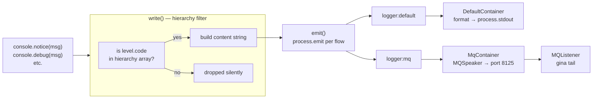
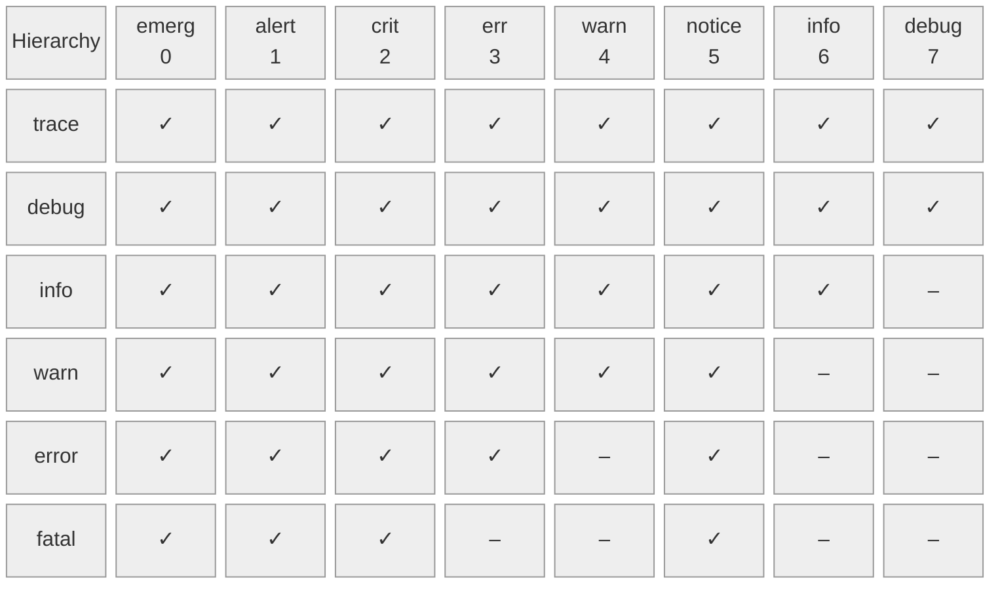
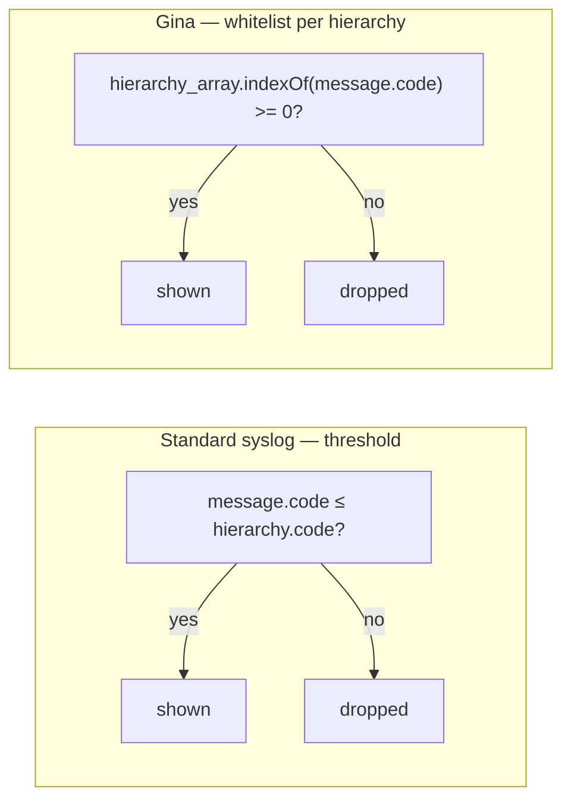

# Logging

Gina's logger is a multi-group, multi-transport structured logger built on top of
Node.js `process.emit`. It replaces the global `console` object so your bundle code
calls `console.info(...)`, `console.err(...)`, etc. as normal — with full control
over what gets shown, where, and at what severity. Because each Gina bundle runs as a separate Node.js process, log groups are isolated per bundle, and `gina tail` aggregates them into a single real-time stream on port 8125.

---

## How it works

Every `console.*` call goes through a four-step pipeline:



1. **`write()`** — checks whether the message's severity code appears in the
   active hierarchy's allowed-codes array. If not, the message is silently
   dropped before any I/O happens.
2. **`emit()`** — broadcasts the raw payload to every registered flow via
   `process.emit('logger#<flow>', JSON.stringify(payload))`.
3. **Containers** (transports) — each flow has a container that listens for
   its event. The `default` container formats and writes to `process.stdout`.
   The `mq` container forwards to the MQ speaker on port `8125`.
4. **`format()`** — applied inside each container. Applies the template
   `[%d] [%s][%a] %m`, pads the level name to a fixed width, and wraps the
   line in the level's ANSI color.

The output line looks like:

```
[2026 Mar 05 17:54:34] [info   ][frontend@myproject] Server listening on port 3100
```

---

## Log levels

Gina follows the [Syslog severity scale (RFC 5424)](https://datatracker.ietf.org/doc/html/rfc5424#section-6.2.1)
for its level codes. Lower code = higher severity.

| Method | Alias | Code | Color | Description |
|--------|-------|:----:|-------|-------------|
| `console.emerg(msg)` | — | 0 | magenta | System is unusable. Process exits. |
| `console.alert(msg)` | — | 1 | red | Immediate action required. |
| `console.crit(msg)` | — | 2 | magenta | Critical condition. |
| `console.err(msg)` | `console.error` *(deprecated)* | 3 | red | Error condition. |
| `console.warning(msg)` | `console.warn` *(deprecated)* | 4 | yellow | Warning condition. |
| `console.notice(msg)` | — | 5 | black† | Normal but significant event. See [notice](#the-notice-level). |
| `console.info(msg)` | — | 6 | cyan | Informational message. |
| `console.debug(msg)` | — | 7 | gray | Debug detail. |

> † `notice` renders in black — use a light-background terminal, or override the
> color in `~/.gina/user/extensions/logger/default/config.json`.

---

## Hierarchy — the cascade design

### Valid hierarchies

The active hierarchy controls which levels are visible. Set it with:

```bash
gina framework:set --log-level=debug
```

or at runtime inside a bundle (see [Setting the level in code](#setting-the-level-in-code)).

Valid values: `trace` · `debug` · `info` · `warn` · `error` · `fatal`

:::caution
Setting `LOG_LEVEL` to a level name that is not a valid hierarchy (e.g. `notice`,
`alert`, `crit`) will cause the logger to fall back to `info` with a warning. This
is enforced both at init time and when calling `console.setLevel()`.
:::

### Which messages appear at each hierarchy



As a plain table:

| Hierarchy | emerg (0) | alert (1) | crit (2) | err (3) | warn (4) | notice (5) | info (6) | debug (7) |
|-----------|:---------:|:---------:|:--------:|:-------:|:--------:|:----------:|:--------:|:---------:|
| `trace`   | ✓ | ✓ | ✓ | ✓ | ✓ | ✓ | ✓ | ✓ |
| `debug`   | ✓ | ✓ | ✓ | ✓ | ✓ | ✓ | ✓ | ✓ |
| `info`    | ✓ | ✓ | ✓ | ✓ | ✓ | ✓ | ✓ | — |
| `warn`    | ✓ | ✓ | ✓ | ✓ | ✓ | ✓ | — | — |
| `error`   | ✓ | ✓ | ✓ | ✓ | — | ✓ | — | — |
| `fatal`   | ✓ | ✓ | ✓ | — | — | ✓ | — | — |

### How this differs from standard syslog

Standard syslog uses a **pure threshold**: setting the level to `warn` shows everything
with a code **≤ 4** (emerg through warn). The rule is simply `message.code ≤ hierarchy.code`.

Gina's cascade is an **explicit whitelist per hierarchy**. Each entry is an array of
allowed codes. This is a deliberate deviation with one specific goal: **`notice` (code 5)
appears at every hierarchy, including `error` and `fatal`.**



Comparison at `error` level:

| | emerg | alert | crit | err | **warn** | **notice** | info | debug |
|---|:---:|:---:|:---:|:---:|:---:|:---:|:---:|:---:|
| Syslog `error` | ✓ | ✓ | ✓ | ✓ | — | — | — | — |
| Gina `error` | ✓ | ✓ | ✓ | ✓ | — | **✓** | — | — |

At `fatal` level Gina also drops `err` (code 3) while retaining `notice` (code 5) —
something a pure threshold model cannot express.

### The `notice` level

`notice` is not just a severity level — it is a **framework signalling channel**.
The framework itself emits `notice` messages to flag state transitions that child
processes (CLI, workers, other bundles) need to react to, regardless of the verbosity
setting the operator has chosen. Keeping it visible at `error` and `fatal` — levels
where an operator is usually trying to reduce noise — means those signals are never
lost in production.

### Design trade-offs

| | Whitelist arrays (Gina) | Pure threshold (syslog) |
|---|---|---|
| `notice` always visible | ✓ native | requires special-casing |
| Adding a new level | update 6 arrays manually | just assign a code |
| `trace` and `fatal` as hierarchies (no matching level) | ✓ works, no level code needed | would require fake codes |
| Predictability | non-contiguous ranges are surprising | strictly monotone |
| Valid `LOG_LEVEL` values | only the 6 hierarchy keys | every level name works |

---

## Using the logger in your bundle

### Bundle bootstrap

Replace the global `console` once, in `src/<bundle>/index.js`, before anything
else runs:

```js
var lib     = require('gina').lib;
var console = lib.logger;

// Set the log level for this bundle's group.
// The group name is "<bundle>@<project>" by default, derived from process.title.
console.setLevel(process.env.LOG_LEVEL || 'info', process.title);
```

After this point every `console.*` call anywhere in the bundle process uses the
Gina logger.

### In controllers

Controllers receive the logger via the replaced global `console`. Use semantic
levels that match the actual severity of the event:

```js
// controller.content.js
var ContentController = function() {
    var self = this;

    this.home = function(req, res, next) {
        try {
            var data = { title: 'Home' };
            console.info('[HOME] Rendering home page for ' + req.session.user.id);
            self.render(data);
        } catch (err) {
            console.err('[HOME] Render failed:', err.stack);
            self.throwError(res, 500, err);
        }
    };

    this.login = function(req, res, next) {
        var body = req.body;

        if (!body.email || !body.password) {
            console.warning('[AUTH] Login attempt with missing credentials from ' + req.ip);
            return self.throwError(res, 400, 'Missing credentials');
        }

        // ... authenticate ...
        console.info('[AUTH] Login successful for ' + body.email);
        self.renderJSON({ success: true });
    };
};
module.exports = ContentController;
```

### In models and entities

```js
// models/session.js
var SessionModel = function() {

    this.findById = function(sessionId) {
        var e = new EventEmitter();

        db.get(sessionId, function(err, result) {
            if (err) {
                console.err('[SESSION] Lookup failed for id=' + sessionId, err.stack);
                return e.emit('error', err);
            }
            if (!result) {
                console.debug('[SESSION] Cache miss for id=' + sessionId);
            }
            e.emit('complete', null, result);
        });

        return e;
    };

    this.keepAlive = function(bucketName) {
        // Framework signalling — use notice so it appears at any log level
        console.notice('[CONNECTOR] Connection to bucket `' + bucketName + '` is being kept alive');
    };
};
```

### Multi-bundle logging — group isolation

Each bundle runs as a separate process. When you call `console.setLevel('warn', 'api@myproject')`,
only the `api` bundle's output is affected. Other bundles keep their own level:

```js
// In api bundle bootstrap:
console.setLevel('warn', process.title);      // api@myproject → warn and above

// In frontend bundle bootstrap:
console.setLevel('debug', process.title);     // frontend@myproject → everything
```

`gina tail` aggregates all groups into a single stream. Each line is prefixed with
the group name so you can grep by bundle:

```bash
gina tail | grep "api@myproject"
```

---

## Configuring the log level

### Via the CLI (persisted to settings.json)

```bash
gina framework:set --log-level=debug   # show everything
gina framework:set --log-level=info    # default
gina framework:set --log-level=warn    # warnings and above
gina framework:set --log-level=error   # errors, crit, alert, emerg + notice
gina framework:set --log-level=fatal   # only emerg, alert, crit + notice
```

The setting is stored in `~/.gina/<version>/settings.json` under `log_level` and
applies to all bundles on the next start.

### Via the environment

```bash
LOG_LEVEL=debug gina bundle:start api @myapp
```

Set `LOG_LEVEL` before starting the framework or a bundle. The logger reads this
variable at init time. Note that only the six hierarchy values above are valid —
setting `LOG_LEVEL=notice` will fall back to `info` with a printed warning.

### Setting the level in code

Call `console.setLevel()` in the bundle bootstrap to override the global setting
for that specific group:

```js
// Force debug output for this bundle regardless of the global setting
if (process.env.NODE_ENV_IS_DEV === 'true') {
    console.setLevel('debug', process.title);
}
```

---

## Log containers (transports)

Gina calls transports **containers**. Two are built in:

| Container | Flow name | Destination | Always active |
|-----------|-----------|-------------|:---:|
| `default` | `logger#default` | `process.stdout` | ✓ |
| `mq` | `logger#mq` | MQSpeaker → port 8125 → MQListener | ✓ |
| `file` | `logger#file` | Rotating log files on disk | opt-in |

The `mq` container is what powers `gina tail`. Every formatted log line is
broadcast to the MQ listener, which forwards it to any connected tail clients.

For custom container configuration, see [Logger API reference → Containers](/api/logger#containers).

---

## Following logs in real time

```bash
gina tail
```

`gina tail` is an alias for `gina framework:tail`. It connects to the MQ listener
on port `8125` and streams formatted output from all running bundles to your terminal.

### `--follow` — stay connected across restarts

Without `--follow`, `gina tail` exits as soon as the MQ stream ends (e.g. when a
bundle stops). With `--follow`, the tail process re-connects automatically and keeps
streaming even if bundles restart:

```bash
gina tail --follow
```

This is the recommended mode during development — it survives `gina bundle:restart`
and framework restarts without any manual intervention.

### Filtering output

Pipe `gina tail` through `grep` to focus on a specific bundle:

```bash
# Only show api bundle output
gina tail --follow | grep "api@myproject"

# Only show warnings and above from any bundle
gina tail --follow | grep -E "\[(emerg|alert|crit|err|warn)\]"

# Exclude debug lines, keep everything else
gina tail --follow | grep -v "\[debug"

# Watch a specific controller action across all bundles
gina tail --follow | grep "\[HOME\]"
```

### Typical development workflow

One terminal window for logs, another for commands:

```bash
# Terminal 1 — persistent log stream
gina tail --follow

# Terminal 2 — start, restart, build as needed
gina bundle:start frontend @myproject
gina bundle:restart api @myproject
```

---

## Log storage

By default, Gina does **not** persist logs to disk. Logs are event-driven and
printed to `process.stdout`. You can capture them at the OS level:

### Development — `gina tail`

Best for development. One terminal window shows all bundles and the framework.

### Production — redirect stdout

```bash
gina bundle:start api @myapp > /var/log/myapp/api.log 2>&1 &
```

Pair with [logrotate](https://linux.die.net/man/8/logrotate) for rotation.

### File transport (experimental)

Enable the built-in file container by adding `"file"` to the `flows` array in
`~/.gina/user/extensions/logger/default/config.json`, then restart:

```bash
gina restart
```

---

## See also

- [Logger API reference](/api/logger) — method signatures, `console.setLevel()` parameters, and container configuration
