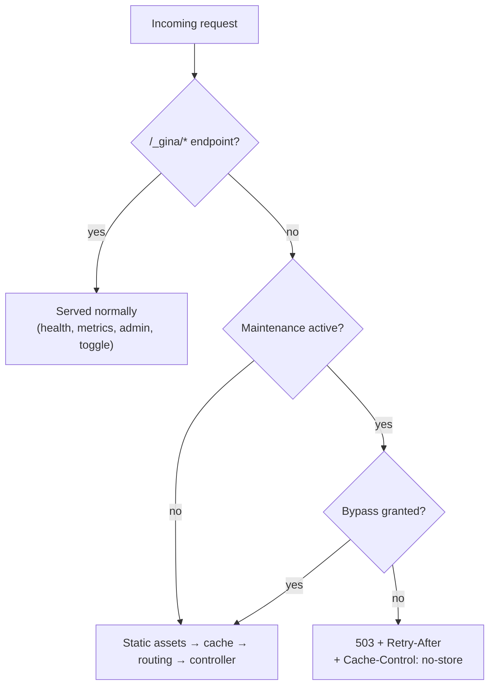

# Maintenance mode

Maintenance mode closes a bundle to the public **without stopping it**. Every
request except the framework's own `/_gina/*` endpoints is answered `503 Service
Unavailable` with a `Retry-After` header and a self-contained maintenance page,
while the process keeps running — so you can still reach it, still read its
metrics, and still turn maintenance back off.

It is deliberately **not** a middleware. Middleware runs only after a route has
matched, which leaves two holes a maintenance window cannot afford: static
assets keep serving `200`, and any URL that matches no route answers `404`
instead of `503`. The maintenance gate sits earlier in the pipeline and closes
both.

---

## Turning it on

Add a `maintenance` block to your bundle's `settings.json`:

```json
{
  "server": {
    "maintenance": {
      "enabled": true,
      "retryAfter": 600,
      "message": "Back at 14:00 UTC — we are migrating the database.",
      "bypassKey": "${secret:MAINTENANCE_BYPASS_KEY}"
    }
  }
}
```

Restart the bundle and every visitor gets the maintenance page. `enabled` must be
a **strict boolean** — `"true"` (a string) leaves it off, on purpose, so a typo
cannot silently close your site.

To flip it without editing configuration, use the
[runtime toggle](#flipping-it-at-runtime) instead.

---

## Where the gate sits



Two properties of that order are load-bearing:

- **`/_gina/*` stays up.** `/_gina/health/check` keeps answering `200`, so an
  orchestrator does not decide your pods are unhealthy and restart them in the
  middle of a maintenance window. The admin endpoints — including the
  maintenance toggle itself — stay reachable, so you are never locked outside
  your own off switch.
- **Everything else is below the gate**, including static assets, the
  render/output cache and routing. A cached page cannot be replayed to the
  public while maintenance is on, and a stylesheet cannot keep serving while the
  page that would use it is closed.

The maintenance page is completely self-contained — no stylesheet, image, font
or script — precisely because the gate that produced it also refuses those
assets.

---

## Configuration reference

| Key | Type | Default | Meaning |
| --- | --- | --- | --- |
| `enabled` | boolean | `false` | Master switch, and the state a restart returns to. Must be strictly `true`. |
| `retryAfter` | integer (1–86400) | `300` | Seconds emitted as the `Retry-After` header. |
| `message` | string | `Service Unavailable` | Text shown on the page and placed in the JSON body's `explicit` field. HTML-escaped on output. |
| `bypassKey` | string | *(unset)* | Shared secret letting chosen visitors through. Supports `${secret:KEY}`. |
| `allowFrom` | string[] | `[]` | Supplementary IP allowlist — **only honoured for non-proxied requests**, see below. |

A malformed block never refuses a boot. Each bad key falls back to its default
**individually**, with a warning naming it — so a mistyped `retryAfter` cannot
silently disable the whole feature and leave you believing the site is closed
when it is open.

### What the visitor receives

A browser navigation gets the HTML page. An XHR, a SPA fragment request
(`X-Gina-Navigate`) or a JSON-only `Accept` gets the framework's standard error
body, so a client that already handles gina errors needs no special case:

```json
{
  "error": {
    "code": "503",
    "message": "GNA:GLOBAL:ERR:503",
    "explicit": "Back at 14:00 UTC — we are migrating the database."
  }
}
```

Both carry `Retry-After` and `Cache-Control: no-store`. The `no-store` matters:
a `503` cached by a CDN or a proxy would outlive the window and keep serving the
closed page after you reopened — turning a ten-minute maintenance into an
open-ended outage.

---

## Letting yourself (and your team) through

### The bypass key — works under any deployment

Set `bypassKey` and present it one of two ways.

**In a browser**, append it once:

```
https://example.com/?gina-maintenance-key=<your-key>
```

The framework verifies it, sets a short-lived cookie, and redirects you to the
same URL **without the secret** — so the key leaves your address bar, your
history and any `Referer` you send onward. Browse normally for the next 12
hours.

**Programmatically** (smoke tests, canary bots), send a header instead — no
cookie involved:

```bash
curl -H "x-gina-maintenance-key: $KEY" https://example.com/health-of-my-app
```

Mint a strong key and keep it out of your configuration file:

```bash
openssl rand -hex 24
```

```json
{ "bypassKey": "${secret:MAINTENANCE_BYPASS_KEY}" }
```

The cookie is a signed, self-expiring token — nothing is stored server-side, so
a grant survives a restart and is accepted by every bundle of a merged-process
project that shares the key. **Rotating `bypassKey` immediately revokes every
outstanding cookie.**

### The IP allowlist — only for direct connections

`allowFrom` lets you name addresses that bypass the window:

```json
{ "allowFrom": ["203.0.113.4", "::1"] }
```

It is honoured **only for requests that did not arrive through a reverse
proxy**, and that restriction is the point rather than a limitation. Behind a
proxy, every connection gina sees originates from the *proxy*, not the visitor.
An unconditioned allowlist would therefore do one of two useless things: list
the proxy's address and let **the entire internet** through while the site
reports itself closed, or omit it and let **nobody** through, including you.

So: **direct deployments** can use `allowFrom` for convenience; **proxied
deployments** should use `bypassKey`, which does not depend on the network path
at all. gina does not trust `X-Forwarded-For` for this decision — a header any
client can set must not decide who bypasses a closed site.

---

## Flipping it at runtime

`/_gina/maintenance` turns maintenance on and off without a restart or a config
edit. It is restricted to the administrator allowlist in `app.json`
(`admin.allowFrom`, loopback by default), so run it from the host or inside the
pod:

```bash
# status
curl -s http://127.0.0.1:8080/_gina/maintenance

# on
curl -s -X POST http://127.0.0.1:8080/_gina/maintenance \
     -H 'content-type: application/json' \
     -d '{"enable":true,"message":"Deploying — back shortly","retryAfter":120}'

# on, with a dead-man switch: reverts by itself after 30 minutes
curl -s -X POST http://127.0.0.1:8080/_gina/maintenance \
     -H 'content-type: application/json' \
     -d '{"enable":true,"ttlSeconds":1800}'

# off
curl -s -X POST http://127.0.0.1:8080/_gina/maintenance \
     -H 'content-type: application/json' \
     -d '{"enable":false}'
```

```json
{
  "bundle": "frontend",
  "active": true,
  "source": "runtime",
  "retryAfter": 120,
  "message": "Deploying — back shortly",
  "until": null,
  "hasBypassKey": true
}
```

Two deliberate behaviours:

- **A runtime flip is not persisted.** A restart returns the bundle to whatever
  `settings.json` says. That is the safe direction — a toggle you forgot cannot
  outlive the process that set it. For a window that must survive restarts, set
  `enabled: true` in configuration.
- **An expired `ttlSeconds` reverts to your *configuration*, not to "off".** If
  `settings.json` says the bundle is closed, a lapsed timer cannot re-open it.

The status payload reports `hasBypassKey` so you can confirm you will be able to
get back in — but never the key itself.

:::caution The toggle refuses cross-origin writes
`POST /_gina/maintenance` is gated by an IP allowlist, which is an *ambient*
credential — a browser attaches it automatically to any request a page makes.
So a `POST` from a browser page served on a **different origin** than the bundle
is refused with **403**, together with the rest of the `/_gina/*` control family.

This does not affect the examples above: `curl` sends no browser origin signal,
so command-line and scripted use is unchanged. `GET /_gina/maintenance` is a safe
method and is never refused. You only hit this if you drive the toggle from a
web page hosted somewhere other than the bundle itself — in which case call it
from a non-browser client, or serve that page from the bundle's own origin.
:::

---

## Behind a reverse proxy

Everything above works proxied, with three things worth checking in your own
stack:

1. **Use `bypassKey`, not `allowFrom`** — see [above](#the-ip-allowlist--only-for-direct-connections).
2. **Check how your proxy treats a `503` from an upstream.** Some configurations
   are set to retry another upstream or mark the backend down on a `503`
   (`proxy_next_upstream` in nginx, `retry-on` in HAProxy). If yours is, your
   visitors get the proxy's own error page instead of your maintenance page.
   Verify before you rely on it.
3. **Confirm your CDN honours `no-store`.** gina emits it on every maintenance
   response; an edge with an overriding cache policy could still retain the
   `503`.

If you would rather close the site *at the edge*, a proxy-level maintenance page
is a perfectly good alternative — it also protects you while the bundle is being
replaced. The two are complementary: the proxy covers "the app is not there",
maintenance mode covers "the app is there and deliberately closed", with
per-bundle scope and an app-aware bypass.

---

## Kubernetes and health probes

Maintenance mode deliberately **does not** change what
`/_gina/health/check` reports. That is intentional: if maintenance flipped your
readiness probe, Kubernetes would stop routing traffic to the pods entirely and
your visitors would get ingress connection errors *instead of* your maintenance
page.

Correct behaviour during a maintenance window is pods that stay **ready** and
serve the `503` themselves — which is what you get by default. Leave your
`livenessProbe` and `readinessProbe` pointed at `/_gina/health/check` and change
nothing.

See [Kubernetes & Docker](/guides/k8s-docker) for the probe configuration.

---

## Scope

Maintenance is **per bundle**. Each bundle serves from its own server instance,
so closing one bundle of a multi-bundle project leaves its siblings serving —
including when several bundles share a single process. To close a whole project,
apply it to each bundle.

See [Multi-bundle projects](/guides/multi-bundle).
