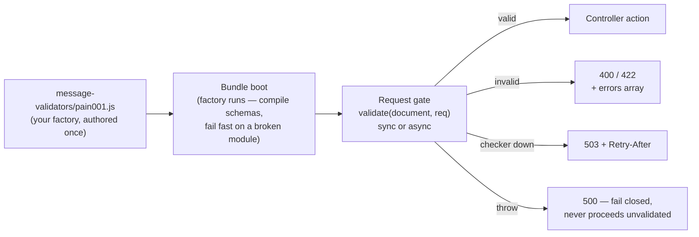

# Message validation

*New in 0.6.25*

Some payloads are not forms. An ISO 20022 payment initiation, a Factur-X invoice, a
vendor XML tree or a deeply-nested JSON document is a **message** with a schema of its
own — an XSD, a Schematron rule set, a usage guideline, a JSON Schema — and validating
it takes an engine Gina deliberately does not ship: schema engines are heavy,
domain-specific, and the strongest ones are native code or external tools.

The message-validation seam splits the job accordingly: **your application supplies the
validator, Gina supplies everything around it** — boot-time registration that fails fast,
a gate at the right place in the request band, and a fail-closed refusal shape.



Routes that declare no validator are completely untouched — the gate is a strict no-op
for them.

## Declaring a validator on a route

A route opts in with `param.messageValidator`, naming a module your bundle ships:

```json
{
  "pain001-submit": {
    "method": "POST",
    "url": "/payments/initiate",
    "param": {
      "control": "submitPayment",
      "messageValidator": "pain001"
    }
  }
}
```

The name resolves to `<bundle>/message-validators/pain001.js`. Several routes may share
one validator — the module is registered once.

## Authoring a validator

A validator module **must export a factory**. The factory runs **once, at bundle boot**,
and returns the validate function:

```js
// message-validators/pain001.js
module.exports = function setup(ctx) {
    // ctx = { bundle, env }
    // Runs at BOOT — do the expensive work here, once:
    // compile your XSD set, open a sidecar connection pool, load rule tables.
    // A throw here refuses the boot: a broken validator is a deploy-time
    // failure, never a silent skip in production.
    var schemas = compileMySchemas();

    return function validate(document, req) {
        // `document` is the VERBATIM request body string — for an XML body,
        // the exact bytes the client sent; for JSON, the raw string (the
        // parsed object is still on req.post / req.put / req.patch).
        // `req` is the live request — read headers or req.routing.rule from
        // it, but never write the response: the gate owns every terminal.
        var report = schemas.check(document);
        if (report.ok) {
            return { valid: true };
        }
        return {
            valid: false,
            status: 422,
            errors: report.problems   // [{ message, line, column }]
        };
    };
};
```

The factory is synchronous (boot is), but the **returned `validate` may be `async`** —
return a promise, `await` a sidecar call, spawn a checker. Whatever it resolves to is
the verdict.

:::tip Reuse it outside the request path
The module is a plain factory — your test suite or CI conformance gate can
`require()` it directly and drive `validate()` against fixture documents, no
server needed.
:::

## The verdict contract

| Return | Result on the wire |
| --- | --- |
| `{ valid: true }` | The request proceeds to the rest of the band. |
| `{ valid: false }` | **422** `Message validation failed` (the default). |
| `{ valid: false, status: 400, errors: [...] }` | **400** — the document does not even parse as the expected format. |
| `{ valid: false, status: 422, errors: [...] }` | **422** — well-formed but schema-invalid. |
| `{ valid: false, status: 503, retryAfter: 30 }` | **503** + `Retry-After: 30` — the **checker** is unavailable (a sidecar down), not the document. |
| a thrown error / rejected promise | **500**, fail-closed — the request **never proceeds unvalidated**. The full stack is logged server-side; the wire never carries it. |

Any other status, or a return that is not a `{ valid: <boolean> }` object, is a loud
**500** contract violation — never a silent pass.

The `errors` array rides the 400/422 response body verbatim, as a top-level `errors`
key beside `status`, `error` and the incident `ref` — the document-level sibling of the
DTO pipe's `fields` map:

```json
{
  "status": 422,
  "error": "Message validation failed",
  "errors": [
    { "message": "IBAN checksum failed", "line": 12, "column": 8 },
    { "message": "missing element", "path": "/Document/CstmrCdtTrfInitn" }
  ],
  "ref": "A3F91C"
}
```

The gate never truncates the array — a validator expecting pathological documents
should cap its own report.

:::caution Fail closed, on purpose
Every non-valid outcome — including a validator crash — refuses the request. If your
checker can be legitimately unavailable and you want callers to see a clean outage
instead of a 500, catch that failure inside `validate()` and return the `503` verdict
with a `retryAfter`.
:::

## Where the gate runs

The gate sits in the router dispatch band, **after** authorization, rate limiting and
[idempotency](/guides/idempotency), and **before** [DTO field validation](/guides/dtos):

```
401 → 429 → idempotency → message validation (400/422/503) → DTO (422) → action
```

The ordering is deliberate:

- An unauthenticated or throttled caller never learns whether its document validates —
  a validation report is a disclosure, and schema validation is also the most expensive
  step in the band.
- A retried idempotent request **replays** its recorded response without re-validating,
  and a validation refusal releases the idempotency reservation so a corrected retry
  re-executes.
- Document-level validation runs before field-level rules — for an XML body the parsed
  method object is empty anyway, so a DTO would have nothing to check.

Both server engines share the same gate — there is nothing engine-specific to
configure.

## Boot-time registration

Every `param.messageValidator` declared in `routing.json` is resolved at bundle boot:
the module is loaded, the factory runs, and the returned function is registered. A
missing file, a module that does not export a function, a factory that throws, or a
factory that does not return a function **refuses the boot** with an error naming the
route — validation can never be silently off in production because a file went missing.

Editing a validator module therefore needs a **bundle restart** to be picked up,
exactly like `routing.json`, DTOs, forms and connectors.

## Message validation and DTOs

The two validation layers are complementary, not alternatives:

| | Message validation | [Route DTOs](/guides/dtos) |
| --- | --- | --- |
| Validates | the **raw document string** | the **parsed object's fields** |
| Engine | **yours** (XSD, Schematron, JSON-Schema, sidecar) | Gina's built-in rule engine |
| Typical body | XML, large/nested JSON messages | form posts, JSON objects |
| Refusals | 400 / 422 (+ `errors` array), 503 | 422 (+ `fields` map) |
| Coerces the payload | never | yes (types, trims, excludes) |

A JSON route may declare both — the document is schema-checked first, then the parsed
fields are validated and coerced.

## See also

- [Route DTOs](/guides/dtos) — field-level validation, coercion and response shaping.
- [Idempotency keys](/guides/idempotency) — safe retries for the same mutation routes.
- [Controllers · XML request bodies](/guides/controller#xml-request-bodies) — how a raw
  XML document reaches `req.body` verbatim.
