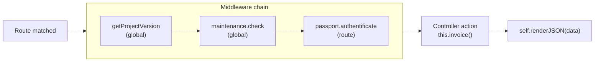
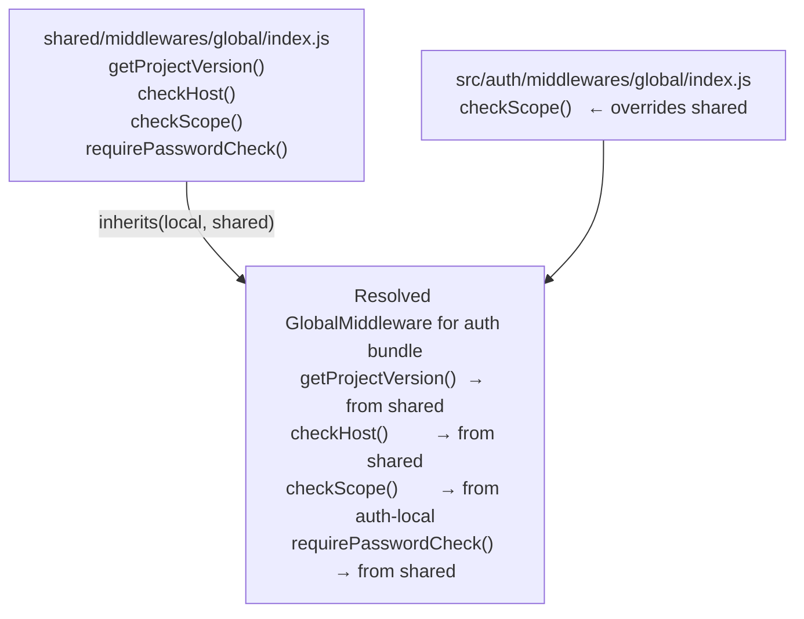

# Middleware

Middleware functions run between route matching and the controller action. They are the
right place for cross-cutting concerns that span multiple routes: authentication, session
enrichment, feature flags, maintenance mode checks, and anything else that should happen
before a controller takes over.

---

## How it works

The middleware chain executes sequentially. Each function receives the request, response,
next, and a `done` callback. Calling `done(req, res, next)` advances to the next
middleware or, once the list is exhausted, dispatches to the controller action.



Any middleware can terminate the request at any point by calling `self.renderJSON()`,
`self.redirect()`, or `self.throwError()` instead of `done`. The controller action is
never reached in that case.

---

## Middleware files

A middleware is a constructor function that lives in its own directory under
`src/<bundle>/middlewares/` (bundle-local) or `shared/middlewares/` (shared):

```
src/frontend/middlewares/
  auth/
    index.js
  global/
    index.js

shared/middlewares/
  global/
    index.js
  maintenance/
    index.js
```

The dotted middleware name in `routing.json` maps to a directory path plus a
method name:

| `routing.json` value | File resolved | Method called |
|---|---|---|
| `"middlewares.auth.require"` | `middlewares/auth/index.js` | `require()` |
| `"middlewares.global.checkScope"` | `middlewares/global/index.js` | `checkScope()` |
| `"middlewares.passport.authentificate"` | `middlewares/passport/index.js` | `authentificate()` |

---

## Resolution order

For any given middleware path the framework checks:

1. **Bundle-local first** — `src/<bundle>/middlewares/<name>/index.js`
2. **Shared fallback** — `shared/middlewares/<name>/index.js`
3. If neither exists — **501 error** ("middleware not found")

If **both** a bundle-local and a shared file exist for the same path, the bundle-local
constructor **inherits from the shared one**. The local file can override specific
methods while everything else falls through to shared. See
[Bundle-local and shared middlewares](#bundle-local-and-shared-middlewares) below.

---

## Writing a middleware

A middleware file exports a plain constructor function. The framework instantiates it
with `new Middleware()` and then calls the method whose name matches the last segment
of the dotted path.

```js
// src/frontend/middlewares/auth/index.js

function AuthMiddleware() {
  var self = this;

  this.require = function(req, res, next, done) {
    if (!req.session || !req.session.user) {
      var conf     = self.getConfig();
      var loginUrl = conf.hostname + '/login';
      return self.redirect(loginUrl, true);
    }

    done(req, res, next);
  };
}

module.exports = AuthMiddleware;
```

Use it on a route:

```json
{
  "dashboard": {
    "url": "/dashboard",
    "param": { "control": "home" },
    "middleware": [
      "middlewares.auth.require"
    ]
  }
}
```

---

## Function signature

Every middleware method receives four arguments:

```js
this.methodName = function(req, res, next, done) {
  // req  — HTTP request object (same reference throughout the chain)
  // res  — HTTP response object
  // next — framework next(), rarely called directly
  // done — call this to advance to the next middleware or controller action
};
```

Call `done(req, res, next)` to continue the chain. To terminate early, call one of
the controller methods instead:

```js
// src/shared/middlewares/maintenance/index.js

function MaintenanceMiddleware() {
  var self = this;

  this.check = function(req, res, next, done) {
    var conf = self.getConfig();

    if (conf.maintenanceMode === true) {
      if (self.isXMLRequest()) {
        return self.renderJSON({ status: 503, message: 'Under maintenance.' });
      }
      return self.throwError(res, 503, new Error('Under maintenance.'));
    }

    done(req, res, next);
  };
}

module.exports = MaintenanceMiddleware;
```

Middleware methods can also be `async`:

```js
this.checkScope = async function(req, res, next, done) {
  var result = await someAsyncCheck();
  if (!result) return self.redirect('/login', true);
  done(req, res, next);
};
```

---

## Available methods

Every middleware gets the same methods as a controller action, injected at load time:

| Method | Description |
|---|---|
| `self.getConfig(key)` | Read bundle configuration (`settings.json`, `app.json`, etc.) |
| `self.getFormsRules(id)` | Load form validation rules |
| `self.render(data)` | Render an HTML response and terminate the request |
| `self.renderJSON(data)` | Render a JSON response and terminate the request |
| `self.redirect(url, permanent)` | Issue a redirect and terminate the request |
| `self.throwError(res, code, err)` | Send an error response |
| `self.isXMLRequest()` | True when the request has `X-Requested-With: XMLHttpRequest` |
| `self.isWithCredentials()` | True when the request sends credentials |
| `self.isHaltedRequest()` | True when a previous request was paused |
| `self.pauseRequest(data)` | Pause the current request for later resumption |
| `self.resumeRequest()` | Resume a paused request |
| `self.query(...)` | Run a model query |
| `self.requireController(ns, opts)` | Load another namespace's controller |

---

## Configuring middlewares on routes

Add middlewares to a route's `middleware` array in `routing.json`. They execute
in the order listed:

```json
{
  "account-password-update": {
    "namespace": "account",
    "url": "/account/password",
    "method": "PUT",
    "param": { "control": "passwordUpdate" },
    "middleware": [
      "middlewares.passport.authentificate",
      "middlewares.global.requirePasswordCheck"
    ]
  }
}
```

The full chain for this route is:

```
[global middlewares] → passport.authentificate → global.requirePasswordCheck → account#passwordUpdate
```

---

## Attaching data to `req`

Middlewares commonly enrich `req` with helpers or data so downstream middlewares
and controllers can use them without repeating the same checks:

```js
// src/auth/middlewares/global/index.js

var lib     = require('gina').lib;
var routing = lib.routing;

function GlobalMiddleware() {
  var self = this;

  this.checkScope = async function(req, res, next, done) {
    var conf = self.getConfig();

    // Attach a helper function once — idempotent across the chain
    if (typeof req.isAllowedForScope === 'undefined') {
      req.isAllowedForScope = function() {
        var property = 'scope';
        var sess = this;
        if (!sess._passport && typeof sess.session !== 'undefined') {
          sess = sess.session;
        }
        return (sess[property] || (sess.session && sess.session[property])) ? true : false;
      };
    }

    // The login-to-scope route itself must not be gated
    if (/^login-to-scope@/i.test(req.routing.rule) || /^login@/i.test(req.routing.rule)) {
      return done(req, res, next);
    }

    if (!req.isAllowedForScope()) {
      var scopeUrl = routing.getRoute('login-to-scope@auth', {
        scope: process.env.NODE_SCOPE
      }).toUrl();
      return self.redirect(scopeUrl, true);
    }

    done(req, res, next);
  };
}

module.exports = GlobalMiddleware;
```

Any controller or later middleware on the same request can now call
`req.isAllowedForScope()` without knowing how the check works.

---

## Global middlewares

`routing.global.json` defines middlewares that run on **every route** in the bundle.

```json
{
  "middleware": [
    "middlewares.global.getProjectVersion",
    "middlewares.maintenance.check"
  ]
}
```

The file lives at:

- `shared/config/routing.global.json` — applies to all bundles in the project
- `src/<bundle>/config/routing.global.json` — applies to one bundle only

Global middlewares are **prepended** to every route's own list. A route that declares
`"middlewares.passport.authentificate"` produces this chain at runtime:

```
getProjectVersion → maintenance.check → passport.authentificate → controller action
```

To protect every route in a bundle, add the middleware to `routing.global.json`.
To protect only specific routes, add it to those routes' `middleware` arrays.

---

## Bundle-local and shared middlewares

When both a bundle-local and a shared file exist for the same middleware path, the
framework merges them using prototype inheritance — the bundle-local constructor
inherits from the shared one:



This means:

- Methods defined only in **shared** are available as-is.
- Methods defined only in **bundle-local** are added on top.
- Methods defined in **both** use the bundle-local version.

A typical pattern is to write the general logic in shared and override only what
differs per bundle:

```js
// shared/middlewares/global/index.js — general version

function GlobalMiddleware() {
  var self = this;

  this.getProjectVersion = function(req, res, next, done) {
    res.setHeader('X-Version', '3.0.0');
    done(req, res, next);
  };

  this.checkScope = function(req, res, next, done) {
    // Default scope check — works for most bundles
    if (req.session && !req.session.scope) {
      return self.redirect('/login-to-' + process.env.NODE_SCOPE, true);
    }
    done(req, res, next);
  };

  this.requirePasswordCheck = async function(req, res, next, done) {
    // Shared password confirmation logic used by multiple bundles
    if (!req.isAuthenticated()) {
      return self.throwError(res, 401, new Error('Not authenticated'));
    }
    done(req, res, next);
  };
}

module.exports = GlobalMiddleware;
```

```js
// src/auth/middlewares/global/index.js — auth bundle override

function GlobalMiddleware() {
  var self = this;

  // Override checkScope with auth-specific logic that also attaches
  // req.isAllowedForScope, req.scopeIn, and req.scopeOut helpers,
  // and excepts the login routes from the scope gate.
  this.checkScope = async function(req, res, next, done) {
    if (typeof req.isAllowedForScope === 'undefined') {
      req.isAllowedForScope = function() { /* ... */ };
    }
    if (typeof req.scopeIn === 'undefined') {
      req.scopeIn = function(scope, options, cb) { /* ... */ };
    }

    if (/^login-to-scope@/i.test(req.routing.rule) || /^login@/i.test(req.routing.rule)) {
      return done(req, res, next);
    }

    if (!req.isAllowedForScope()) {
      return self.redirect('/login-to-' + process.env.NODE_SCOPE, true);
    }

    done(req, res, next);
  };

  // getProjectVersion and requirePasswordCheck are inherited from shared —
  // no need to redeclare them here.
}

module.exports = GlobalMiddleware;
```

When you reference `"middlewares.global.checkScope"` from the `auth` bundle, the
auth-local `checkScope` runs. When you reference `"middlewares.global.requirePasswordCheck"`
from the same bundle, the shared version runs because auth-local does not define it.

---

## See also

- [Routing guide](./routing) — Declaring routes and attaching middleware
- [Views and templates](./views) — How middleware can call `self.render()`
- [Routing API reference](/api/routing) — `getRoute()` for building redirect URLs inside middlewares
