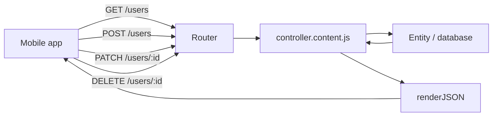

# Mobile Backend

Gina is a natural fit for mobile backends: each bundle is an independent HTTP/2-capable Node.js process, JSON is the default response format, and every HTTP method (GET, POST, PUT, PATCH, DELETE, HEAD) is supported out of the box. This guide covers the patterns mobile API clients depend on.

---

## Project setup

Create a dedicated `api` bundle inside your project:

```bash
mkdir myapp && cd myapp
gina project:add @myapp
gina bundle:add api @myapp
```

A mobile backend rarely needs HTML views, so the default JSON-only bundle is the right starting point. Set the hostname to `localhost` in `env.json` for local development (see [First Project](/getting-started/first-project#envjson-and-hostnames)).

---

## RESTful routing

Declare all HTTP methods in `routing.json`. Gina dispatches `req.get`, `req.post`, `req.put`, `req.patch`, and `req.delete` for each method respectively.

```json
{
  "users-list": {
    "method": "GET",
    "url": "/users",
    "param": { "control": "list" }
  },
  "users-create": {
    "method": "POST",
    "url": "/users",
    "param": { "control": "create" }
  },
  "users-get": {
    "method": "GET",
    "url": "/users/:id",
    "param": { "control": "getById" }
  },
  "users-update": {
    "method": "PUT",
    "url": "/users/:id",
    "param": { "control": "replace" }
  },
  "users-patch": {
    "method": "PATCH",
    "url": "/users/:id",
    "param": { "control": "update" }
  },
  "users-delete": {
    "method": "DELETE",
    "url": "/users/:id",
    "param": { "control": "remove" }
  }
}
```



### PUT vs PATCH

| Method | Semantics | Use when |
| --- | --- | --- |
| `PUT` | Replace the whole resource | Sending a full object on save |
| `PATCH` | Partial update — only sent fields change | Toggling a flag, updating one field |

```js
// PATCH — only update the fields the client sent
this.update = function(req, res, next) {
    var self   = this;
    var fields = req.patch; // { name: 'Amara' } — only changed fields
    // merge fields into the stored document...
    self.renderJSON({ user: updated });
};
```

### HEAD requests

Routes declared as `GET` automatically accept `HEAD` — no extra routing rule needed. The full controller action runs so all response headers are set correctly; the body is suppressed before writing to the wire. Useful for cache validation and existence checks.

---

## Standard response envelope

Agree on a consistent JSON shape with your mobile client team and stick to it. A common pattern:

```js
// Success
self.renderJSON({
    data : result        // the payload
  , meta : { total: n }  // optional metadata (pagination, etc.)
});

// Error — handled automatically by throwError(), but you can also format manually
self.throwError(res, 404, 'User not found');
// sends: { "error": "User not found" }
```

```json
{ "data": { "id": 1, "name": "Amara Diallo" }, "meta": {} }
```

```json
{ "error": "User not found" }
```

Mobile SDKs can then check for the presence of `"error"` as a single convention rather than parsing status codes alone.

---

## Pagination

Offset-based pagination is the simplest to implement and works well for most mobile list screens:

**Route:**

```json
{
  "users-list": {
    "method": "GET",
    "url": "/users",
    "param": { "control": "list" }
  }
}
```

**Controller:**

```js
this.list = function(req, res, next) {
    var self   = this;
    var limit  = Math.min(Number(req.get.limit)  || 20, 100); // cap at 100
    var offset = Number(req.get.offset) || 0;

    // with a database entity:
    // var results = await self.UserEntity.findPage(limit, offset);
    // self.renderJSON({
    //     data : results.rows
    //   , meta : { total: results.total, limit: limit, offset: offset }
    // });

    // in-memory example:
    var page = allUsers.slice(offset, offset + limit);
    self.renderJSON({
        data : page
      , meta : { total : allUsers.length, limit : limit, offset : offset }
    });
};
```

Client call: `GET /users?limit=20&offset=40`

---

## Authentication

### Session-based (recommended for same-origin web + mobile hybrid)

Sessions are enabled per bundle in `app.json`:

```json
{
  "session": {
    "secret": "${SESSION_SECRET}",
    "resave": false,
    "saveUninitialized": false
  }
}
```

Login / logout controller:

```js
this.login = function(req, res, next) {
    var self = this;
    var user = authenticate(req.post.email, req.post.password);

    if (!user) {
        self.throwError(res, 401, 'Invalid credentials');
        return;
    }

    req.session.user = { id: user.id, email: user.email };
    self.renderJSON({ ok: true, user: req.session.user });
};

this.logout = function(req, res, next) {
    var self = this;
    req.session.destroy();
    self.renderJSON({ ok: true });
};
```

Authentication middleware that protects private routes:

```js
// src/api/middlewares/auth/index.js
function Auth() {}
Auth = inherits(Auth, SuperController);

Auth.prototype.check = function(req, res, next, done) {
    var self = this;
    if (!req.session || !req.session.user) {
        self.throwError(res, 401, 'Authentication required');
        return;
    }
    done(req, res, next);
};

module.exports = Auth;
```

Apply it per-route in `routing.json`:

```json
{
  "profile-get": {
    "method": "GET",
    "url": "/profile",
    "middleware": ["middlewares.auth.check"],
    "param": { "control": "getProfile" }
  }
}
```

### Token-based (stateless, for pure mobile clients)

For purely stateless token auth (JWT, API keys), validate the `Authorization` header inside a middleware:

```js
Auth.prototype.check = function(req, res, next, done) {
    var self  = this;
    var token = (req.headers['authorization'] || '').replace('Bearer ', '');

    if (!token || !isValidToken(token)) {
        self.throwError(res, 401, 'Invalid or missing token');
        return;
    }
    req.session.user = decodeToken(token);
    done(req, res, next);
};
```

---

## CORS

Cross-origin requests from mobile web views (Expo Web, Capacitor) or browser-based testing tools need CORS headers. Add a global CORS middleware in `routing.global.json` — this array is prepended to every route's middleware chain:

```json
{
  "middleware": ["middlewares.cors.handle"]
}
```

```js
// src/api/middlewares/cors/index.js
function Cors() {}
Cors = inherits(Cors, SuperController);

Cors.prototype.handle = function(req, res, next, done) {
    var origin = req.headers['origin'] || '*';

    res.setHeader('Access-Control-Allow-Origin',  origin);
    res.setHeader('Access-Control-Allow-Methods', 'GET,POST,PUT,PATCH,DELETE,OPTIONS');
    res.setHeader('Access-Control-Allow-Headers', 'Content-Type,Authorization');
    res.setHeader('Access-Control-Allow-Credentials', 'true');

    // Preflight
    if (req.method === 'OPTIONS') {
        res.writeHead(204);
        res.end();
        return;
    }

    done(req, res, next);
};

module.exports = Cors;
```

---

## Error handling

`self.throwError(res, statusCode, message)` terminates the request and sends a standard `{ "error": "..." }` JSON body. Always `return` immediately after:

```js
this.create = function(req, res, next) {
    var self = this;

    if (!req.post.email) {
        self.throwError(res, 422, '"email" is required');
        return;
    }
    if (!isValidEmail(req.post.email)) {
        self.throwError(res, 422, 'Invalid email address');
        return;
    }

    // ... proceed
    self.renderJSON({ data: newUser });
};
```

For async actions, errors that reach the `.catch()` handler are routed to a 500 response automatically — you only need to handle expected errors explicitly:

```js
this.getById = async function(req, res, next) {
    var self = this;
    var user = await self.UserEntity.getById(req.params.id);

    if (!user) {
        self.throwError(res, 404, 'User not found');
        return;
    }
    self.renderJSON({ data: user });
};
```

---

## HTTP/2 benefits for mobile

Starting the bundle with HTTPS/HTTP2 protocol gives mobile clients measurable improvements on cellular networks:

- **Header compression (HPACK)** — repeated headers (Authorization, Content-Type, Accept) are sent as indexed references after the first request, saving dozens of bytes per call.
- **Multiplexing** — multiple API calls in parallel over one TCP connection; eliminates the head-of-line blocking that hurts 3G/4G latency.
- **103 Early Hints** — preload critical resources before the response body is ready (HTML-rendered bundles; less relevant for pure JSON APIs).

Switch the `api` bundle to HTTP/2:

```bash
gina protocol:set api @myapp
gina bundle:restart api @myapp
```

The command runs interactively and prompts you to select the protocol.

See [HTTPS & HTTP/2](/guides/https) for the full certificate setup.

---

## Streaming responses (AI / real-time)

For AI-powered features (chatbot, autocomplete, summarisation), `self.renderStream()` lets you push tokens to the mobile client as they arrive without buffering the full response:

```js
this.chat = async function(req, res, next) {
    var self   = this;
    var ai     = getModel('claude');
    var stream = ai.client.messages.stream({
        model      : 'claude-opus-4-6'
      , max_tokens : 1024
      , messages   : [{ role: 'user', content: req.post.message }]
    });

    self.renderStream(
        (async function* () {
            for await (var event of stream) {
                if (event.type === 'content_block_delta') {
                    yield event.delta.text;
                }
            }
        })(),
        'text/event-stream'
    );
};
```

The client receives a standard Server-Sent Events stream. Native support in React Native via `EventSource` polyfill; Flutter via `http` package stream subscription.

---

## Checklist before shipping

- [ ] `env.json` `hostname` set to your production domain, not `localhost`
- [ ] Session secret loaded from an environment variable (`${SESSION_SECRET}`), not hardcoded
- [ ] `NODE_ENV` set to `prod` in production — disables hot-reload, enables ETag caching, strips dev toolbar
- [ ] CORS `Allow-Origin` restricted to known client origins in production
- [ ] Error responses never include `err.stack` or internal paths (Gina strips this automatically)
- [ ] HTTPS/HTTP2 protocol enabled for any public-facing endpoint
